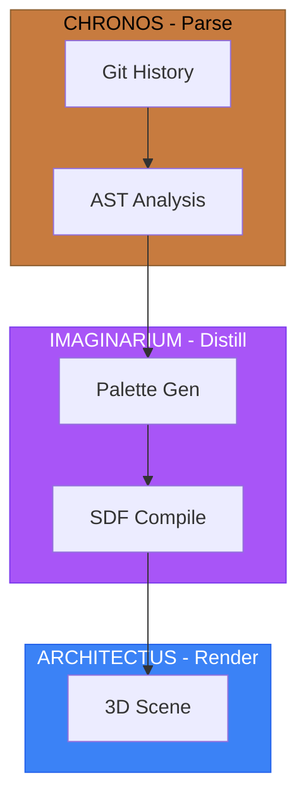

# Diagram Conventions Rules

**Trigger:** When creating any Mermaid diagram, architecture visualization, or styled diagram in documentation or PR descriptions.

---

## 1. Format Requirement

**ALL diagrams MUST use Mermaid syntax.** No ASCII box-drawing for architecture diagrams.

Exception: Coat of Arms at Level 1 (Synthetic) uses ASCII box-drawing intentionally.

## 2. Text Color Accessibility (CRITICAL)

Every `style` directive MUST include explicit `color:` for text.

### The Rule

> **If fill luminance < 50% -> use `color:#ffffff` (white text)**
> **If fill luminance >= 50% -> use `color:#000000` (black text)**

Without explicit text color, Mermaid defaults to black text, which is unreadable on dark backgrounds.

### Complete Color Reference

| Fill Hex | Name | Text Color | Category |
|----------|------|------------|----------|
| `#1e3a5f` | Navy | `#ffffff` | Dark |
| `#3c6b63` | Teal | `#ffffff` | Dark |
| `#1F2937` | Neutral/Sable | `#ffffff` | Dark |
| `#3b82f6` | Azure | `#ffffff` | Dark |
| `#5f4b1e` | Brown | `#ffffff` | Dark |
| `#3c1f5f` | Purple | `#ffffff` | Dark |
| `#1e5f3b` | Dark Green | `#ffffff` | Dark |
| `#166534` | Forest | `#ffffff` | Dark |
| `#dc2626` | Red | `#ffffff` | Dark |
| `#A855F7` | Purpure | `#ffffff` | Dark |
| `#EF4444` | Gules | `#ffffff` | Dark |
| `#c77b3f` | Copper/Amber | `#000000` | Light |
| `#22c55e` | Green/Vert | `#000000` | Light |
| `#d97706` | Orange | `#000000` | Light |
| `#fef3c7` | Cream | `#000000` | Light |
| `#fee2e2` | Light Red | `#000000` | Light |
| `#dcfce7` | Light Green | `#000000` | Light |
| `#FFD700` | Gold/Or | `#000000` | Light |
| `#E5E7EB` | Silver/Argent | `#000000` | Light |
| `#CD853F` | Tenne | `#000000` | Light |

### Dendrovia Pillar Colors

| Pillar | Fill | Text | Tincture |
|--------|------|------|----------|
| CHRONOS | `#c77b3f` | `#000000` | Amber |
| IMAGINARIUM | `#A855F7` | `#ffffff` | Purpure |
| ARCHITECTUS | `#3B82F6` | `#ffffff` | Azure |
| LUDUS | `#EF4444` | `#ffffff` | Gules |
| OCULUS | `#22C55E` | `#000000` | Vert |
| OPERATUS | `#1F2937` | `#ffffff` | Sable |

## 3. Supported Diagram Types

| Type | Syntax | Best For |
|------|--------|----------|
| Flowchart | `flowchart TB/LR` | Architecture, data flow, pipelines |
| Sequence | `sequenceDiagram` | API interactions, protocol flows |
| ER Diagram | `erDiagram` | Database schema, data models |
| State | `stateDiagram-v2` | State machines, lifecycle flows |
| Class | `classDiagram` | Type hierarchies, interfaces |
| Gantt | `gantt` | Phase timelines (not for estimates) |
| Pie | `pie` | Distribution breakdowns |
| Git Graph | `gitGraph` | Branch strategies |

## 4. Reserved Keywords

**Never use these as Mermaid node IDs:**

| Category | Reserved |
|----------|----------|
| Structure | `end`, `subgraph`, `graph`, `flowchart`, `direction` |
| Interaction | `click`, `style`, `classDef`, `class`, `linkStyle` |
| Sequence | `sequenceDiagram`, `participant`, `actor`, `note` |
| State | `stateDiagram`, `state`, `[*]` |

Use descriptive IDs with labels instead:

```
WRONG:  start --> end
RIGHT:  startNode["Start"] --> finishNode["End"]
```

## 5. Styleable Elements

| Element | Syntax |
|---------|--------|
| Node | `style NodeId fill:...,stroke:...,color:...` |
| Subgraph | `style SubgraphId fill:...,stroke:...,color:...` |
| Class | `classDef name fill:...,stroke:...,color:...` |

## 6. Correct Example



## 7. Anti-Patterns

```
WRONG: style A fill:#1e3a5f,stroke:#3b82f6
       (missing color: -- invisible text on dark fill)

WRONG: flowchart TD
           start --> end
       (reserved keyword 'end' as node ID)

WRONG: Using ASCII box diagrams for architecture
       +--------+     +--------+
       | Input  | --> | Output |
       +--------+     +--------+
       (use Mermaid instead)
```

---

## Cross-References

| Related Rule | Purpose |
|--------------|---------|
| `PR_DESCRIPTION_CONTENT.rules.md` | Where diagrams appear in PR descriptions |
| `PR_HERALDRY_COMPLETENESS.rules.md` | Pillar color assignments |

---

_Version: 1.0.0_
_Created: 2026-02-12_
