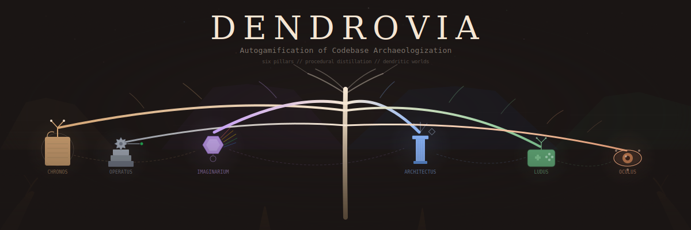
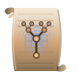
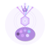
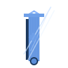
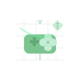
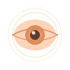
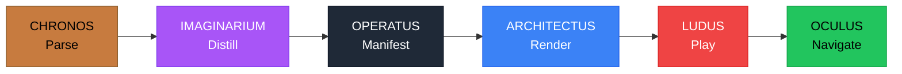

<p align="center">
  
</p>

<h1 align="center">DENDROVIA</h1>

<p align="center">
  <em>Autogamification of Codebase Archaeologization</em>
</p>

<p align="center">
  <a href="LICENSE"></a>
  
  
  
  
  
</p>

---

## Quick Start

```bash
bun install
bun run slice        # Parse a file → generate palette → render SDF branch
bun run dev          # Launch dev mode (all packages)
```

This runs the **Thin Vertical Slice** — a single file parsed through the entire stack to prove the architecture end-to-end:

```
CHRONOS: Parse package.json → IMAGINARIUM: Generate palette → ARCHITECTUS: Render SDF
    → LUDUS: Detect interaction → OCULUS: Show file contents
```

## What is Dendrovia?

Dendrovia transforms Git repositories into explorable 3D RPG worlds. Point it at any codebase and it generates a Monument Valley-inspired landscape where:

- **Git history** becomes geological strata you excavate
- **Code structure** becomes navigable dendritic architecture
- **Bugs** become creatures with stats derived from complexity
- **Refactors** become healing spells, `git blame` becomes reconnaissance

Instead of shipping heavy assets, Dendrovia **procedurally distills** AI-generated art into mathematical representations — SDFs, shaders, noise functions — creating infinite detail at minimal download size.

## Six-Pillar Architecture

<table>
  <tr>
    <td align="center" width="200">
      <br />
      <strong>CHRONOS</strong><br />
      <em>The Archaeologist</em><br />
      Git + AST parsing
    </td>
    <td align="center" width="200">
      <br />
      <strong>IMAGINARIUM</strong><br />
      <em>The Compiler</em><br />
      Procedural distillation
    </td>
    <td align="center" width="200">
      <br />
      <strong>OPERATUS</strong><br />
      <em>The Infrastructure</em><br />
      Asset loading + persistence
    </td>
  </tr>
  <tr>
    <td align="center" width="200">
      <br />
      <strong>ARCHITECTUS</strong><br />
      <em>The Renderer</em><br />
      WebGPU + SDF raymarching
    </td>
    <td align="center" width="200">
      <br />
      <strong>LUDUS</strong><br />
      <em>The Mechanics</em><br />
      Game logic + combat
    </td>
    <td align="center" width="200">
      <br />
      <strong>OCULUS</strong><br />
      <em>The Interface</em><br />
      UI + navigation
    </td>
  </tr>
</table>

### Build → Runtime Pipeline



## Current Status

| Pillar | Version | Status | Key Output |
|--------|---------|--------|------------|
| **CHRONOS** | v0.1.0 | Implemented | `topology.json` via isomorphic-git + ts-morph |
| **IMAGINARIUM** | v0.1.0 | Active | Distillation, generation, cache, fallbacks |
| **OPERATUS** | v0.3.0 | Production | OPFS cache, IndexedDB, Zustand persistence, SW |
| **ARCHITECTUS** | v0.1.0 | Scaffold | R3F + Three.js r171 integration |
| **LUDUS** | v0.1.0 | Scaffold | Zustand state machine, combat rules |
| **OCULUS** | v0.1.0 | Component Library | TanStack Virtual, panel system |

**Shared contracts** (`@dendrovia/shared`): Types, EventBus, schemas via Zod.

## Tech Stack

| Technology | Purpose | Version |
|------------|---------|---------|
| **Bun** | Runtime + Package Manager | 1.0+ |
| **TurboRepo** | Build Orchestration | 2.7 |
| **Three.js** | 3D Rendering | r171 |
| **React** | UI Framework | 19 |
| **Zustand** | State Management | 5 |
| **TypeScript** | Language | 5.7+ |
| **Next.js** | Application Framework | 16 |

## How It Works

### Core Principles

1. **Cognitive Architecture** — Each pillar communicates only via the EventBus. Two teams can work without coordination if the interface contracts hold.
2. **Build-Time vs Runtime** — CHRONOS and IMAGINARIUM run once per codebase, producing static artifacts (JSON, GLSL). ARCHITECTUS, LUDUS, and OCULUS consume them in the browser.
3. **Local-First** — The game fully works offline. Initial payload under 1MB. State persisted in OPFS with IndexedDB fallback.
4. **Hybrid Rendering** — SDF for static dendrites (infinite detail), instanced meshes for dynamic elements (creatures, particles), adaptive LOD.
5. **Diegetic Mechanics** — Spells are developer actions: `git blame` reveals origins, `refactor` heals tech debt, `debug` exposes weaknesses.

### Project Structure

```
dendrovia/
├── apps/
│   ├── dendrovia-quest/        # Main game application (Next.js)
│   └── playground-*/           # Per-pillar playgrounds
├── packages/
│   ├── shared/                 # Types, events, contracts
│   ├── chronos/                # Git + AST parser
│   ├── imaginarium/            # Procedural distillation
│   ├── architectus/            # R3F + WebGPU engine
│   ├── ludus/                  # Game mechanics
│   ├── oculus/                 # UI components
│   └── operatus/               # Infrastructure + persistence
├── assets/                     # SVG icons, design assets
├── lib/                        # Heraldry, shared utilities
├── turbo.json                  # TurboRepo pipeline
└── package.json                # Workspace config
```

## Contributing

Each pillar can be developed independently:

1. **Fork the repo** and pick a pillar
2. **Read the pillar's README** in `packages/{pillar}/`
3. **Respect the interface** — EventBus contracts in `packages/shared`
4. **Submit a PR** when tests pass

See `docs/` for architecture guides, the design system, and pillar thematic schemas.

## Docs

- [Pillar Thematic Schema](docs/PILLAR_THEMATIC_SCHEMA.md) — Design DNA for all six pillars
- [Pillar Insignia](docs/PILLAR_INSIGNIA_STRUCTURAL.md) — Structural icon specifications
- [Symbol-Driven Design System](docs/SYMBOL_DRIVEN_DESIGN_SYSTEM.md) — Visual language architecture

## License

MIT — See [LICENSE](LICENSE)
