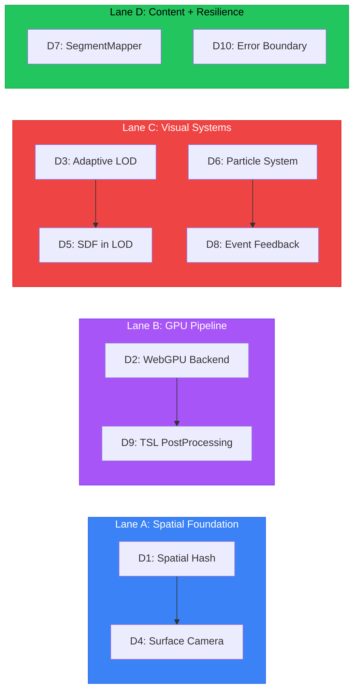

# ARCHITECTUS Implementation Directives

> **Domain:** The Renderer (packages/architectus)
> **Baseline:** 23 files, functional scaffold, instanced mesh pipeline operational
> **Goal:** Fulfill CLAUDE.md commitments — WebGPU, adaptive LOD, spatial queries, surface camera, particles

---

## Execution Lanes

Four independent lanes, each containing sequentially-dependent directives. Lanes run in parallel.



### Cross-Lane Dependencies

| Consumer | Producer | Interface |
|----------|----------|-----------|
| D4 (Surface Camera) | D1 (Spatial Hash) | `SpatialIndex.nearest(position): BranchSegment` |
| D5 (SDF in LOD) | D3 (Adaptive LOD) | `qualityController.currentBudget: { raymarchSteps, dpr }` |
| D8 (Event Feedback) | D6 (Particle System) | `ParticleSystem.burst(position, config)` |
| D9 (TSL PostProcessing) | D2 (WebGPU Backend) | `renderer.backend === 'webgpu'` condition |

No cross-lane dependencies exist. All four lanes are fully independent.

---

## Lane A: Spatial Foundation

### D1 — Spatial Partitioning (O(n) → O(log n))

**Priority:** P0
**Complexity:** Medium (new system, clear algorithm)
**Files to create:** `systems/SpatialIndex.ts`
**Files to modify:** `components/DendriteWorld.tsx`

#### Current State
- BranchTracker in DendriteWorld iterates all NodeMarkers every 10 frames
- `three-mesh-bvh` installed in monorepo but unused
- No spatial data structure exists anywhere in the codebase

#### Target State
- Spatial hash grid with cell size tuned to average branch length
- O(1) average proximity queries, O(log n) worst case
- API: `insert(id, position)`, `nearest(position, radius): NodeMarker[]`, `rebuild()`

#### Approach
1. Implement `SpatialIndex` class with 3D hash grid (cell = avg branch length)
2. On topology change, rebuild index from NodeMarkers + BranchSegments
3. Replace BranchTracker's linear scan with `spatialIndex.nearest(cameraPos, 1)`
4. Expose index on store or via ref for D4 (surface camera) to consume

#### Entry Criteria
- Current BranchTracker logic understood (DendriteWorld.tsx)
- Average branch segment length measurable from test topology

#### Exit Criteria
- [ ] `SpatialIndex` class with insert/nearest/rebuild
- [ ] BranchTracker uses spatial index instead of linear scan
- [ ] Proximity query time independent of node count (benchmark: 10k nodes < 0.1ms)
- [ ] No regression in BRANCH_ENTERED event accuracy

#### Exports (for D4)
```typescript
interface SpatialIndex {
  nearest(position: Vector3, radius?: number): NodeMarker[];
  nearestSegment(position: Vector3): { segment: BranchSegment; t: number; distance: number };
  rebuild(nodes: NodeMarker[], segments: BranchSegment[]): void;
}
```

---

### D4 — Surface-Locked Camera ("Ant on Manifold")

**Priority:** P1
**Complexity:** High (physics, quaternion math, feel tuning)
**Files to modify:** `components/CameraRig.tsx`
**Depends on:** D1 (SpatialIndex.nearestSegment)

#### Current State
- Player mode = restricted OrbitControls (minDistance 2, maxPolarAngle 0.7pi)
- No gravity toward branch axis
- No surface-tangent movement

#### Target State
- Camera gravity vector = normalize(nearestAxisPoint - cameraPosition)
- Movement tangent to branch surface (cross product of normal and input)
- Jump arc returns to surface (parabolic with surface-gravity)
- Smooth transition between branches at junctions

#### Approach
1. Each frame in Player mode: query `spatialIndex.nearestSegment(cameraPos)`
2. Project camera onto cylinder surface at distance = playerHeight
3. Gravity = direction toward segment axis (not world-down)
4. Input movement: resolve WASD into tangent plane of cylinder at current position
5. At branch junctions (segment endpoints), detect fork and allow steering choice
6. Jump: impulse along surface normal, gravity pulls back to cylinder

#### Entry Criteria
- D1 complete (SpatialIndex available)
- CameraRig.tsx Player mode logic understood

#### Exit Criteria
- [ ] Camera stays on branch surface within tolerance
- [ ] Walking along branch feels smooth (no jitter at segment boundaries)
- [ ] Branch junctions navigable (fork detection + steering)
- [ ] Jump arc returns to surface
- [ ] Falcon↔Player transition still works (SLERP into surface-lock)
- [ ] PLAYER_MOVED events still emitted with correct position

---

## Lane B: GPU Pipeline

### D2 — WebGPU Backend Activation

**Priority:** P0
**Complexity:** Medium (conditional renderer, testing matrix)
**Files to create:** `renderer/createRenderer.ts`
**Files to modify:** `App.tsx`, `renderer/detectGPU.ts`

#### Current State
- `detectGPU()` probes `navigator.gpu`, sets `gpuBackend` in store
- Canvas always uses Three.js default renderer (WebGL2)
- `webgpu.d.ts` type stubs exist

#### Target State
- When WebGPU available: create `WebGPURenderer` from `three/webgpu`
- When not: fall back to standard `WebGLRenderer`
- PostProcessing disabled on WebGPU path (Phase 1 — re-enabled by D9)
- Store tracks actual active backend

#### Approach
1. Create `renderer/createRenderer.ts` that returns appropriate renderer
2. In App.tsx, pass custom renderer to R3F Canvas via `gl` prop
3. When WebGPU active, skip pmndrs PostProcessing component
4. Update PerformanceMonitor to handle both renderer info APIs
5. SDFBackdrop shader materials may need WebGPU-compatible path (RawShaderMaterial → TSL)

#### Entry Criteria
- Three.js WebGPU renderer API understood (r171+ import path)
- R3F `gl` prop for custom renderer documented

#### Exit Criteria
- [ ] WebGPU renderer activates on supported browsers (Chrome 113+, Edge 113+)
- [ ] WebGL2 fallback works identically to current behavior
- [ ] FPS displayed correctly on both backends
- [ ] No console errors on either path
- [ ] SDFBackdrop renders on both backends (or gracefully skips on WebGPU if shader incompatible)

---

### D9 — PostProcessing WebGPU Migration (TSL)

**Priority:** P3
**Complexity:** High (TSL API, effect parity)
**Files to create:** `components/PostProcessingTSL.tsx`
**Files to modify:** `components/PostProcessing.tsx` (conditional), `App.tsx`
**Depends on:** D2 (WebGPU backend active)

#### Current State
- pmndrs/postprocessing: Bloom, ChromaticAberration, Vignette
- GLSL-only — forces WebGL2 even when WebGPU renderer created
- ~1.5ms on M1

#### Target State
- WebGPU path: Three.js built-in `PostProcessing` class with TSL node effects
- WebGL2 path: keep pmndrs EffectComposer (unchanged)
- Effect parity: Bloom + ChromaticAberration + Vignette on both

#### Approach
1. Create `PostProcessingTSL.tsx` using Three.js r169+ `PostProcessing` class
2. Implement bloom via `bloomNode()`, vignette via custom TSL function node
3. In App.tsx or DendriteWorld, conditionally render TSL vs pmndrs based on `gpuBackend`
4. Match visual output between both paths (side-by-side comparison)

#### Entry Criteria
- D2 complete (WebGPU renderer active)
- Three.js TSL PostProcessing API documented and stable
- TSL bloom/vignette node examples available

#### Exit Criteria
- [ ] WebGPU path renders bloom + vignette + chromatic aberration
- [ ] Visual parity with WebGL2 pmndrs path (screenshot comparison)
- [ ] No performance regression vs WebGL2 path
- [ ] Graceful fallback if TSL nodes unavailable

---

## Lane C: Visual Systems

### D3 — Adaptive LOD Pipeline

**Priority:** P1
**Complexity:** Medium (control theory, hysteresis)
**Files to modify:** `store/useRendererStore.ts`, `components/PerformanceMonitor.tsx`

#### Current State
- Quality tier set once at startup via `detectGPU()` result
- `lodBias` field in QualitySettings exists but unused
- PerformanceMonitor samples FPS every 30 frames, writes to store

#### Target State
- `QualityController` reads FPS history and shifts tier with hysteresis
- Downgrade threshold: FPS < 45 for 3 consecutive samples (90 frames)
- Upgrade threshold: FPS > 55 for 5 consecutive samples (150 frames)
- `lodBias` wired to SDFBackdrop raymarch step count
- DPR range adjusted per-tier dynamically

#### Approach
1. Add `fpsHistory: number[]` (ring buffer, last 10 samples) to store
2. Add `autoTuneQuality()` method: evaluate history, shift tier if thresholds met
3. Call `autoTuneQuality()` from PerformanceMonitor after each FPS update
4. Wire `quality.maxRaymarchSteps` to SDFBackdrop uniform
5. Wire `quality.dprRange` to R3F `<AdaptiveDpr>` bounds

#### Entry Criteria
- PerformanceMonitor sampling behavior understood
- Current quality tier fields mapped to consumers

#### Exit Criteria
- [ ] FPS drop triggers tier downgrade within 2 seconds
- [ ] FPS recovery triggers tier upgrade within 3 seconds
- [ ] No oscillation between tiers (hysteresis prevents ping-pong)
- [ ] SDFBackdrop raymarch steps change with tier
- [ ] DPR adjusts with tier
- [ ] Manual tier override still works (user can lock tier)

---

### D5 — SDF Integration into LOD Pipeline

**Priority:** P2
**Complexity:** High (compositing, depth buffer coordination)
**Files to modify:** `components/SDFBackdrop.tsx`, `components/DendriteWorld.tsx`
**Depends on:** D3 (adaptive quality budget)

#### Current State
- SDFBackdrop = fullscreen quad at z=0.999 with fragment shader
- Renders behind everything, no depth interaction with meshes
- Color uniforms from IMAGINARIUM palette

#### Target State
- SDF renders distant branches (beyond LOD threshold)
- Instanced meshes render nearby branches
- Transition band: both overlap with alpha blend
- Raymarch step budget from D3 quality controller

#### Approach
1. SDFBackdrop writes to depth buffer (enable depthWrite)
2. Pass camera position + LOD threshold as uniforms
3. In SDF shader: only render geometry beyond threshold distance
4. In DendriteWorld: cull instanced branches beyond threshold (instance visibility)
5. Transition band (threshold ± margin): blend SDF opacity down, mesh opacity up
6. Quality tier controls: threshold distance, raymarch steps, transition width

#### Entry Criteria
- D3 complete (quality budget available)
- SDFBackdrop shader structure understood
- IMAGINARIUM shader format documented

#### Exit Criteria
- [ ] Far branches rendered by SDF, near by mesh — visually seamless
- [ ] Transition band has no popping or z-fighting
- [ ] LOD threshold responds to quality tier changes
- [ ] Performance improves vs rendering all branches as meshes at distance
- [ ] Fallback: mesh-only when no SDF shader loaded (current behavior)

---

### D6 — Particle System

**Priority:** P2
**Complexity:** High (GPU compute, WebGL fallback)
**Files to create:** `systems/ParticleSystem.ts`, `components/ParticleInstances.tsx`

#### Current State
- `maxParticles` in quality tiers (100–5000) but no particle renderer
- No compute shader infrastructure
- No particle state management

#### Target State
- GPU-driven particle simulation (WebGPU compute shader)
- WebGL2 fallback: CPU simulation + instanced quads
- Particle types: ambient fireflies, damage burst, encounter glow, trail particles
- Budget from quality tier `maxParticles`

#### Approach
1. `ParticleSystem` class: manages particle pool, emitters, simulation
2. WebGPU path: compute shader updates positions/velocities, instanced draw
3. WebGL2 path: TypedArray CPU sim, InstancedBufferGeometry with point sprites
4. Emitter types: `ambient(bounds)`, `burst(position, count)`, `trail(source, rate)`
5. `ParticleInstances` component: renders particle geometry, reads system state
6. Quality tier `maxParticles` caps active particle count

#### Entry Criteria
- WebGPU compute shader API understood (GPUComputePipeline)
- Three.js InstancedBufferGeometry for point sprites documented
- Quality tier maxParticles values confirmed

#### Exit Criteria
- [ ] Ambient fireflies render in scene
- [ ] `burst()` API works for damage VFX (feeds D8)
- [ ] Particle count respects quality tier budget
- [ ] WebGPU path: compute shader simulation at 60fps with 5000 particles
- [ ] WebGL2 path: CPU sim at 60fps with 1000 particles
- [ ] No memory leaks (particle pool recycling)

---

### D8 — Event Feedback Loop

**Priority:** P3
**Complexity:** Low (wiring, visual tuning)
**Files to modify:** `components/DendriteWorld.tsx` or `App.tsx`, `components/NodeInstances.tsx`
**Depends on:** D6 (ParticleSystem.burst)

#### Current State
- ARCHITECTUS emits BRANCH_ENTERED, NODE_CLICKED, PLAYER_MOVED
- Never listens to ENCOUNTER_TRIGGERED or DAMAGE_DEALT
- No visual feedback for game events

#### Target State
- ENCOUNTER_TRIGGERED → emissive pulse on target node
- DAMAGE_DEALT → particle burst at impact position
- Visual feedback creates game feel connection between LUDUS and ARCHITECTUS

#### Approach
1. Register EventBus listeners in DendriteWorld or App.tsx
2. ENCOUNTER_TRIGGERED handler: set `encounterNodeId` in store
3. NodeInstances reads `encounterNodeId`, applies time-based emissive pulse (sine wave)
4. DAMAGE_DEALT handler: call `particleSystem.burst(event.position, damageConfig)`
5. Clear encounter state after pulse duration (2 seconds)

#### Entry Criteria
- D6 complete (ParticleSystem.burst available)
- EventBus listener registration pattern understood
- LUDUS event payload shapes confirmed

#### Exit Criteria
- [ ] Encountering a node causes visible glow pulse
- [ ] Damage event triggers particle burst at correct position
- [ ] Effects respect quality tier (disabled on potato)
- [ ] No dangling event listeners on unmount

---

## Lane D: Content + Resilience

### D7 — Wire Story Arc (SegmentMapper)

**Priority:** P2
**Complexity:** Low (existing code, wiring)
**Files to create:** `components/SegmentOverlay.tsx`
**Files to modify:** `components/DendriteWorld.tsx`

#### Current State
- `SegmentMapper.ts` exists: maps NodeMarkers → StoryArc segments → centroid + radius
- Never called from any component
- StoryArc data loaded by AssetBridge but unused

#### Target State
- After turtle interpretation, SegmentMapper computes placements
- SegmentOverlay renders translucent bounding spheres or glow zones at segment regions
- Active segment highlighted differently (quest target indicator)

#### Approach
1. In DendriteWorld, after `TurtleInterpreter.interpret()`, call `SegmentMapper.map(nodes, storyArc)`
2. Pass placements to new `SegmentOverlay` component
3. SegmentOverlay: instanced transparent spheres (MeshBasicMaterial, opacity 0.1, additive blending)
4. Active segment (from LUDUS quest state) gets brighter glow + pulsing radius

#### Entry Criteria
- SegmentMapper.ts API understood
- StoryArc type shape confirmed
- AssetBridge storyArc loading verified

#### Exit Criteria
- [ ] Story segments visible as faint glow regions in scene
- [ ] Active quest segment highlighted
- [ ] No placements rendered when no StoryArc loaded (graceful skip)
- [ ] Performance: <0.1ms for overlay rendering (few instances)

---

### D10 — React Error Boundary

**Priority:** P3
**Complexity:** Trivial
**Files to create:** `components/ErrorBoundary.tsx`
**Files to modify:** `App.tsx`

#### Current State
- Try/catch at init level in DendroviaQuest.tsx
- No React Error Boundary wrapping Canvas
- Scene crash = blank screen with console error

#### Target State
- Error Boundary wraps Canvas
- On crash: shows fallback UI with error description + retry button
- Retry re-mounts Canvas (fresh WebGL context)

#### Approach
1. Standard React class component Error Boundary
2. Wrap Canvas in App.tsx with ErrorBoundary
3. Fallback: dark-themed error card matching Tron aesthetic
4. Retry: reset error state, re-mount children

#### Entry Criteria
- None (independent)

#### Exit Criteria
- [ ] Intentional scene crash shows fallback UI (not blank screen)
- [ ] Retry button recovers the scene
- [ ] Error details logged to console
- [ ] Styling matches application theme

---

## Parallelization Matrix

| Lane | Directives | Can Start | Blocked Until |
|------|-----------|-----------|---------------|
| A | D1, D4 | Immediately (D1) | D4 waits for D1 |
| B | D2, D9 | Immediately (D2) | D9 waits for D2 |
| C | D3+D6, D5, D8 | Immediately (D3, D6 parallel) | D5 waits for D3; D8 waits for D6 |
| D | D7, D10 | Immediately (both) | None |

**Maximum parallelism:** 5 directives can start simultaneously: D1, D2, D3, D6, D7+D10

**Critical path:** D1 → D4 (spatial → camera) is the longest sequential chain for gameplay impact.

---

## Verification Protocol

Each directive completion requires:
1. **Unit verification** — exit criteria checked
2. **Integration verification** — no regression in existing behavior
3. **Performance verification** — FPS on test topology (dendrovia self-portrait) stays within budget

### Test Topology
Use the dendrovia monorepo self-portrait (`dendrovia` world) as standard test:
- Known node count, branch count, depth
- Reproducible between sessions
- Exercises full pipeline: CHRONOS → IMAGINARIUM → ARCHITECTUS

### Performance Budget (reiterated)

| Platform | Target FPS | Mode |
|----------|-----------|------|
| Desktop (Discrete GPU) | 60 | Full SDF + particles |
| Desktop (Integrated GPU) | 60 | Hybrid + reduced particles |
| Mobile (High-end) | 30 | Mesh-only + minimal particles |

---

## File Impact Summary

| File | Directives | Type |
|------|-----------|------|
| `systems/SpatialIndex.ts` | D1 | **New** |
| `systems/ParticleSystem.ts` | D6 | **New** |
| `components/ParticleInstances.tsx` | D6 | **New** |
| `components/SegmentOverlay.tsx` | D7 | **New** |
| `components/ErrorBoundary.tsx` | D10 | **New** |
| `components/PostProcessingTSL.tsx` | D9 | **New** |
| `renderer/createRenderer.ts` | D2 | **New** |
| `components/DendriteWorld.tsx` | D1, D7, D8 | Modify |
| `components/CameraRig.tsx` | D4 | Modify |
| `components/SDFBackdrop.tsx` | D5 | Modify |
| `components/PostProcessing.tsx` | D9 | Modify |
| `components/NodeInstances.tsx` | D8 | Modify |
| `components/PerformanceMonitor.tsx` | D3 | Modify |
| `store/useRendererStore.ts` | D1, D3 | Modify |
| `renderer/detectGPU.ts` | D2 | Modify |
| `App.tsx` | D2, D9, D10 | Modify |

**New files: 7 | Modified files: 10 | Unchanged: 6**

---

*Document version: 1.0.0*
*Generated: 2026-02-16*
*Baseline commit: 9f24285*
