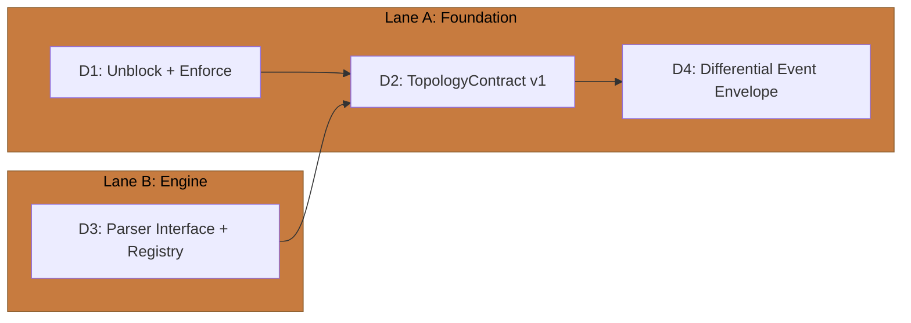
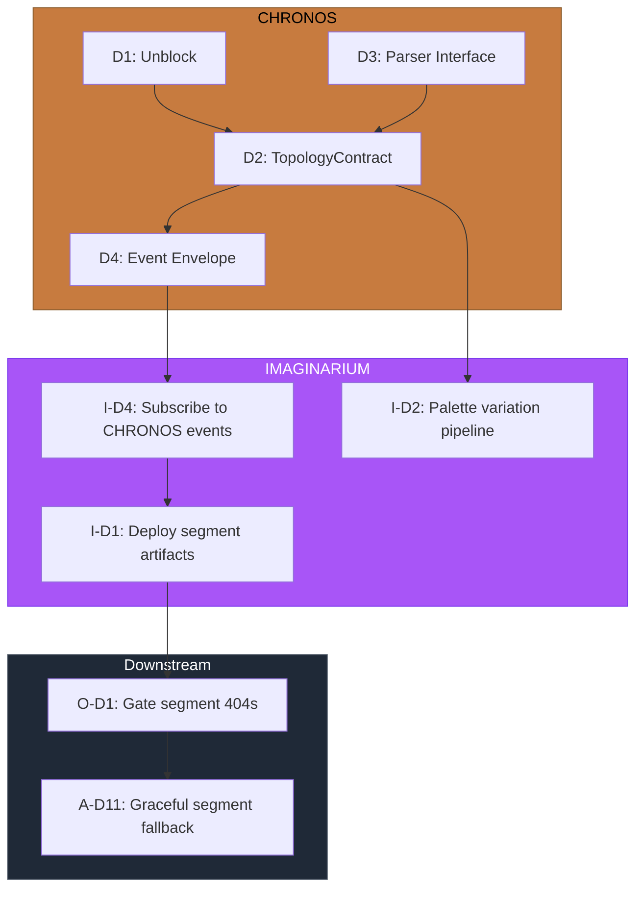

# CHRONOS Implementation Directives

> **Domain:** The Timekeeper (`packages/chronos`)
> **Identity:** Differential Provenance Engine
> **Baseline:** 14 exports, 7 test files, zero runtime consumers, `.js` import extensions block downstream
> **Goal:** Refactor CHRONOS as a differential provenance engine that subsumes batch parsing as its degenerate case, establishes a versioned topology contract, and shapes the data foundation for multi-world portaling and incremental downstream updates

---

## Architectural Reframing

CHRONOS is not a batch parser that might someday support diffs. It is a **differential provenance engine** — a system whose primary operation is computing what changed, what that change means structurally, and what downstream consumers need to know. Full parsing is the degenerate case where the delta is everything.

This reframing subsumes the original directives but reorients them around three principles:

1. **Differential first.** Every output is expressible as a delta. A full topology is a delta applied to the empty state. An incremental update is a delta applied to the previous topology. The data structures, events, and contracts are designed for deltas; full payloads are a convenience built on top.

2. **Contract provenance.** CHRONOS owns the `TopologyContract` — the versioned, schema-validated data shape that all downstream pillars consume. As downstream pillars discover needs (segmented delivery, palette mapping, encounter generation), those learnings feed back to refine the contract. But the contract is always CHRONOS's to define and version.

3. **Callability, not lifecycle.** CHRONOS is always called, never calling. It does not manage its own lifecycle, listen to game events, or maintain runtime state. External orchestration (OPERATUS, app layer, dev server) invokes CHRONOS when provenance needs updating. CHRONOS computes and emits. This keeps the engine pure and composable.

### Current Development Context

The differential engine will initially operate against local git repositories — the current development modality. Git provides the native diff primitives (`git diff`, `git log --since`, commit ranges) that make incremental parsing tractable. This is not a permanent constraint. The architecture anticipates a future where worlds are stored outside git-tracked repositories, but git is the perturbation environment where we iterate on the contract shape before committing to more general storage backends.

### Multi-World and Portaling

Each parsed codebase produces a topology scoped to a `worldId`. Cross-world dependency edges (e.g., `package.json` references to packages published from another repo) surface as portal connections. The topology contract carries the `worldId` from day one so that multi-world support is additive, not a retrofit. The portal system itself is a downstream concern (LUDUS for mechanics, ARCHITECTUS for rendering), but the data that enables it — dependency edges crossing world boundaries — is CHRONOS's to extract and publish.

---

## Execution Lanes



Lane A is sequential: unblock consumption, define the contract, then wire the differential event system. Lane B (parser architecture) feeds into the contract design but can progress in parallel.

---

## D1 — Unblock Downstream Consumption

**Priority:** P0
**Complexity:** Trivial (fix) + Low (enforcement)
**Files to modify:** All `src/*.ts` files with `.js` extensions; `tsconfig.json` audit; lint/Castle Walls config

### Problem

CHRONOS source files use `.js` extensions in import statements. This blocks Turbopack resolution and prevents any downstream pillar from importing `@dendrovia/chronos`. This is the root blocker in the entire cross-pillar directive system.

### Target State

- All imports use extensionless paths: `import { Foo } from './bar'`
- `tsconfig.json` uses `"moduleResolution": "bundler"` (or monorepo-standard equivalent)
- A lint rule or Castle Walls gate prevents `.js` extensions from recurring
- Turbopack resolves all CHRONOS imports in bundled contexts

### Approach

1. Remove `.js` suffixes from all import/export statements in `src/`
2. Audit `tsconfig.json` module resolution strategy against monorepo standard
3. Add ESLint rule (`import/extensions: ["error", "never"]`) or equivalent enforcement
4. Verify `bun test` passes and Turbopack bundles a downstream consumer

### Exit Criteria

- [ ] Zero `.js` extensions in import/export statements in `src/`
- [ ] Module resolution strategy documented and consistent with monorepo
- [ ] Lint or Castle Walls enforcement prevents recurrence
- [ ] `bun test` passes
- [ ] Turbopack resolution succeeds for downstream consumer

---

## D2 — Define TopologyContract v1

**Priority:** P1
**Complexity:** Medium
**Files to create/modify:** `packages/shared/src/contracts/topology.ts`, CHRONOS pipeline output alignment
**Depends on:** D3 (parser interface informs what the contract can carry)

### Problem

The topology output is currently an unversioned, unvalidated data structure coupled to CHRONOS internals. Downstream pillars consume it by convention, with no schema enforcement, no version negotiation, and no accommodation for incremental updates. As the first real consumer (IMAGINARIUM) wires in, the contract must be formalized before implicit assumptions calcify into technical debt.

### Design Principles

**Versioned.** Every `TopologyContract` instance carries a `version` field (semver). Consumers declare the version range they support. Breaking changes increment the major version. CHRONOS can emit multiple versions during migration periods.

**Segmentable.** The topology is structured as a map of path-keyed subtrees, not a single monolithic tree. Each subtree is self-contained — it carries its own metadata, normalized scores, and dependency edges. Downstream pillars can request and process subtrees independently, enabling chunked delivery (resolving the segment 404 cascade) and partial re-distillation.

**Normalized.** All scalar metrics (complexity, hotspot intensity, contributor entropy) are normalized to `[0, 1]` by CHRONOS. Only CHRONOS knows the distribution across the full codebase. Downstream pillars map normalized values to their domain (branch radius, palette intensity, encounter difficulty) without needing to understand the raw scale.

**Dependency-aware.** The contract includes dependency edges — import/export relationships between files. Within a world, these are internal edges. Across worlds, these become portal edges. The edge data is extracted during AST parsing (D3) and is part of the topology, not a separate artifact.

**World-scoped.** Every topology is keyed by `worldId`. For the current development modality, `worldId` derives from the git remote URL or repository path. This field exists from v1 so that multi-world and portaling support is additive.

### Target Shape (Indicative)

```typescript
interface TopologyContract {
  version: string              // semver, e.g., "1.0.0"
  worldId: string              // unique world identifier
  generatedAt: string          // ISO timestamp
  commitRange: CommitRange     // what git state this represents
  segments: Map<string, TopologySegment>  // path-keyed subtrees
  edges: DependencyEdge[]      // cross-file and cross-world edges
  meta: WorldMetadata          // repo-level summary statistics
}

interface TopologySegment {
  path: string
  node: FileTreeNode
  metrics: NormalizedMetrics    // all scores in [0, 1]
  contributors: ContributorProfile[]
  children: string[]           // keys into segments map
}

interface NormalizedMetrics {
  complexity: number           // [0, 1]
  hotspotIntensity: number     // [0, 1]
  churnRate: number            // [0, 1]
  contributorEntropy: number   // [0, 1]
}

interface DependencyEdge {
  source: string               // file path (or worldId:path for cross-world)
  target: string
  kind: 'import' | 're-export' | 'dynamic' | 'portal'
}

interface CommitRange {
  from: string | null          // null = initial parse (full)
  to: string                   // HEAD at parse time
}
```

### Approach

1. Define `TopologyContract` types in `packages/shared/src/contracts/topology.ts`
2. Audit current CHRONOS pipeline output against the contract shape
3. Add normalization pass to `ComplexityAnalyzer` and `HotspotDetector` (emit `[0, 1]` scores)
4. Add `worldId` derivation from git remote / repo path
5. Restructure pipeline output to emit `segments` map instead of monolithic tree
6. Verify existing downstream consumers (IMAGINARIUM L-system, ARCHITECTUS rendering) can consume the new shape
7. Trace complexity data flow end-to-end: CHRONOS → IMAGINARIUM → ARCHITECTUS (subsumes original D2 audit)

### Exit Criteria

- [ ] `TopologyContract` types defined in `packages/shared`
- [ ] Contract includes `version`, `worldId`, `commitRange`, `segments`, `edges`, `meta`
- [ ] All scalar metrics normalized to `[0, 1]`
- [ ] Pipeline output conforms to contract
- [ ] Complexity data flow verified end-to-end (CHRONOS → IMAGINARIUM → ARCHITECTUS)
- [ ] If flow is broken: follow-up directive filed on the responsible pillar
- [ ] Existing tests pass against new output shape

---

## D3 — Parser Interface and Registry

**Priority:** P1
**Complexity:** Medium
**Files to create/modify:** `src/parser/ParserInterface.ts`, `src/parser/ParserRegistry.ts`, refactor existing parsers, test suite
**Feeds into:** D2 (parser output shapes what the contract can carry)

### Problem

Three parsers exist (`GitParser`, `ASTParser`, `GoParser`) with no shared interface, no registration mechanism, and no tests. Adding a new language means adding another ad-hoc file. Incremental parsing (re-parse only changed files over a commit range) is not supported. The differential engine requires parsers that are modular, per-file callable, and commit-range scoped.

### Parser Interface

```typescript
interface Parser {
  /** File extensions or patterns this parser handles */
  canHandle(filePath: string): boolean

  /** Parse a single file, return structured result */
  parse(content: string, metadata: FileMetadata): ParseResult

  /** Extract dependency edges from a file */
  extractDependencies(content: string, filePath: string): DependencyEdge[]
}

interface FileMetadata {
  path: string
  language: string
  lastModified: string
  commitHash: string
}

interface ParseResult {
  declarations: Declaration[]   // functions, classes, interfaces
  complexity: RawComplexityData // pre-normalization
  loc: number
  errors: ParseError[]          // partial results on syntax errors, not crashes
}
```

### GitParser Scoping

`GitParser` operates at a different level than file parsers — it extracts commit history, not file content. It needs a separate interface concern:

```typescript
interface HistoryParser {
  /** Parse full history */
  parseAll(repoPath: string): CommitRecord[]

  /** Parse incremental range — the differential primitive */
  parseRange(repoPath: string, from: string, to: string): CommitRecord[]

  /** List files changed in a range — scoping input for file parsers */
  changedFiles(repoPath: string, from: string, to: string): ChangedFile[]
}
```

The `changedFiles` method is the bridge between git-level diffing and file-level parsing. The differential engine calls `changedFiles` to determine scope, then routes only those files through the `Parser` registry. This is how incremental mode avoids re-parsing the entire codebase.

### Registry

```typescript
class ParserRegistry {
  register(parser: Parser): void
  resolve(filePath: string): Parser | null
  parseFile(filePath: string, content: string, metadata: FileMetadata): ParseResult
}
```

Language detection by file extension. Fallback to a generic parser (line count, no AST) for unrecognized extensions. New languages are added by implementing `Parser` and registering — no changes to pipeline code.

### Approach

1. Define `Parser` and `HistoryParser` interfaces
2. Define `ParserRegistry` with registration and resolution
3. Refactor `ASTParser` to implement `Parser` (TypeScript/JavaScript)
4. Refactor `GoParser` to implement `Parser`
5. Refactor `GitParser` to implement `HistoryParser` with `parseRange` and `changedFiles`
6. Add `extractDependencies` to file parsers (import/require/from statements)
7. Test each parser against the interface contract
8. Test incremental scoping: `changedFiles` returns correct file list for a commit range
9. Test partial results: syntax errors produce `ParseResult` with errors, not exceptions
10. Fixture strategy: programmatically generated minimal files, not committed repos

### Exit Criteria

- [ ] `Parser` interface defined and exported
- [ ] `HistoryParser` interface defined and exported
- [ ] `ParserRegistry` resolves parsers by file extension
- [ ] `ASTParser` implements `Parser` with `extractDependencies`
- [ ] `GoParser` implements `Parser` with `extractDependencies`
- [ ] `GitParser` implements `HistoryParser` with `parseRange` and `changedFiles`
- [ ] Per-file parsing verified (single file in, structured result out)
- [ ] Commit-range scoping verified (`changedFiles` returns correct diff)
- [ ] Syntax errors produce partial results, not crashes
- [ ] All tests use programmatic fixtures

---

## D4 — Differential Event Envelope

**Priority:** P1
**Complexity:** Medium
**Files to create/modify:** `packages/shared/src/events/topology-events.ts`, app-layer bridge module
**Depends on:** D1 (import fix), D2 (contract shape), IMAGINARIUM D4 (consumer side)
**Cross-pillar:** IMAGINARIUM D4 subscribes to these events

### Problem

CHRONOS emits two events (`PARSE_COMPLETE`, `TOPOLOGY_GENERATED`) with unspecified payloads into a bus with zero listeners. The first real consumer (IMAGINARIUM) is about to wire in. The event design must accommodate three modes of operation — full, delta, and reference — so that incremental and multi-world support are additive, not breaking changes to the event contract.

### Event Modes

| Mode | Trigger | Payload | Consumer Action |
|------|---------|---------|-----------------|
| `full` | Initial parse, new world, portal entry | Complete `TopologyContract` | Full distillation + render |
| `delta` | Incremental update (file change, new commits) | `TopologyDelta` (added/removed/modified segments, changed edges) | Partial re-distill, targeted re-render |
| `ref` | Large topology, production deploy | Cache key or URI reference | Consumer fetches on demand |

Mode `full` is implemented now. Modes `delta` and `ref` are specified in the type system but implemented later. Consumers switch on mode and fall back to `full` re-process for unrecognized modes — forward compatibility by design.

### Event Envelope

```typescript
interface TopologyEvent {
  type: 'TOPOLOGY_GENERATED'
  version: string              // event schema version
  worldId: string
  mode: 'full' | 'delta' | 'ref'
  payload: TopologyContract | TopologyDelta | TopologyRef
  timestamp: string
}

interface TopologyDelta {
  commitRange: CommitRange     // what changed
  added: TopologySegment[]     // new files/directories
  removed: string[]            // paths no longer present
  modified: TopologySegment[]  // nodes with changed metadata
  edgesAdded: DependencyEdge[]
  edgesRemoved: DependencyEdge[]
}

interface TopologyRef {
  uri: string                  // cache key, file path, or URL
  commitRange: CommitRange
  segmentCount: number         // hint for consumer allocation
}
```

### PARSE_COMPLETE Audit

Two events currently exist. `PARSE_COMPLETE` is an internal milestone (git history parsed, AST analysis done) that precedes topology construction. Assess whether any consumer needs this signal:

- If useful for progress indication or partial pipeline starts: retain and spec its payload
- If no consumer needs it: remove from the public event surface to keep the contract clean
- Decision documented in this directive's exit criteria

### Bridge Module

The wiring between CHRONOS and IMAGINARIUM lives in the **app layer** (`apps/` or a dedicated `packages/pipeline/`), never inside CHRONOS or IMAGINARIUM. This preserves the dependency direction: app depends on pillars, pillars do not depend on each other.

In dev mode, the bridge wires: file change → `HistoryParser.changedFiles` → `ParserRegistry.parseFile` (scoped) → differential topology → `TopologyEvent { mode: 'delta' }` → IMAGINARIUM re-distills affected subtrees.

In production, the bridge is a no-op: pre-computed assets are served statically. CHRONOS runs at build time, emits `TopologyEvent { mode: 'full' }`, and the result is serialized to disk.

### Approach

1. Define `TopologyEvent`, `TopologyDelta`, and `TopologyRef` types in `packages/shared/src/events/`
2. Implement `mode: 'full'` — CHRONOS pipeline emits `TopologyEvent` with full `TopologyContract` payload
3. Spec `mode: 'delta'` in types — implementation deferred to incremental parsing work
4. Spec `mode: 'ref'` in types — implementation deferred to production optimization
5. Audit `PARSE_COMPLETE`: determine retain or remove
6. Create bridge module in app layer that wires CHRONOS events to IMAGINARIUM
7. Dev mode: bridge triggers on file change via watcher, scopes re-parse via `changedFiles`
8. Production mode: bridge runs once at build time, serializes output
9. Verify no circular imports between pillars

### Exit Criteria

- [ ] `TopologyEvent` envelope type defined with `mode` discriminator
- [ ] `TopologyDelta` and `TopologyRef` types specified (implementation deferred)
- [ ] Mode `full` implemented: CHRONOS emits `TopologyEvent` with `TopologyContract`
- [ ] `PARSE_COMPLETE` decision documented (retain with spec, or remove)
- [ ] Bridge module exists in app layer, not in pillar packages
- [ ] Dev mode: file change triggers scoped re-parse and delta event
- [ ] Production mode: build-time full parse, serialized output
- [ ] No circular imports between pillars
- [ ] Event payload size reasonable (<1MB for medium repos in full mode)
- [ ] IMAGINARIUM can subscribe and receive events (wiring verified)

---

## Future Directives (Specified, Not Scheduled)

These emerge from the differential engine architecture but are not immediate work. They are documented here so that D1-D4 design decisions anticipate them.

### D5 — Incremental Parse Engine

Implement `mode: 'delta'` end-to-end. Given a previous `TopologyContract` and a commit range, produce a `TopologyDelta` containing only what changed. Requires: `HistoryParser.changedFiles` (D3), segment-keyed topology (D2), delta event envelope (D4).

### D6 — Multi-World Registry

Maintain a map of `worldId` to `TopologyContract` for portaling. When a second world is parsed, its topology is stored alongside the first. Cross-world dependency edges become portal connections. Requires: `worldId` in contract (D2), `DependencyEdge.kind: 'portal'` (D2).

### D7 — Parser Expansion (Polyglot)

Add `Parser` implementations for Python, Rust, Java, and other languages. Each implementation follows the `Parser` interface (D3), registers with `ParserRegistry`, and extracts language-appropriate declarations and dependencies. Prioritized by the codebases users actually parse.

### D8 — Storage Backend Abstraction

Decouple topology persistence from the file system. The current modality writes JSON to disk. Future modalities may write to a database, object store, or network cache. The differential engine's `TopologyRef` mode (D4) anticipates this — the ref URI can point to any backend. Implementation lives in OPERATUS (persistence is its domain), but the ref contract is CHRONOS's.

---

## Cross-Pillar Dependencies



CHRONOS D1 remains the root blocker. The critical path is: D1 → D2 → D4 → I-D4 → I-D1 → O-D1 → A-D11. D3 (parser interface) feeds D2 in parallel and is not on the critical path but informs the contract shape.

---

*Document version: 2.0.0*
*Reframed: 2026-02-18*
*Previous version: 1.0.0 (batch-oriented directives, subsumed by differential engine reframing)*
