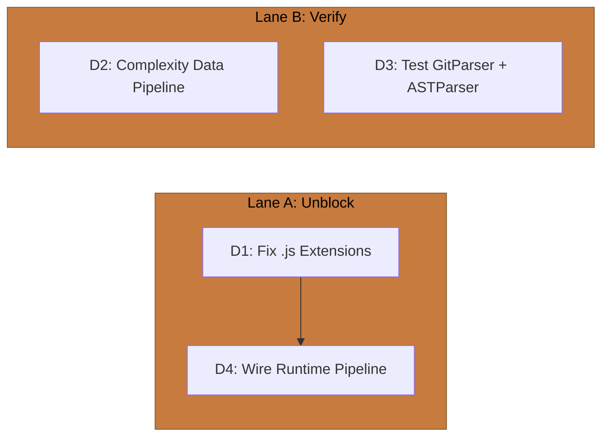

# CHRONOS Implementation Directives

> **Domain:** The Timekeeper (`packages/chronos`)
> **Baseline:** 14 exports, 7 test files, zero runtime consumers, `.js` import extensions block downstream
> **Goal:** Fix the Turbopack blocker, verify the data pipeline to rendering, and wire the runtime bridge to IMAGINARIUM

---

## Execution Lanes

---

## D1 — Fix .js Import Extensions

**Priority:** P0
**Complexity:** Trivial
**Files to modify:** All `src/*.ts` files with `.js` extensions in import paths

### Problem

CHRONOS source files use `.js` extensions in import statements (e.g., `import { Foo } from './bar.js'`). This blocks Turbopack resolution and prevents any downstream pillar from importing `@dendrovia/chronos` in a bundled context. CHRONOS is the only pillar with this issue.

### Target State

- All imports use extensionless paths: `import { Foo } from './bar'`
- `tsconfig.json` does not force `.js` extension resolution
- Turbopack can resolve all CHRONOS imports

### Approach

1. Find all `.js` extensions in import/export statements across `src/`
2. Remove the `.js` suffix from each
3. Verify `bun test` passes (Bun resolves both forms)
4. Verify Turbopack can bundle a consumer that imports from `@dendrovia/chronos`

### Exit Criteria

- [ ] Zero `.js` extensions in import/export statements in `src/`
- [ ] `bun test` passes
- [ ] Turbopack resolution succeeds for downstream consumers
- [ ] No regression in CHRONOS pipeline output

---

## D2 — Verify Complexity Data Pipeline to Rendering

**Priority:** P2
**Complexity:** Low (audit, not implementation)
**Files to audit:** `src/analyzer/ComplexityAnalyzer.ts` → IMAGINARIUM → ARCHITECTUS rendering

### Problem

The tree renders with uniform branch thickness and uniform node size. CHRONOS computes per-file complexity scores (`complexity`, `loc`, `lastModified`), but it's unclear whether this data flows through IMAGINARIUM's palette/L-system pipeline to ARCHITECTUS's `BranchInstances` (radius) and `NodeInstances` (scale).

### Target State

- Document the complete data flow: CHRONOS `complexity` → `FileTreeNode.metadata.complexity` → IMAGINARIUM L-system `startRadius` → ARCHITECTUS `BranchInstances` cylinder scale
- Identify any broken link in the chain
- If the chain is intact, the rendering issue is in ARCHITECTUS (radius scaling too subtle)
- If the chain is broken, identify which pillar needs a fix

### Approach

1. Trace `complexity` from CHRONOS `ComplexityAnalyzer` output
2. Verify it's included in `FileTreeNode.metadata`
3. Verify IMAGINARIUM `LSystemCompiler` uses complexity for branch radius rules
4. Verify ARCHITECTUS `TurtleInterpreter` maps L-system radius to `BranchSegment.startRadius`
5. Verify `BranchInstances` uses `startRadius` for cylinder scale

### Exit Criteria

- [ ] Data flow documented end-to-end
- [ ] Each link verified as connected or identified as broken
- [ ] If broken: follow-up directive filed on the responsible pillar
- [ ] If connected but too subtle: ARCHITECTUS directive to amplify radius differentiation

---

## D3 — Test GitParser and ASTParser

**Priority:** P2
**Complexity:** Medium
**Files to create:** `__tests__/git-parser.test.ts`, `__tests__/ast-parser.test.ts`

### Problem

`GitParser` and `ASTParser` are the primary input parsers — all downstream data (topology, complexity, hotspots) depends on their output. Neither has direct tests. They're exercised only through integration paths.

### Exit Criteria

- [ ] `GitParser`: parses a known git log format, produces correct commit objects
- [ ] `GitParser`: handles empty repos, merge commits, binary files
- [ ] `ASTParser`: extracts function/class declarations from TypeScript
- [ ] `ASTParser`: handles syntax errors gracefully (returns partial result, not crash)
- [ ] Both parsers tested with real fixture files (small known repos)

---

## D4 — Wire CHRONOS → IMAGINARIUM Runtime Pipeline

**Priority:** P2
**Complexity:** Medium
**Files to modify:** App-level integration or new bridge module
**Depends on:** D1 (import fix), IMAGINARIUM D4 (subscribes to CHRONOS events)
**Cross-pillar:** IMAGINARIUM D4 is the consumer side of this wiring

### Problem

The architecture specifies `CHRONOS → IMAGINARIUM` as the first pipeline stage. CHRONOS correctly emits `PARSE_COMPLETE` and `TOPOLOGY_GENERATED` events, but no runtime code bridges them to IMAGINARIUM. The distillation pipeline runs only as a CLI command, not as a reactive listener.

### Target State

- After CHRONOS parses a repository, it emits `TOPOLOGY_GENERATED` with the topology payload
- IMAGINARIUM (via I-D4) subscribes and runs its distillation pipeline
- The chain fires automatically when a new world is loaded
- In production: pre-computed (current behavior). In dev: reactive live-reload

### Approach

1. Ensure `TOPOLOGY_GENERATED` event payload includes the full `FileTreeNode` tree
2. Create a bridge module (in `apps/` or `packages/shared`) that imports CHRONOS and IMAGINARIUM
3. In dev mode, wire: `CHRONOS.parse(repoPath)` → emit `TOPOLOGY_GENERATED` → IMAGINARIUM subscribes
4. In production, this is a no-op (assets are pre-computed and served statically)

### Exit Criteria

- [ ] `TOPOLOGY_GENERATED` event carries full topology
- [ ] Dev mode: changing a file triggers re-parse → re-distill → re-render
- [ ] Production mode: no change (pre-computed assets served)
- [ ] No circular imports between pillars (bridge lives in app layer)
- [ ] Event payload size reasonable (<1MB for medium repos)

---

*Document version: 1.0.0*
*Generated: 2026-02-18*
