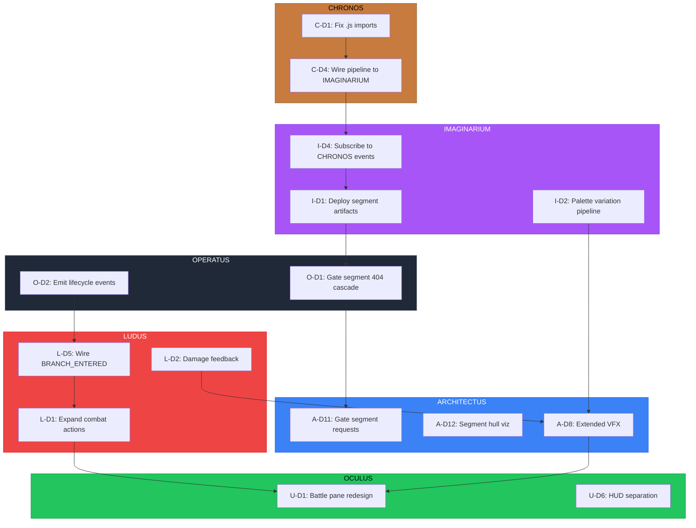

# Cross-Pillar Directive Dispatch

> **Date:** 2026-02-18
> **Source:** Visual audit of deployed app (`dendrovia-architectus.vercel.app`)
> **World:** anthropics/claude-code
> **Baseline:** Post `fix/architectus-webgpu-renderer` merge (PR #91)

---

## Context

A screenshot audit of the running Dendrovia app revealed issues spanning all six pillars. This dispatch formalizes the findings into per-pillar directives, establishes cross-pillar dependencies, and assigns priority tiers.

The app is functional at a prototype level — the dendrite tree renders, the camera orbits, combat triggers, and the panel system exists. But every pillar has incomplete wiring that creates a compounding degradation: 350+ cascading 404s from missing segment data, a monochrome tree with no palette flow, a skeleton battle pane with a single "Attack" button, and UI panels that don't respond to game state transitions.

---

## Observation Summary

| Area | What Works | What's Broken or Missing |
|------|-----------|--------------------------|
| **Console** | Monolithic fallback loads correctly | 350+ 404s for stem.json/cap.json segment chunks |
| **3D Scene** | Tree renders, Falcon orbit at 60fps HIGH | Monochrome cyan, no particles, no bloom, no SDF backdrop, no segment hulls |
| **Battle Pane** | Encounter triggers, enemy name/HP display | Single Attack button, no feedback, no turn indicator, minimal styling |
| **Character HUD** | HP/MP bars, level display | Tiny text, thin bars, FPS mixed with game state |
| **Navigation** | Tab bar, controls panel, minimap | Duplicate quest entry, static controls, no breadcrumb |
| **Data Pipeline** | CHRONOS parse → topology exists | Segment pipeline output not deployed, palette variation not flowing |

---

## Directive Registry

### Per-Pillar Directive Documents

| Pillar | Document | Directives | Priority Range |
|--------|----------|-----------|---------------|
| ARCHITECTUS | `docs/ARCHITECTUS_DIRECTIVES.md` | D1-D13 (D11-D13 new) | P0-P3 |
| OPERATUS | `docs/OPERATUS_DIRECTIVES.md` | D1-D5 (new) | P0-P2 |
| IMAGINARIUM | `docs/IMAGINARIUM_DIRECTIVES.md` | D1-D5 (new) | P0-P2 |
| LUDUS | `docs/LUDUS_DIRECTIVES.md` | D1-D7 (new) | P0-P2 |
| OCULUS | `docs/OCULUS_DIRECTIVES.md` | D1-D8 (new) | P0-P2 |
| CHRONOS | `docs/CHRONOS_DIRECTIVES.md` | D1-D4 (new) | P0-P1 |

### Total Directive Count

| Category | Count |
|----------|-------|
| Existing (ARCHITECTUS D1-D10) | 10 |
| New ARCHITECTUS (D11-D13) | 3 |
| New cross-pillar | 29 |
| **Grand total** | **42** |

---

## Cross-Pillar Dependency Graph



---

## Priority Tiers

### P0 — Blockers (fix first, unblocks everything else)

| Directive | Pillar | Rationale |
|-----------|--------|-----------|
| C-D1 | CHRONOS | `.js` extensions block Turbopack; no downstream pillar can consume CHRONOS |
| O-D1 | OPERATUS | 350+ 404s on every page load; must gate or serve segment data |
| I-D1 | IMAGINARIUM | Segment pipeline artifacts not deployed; root cause of the 404 cascade |
| A-D11 | ARCHITECTUS | Even after I-D1/O-D1, gracefully handle absent segment data |
| L-D5 | LUDUS | BRANCH_ENTERED listener missing from `wireGameEvents()` — encounters can't trigger on directory entry |

### P1 — High impact (visible improvement, no blockers)

| Directive | Pillar | Rationale |
|-----------|--------|-----------|
| I-D2 | IMAGINARIUM | Palette flow → tree stops being monochrome |
| L-D1 | LUDUS | Expand combat beyond single Attack button |
| L-D2 | LUDUS | Damage feedback gives combat game-feel |
| U-D1 | OCULUS | Battle pane redesign — most visible UX improvement |
| U-D6 | OCULUS | HUD separation — dev telemetry vs game state |
| A-D8 | ARCHITECTUS | Extended VFX for combat events (existing directive, priority raised) |
| O-D2 | OPERATUS | Lifecycle events (GAME_STARTED, LEVEL_LOADED) needed by all consumers |

### P2 — Medium (polish, completeness)

| Directive | Pillar | Rationale |
|-----------|--------|-----------|
| A-D12 | ARCHITECTUS | Segment hull visualization in Falcon mode |
| A-D13 | ARCHITECTUS | Default particles + bloom activation |
| I-D3 | IMAGINARIUM | Procedural enemy visuals |
| I-D4 | IMAGINARIUM | Subscribe to CHRONOS events |
| I-D5 | IMAGINARIUM | Ambient atmosphere (fog, glow halos) |
| L-D3 | LUDUS | Turn system visibility |
| L-D4 | LUDUS | Combat outcome pipeline (XP, loot) |
| L-D6 | LUDUS | TurnBasedEngine tests |
| L-D7 | LUDUS | EventWiring tests |
| U-D2 | OCULUS | HP bar contrast fix |
| U-D3 | OCULUS | Contextual controls |
| U-D4 | OCULUS | Deduplicate quest entry points |
| U-D5 | OCULUS | Breadcrumb navigation |
| U-D7 | OCULUS | Test useEventSubscriptions |
| U-D8 | OCULUS | Test BattleUI component |
| O-D3 | OPERATUS | Wire initializeOperatus |
| O-D4 | OPERATUS | Resolve GameStore naming collision |
| O-D5 | OPERATUS | Test MultiplayerClient |
| C-D2 | CHRONOS | Verify complexity pipeline to rendering |
| C-D3 | CHRONOS | Test GitParser / ASTParser |
| C-D4 | CHRONOS | Wire CHRONOS → IMAGINARIUM runtime |

---

## Execution Strategy

### Wave 1: Kill the 404 cascade (P0 blockers)

```
C-D1 (fix imports) ──→ I-D1 (deploy segments) ──→ O-D1 (gate/serve) ──→ A-D11 (graceful fallback)
                                                    L-D5 (wire BRANCH_ENTERED)
```

All five directives can be parallelized across pillar checkouts. C-D1 is the only hard sequential dependency (CHRONOS must fix imports before IMAGINARIUM can consume it).

### Wave 2: Make it look alive (P1 visible)

```
I-D2 (palette flow)     → tree gets color
L-D1 + L-D2 (combat)    → battle pane has depth
U-D1 + U-D6 (UI)        → panels look designed
A-D8 (VFX)              → tree responds to combat
O-D2 (lifecycle events)  → asset pipeline initializes
```

### Wave 3: Polish and test (P2)

Remaining directives in priority order within each pillar. Each pillar works independently.

---

## Recommended Branch Names

| Directive(s) | Branch |
|-------------|--------|
| C-D1 | `fix/chronos-js-extensions` |
| I-D1 + I-D4 | `feat/imaginarium-segment-deploy-pipeline` |
| O-D1 + O-D2 | `fix/operatus-segment-gate-lifecycle` |
| A-D11 + A-D12 + A-D13 | `feat/architectus-segment-hull-defaults` |
| L-D1 + L-D2 + L-D5 | `feat/ludus-combat-expansion` |
| U-D1 + U-D2 + U-D6 | `feat/oculus-battle-pane-redesign` |
| C-D4 + I-D2 | `feat/chronos-imaginarium-runtime-pipeline` |
| L-D3 + L-D4 | `feat/ludus-turn-system-outcomes` |
| U-D3 + U-D4 + U-D5 | `feat/oculus-contextual-nav` |

---

*Dispatch version: 1.0.0*
*Generated: 2026-02-18*
*Source: Visual audit screenshot + pillar audit cross-reference*
