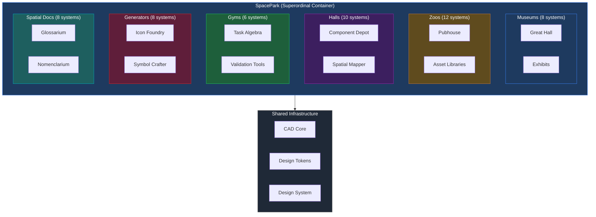
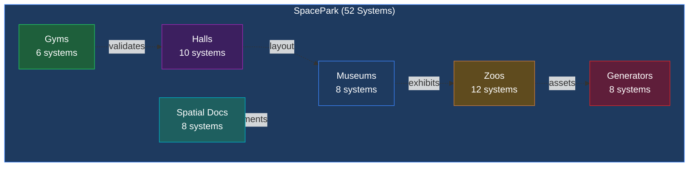
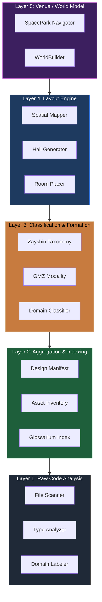
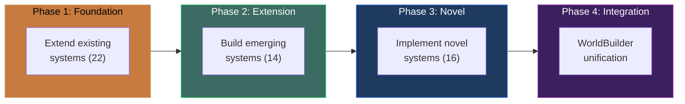
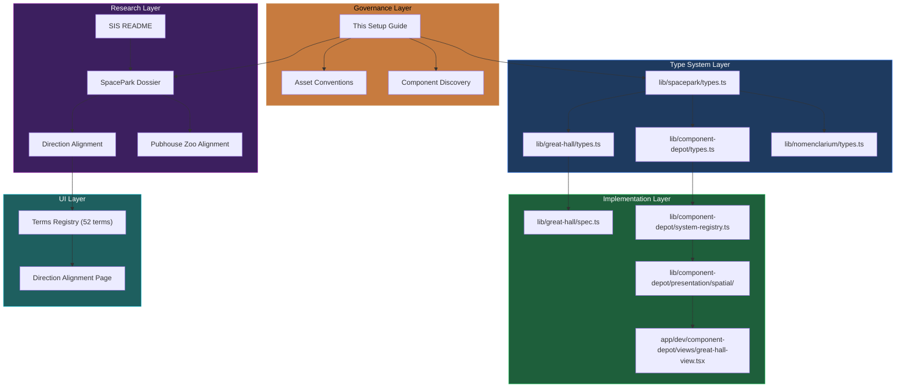
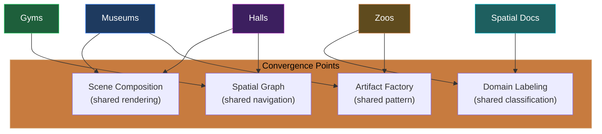

# Gyms, Zoos, Museums & Spatial Documentation: Codebase Context System Setup

> **Scope:** Comprehensive setup guide for Lanternade's spatial documentation ecosystem (SpacePark), covering the GMZ modality system, six thematic domains, canonical implementations, type system architecture, and integration patterns.
>
> **Audience:** AI assistants (Claude Code), contributors, and developers building within the SpacePark system.
>
> **Companion Guides:**
> - `docs/governance/PR_HERALDRY_COMPLETENESS_CODEBASE_CONTEXT_SYSTEM_SETUP.md`
> - `docs/governance/CASTLE_WALLS_CODEBASE_CONTEXT_SYSTEM_SETUP.md`

---

## Table of Contents

1. [System Overview](#1-system-overview)
2. [File Structure and Placement](#2-file-structure-and-placement)
3. [Setting Up the Core Type System](#3-setting-up-the-core-type-system)
4. [GMZ Modality Classification Definitions](#4-gmz-modality-classification-definitions)
5. [Domain Architecture](#5-domain-architecture)
6. [Canonical Implementations](#6-canonical-implementations)
7. [Spatial Primitives and Generation Rules](#7-spatial-primitives-and-generation-rules)
8. [Abstraction Hierarchy and Pipeline Architecture](#8-abstraction-hierarchy-and-pipeline-architecture)
9. [Direction Alignment and Terms Registry](#9-direction-alignment-and-terms-registry)
10. [Rules and Policy Governance](#10-rules-and-policy-governance)
11. [Cross-Reference and Reachability Architecture](#11-cross-reference-and-reachability-architecture)
12. [Verification and Quality Gates](#12-verification-and-quality-gates)
13. [Open Questions and Contemplation Priorities](#13-open-questions-and-contemplation-priorities)

---

## 1. System Overview

### 1.1 What is SpacePark?

SpacePark is the **superordinal container** for Lanternade's spatial documentation ecosystem. It adapts conventions from game development — specifically level design, dungeon layout, and asset management — to create navigable, inspectable environments for codebase comprehension.

The system answers a fundamental question: *How do you make a large codebase spatially intelligible to both humans and agents?*

SpacePark provides the answer through **six thematic domains**, each implementing a different facet of spatial documentation, unified by a shared type system and the **GMZ modality framework**.

### 1.2 Game Development Adaptation

The four documentation models are adapted from game development conventions:

| Game Dev Concept | Lanternade Adaptation | Domain |
|------------------|----------------------|--------|
| Character controller testing areas | Algorithm/pipeline testing infrastructure | **Gyms** |
| 3D asset display and reference galleries | Component galleries, artifact catalogs | **Zoos** |
| Technology demos and interactive showcases | Architecture exhibits, API documentation surfaces | **Museums** |
| In-game notes, lore, environmental storytelling | Inline docs, CLAUDE.md rules, contextual information | **Spatial Docs** |
| Level design and procedural generation | L-system hall generation, spatial graph navigation | **Halls** |
| Asset creation and transformation pipelines | Icon foundry, symbol crafting, logoplex | **Generators** |

### 1.3 The GMZ Modality System

Every venue (room, alcove, hall) in SpacePark carries a **GMZ modality triplet** that defines how users interact with the space:

- **G (Gym)**: Build, test, iterate, fail safely. Training and experimentation.
- **M (Museum)**: Browse, read, inspect, reference. Exhibition and viewing.
- **Z (Zoo)**: Catalog, monitor, observe lifecycle. Living collections.

The three booleans produce 8 permutations (see Section 4), enabling precise classification of interaction patterns.

### 1.4 Architectural Position



### 1.5 Scale

| Metric | Count |
|--------|-------|
| Total systems | 52 |
| Existing (implemented) | 22 |
| Emerging (in development) | 14 |
| Novel (speculated) | 16 |
| Reutilization rate | ~69% |
| Shared infrastructure modules | 12 (via CAD Core) |
| Canonical implementations | 3 (Great Hall, Pubhouse, Component Depot) |

---

## 2. File Structure and Placement

### 2.1 Core Type System

```
lib/spacepark/
├── types.ts                          # Root SpacePark type system (668 lines)
├── index.ts                          # Public exports
└── (future: engine/, navigation/, generation/)
```

### 2.2 Canonical Implementations

```
lib/great-hall/                       # Museum canonical implementation
├── types.ts                          # 4-layer ontology (Volume, Surface, Path, Semantic)
├── spec.ts                           # GreatHallSpec (9 bays, dimensions)
├── frames/
│   └── types.ts                      # Frame, Vec3 geometric primitives
├── integration/
│   └── exhibit-mapper.ts             # Zone-to-bay mapping
└── index.ts

lib/component-depot/                  # Hall canonical implementation
├── types.ts                          # 4 depot categories (Nomenclarium-aligned)
├── system-registry.ts                # 25 depot subsystems
├── presentation/
│   ├── types.ts                      # ViewMode, SpatialPosition, DepotItem
│   └── spatial/
│       └── spatial-mapper.ts         # 9 spatial zones, 5 layout algorithms
└── index.ts

lib/pubhouse/                         # Zoo canonical implementation (planned)
├── (6-phase pipeline: scan→index→categorize→orchestrate→build→render)
└── types.ts
```

### 2.3 Supporting Systems

```
lib/glossarium/                       # Spatial Docs: Term definitions
lib/nomenclarium/                     # Spatial Docs: Workflow phases
├── types.ts
├── colors.ts
├── topology.ts
└── patterns/
    └── atrium.ts                     # Reusable interface pattern

lib/icon-foundry/                     # Generator: Skeuomorphic SVGs
├── assets/
└── types.ts

lib/asset-inventory/                  # Zoo-adjacent: Asset tracking
├── routes.ts
└── types.ts

lib/domain-labeler/                   # Spatial Docs: OCHO domain detection
└── types/
    └── domains.ts                    # OchoDomain type
```

### 2.4 Application Pages

```
app/dev/spacepark/                    # SpacePark dev pages
├── direction-alignment/
│   ├── page.tsx                      # Direction alignment UI
│   └── terms-registry.ts            # 52-term TypeScript registry
└── (future: navigator/, world-builder/)

app/dev/component-depot/              # Component Depot dev pages
├── page.tsx
└── views/
    └── great-hall-view.tsx           # 3D museum visualization

app/dev/nomenclarium/                 # Nomenclarium dev pages
├── page.tsx
└── phases/
    └── {phase-id}/page.tsx
```

### 2.5 Documentation

```
docs/spatial-indexing-system/
├── README.md                         # SIS vision (4 documentation models)
├── gyms/                             # Gym-specific docs
├── zoos/                             # Zoo-specific docs
├── museums/                          # Museum-specific docs
├── spatial-documentation/            # Spatial docs docs
└── combined-techniques/              # Cross-domain patterns

docs/contemplate/spacepark/
├── SPACEPARK_COMPREHENSIVE_DOSSIER.md           # Master reference (882 lines)
├── SPACEPARK_DIRECTION_ALIGNMENT.md             # Three-tier classification
└── (other contemplation docs)

docs/contemplate/pubhouse/
└── SIS_PUBHOUSE_ZOO_DIRECTION_ALIGNMENT.md      # Zoo domain alignment (1037 lines)
```

### 2.6 Placement Rules

| Artifact | Location | Rationale |
|----------|----------|-----------|
| Core types shared across domains | `lib/spacepark/types.ts` | Single source of truth |
| Domain-specific types | `lib/{domain}/types.ts` | Co-located with implementation |
| Spatial zone definitions | `lib/component-depot/presentation/spatial/` | Presentation layer |
| Direction alignment registries | `app/dev/spacepark/direction-alignment/` | Interactive UI data |
| Contemplation/research docs | `docs/contemplate/spacepark/` | Pre-implementation research |
| Governance guides | `docs/governance/` | Policy and setup documentation |
| SIS documentation | `docs/spatial-indexing-system/` | Domain-specific documentation |

---

## 3. Setting Up the Core Type System

### 3.1 Spatial Primitives

The foundation of SpacePark is a spatial graph composed of typed nodes and edges. All spatial entities extend `SpatialNode`:

```typescript
// lib/spacepark/types.ts

/** Spatial node types in the graph */
export type SpatialNodeType =
  | "rotunda"    // Central hub
  | "hall"       // Rectilinear throughway (can be node, edge, or path)
  | "corridor"   // Connecting passage
  | "juncture"   // Intersection point
  | "room"       // Leaf venue / terminus
  | "alcove"     // Small recess off a hall
  | "chamber";   // Larger enclosed space

/** Edge types between spatial nodes */
export type SpatialEdgeType =
  | "passage"    // Direct connection
  | "portal"     // Threshold with transition
  | "stair"      // Vertical connection
  | "ramp"       // Gradual elevation change
  | "bridge";    // Spanning connection

/** Base spatial node */
export interface SpatialNode {
  id: string;
  name: string;
  type: SpatialNodeType;
  position: Vec3;
  frame?: Frame;
}

/** Edge connecting two spatial nodes */
export interface SpatialEdge {
  id: string;
  type: SpatialEdgeType;
  fromNode: string;
  toNode: string;
  bidirectional: boolean;
  traversalCost: number;
}
```

### 3.2 Structural Hierarchy

SpacePark organizes space in a strict containment hierarchy:

```
Spacepark (root)
└── Tract (major codebase region, 1 per OCHO domain)
    ├── Rotunda (central navigation hub)
    └── Hall[] (rectilinear throughways)
        ├── Juncture[] (intersection points)
        ├── Alcove[] (small recesses)
        └── Room[] (leaf venues / terminuses)
            └── Scene (composed environment)
                ├── Item[] (code entity props)
                ├── ItemSet[] (grouped items)
                └── Furnishing[] (compositional elements)
```

### 3.3 The Tract

A Tract is the highest-level spatial division, aligned with an OCHO domain:

```typescript
export interface Tract {
  id: string;
  name: string;
  description?: string;
  domain: OchoDomain;        // OCHO domain alignment
  rotunda: Rotunda;          // Central navigation hub
  halls: Hall[];             // Halls radiating from or within the tract
  rooms: Room[];             // All rooms/terminuses in this tract
  graph: SpatialGraph;       // Spatial graph for navigation
  metadata: TractMetadata;   // File count, component count, dates
}
```

### 3.4 The Hall (L-System Generated)

Halls are the primary throughways, generated procedurally via L-system parameters:

```typescript
export interface Hall extends SpatialNode {
  type: "hall";
  spec: GreatHallSpec;         // L-system generation parameters
  generated?: GeneratedHall;   // Populated after generation
  role: HallRole;              // primary | secondary | connector | terminal
  connections: HallConnection[];
  junctures: Juncture[];       // Branching points
  rooms: string[];             // Room IDs
  alcoves: Alcove[];           // Small recesses along the hall
}

export type HallRole =
  | "primary"      // Main thoroughfare from rotunda
  | "secondary"    // Branch off primary
  | "connector"    // Connects two other halls
  | "terminal";    // Ends at a terminus/room
```

### 3.5 The Room (GMZ-Classified Venue)

Rooms are leaf venues where interaction happens. Every room carries a GMZ modality:

```typescript
export interface Room extends SpatialNode {
  type: "room";
  modalities: VenueModalities;   // GMZ classification
  accessFrom: string;            // Parent hall or corridor ID
  dimensions: RoomDimensions;    // width, depth, height, shape
  contents: RoomContents;        // Items, ItemSets, Furnishings
  scene?: Scene;                 // Optional composed environment
}

export interface RoomDimensions {
  width: number;
  depth: number;
  height: number;
  shape: "rectangular" | "circular" | "octagonal" | "irregular";
}
```

### 3.6 Artifacts and Furnishings

Code entities are represented as skeuomorphic props within rooms:

```typescript
/** Item types - what code becomes in spatial context */
export type ItemType =
  | "book"        // Code file/module
  | "scroll"      // Documentation
  | "artifact"    // Special item
  | "specimen"    // Zoo item (living/dynamic)
  | "tool"        // Interactive tool
  | "marker";     // Wayfinding/label

/** Furnishing types - compositional elements around items */
export type FurnishingType =
  | "shelf"       // Holds items horizontally
  | "pedestal"    // Displays single item
  | "case"        // Enclosed display
  | "rack"        // Vertical storage
  | "frame"       // Border/surround
  | "plinth"      // Base/platform
  | "bracket";    // Wall mount
```

### 3.7 The Artifact Factory Pattern

All item production follows the factory interface:

```typescript
export interface ArtifactFactory<TInput, TOutput> {
  id: string;
  produce(input: TInput): TOutput;
  produceBatch(inputs: TInput[]): TOutput[];
}

/** Factory registry for all artifact types */
export interface FactoryRegistry {
  items: Map<string, ArtifactFactory<unknown, Item>>;
  itemSets: Map<string, ArtifactFactory<unknown, ItemSet>>;
  furnishings: Map<string, ArtifactFactory<unknown, Furnishing>>;
  scenes: Map<string, ArtifactFactory<unknown, Scene>>;
}
```

### 3.8 The Spatial Graph

Navigation within a tract uses a graph with adjacency lists:

```typescript
export interface SpatialGraph {
  nodes: Map<string, SpatialNode>;
  edges: SpatialEdge[];
  adjacency: Map<string, string[]>;  // Fast lookup
}

export interface SpatialPath {
  nodes: string[];
  edges: string[];
  totalCost: number;
}
```

### 3.9 Generation Rules

Procedural generation is driven by rule-based geometry, not randomness:

```typescript
export interface GenerationRules {
  tract: TractGenerationRules;     // maxHallsFromRotunda, minHallAngle, hallLengthRange
  hall: HallGenerationRules;       // L-system axiom, production rules, branching probability
  room: RoomGenerationRules;       // Size and shape by modality code
  scene: SceneGenerationRules;     // Item density, furnishing ratio, composition style
}

export interface HallGenerationRules {
  axiom: string;                   // L-system starting string
  productionRules: ProductionRule[];
  maxIterations: number;
  branchingProbability: number;
  junctureRules: JunctureRules;    // Min distance, allowed configurations
}
```

---

## 4. GMZ Modality Classification Definitions

### 4.1 The Three Modalities

| Modality | Code | Interaction Pattern | Game Dev Origin | Codebase Manifestation |
|----------|------|--------------------|-----------------|-----------------------|
| **Gym** | G | Build, test, iterate, fail safely | Character controller testing | Algorithm testing, pipeline validation, sandbox environments |
| **Museum** | M | Browse, read, inspect, reference | Technology demos, walkthroughs | Architecture exhibits, API surfaces, documentation showcases |
| **Zoo** | Z | Catalog, monitor, observe lifecycle | Asset galleries, bestiary | Component catalogs, artifact libraries, living collections |

### 4.2 The Eight Permutations

```typescript
export type ModalityCode =
  | "GMZ" | "GM-" | "G-Z" | "-MZ"
  | "G--" | "-M-" | "--Z" | "---";
```

| Code | Gym | Museum | Zoo | Description | Example Venues |
|------|-----|--------|-----|-------------|---------------|
| `GMZ` | yes | yes | yes | Full-spectrum venue | Component Depot (browse, test, catalog) |
| `GM-` | yes | yes | no | Interactive showcase | Pipeline Studio (run pipelines, view results) |
| `G-Z` | yes | no | yes | Testing collection | Test Suite Gallery (run tests, browse specimens) |
| `-MZ` | no | yes | yes | Curated exhibition | Great Hall (view exhibits, browse catalogs) |
| `G--` | yes | no | no | Pure training ground | Sandbox environment, REPL |
| `-M-` | no | yes | no | Read-only exhibit | Documentation page, API reference |
| `--Z` | no | no | yes | Pure catalog | Asset inventory, icon library |
| `---` | no | no | no | Transit/infrastructure | Corridors, junctures, utility spaces |

### 4.3 Modality Functions

```typescript
/** Convert modalities to 3-character code */
export function modalityToCode(m: VenueModalities): ModalityCode {
  const g = m.gym ? "G" : "-";
  const mu = m.museum ? "M" : "-";
  const z = m.zoo ? "Z" : "-";
  return `${g}${mu}${z}` as ModalityCode;
}

/** Convert code back to modalities */
export function codeToModality(code: ModalityCode): VenueModalities {
  return {
    gym: code[0] === "G",
    museum: code[1] === "M",
    zoo: code[2] === "Z",
  };
}
```

### 4.4 Modality-Driven Room Generation

Room dimensions and shapes are determined by modality:

```typescript
export interface RoomGenerationRules {
  sizeByModality: Record<ModalityCode, RoomDimensions>;
  shapeByModality: Record<ModalityCode, RoomDimensions["shape"][]>;
}
```

| Modality | Typical Size | Preferred Shapes | Rationale |
|----------|-------------|-----------------|-----------|
| `GMZ` | Large (20x20x8) | rectangular, octagonal | Needs space for all interaction types |
| `-MZ` | Medium-Large (16x16x10) | rectangular | Exhibition + catalog layout |
| `GM-` | Medium (12x12x6) | rectangular | Interactive workspace |
| `G--` | Small-Medium (8x8x4) | rectangular | Focused testing area |
| `-M-` | Variable | rectangular, circular | Viewing gallery |
| `--Z` | Medium (12x8x4) | rectangular | Shelving-friendly layout |
| `---` | Minimal | rectangular | Transit only |

### 4.5 Modality and the Nomenclarium Phase Alignment

Each modality aligns with Nomenclarium workflow phases:

| Modality | Primary Phase | Connection |
|----------|--------------|------------|
| Gym (G) | Evacatio (Phase 4) | Unearth and prepare through testing |
| Museum (M) | Paratium (Phase 1) | Observe and research through exhibition |
| Zoo (Z) | Stratum (Phase 3) | Catalog and ground through collections |

---

## 5. Domain Architecture

### 5.1 The Six SpacePark Domains

SpacePark decomposes into six thematic domains, each containing related systems:



### 5.2 Museums Domain (8 Systems)

**Purpose:** Technology showcases through immersive 3D exhibits.

**Canonical Implementation:** Great Hall

| ID | System | Status | Description |
|----|--------|--------|-------------|
| E-05 | Great Hall | Existing | 9-bay parametric museum with 4-layer ontology |
| E-06 | Great Hall Spec | Existing | Generation parameters (bay length, width, height) |
| E-07 | Exhibit Mapper | Existing | Zone-to-bay mapping for spatial placement |
| T-05 | Exhibit Factory | Emerging | Item production for museum displays |
| T-06 | Pipeline Orchestrator | Emerging | Multi-stage exhibit generation |
| N-03 | Immersive Viewer | Novel | 3D walkthrough renderer |
| N-04 | Exhibit Composer | Novel | Drag-and-drop exhibit arrangement |
| N-05 | Museum Navigator | Novel | Spatial wayfinding within museums |

**Great Hall 4-Layer Ontology:**

| Layer | Purpose | Examples |
|-------|---------|---------|
| Volume | 3D spatial envelope | Bay geometry, ceiling height, wall boundaries |
| Surface | Material and visual treatment | Floor textures, wall finishes, display surfaces |
| Path | Navigation and circulation | Visitor routes, accessibility paths, focal points |
| Semantic | Meaning and information | Labels, descriptions, category groupings |

### 5.3 Zoos Domain (12 Systems)

**Purpose:** Categorized asset collections as physical libraries.

**Canonical Implementation:** Pubhouse

| ID | System | Status | Description |
|----|--------|--------|-------------|
| E-01 | Asset Inventory | Existing | Route-based asset tracking and registration |
| E-02 | Design System Manifest | Existing | 634+ component catalog |
| E-03 | Icon Foundry Assets | Existing | Skeuomorphic SVG library |
| E-08 | Component Index | Existing | Quick-reference component lookup |
| T-01 | Pubhouse Scanner | Emerging | Codebase scanning for categorizable assets |
| T-02 | Pubhouse Indexer | Emerging | Search index construction |
| T-03 | Pubhouse Categorizer | Emerging | Classification engine |
| T-04 | Pubhouse Orchestrator | Emerging | Pipeline coordination |
| N-06 | Pubhouse Builder | Novel | 3D library construction from catalog |
| N-07 | Pubhouse Renderer | Novel | Visual rendering of categorized collections |
| N-08 | Collection Curator | Novel | AI-assisted collection arrangement |
| N-09 | Specimen Tracker | Novel | Living specimen lifecycle monitoring |

**Pubhouse 6-Phase Pipeline:**


### 5.4 Halls Domain (10 Systems)

**Purpose:** Component system displays and pattern libraries.

**Canonical Implementation:** Component Depot

| ID | System | Status | Description |
|----|--------|--------|-------------|
| E-04 | Component Depot | Existing | 634+ components, 25 subsystems, 4 categories |
| E-09 | Spatial Mapper | Existing | 9 zones, 5 layout algorithms |
| E-10 | System Registry | Existing | 25 depot subsystem definitions |
| E-11 | Depot Presentation | Existing | ViewMode, DepotItem, SpatialPosition types |
| T-07 | Great Hall View | Emerging | 3D museum visualization of components |
| T-08 | Pattern Library | Emerging | Reusable UI pattern catalog |
| N-10 | Hall Generator | Novel | L-system procedural hall construction |
| N-11 | Juncture Resolver | Novel | Intersection and branching logic |
| N-12 | Hall Navigator | Novel | Corridor-level wayfinding |
| N-13 | Pattern Composer | Novel | Composable pattern assembly |

**Component Depot 4 Categories (Nomenclarium-Aligned):**

| Category | Phase | Action | Color |
|----------|-------|--------|-------|
| Asset Manager | Specificare | Specify and configure | `#3b82f6` |
| Asset Generator | Regere | Build and orchestrate | `#9C27B0` |
| Asset Updater | Evacatio | Unearth and prepare | `#FF6B35` |
| Asset Indexer | Paratium | Observe and catalog | `#00ACC1` |

**9 Spatial Zones:**

| Zone | Purpose | Placement |
|------|---------|-----------|
| `entrance` | Orientation and wayfinding | Entry point |
| `atom-alcove` | Atomic components display | Near entrance |
| `molecule-gallery` | Molecule compositions | Central area |
| `organism-hall` | Complex organisms | Deep hall |
| `template-terrace` | Page templates | Upper level |
| `page-plaza` | Full page examples | Exhibition space |
| `system-sanctuary` | System-level displays | Specialized area |
| `asset-archive` | Asset storage and retrieval | Back rooms |
| `gallery-grove` | Curated collections | Garden area |

### 5.5 Gyms Domain (6 Systems)

**Purpose:** Mechanics testing and validation infrastructure.

| ID | System | Status | Description |
|----|--------|--------|-------------|
| E-12 | Task Algebra | Existing | HypotheticalTask state machine with decimal priority |
| E-13 | Validation Tools | Existing | Type checking, linting, build verification |
| T-09 | Sandbox Environment | Emerging | Isolated testing contexts |
| T-10 | Pipeline Gym | Emerging | Pipeline testing and benchmarking |
| N-14 | Training Arena | Novel | Interactive algorithm practice |
| N-15 | Benchmark Track | Novel | Performance comparison environment |

**Task Algebra Integration:**

The Gym modality integrates with Task Algebra for structured experimentation:

```
HypotheticalTask → ExperimentalTask → ValidatedTask → IntegratedTask
     (idea)          (sandbox)         (tested)        (merged)
```

### 5.6 Generators Domain (8 Systems)

**Purpose:** Asset creation and transformation pipelines.

| ID | System | Status | Description |
|----|--------|--------|-------------|
| E-14 | Icon Foundry | Existing | Skeuomorphic SVG icon creation |
| E-15 | Symbol Crafter | Existing | Parametric symbol generation |
| E-16 | SymEdit Pipeline | Existing | Symbol editing and export |
| E-17 | Logoplex | Existing | Logo and branding asset pipeline |
| T-11 | Emojidex | Emerging | Custom emoji generation |
| T-12 | UI Diffusion | Emerging | UI mockup generation |
| N-16 | World Texture Gen | Novel | Procedural texture creation |
| E-18 | Remix Primitives | Existing | SVG-to-React component extraction |

### 5.7 Spatial Docs Domain (8 Systems)

**Purpose:** In-situ contextual documentation.

| ID | System | Status | Description |
|----|--------|--------|-------------|
| E-19 | Glossarium | Existing | 159+ term definitions with semantic search |
| E-20 | Nomenclarium | Existing | 5 workflow phases, 2 containers, Atrium pattern |
| E-21 | CLAUDE.md System | Existing | AI assistant configuration and rules |
| E-22 | Rules Engine | Existing | 20+ policy rules in `.claude/rules/` |
| T-13 | Indexarium | Emerging | Cross-system index generation |
| T-14 | Direction Alignment | Emerging | Interactive term registry UI |
| N-01 | SpacePark Navigator | Novel | Global spatial navigation |
| N-02 | Zayshin Taxonomy | Novel | 8-category essential nature classification |

**Zayshin Taxonomy (在真) Categories:**

| Category | Description | Nature |
|----------|-------------|--------|
| Foundational | Core infrastructure | Essential |
| Structural | Architecture patterns | Load-bearing |
| Transformational | Data pipelines | Converting |
| Presentational | UI rendering | Displaying |
| Orchestrative | Coordination logic | Directing |
| Analytical | Analysis engines | Understanding |
| Integrative | Cross-system bridges | Connecting |
| Observational | Monitoring and metrics | Watching |

---

## 6. Canonical Implementations

### 6.1 Great Hall (Museum Canonical)

**Location:** `lib/great-hall/`

The Great Hall is a 9-bay parametric museum implementing the Museum modality through spatial exhibits. It serves as the reference implementation for how museums are constructed in SpacePark.

**Specification (`lib/great-hall/spec.ts`):**

| Parameter | Value | Purpose |
|-----------|-------|---------|
| Bay count | 9 | Primary structural divisions |
| Bay length | 8m | Longitudinal spacing |
| Hall width | 12m | Cross-section dimension |
| Hall height | 10m | Vertical clearance |
| Colonnade width | 2m | Side passage width |

**4-Layer Ontology (`lib/great-hall/types.ts`):**

```typescript
// Each bay has 4 semantic layers
interface GreatHallBay {
  volume: VolumeLayer;     // 3D spatial envelope
  surface: SurfaceLayer;   // Material treatment
  path: PathLayer;         // Navigation routes
  semantic: SemanticLayer; // Meaning and labels
}
```

**Exhibit Mapping (`lib/great-hall/integration/exhibit-mapper.ts`):**

The exhibit mapper bridges Component Depot spatial zones to Great Hall bays:

| Spatial Zone | Bay Assignment | Exhibit Type |
|-------------|---------------|-------------|
| entrance | Bay 1 | Orientation exhibit |
| atom-alcove | Bay 2 | Atomic component showcase |
| molecule-gallery | Bay 3-4 | Molecule composition display |
| organism-hall | Bay 5-6 | Complex organism walkthrough |
| template-terrace | Bay 7 | Template gallery |
| page-plaza | Bay 8 | Full page demonstration |
| system-sanctuary | Bay 9 | System-level exhibition |

### 6.2 Pubhouse (Zoo Canonical)

**Location:** `lib/pubhouse/` (planned), research at `docs/contemplate/pubhouse/`

Pubhouse implements the Zoo modality as a 6-phase pipeline that transforms raw codebase assets into categorized, browsable collections. The name derives from "pub" (publication) + "house" (storage).

**6-Phase Pipeline:**

| Phase | Input | Output | Purpose |
|-------|-------|--------|---------|
| 1. Scan | File system | Raw file list | Discover all assets |
| 2. Index | Raw files | Searchable index | Enable fast lookup |
| 3. Categorize | Indexed files | Classified assets | Apply taxonomy |
| 4. Orchestrate | Classified assets | Build plan | Determine rendering strategy |
| 5. Build | Build plan | Spatial layout | Construct 3D library |
| 6. Render | Spatial layout | Visual output | Display to user |

**37 Terms (Direction Alignment):**

The Pubhouse Zoo direction alignment identifies 37 terms:
- 15 Existing (E-01 through E-15)
- 8 Emerging (T-01 through T-08)
- 14 Novel (N-01 through N-14)

Full details in `docs/contemplate/pubhouse/SIS_PUBHOUSE_ZOO_DIRECTION_ALIGNMENT.md`.

### 6.3 Component Depot (Hall Canonical)

**Location:** `lib/component-depot/`

The Component Depot implements the Hall modality by presenting 634+ components across 25 subsystems in a navigable spatial layout. It serves as both a zoo (cataloging components) and a hall (providing throughway navigation).

**25 Subsystems (`lib/component-depot/system-registry.ts`):**

Subsystems span across the four Nomenclarium-aligned categories:

| Category | Count | Example Subsystems |
|----------|-------|--------------------|
| Asset Manager (Specificare) | ~6 | Component Browser, Property Editor |
| Asset Generator (Regere) | ~7 | Code Generator, Template Engine |
| Asset Updater (Evacatio) | ~6 | Dependency Updater, Migration Tool |
| Asset Indexer (Paratium) | ~6 | Search Engine, Type Analyzer |

**5 Layout Algorithms (`lib/component-depot/presentation/spatial/spatial-mapper.ts`):**

| Algorithm | Description | Best For |
|-----------|-------------|----------|
| Linear | Sequential row layout | Small collections |
| Grid | 2D grid arrangement | Medium collections |
| Radial | Circular arrangement | Hub-and-spoke displays |
| Clustered | Grouped by category | Related components |
| Hierarchical | Tree structure | Dependency visualization |

---

## 7. Spatial Primitives and Generation Rules

### 7.1 Rotunda (Central Hub)

```typescript
export interface Rotunda extends SpatialNode {
  type: "rotunda";
  connectedHalls: string[];    // IDs of radiating halls
  capacity: "small" | "medium" | "large" | "grand";
  geometry?: RotundaGeometry;  // radius, height, domeStyle, portalCount
}
```

The Rotunda serves as the central navigation hub within each Tract. Halls radiate outward from rotundas, creating the primary navigation structure.

**Capacity determines connectivity:**

| Capacity | Max Halls | Typical Use |
|----------|-----------|-------------|
| small | 3 | Focused sub-domain |
| medium | 5 | Standard domain |
| large | 8 | Major domain |
| grand | 12 | Cross-domain hub |

### 7.2 Juncture (Intersection Point)

```typescript
export interface Juncture extends SpatialNode {
  type: "juncture";
  connectedHalls: string[];
  configuration: JunctureConfiguration;
}

export type JunctureConfiguration =
  | "T"           // T-intersection (3-way)
  | "cross"       // 4-way intersection
  | "Y"           // Y-fork
  | "elbow"       // 90-degree turn
  | "splay";      // Multi-way (5+)
```

### 7.3 Corridor (Simple Connection)

```typescript
export interface Corridor extends SpatialNode {
  type: "corridor";
  fromNode: string;
  toNode: string;
  length: number;
  width: number;
  height: number;
  bidirectional: boolean;
}
```

### 7.4 Alcove (Hall Recess)

```typescript
export interface Alcove extends SpatialNode {
  type: "alcove";
  parentHall: string;
  hallPosition: number;     // 0-1 along hall length
  side: "left" | "right";
  depth: number;
  width: number;
  height: number;
  contents: RoomContents;
}
```

### 7.5 L-System Hall Generation

Halls are generated procedurally using L-system production rules:

```typescript
export interface HallGenerationRules {
  axiom: string;                       // Starting string (e.g., "F")
  productionRules: ProductionRule[];   // Rewriting rules
  maxIterations: number;               // Generation depth limit
  branchingProbability: number;        // Chance of branching at each step
  junctureRules: JunctureRules;        // Constraints on intersections
}

export interface ProductionRule {
  symbol: string;       // Input symbol
  replacement: string;  // Output string
  condition?: string;   // Optional guard condition
}
```

**Example L-system for a museum hall:**

```
Axiom: F
Rules:
  F → F[+F]F[-F]F    (branch with sub-halls)
  + → turn right 90
  - → turn left 90
  [ → push position (create juncture)
  ] → pop position (return to juncture)

Iteration 0: F
Iteration 1: F[+F]F[-F]F
Iteration 2: F[+F]F[-F]F[+F[+F]F[-F]F]F[+F]F[-F]F[-F[+F]F[-F]F]F[+F]F[-F]F
```

### 7.6 Scene Composition

Scenes are the final rendered output combining items, furnishings, and lighting:

```typescript
export interface Scene {
  id: string;
  name: string;
  items: Item[];
  itemSets: ItemSet[];
  furnishings: Furnishing[];
  layout: SceneLayout;        // Floor plan bounds, placement zones, navigation paths
  lighting: SceneLighting;    // Ambient, directional, point lights
}

export interface SceneGenerationRules {
  itemDensity: number;           // Items per cubic unit
  furnishingRatio: number;       // Furnishings per item
  compositionStyle: "dense" | "sparse" | "clustered" | "ordered";
}
```

---

## 8. Abstraction Hierarchy and Pipeline Architecture

### 8.1 The 5-Layer Abstraction Hierarchy

SpacePark organizes its systems across five levels of abstraction, each building on the layer below:



| Layer | Name | Input | Output | Key Systems |
|-------|------|-------|--------|-------------|
| 1 | Raw Code Analysis | Source files | Parsed structures | File Scanner, Type Analyzer, Domain Labeler |
| 2 | Aggregation & Indexing | Parsed structures | Searchable indices | Design Manifest, Asset Inventory, Glossarium |
| 3 | Classification & Formation | Indexed data | Classified entities | Zayshin Taxonomy, GMZ Modality, Domain Classifier |
| 4 | Layout Engine | Classified entities | Spatial positions | Spatial Mapper, Hall Generator, Room Placer |
| 5 | Venue / World Model | Spatial layout | Navigable world | SpacePark Navigator, WorldBuilder |

### 8.2 Shared Infrastructure (CAD Core)

CAD Core provides 12 major modules shared across SpacePark domains:

| Module | Purpose | Used By |
|--------|---------|---------|
| Geometry Primitives | Vec3, Frame, Transform | All spatial systems |
| CSG Operations | Boolean unions/intersections | Hall and room generation |
| Mesh Generation | Triangulation, normals | Rendering pipeline |
| Scene Graph | Hierarchical transforms | Scene composition |
| Material System | Surface properties | Museum exhibits |
| Camera System | Viewpoint management | Navigation |
| Collision Detection | Spatial queries | Interaction |
| Animation System | Keyframe interpolation | Transitions |
| Export Pipeline | glTF, OBJ output | Asset creation |
| Input Handling | Mouse, keyboard, touch | Interaction |
| Lighting System | Ambient, point, directional | Scene atmosphere |
| LOD System | Level of detail | Performance |

### 8.3 WorldBuilder Pipeline Status

WorldBuilder is the planned end-to-end pipeline for constructing SpacePark worlds:

| Stage | Status | Description |
|-------|--------|-------------|
| Codebase Scan | Existing | File system traversal and parsing |
| Domain Classification | Existing | OCHO domain labeling |
| Asset Extraction | Emerging | Component and artifact identification |
| Spatial Layout | Emerging | L-system hall generation |
| Scene Composition | Novel | Item and furnishing placement |
| Rendering | Novel | 3D visualization output |

**Overlap with existing systems:** ~55% ontological overlap between WorldBuilder and existing SpacePark implementations. This overlap is intentional — WorldBuilder synthesizes existing capabilities into a unified pipeline.

### 8.4 Multi-Structure Pipeline Family

SpacePark uses specialized pipelines for each domain:

| Pipeline | Domain | Phases | Status |
|----------|--------|--------|--------|
| Great Hall Pipeline | Museums | Spec → Generate → Populate → Render | Partially existing |
| Pubhouse Pipeline | Zoos | Scan → Index → Categorize → Orchestrate → Build → Render | Emerging |
| Depot Pipeline | Halls | Discover → Classify → Map → Layout → Present | Existing |
| Gym Pipeline | Gyms | Define → Configure → Execute → Validate | Partially existing |
| Generator Pipeline | Generators | Input → Transform → Validate → Export | Existing (per-generator) |
| Docs Pipeline | Spatial Docs | Parse → Index → Relate → Surface | Partially existing |

---

## 9. Direction Alignment and Terms Registry

### 9.1 Three-Tier Classification System

Every system in SpacePark is classified into one of three tiers:

| Tier | Color | Hex | Count | Meaning |
|------|-------|-----|-------|---------|
| **Existing** | Copper | `#c77b3f` | 22 | Implemented and functional |
| **Emerging** | Oxidized | `#3c6b63` | 14 | In development or partial |
| **Novel** | Azure | `#3b82f6` | 16 | Speculated, not yet started |

### 9.2 Domain Colors

```typescript
// app/dev/spacepark/direction-alignment/terms-registry.ts

export const DOMAIN_COLORS: Record<SpaceparkDomain, string> = {
  museums: "#1e3a5f",       // Navy blue
  gyms: "#1e5f3b",          // Forest green
  zoos: "#5f4b1e",          // Brown
  halls: "#3c1f5f",         // Purple
  generators: "#5f1e3a",    // Crimson
  "spatial-docs": "#1e5f5f", // Teal
};
```

### 9.3 Terms Registry Structure

Each term in the registry follows this interface:

```typescript
export interface TermDefinition {
  id: string;                           // e.g., "E-04", "T-06", "N-01"
  term: string;                         // Display name
  definition: string;                   // Semantically clamped definition
  domain: SpaceparkDomain;             // Which of the 6 domains
  status: ClassificationStatus;         // existing | emerging | new
  existingLocation?: string;            // File path if existing
  relatedTerms: string[];               // Cross-references
  aliases?: string[];                   // Alternative names
}
```

### 9.4 Full 52-Term Registry

**Existing Systems (22):**

| ID | Term | Domain |
|----|------|--------|
| E-01 | Asset Inventory | zoos |
| E-02 | Design System Manifest | zoos |
| E-03 | Icon Foundry Assets | zoos |
| E-04 | Component Depot | halls |
| E-05 | Great Hall | museums |
| E-06 | Great Hall Spec | museums |
| E-07 | Exhibit Mapper | museums |
| E-08 | Component Index | zoos |
| E-09 | Spatial Mapper | halls |
| E-10 | System Registry | halls |
| E-11 | Depot Presentation | halls |
| E-12 | Task Algebra | gyms |
| E-13 | Validation Tools | gyms |
| E-14 | Icon Foundry | generators |
| E-15 | Symbol Crafter | generators |
| E-16 | SymEdit Pipeline | generators |
| E-17 | Logoplex | generators |
| E-18 | Remix Primitives | generators |
| E-19 | Glossarium | spatial-docs |
| E-20 | Nomenclarium | spatial-docs |
| E-21 | CLAUDE.md System | spatial-docs |
| E-22 | Rules Engine | spatial-docs |

**Emerging Systems (14):**

| ID | Term | Domain |
|----|------|--------|
| T-01 | Pubhouse Scanner | zoos |
| T-02 | Pubhouse Indexer | zoos |
| T-03 | Pubhouse Categorizer | zoos |
| T-04 | Pubhouse Orchestrator | zoos |
| T-05 | Exhibit Factory | museums |
| T-06 | Pipeline Orchestrator | museums |
| T-07 | Great Hall View | halls |
| T-08 | Pattern Library | halls |
| T-09 | Sandbox Environment | gyms |
| T-10 | Pipeline Gym | gyms |
| T-11 | Emojidex | generators |
| T-12 | UI Diffusion | generators |
| T-13 | Indexarium | spatial-docs |
| T-14 | Direction Alignment | spatial-docs |

**Novel Systems (16):**

| ID | Term | Domain |
|----|------|--------|
| N-01 | SpacePark Navigator | spatial-docs |
| N-02 | Zayshin Taxonomy | spatial-docs |
| N-03 | Immersive Viewer | museums |
| N-04 | Exhibit Composer | museums |
| N-05 | Museum Navigator | museums |
| N-06 | Pubhouse Builder | zoos |
| N-07 | Pubhouse Renderer | zoos |
| N-08 | Collection Curator | zoos |
| N-09 | Specimen Tracker | zoos |
| N-10 | Hall Generator | halls |
| N-11 | Juncture Resolver | halls |
| N-12 | Hall Navigator | halls |
| N-13 | Pattern Composer | halls |
| N-14 | Training Arena | gyms |
| N-15 | Benchmark Track | gyms |
| N-16 | World Texture Gen | generators |

### 9.5 Reutilization Matrix

Component reutilization across domains:

| Domain | Existing | Emerging | Novel | Reuse % |
|--------|----------|----------|-------|---------|
| Museums | 3 | 2 | 3 | 62% |
| Zoos | 4 | 4 | 4 | 67% |
| Halls | 4 | 2 | 4 | 60% |
| Gyms | 2 | 2 | 2 | 67% |
| Generators | 5 | 2 | 1 | 88% |
| Spatial Docs | 4 | 2 | 2 | 75% |
| **Total** | **22** | **14** | **16** | **~69%** |

### 9.6 Critical Path



---

## 10. Rules and Policy Governance

### 10.1 Applicable Rules

The following `.claude/rules/` files govern SpacePark development:

| Rule | Relevance |
|------|-----------|
| `COMPONENT_DISCOVERY.rules.md` | Reusing existing UI components in SpacePark pages |
| `NOMENCLARIUM_PHASES.rules.md` | Phase alignment for depot categories and workflow |
| `DIAGRAM_CONVENTIONS.rules.md` | Mermaid diagrams for SpacePark architecture |
| `ASSET_CONVENTIONS.rules.md` | Asset placement for generated symbols and icons |
| `GROUNDWORK_COMPONENT_CLASSIFICATION.rules.md` | E/T/X/M/P/N classification for new components |
| `B2A_COMPLIANCE.rules.md` | Externalization of SpacePark APIs and MCP tools |

### 10.2 Naming Conventions

| Artifact | Convention | Example |
|----------|-----------|---------|
| Spatial node IDs | kebab-case with domain prefix | `museum-great-hall-bay-3` |
| Room IDs | domain + zone + index | `halls-atom-alcove-01` |
| Tract IDs | OCHO domain name | `dev-tools`, `observability` |
| System IDs | tier prefix + sequence | `E-04`, `T-06`, `N-01` |
| Type names | PascalCase | `SpatialNode`, `VenueModalities` |
| Functions | camelCase | `modalityToCode()`, `codeToModality()` |

### 10.3 Domain Color Conventions

SpacePark domains use dedicated colors distinct from OCHO tinctures:

| Domain | Fill | Text | Usage |
|--------|------|------|-------|
| Museums | `#1e3a5f` | `#ffffff` | Mermaid nodes, badges, borders |
| Zoos | `#5f4b1e` | `#ffffff` | Mermaid nodes, badges, borders |
| Halls | `#3c1f5f` | `#ffffff` | Mermaid nodes, badges, borders |
| Gyms | `#1e5f3b` | `#ffffff` | Mermaid nodes, badges, borders |
| Generators | `#5f1e3a` | `#ffffff` | Mermaid nodes, badges, borders |
| Spatial Docs | `#1e5f5f` | `#ffffff` | Mermaid nodes, badges, borders |

All six domain colors have luminance < 50%, so text color is always `#ffffff` per `DIAGRAM_CONVENTIONS.rules.md`.

### 10.4 Component Discovery Keywords

When building SpacePark UI, these keywords trigger component reuse:

| Keywords | Component | Import |
|----------|-----------|--------|
| spatial, 3D, museum, hall | Great Hall View | `app/dev/component-depot/views/great-hall-view.tsx` |
| term, definition, glossary | Glossarium components | `lib/glossarium/` |
| phase, workflow, nomenclarium | Phase components | `components/nomenclarium/` |
| direction, alignment, classification | Terms Registry | `app/dev/spacepark/direction-alignment/` |
| component, depot, catalog | Component Depot | `lib/component-depot/` |
| scroll, overflow | ScrollArea | `@/components/ui/ScrollArea` |
| diagram, architecture | DiagramRenderer | `@/lib/diagram-system/components/` |
| collapsible, section | CollapsibleCard | `@/components/dashboard/CollapsibleCard` |
| status, badge | StatusBadge | `@/components/observability/primitives/StatusBadge` |

---

## 11. Cross-Reference and Reachability Architecture

### 11.1 Reachability Graph



### 11.2 Complete File Reference Index

**Core Type System:**

| File | Lines | Purpose |
|------|-------|---------|
| `lib/spacepark/types.ts` | 668 | Root type system — all spatial primitives, GMZ, Tract, Hall, Room, Scene, Item, Factory |
| `lib/great-hall/types.ts` | ~200 | 4-layer ontology (Volume, Surface, Path, Semantic) |
| `lib/great-hall/spec.ts` | ~80 | GreatHallSpec (9 bays, 8m/12m/10m) |
| `lib/great-hall/frames/types.ts` | ~50 | Frame, Vec3 geometric primitives |
| `lib/component-depot/types.ts` | ~150 | 4 depot categories (Nomenclarium-aligned) |
| `lib/component-depot/presentation/types.ts` | ~120 | ViewMode, SpatialPosition, DepotItem |
| `lib/nomenclarium/types.ts` | ~200 | Workflow phases, containers |
| `lib/domain-labeler/types/domains.ts` | ~50 | OchoDomain type definition |

**Implementations:**

| File | Purpose |
|------|---------|
| `lib/great-hall/integration/exhibit-mapper.ts` | Zone-to-bay mapping |
| `lib/component-depot/system-registry.ts` | 25 depot subsystem definitions |
| `lib/component-depot/presentation/spatial/spatial-mapper.ts` | 9 zones, 5 layout algorithms |
| `lib/nomenclarium/colors.ts` | Phase and container colors |
| `lib/nomenclarium/topology.ts` | Nested topology structure |
| `lib/nomenclarium/patterns/atrium.ts` | Reusable interface pattern |

**UI and Pages:**

| File | Purpose |
|------|---------|
| `app/dev/spacepark/direction-alignment/page.tsx` | Direction alignment interactive UI |
| `app/dev/spacepark/direction-alignment/terms-registry.ts` | 52-term TypeScript registry |
| `app/dev/component-depot/views/great-hall-view.tsx` | 3D museum visualization |
| `app/dev/nomenclarium/page.tsx` | Nomenclarium main page |
| `app/dev/nomenclarium/phases/{id}/page.tsx` | Individual phase pages |

**Research and Documentation:**

| File | Lines | Purpose |
|------|-------|---------|
| `docs/contemplate/spacepark/SPACEPARK_COMPREHENSIVE_DOSSIER.md` | 882 | Master reference document |
| `docs/contemplate/spacepark/SPACEPARK_DIRECTION_ALIGNMENT.md` | 556 | Three-tier classification |
| `docs/contemplate/pubhouse/SIS_PUBHOUSE_ZOO_DIRECTION_ALIGNMENT.md` | 1037 | Zoo domain alignment |
| `docs/spatial-indexing-system/README.md` | 182 | SIS vision and four documentation models |

**Governance:**

| File | Purpose |
|------|---------|
| `docs/governance/GYMS_ZOOS_MUSEUMS_SPATIAL_DOCUMENTATION_CODEBASE_CONTEXT_SYSTEM_SETUP.md` | This document |
| `.claude/rules/NOMENCLARIUM_PHASES.rules.md` | Workflow phase rules |
| `.claude/rules/COMPONENT_DISCOVERY.rules.md` | Component reuse rules |
| `.claude/rules/ASSET_CONVENTIONS.rules.md` | Asset governance |
| `.claude/rules/GROUNDWORK_COMPONENT_CLASSIFICATION.rules.md` | E/T/X/M/P/N classification |

### 11.3 Integration Points

| System A | System B | Integration |
|----------|----------|-------------|
| SpacePark types | Great Hall types | `GreatHallSpec` referenced in `Hall.spec` |
| SpacePark types | Great Hall frames | `Vec3`, `Frame` used for `SpatialNode.position` |
| Component Depot | Nomenclarium | 4 categories aligned with workflow phases |
| Component Depot | Great Hall | Exhibit mapper bridges zones to bays |
| Glossarium | Nomenclarium | Term definitions include phase references |
| Direction Alignment | Terms Registry | Interactive UI for 52-term classification |
| Asset Inventory | Zoos domain | Asset tracking feeds zoo catalogs |
| Icon Foundry | Generators domain | SVG creation pipeline |
| Task Algebra | Gyms domain | State machine for experimentation |
| Domain Labeler | All domains | OCHO domain detection for tract assignment |

---

## 12. Verification and Quality Gates

### 12.1 Type System Verification

```bash
# Verify SpacePark types compile
pnpm typecheck

# Check for unused types
grep -rn "SpatialNode\|SpatialEdge\|VenueModalities\|ModalityCode" lib/ --include="*.ts"

# Verify Great Hall spec integrity
grep -rn "GreatHallSpec" lib/ --include="*.ts"
```

### 12.2 Direction Alignment Verification

```bash
# Count terms in registry
grep -c "id:" app/dev/spacepark/direction-alignment/terms-registry.ts

# Verify all 52 terms present (22E + 14T + 16N)
grep "status:" app/dev/spacepark/direction-alignment/terms-registry.ts | sort | uniq -c

# Check for orphaned system IDs
grep -rn "E-\|T-\|N-" docs/contemplate/spacepark/ --include="*.md"
```

### 12.3 Spatial Zone Consistency

```bash
# Verify 9 spatial zones defined
grep -c "zone" lib/component-depot/presentation/spatial/spatial-mapper.ts

# Check zone-to-bay mapping consistency
grep -rn "entrance\|atom-alcove\|molecule-gallery\|organism-hall" lib/ --include="*.ts"
```

### 12.4 Modality Code Integrity

```bash
# Verify all 8 modality codes exist
grep "ModalityCode" lib/spacepark/types.ts

# Check modality usage in codebase
grep -rn "modalityToCode\|codeToModality\|VenueModalities" lib/ --include="*.ts"
```

### 12.5 Documentation Freshness

| Document | Expected Updates | Check Command |
|----------|-----------------|---------------|
| SpacePark Dossier | After any system addition | `stat docs/contemplate/spacepark/SPACEPARK_COMPREHENSIVE_DOSSIER.md` |
| Direction Alignment | After any tier change | `stat docs/contemplate/spacepark/SPACEPARK_DIRECTION_ALIGNMENT.md` |
| Terms Registry | After any system addition | `stat app/dev/spacepark/direction-alignment/terms-registry.ts` |
| This Setup Guide | After structural changes | `stat docs/governance/GYMS_ZOOS_MUSEUMS_SPATIAL_DOCUMENTATION_CODEBASE_CONTEXT_SYSTEM_SETUP.md` |

### 12.6 Pre-Implementation Checklist

Before implementing any new SpacePark system:

- [ ] System ID assigned (E-XX, T-XX, or N-XX)
- [ ] Domain classification confirmed (museums/zoos/halls/gyms/generators/spatial-docs)
- [ ] GMZ modality determined for any venue components
- [ ] Existing component reuse checked (`COMPONENT_INDEX.md`)
- [ ] Groundwork classification applied (E/T/X/M/P/N per `GROUNDWORK_COMPONENT_CLASSIFICATION.rules.md`)
- [ ] Types extend or reference `lib/spacepark/types.ts`
- [ ] Direction alignment terms registry updated
- [ ] Domain color applied correctly (see Section 10.3)
- [ ] Spatial zone placement determined (if hall-domain)
- [ ] Factory interface implemented (if producing artifacts)
- [ ] Cross-references added to relevant documentation

---

## 13. Open Questions and Contemplation Priorities

### 13.1 Architectural Open Questions

These questions are documented in the SpacePark Comprehensive Dossier and require deliberation before implementation:

| # | Question | Domain | Priority |
|---|----------|--------|----------|
| 1 | How should inter-tract navigation work at the global graph level? | All | High |
| 2 | Should the Zayshin Taxonomy (在真) be orthogonal to or nested within OCHO domains? | Spatial Docs | High |
| 3 | What is the precise boundary between Pubhouse (zoo) and Component Depot (hall)? | Zoos, Halls | Medium |
| 4 | Should WorldBuilder be a single unified pipeline or a federation of domain pipelines? | All | High |
| 5 | How should L-system generation parameters be exposed to users? | Halls | Medium |
| 6 | What rendering target should SpacePark use? (WebGL, Three.js, CSS 3D, SVG) | All | High |
| 7 | How does the Atrium pattern (reusable research container) integrate with GMZ venues? | Spatial Docs | Low |
| 8 | Should `Map<>` types in `Spacepark`, `SpatialGraph` be replaced with plain objects for Immer compatibility? | Types | Medium |

### 13.2 Implementation Priorities

Based on the dossier's contemplation priority queue:

| Priority | System | Rationale |
|----------|--------|-----------|
| P0 | SpacePark Navigator (N-01) | Enables all other systems through navigation |
| P0 | Hall Generator (N-10) | L-system generation is foundational for spatial layout |
| P1 | Pubhouse Scanner (T-01) | First phase of the zoo pipeline |
| P1 | Exhibit Factory (T-05) | Item production for museum displays |
| P2 | Zayshin Taxonomy (N-02) | Essential nature classification system |
| P2 | Juncture Resolver (N-11) | Required for complex hall intersections |
| P3 | Immersive Viewer (N-03) | 3D rendering can use interim 2D views |
| P3 | Collection Curator (N-08) | AI-assisted curation is enhancement, not core |

### 13.3 B2A Externalization Opportunities

Systems suitable for externalization per `B2A_COMPLIANCE.rules.md`:

| System | Interface Potential | Phase |
|--------|-------------------|-------|
| Glossarium | REST + MCP + CLI for term lookup | Beta |
| Component Depot | REST + MCP for component discovery | Alpha |
| Asset Inventory | REST + MCP for asset queries | Alpha |
| Nomenclarium | REST + MCP for phase/taxonomy queries | Beta |
| Direction Alignment | REST for term registry queries | Alpha |

### 13.4 Immer Compatibility Note

The current `lib/spacepark/types.ts` uses `Map<>` in several interfaces (`SpatialGraph.nodes`, `SpatialGraph.adjacency`, `Spacepark.tracts`, `SpaceparkIndex.*`). Per the FlyDE CRDT implementation pattern, Zustand + Immer requires plain objects, not Maps. If SpacePark state is managed via Zustand:

- Replace `Map<string, T>` with `Record<string, T>` or `{ [key: string]: T }`
- OR keep Maps for computation-only interfaces that don't flow through Immer

### 13.5 Cross-Domain Convergence

The dossier identifies convergence points where multiple domains share infrastructure:



These convergence points suggest that shared infrastructure modules should be stabilized before domain-specific novel systems are implemented.

---

## Work Cited

### Primary Sources (Codebase)

| Source | Location | Relevance |
|--------|----------|-----------|
| SpacePark Type System | `lib/spacepark/types.ts` | Foundational types for all spatial primitives |
| Great Hall Types | `lib/great-hall/types.ts` | Museum ontology (4-layer) |
| Great Hall Spec | `lib/great-hall/spec.ts` | Museum generation parameters |
| Great Hall Exhibit Mapper | `lib/great-hall/integration/exhibit-mapper.ts` | Zone-to-bay bridging |
| Component Depot Types | `lib/component-depot/types.ts` | Hall category definitions |
| Component Depot Registry | `lib/component-depot/system-registry.ts` | 25 subsystem definitions |
| Spatial Mapper | `lib/component-depot/presentation/spatial/spatial-mapper.ts` | 9 zones, 5 algorithms |
| Terms Registry | `app/dev/spacepark/direction-alignment/terms-registry.ts` | 52-term classification |
| Great Hall View | `app/dev/component-depot/views/great-hall-view.tsx` | 3D museum visualization |
| Nomenclarium Types | `lib/nomenclarium/types.ts` | Phase and container types |

### Research Documents

| Source | Location | Relevance |
|--------|----------|-----------|
| SpacePark Dossier | `docs/contemplate/spacepark/SPACEPARK_COMPREHENSIVE_DOSSIER.md` | Master reference (882 lines) |
| Direction Alignment | `docs/contemplate/spacepark/SPACEPARK_DIRECTION_ALIGNMENT.md` | Three-tier classification (556 lines) |
| Pubhouse Zoo Alignment | `docs/contemplate/pubhouse/SIS_PUBHOUSE_ZOO_DIRECTION_ALIGNMENT.md` | Zoo domain detail (1037 lines) |
| SIS Vision | `docs/spatial-indexing-system/README.md` | Four documentation models (182 lines) |

### Governance and Rules

| Source | Location | Relevance |
|--------|----------|-----------|
| Component Discovery Rules | `.claude/rules/COMPONENT_DISCOVERY.rules.md` | UI component reuse |
| Nomenclarium Phase Rules | `.claude/rules/NOMENCLARIUM_PHASES.rules.md` | Phase alignment |
| Groundwork Classification | `.claude/rules/GROUNDWORK_COMPONENT_CLASSIFICATION.rules.md` | E/T/X/M/P/N system |
| Asset Conventions | `.claude/rules/ASSET_CONVENTIONS.rules.md` | Asset placement |
| B2A Compliance | `.claude/rules/B2A_COMPLIANCE.rules.md` | Externalization |
| Diagram Conventions | `.claude/rules/DIAGRAM_CONVENTIONS.rules.md` | Mermaid standards |

### Companion Setup Guides

| Source | Location | Relevance |
|--------|----------|-----------|
| PR Heraldry Setup | `docs/governance/PR_HERALDRY_COMPLETENESS_CODEBASE_CONTEXT_SYSTEM_SETUP.md` | Structural template |
| Castle Walls Setup | `docs/governance/CASTLE_WALLS_CODEBASE_CONTEXT_SYSTEM_SETUP.md` | Structural template |

---

_Version: 1.0.0_
_Created: 2026-02-12_
_Branch: feat/permission-policy-engine_
