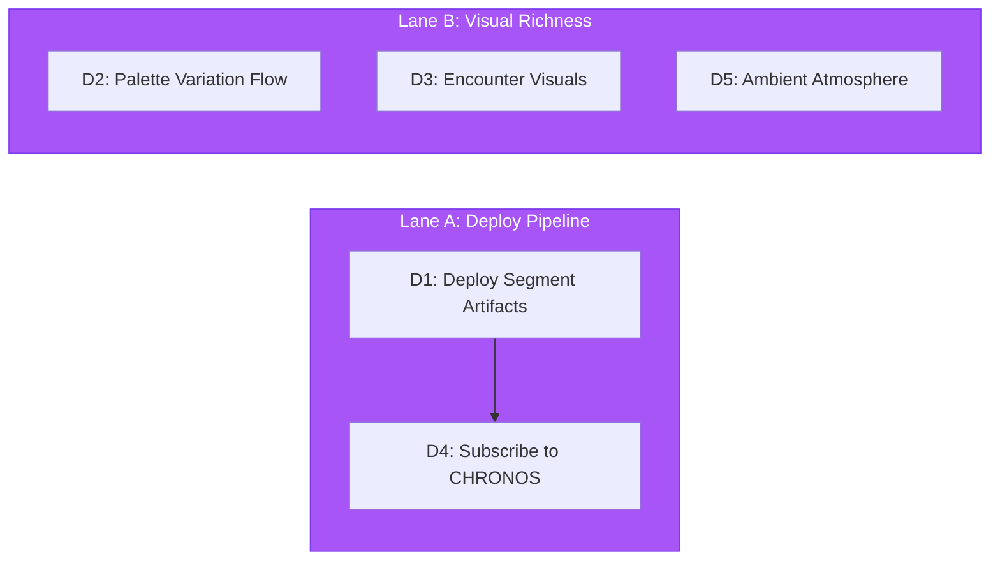

# IMAGINARIUM Implementation Directives

> **Domain:** The Dream Forge (`packages/imaginarium`)
> **Baseline:** 25 exports, 21 test files (best coverage), 6 build-time events emitted but never listened to
> **Goal:** Close the art pipeline from generation to rendering — make the tree colorful, segments deployable, encounters visual

---

## Execution Lanes

---

## D1 — Deploy Segment Pipeline Artifacts

**Priority:** P0
**Complexity:** Medium
**Files to modify:** `src/pipeline/SegmentPipeline.ts`, build/deploy scripts
**Cross-pillar:** Root cause of the 350+ 404 cascade in OPERATUS/ARCHITECTUS

### Problem

`SegmentPipeline` writes per-file `stem.json` and `cap.json` chunks during `bun run distill`. These files are not included in the Vercel deployment artifact. The deployed app requests them at runtime via `/api/worlds/{owner}/{repo}/{hash}__stem.json` and gets 404s for every file in the topology.

### Target State

- `bun run distill` output includes all segment chunks in the deploy-ready directory
- Vercel API route (or static file serving) serves segment chunks alongside the manifest
- `manifest-chunked.json` references all chunks with correct relative paths

### Approach

1. Verify `SegmentPipeline` output directory matches the served path
2. Add segment chunks to the Vercel build output (either via API route or static `public/` directory)
3. Ensure `manifest-chunked.json` is generated and deployed alongside the chunks
4. Test with a small world (e.g., dendrovia self-portrait) to verify all paths resolve

### Exit Criteria

- [ ] `bun run distill` produces `manifest-chunked.json` + per-segment chunks
- [ ] Vercel deployment serves all segment files without 404
- [ ] `loadWorldIndex()` returns a valid result on deployed app
- [ ] Per-segment loading (stem.json, cap.json) succeeds for all segments

---

## D2 — Palette Variation Pipeline

**Priority:** P1
**Complexity:** Medium
**Files to modify:** `src/palette/PaletteGenerator.ts`, palette consumption in ARCHITECTUS
**Cross-pillar:** ARCHITECTUS `BranchInstances` and `NodeInstances` consume palette

### Problem

The IMAGINARIUM palette generator produces per-language and per-depth palette variations, but the data flow stops at `AssetBridge`. The ARCHITECTUS rendering pipeline uses a single flat palette (the "global" palette or hardcoded `DEFAULT_PALETTE`). The tree renders as monochrome cyan regardless of language, complexity, or depth.

### Target State

- Palette data includes per-language tinctures (e.g., TypeScript = azure, Go = teal, Rust = copper)
- Branch coloring varies by: depth (darker at root, brighter at leaves), language (per-file tincture), complexity (hotter = more saturated)
- The `palettes` record from `GeneratedAssets` flows through to `BranchInstances` and `NodeInstances` as a lookup table

### Approach

1. Ensure `PaletteGenerator` produces a `palettes` map keyed by language ID
2. In ARCHITECTUS, pass `palettes` to `DendriteWorld` → `BranchInstances`
3. `BranchInstances` looks up each branch's source language from the topology metadata and uses the corresponding palette entry for per-instance color
4. Fall back to global palette when language-specific entry is absent
5. Add a depth-based luminance ramp (darker at depth 0, brighter at max depth)

### Exit Criteria

- [ ] Tree shows visible color variation by language
- [ ] Depth-based luminance gradient visible
- [ ] Complexity hotspots visually distinct (warmer/brighter)
- [ ] Global palette fallback works when per-language data absent
- [ ] No performance regression (palette lookup is per-instance setup, not per-frame)

---

## D3 — Encounter Visual Generation

**Priority:** P2
**Complexity:** Medium
**Files to create:** `src/encounter/EncounterVisualGenerator.ts`
**Cross-pillar:** OCULUS `BattleUI` consumes generated encounter visuals

### Problem

The battle pane shows "Null Pointer" with a small generic bug icon. There's no visual representation of the enemy — no sprite, no procedural graphic, no severity-scaled visual. The encounter feels like a text log, not a battle.

### Target State

- Procedurally generate encounter visuals based on bug type and severity
- Output: SVG or canvas-rendered bug portrait at 128x128
- Visual vocabulary: Null Pointer = fractured crystal, Memory Leak = dripping blob, Race Condition = tangled threads, Type Error = misshapen geometry
- Severity 1-5 scales visual complexity and color intensity

### Approach

1. Define a `BugVisualSpec` type mapping bug categories to visual parameters
2. Create `EncounterVisualGenerator` that produces an SVG string or `ImageData` from a spec
3. Export via IMAGINARIUM's root index
4. OCULUS `BattleUI` calls the generator when an encounter begins, displays the result

### Exit Criteria

- [ ] Each bug category has a distinct visual
- [ ] Severity scales visual complexity
- [ ] Generation takes <50ms (no frame stutter)
- [ ] Fallback to generic bug icon when generator unavailable

---

## D4 — Subscribe to CHRONOS Events

**Priority:** P2
**Complexity:** Low
**Files to modify:** `src/pipeline/DistillationPipeline.ts` or runtime bridge
**Cross-pillar:** CHRONOS emits PARSE_COMPLETE + TOPOLOGY_GENERATED; nobody listens

### Problem

The CHRONOS → IMAGINARIUM pipeline is documented in the architecture but never wired at runtime. CHRONOS emits `PARSE_COMPLETE` and `TOPOLOGY_GENERATED` events, but IMAGINARIUM never subscribes. The distillation pipeline runs only as a CLI command (`bun run distill`), not as a reactive listener.

### Target State

- IMAGINARIUM subscribes to `TOPOLOGY_GENERATED`
- On receipt, triggers palette generation and shader compilation for the new topology
- Enables live-reload during development: change a file → CHRONOS re-parses → IMAGINARIUM re-distills → ARCHITECTUS re-renders

### Approach

1. Create a runtime bridge module that subscribes to CHRONOS events
2. On `TOPOLOGY_GENERATED`, invoke the palette and shader pipelines with the new topology
3. Emit `PALETTE_GENERATED` and `SHADERS_COMPILED` for ARCHITECTUS to consume
4. Guard against re-entrancy (debounce rapid topology changes)

### Exit Criteria

- [ ] IMAGINARIUM reacts to CHRONOS `TOPOLOGY_GENERATED`
- [ ] Palette and shader pipelines re-run with new data
- [ ] ARCHITECTUS receives updated assets via EventBus
- [ ] No re-entrancy or infinite loops
- [ ] CLI `bun run distill` still works independently

---

## D5 — Ambient Atmosphere Effects

**Priority:** P2
**Complexity:** Medium
**Files to modify:** Shader source templates, palette generator
**Cross-pillar:** ARCHITECTUS `SDFBackdrop` and `PostProcessing` consume atmosphere data

### Problem

The scene has no atmospheric depth — no fog gradient, no glow halos around bright nodes, no ambient color temperature shift. The tree floats in void. The "melted plastic aesthetic" described in the design system isn't expressed.

### Target State

- Palette includes atmosphere parameters: fog color, fog density, ambient glow color, ambient glow radius
- SDF backdrop shader applies distance-based fog
- Bloom post-processing catches emissive > 1.0 surfaces (node orbs, branch edges)
- Overall scene feels immersive rather than clinical

### Approach

1. Extend `ProceduralPalette` type with atmosphere fields (fog, ambient glow)
2. Generate atmosphere params in `PaletteGenerator` based on mood (cool → blue fog, warm → amber fog)
3. Pass to ARCHITECTUS via `GeneratedAssets.palette`
4. ARCHITECTUS `SDFBackdrop` reads fog uniforms, `PostProcessing` reads bloom threshold

### Exit Criteria

- [ ] Distance fog visible in scene
- [ ] Bloom catches bright emissive surfaces
- [ ] Atmosphere parameters vary with palette mood
- [ ] Performance budget maintained (fog is a cheap fullscreen effect)

---

*Document version: 1.0.0*
*Generated: 2026-02-18*
