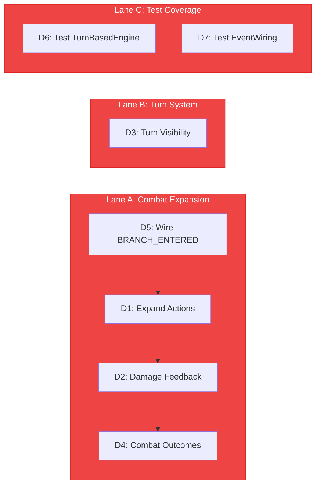

# LUDUS Implementation Directives

> **Domain:** The Rulemaker (`packages/ludus`)
> **Baseline:** 17 exports, 4 test files, 12 combat events emitted, BRANCH_ENTERED listener missing
> **Goal:** Transform the skeleton combat system into a playable encounter loop with feedback and progression

---

## Execution Lanes



---

## D1 — Expand Combat Action Set

**Priority:** P1
**Complexity:** Medium
**Files to modify:** `src/combat/TurnBasedEngine.ts`, `src/combat/CombatMath.ts`
**Cross-pillar:** OCULUS `BattleUI` renders action buttons

### Problem

The battle pane has a single "Attack" button. Players have no tactical choice — combat is a click-to-win loop. The `TurnBasedEngine` may support more actions internally, but they're not exposed to the UI layer.

### Target State

Minimum four actions available during player turn:

| Action | Effect | Event Emitted |
|--------|--------|--------------|
| **Attack** | Base damage roll vs enemy defense | `DAMAGE_DEALT` |
| **Defend** | Reduce incoming damage next turn, small MP cost | `STATUS_EFFECT_APPLIED` |
| **Spell** | MP-consuming ability (scales with level), type-effective | `SPELL_RESOLVED` |
| **Flee** | Chance-based escape (severity-scaled), ends encounter | `COMBAT_ENDED` |

### Approach

1. Audit `TurnBasedEngine` for existing action handling
2. Add `defend()`, `castSpell(spellId)`, and `attemptFlee()` methods
3. Ensure each action emits the appropriate event via EventBus
4. Add action availability logic (Spell requires MP, Flee chance decreases with severity)
5. Expose available actions as a `getAvailableActions(): Action[]` method for OCULUS consumption

### Exit Criteria

- [ ] All four actions functional in TurnBasedEngine
- [ ] Each action emits correct EventBus event
- [ ] MP consumed by Spell, validated before casting
- [ ] Flee chance calculated from severity (Severity 1 = 80%, Severity 5 = 20%)
- [ ] OCULUS can query available actions and render buttons accordingly

---

## D2 — Damage Feedback System

**Priority:** P1
**Complexity:** Medium
**Files to modify:** `src/combat/CombatMath.ts`, event payloads
**Cross-pillar:** ARCHITECTUS D8 (particle burst), OCULUS (damage numbers)

### Problem

When the player attacks, nothing visible happens. No damage number, no hit/miss indicator, no HP bar animation, no screen shake, no particle burst. The `DAMAGE_DEALT` event fires but carries minimal data for consumers to render feedback.

### Target State

`DAMAGE_DEALT` event payload includes:

```typescript
{
  sourceId: string;      // attacker
  targetId: string;      // defender
  damage: number;        // final damage after defense
  isCritical: boolean;   // crit multiplier applied
  isResisted: boolean;   // type resistance reduced damage
  position: [number, number, number]; // world-space for particle burst
  damageType: 'physical' | 'arcane' | 'system'; // for VFX color
}
```

### Approach

1. Enrich `DAMAGE_DEALT` event payload with the fields above
2. `CombatMath.calculateDamage()` returns a `DamageResult` object with all computed values
3. `TurnBasedEngine` passes `DamageResult` into the event emission
4. ARCHITECTUS reads `position` + `damageType` for particle burst color
5. OCULUS reads `damage` + `isCritical` for floating damage number + HP bar animation

### Exit Criteria

- [ ] `DAMAGE_DEALT` payload includes all enriched fields
- [ ] Critical hits distinguishable from normal hits
- [ ] Damage type flows through to VFX consumers
- [ ] Position is world-space (not screen-space)
- [ ] Backward-compatible with existing listeners

---

## D3 — Turn System Visibility

**Priority:** P2
**Complexity:** Low
**Files to modify:** `src/combat/TurnBasedEngine.ts`, event payloads
**Cross-pillar:** OCULUS renders turn indicator

### Problem

The battle pane has no turn indicator. Players can't tell whose turn it is, what the enemy is doing, or when they can act. The `COMBAT_TURN_START` and `COMBAT_TURN_END` events exist but carry minimal data.

### Target State

- `COMBAT_TURN_START` includes `{ actorId, actorName, isPlayer, turnNumber }`
- `COMBAT_TURN_END` includes `{ actorId, actionTaken, turnNumber }`
- Enemy turn has a brief delay (500ms) with visible "Enemy is thinking..." indicator
- Turn order is predictable and displayed

### Approach

1. Enrich turn events with actor identity and turn number
2. Add an `enemyThinkDelay` parameter (500ms default) between player turn end and enemy action
3. Emit `COMBAT_TURN_START` before the delay, `COMBAT_TURN_END` after
4. OCULUS reads turn events to show a turn indicator bar

### Exit Criteria

- [ ] Turn events carry actor identity
- [ ] Enemy turn has visible delay
- [ ] OCULUS can render "Your Turn" / "Enemy Turn" indicator
- [ ] Turn number increments correctly

---

## D4 — Combat Outcome Pipeline

**Priority:** P2
**Complexity:** Medium
**Files to modify:** `src/combat/TurnBasedEngine.ts`, `src/state/GameStore.ts`
**Cross-pillar:** OCULUS renders rewards; OPERATUS persists state

### Problem

When an encounter ends, nothing happens. No XP awarded, no loot dropped, no severity-based rewards, no progression state updated. The `COMBAT_ENDED` event fires but the player gets nothing.

### Target State

`COMBAT_ENDED` event includes outcome:

```typescript
{
  outcome: 'victory' | 'defeat' | 'fled';
  xpGained: number;           // severity-scaled
  loot: LootItem[] | null;    // chance-based, severity-scaled
  nodeId: string;             // which file/directory was encountered
}
```

After victory:
- `EXPERIENCE_GAINED` emitted with XP amount
- `LEVEL_UP` emitted if threshold crossed
- `LOOT_DROPPED` emitted if loot generated
- GameStore updated with new XP and inventory

### Approach

1. Add `resolveOutcome()` to `TurnBasedEngine` that computes rewards
2. XP formula: `basXP * severity * (1 + critBonus)`
3. Loot table: `MonsterFactory` generates loot based on bug type and severity
4. Chain emissions: `COMBAT_ENDED` → `EXPERIENCE_GAINED` → `LEVEL_UP` (conditional) → `LOOT_DROPPED` (conditional)
5. Update `GameStore` with new player state

### Exit Criteria

- [ ] Victory awards XP proportional to severity
- [ ] Loot drops with probability based on severity
- [ ] `EXPERIENCE_GAINED` and `LEVEL_UP` events fire correctly
- [ ] GameStore reflects updated XP and inventory
- [ ] Defeat outcome does not award XP (but preserves player state)
- [ ] Fled outcome awards partial XP (50%)

---

## D5 — Wire BRANCH_ENTERED Listener

**Priority:** P0
**Complexity:** Trivial
**Files to modify:** `src/events/EventWiring.ts`
**Cross-pillar:** ARCHITECTUS emits `BRANCH_ENTERED`; LUDUS should listen for encounter triggering

### Problem

The `BRANCH_ENTERED` event is documented as a LUDUS listener and is critical for triggering encounters when the player enters a directory. But the registration call is simply absent from `wireGameEvents()`. The listener function exists but is never subscribed.

### Target State

- `wireGameEvents()` subscribes to `BRANCH_ENTERED`
- On receipt, checks if the entered branch has an encounter configured
- If yes, triggers `ENCOUNTER_TRIGGERED` and starts combat

### Approach

1. Add `eventBus.on(GameEvents.BRANCH_ENTERED, handleBranchEntered)` to `wireGameEvents()`
2. `handleBranchEntered` checks encounter table for the entered path
3. If match, invokes the `EncounterSystem` to start an encounter

### Exit Criteria

- [ ] `BRANCH_ENTERED` listened in `wireGameEvents()`
- [ ] Directory entry triggers encounter when configured
- [ ] No duplicate listeners on hot reload
- [ ] Cleanup on `unwireGameEvents()`

---

## D6 — Test TurnBasedEngine Directly

**Priority:** P2
**Complexity:** Medium
**Files to create:** `tests/turn-based-engine.test.ts`

### Problem

`TurnBasedEngine` is 625+ lines of core combat logic with zero direct tests. It's exercised only indirectly through the integration test. Any refactoring (e.g., for D1-D4) risks silent regression.

### Exit Criteria

- [ ] Turn progression tested (player → enemy → player cycle)
- [ ] Damage calculation verified against CombatMath
- [ ] Action validation tested (can't cast spell without MP)
- [ ] Combat end conditions tested (enemy HP 0, player HP 0, flee)
- [ ] Event emissions verified for all combat events

---

## D7 — Test EventWiring

**Priority:** P2
**Complexity:** Medium
**Files to create:** `tests/event-wiring.test.ts`

### Problem

`EventWiring.ts` is the 425-line bridge connecting LUDUS to the rest of the world. It has zero tests. It subscribes to spatial events, emits combat events, and orchestrates the encounter lifecycle. If it breaks, the entire game loop is severed.

### Exit Criteria

- [ ] All subscriptions registered on `wireGameEvents()`
- [ ] All subscriptions cleaned up on `unwireGameEvents()`
- [ ] `NODE_CLICKED` → encounter check → `ENCOUNTER_TRIGGERED` flow tested
- [ ] `PLAYER_MOVED` → proximity check tested
- [ ] `BRANCH_ENTERED` → encounter trigger tested (after D5)

---

*Document version: 1.0.0*
*Generated: 2026-02-18*
