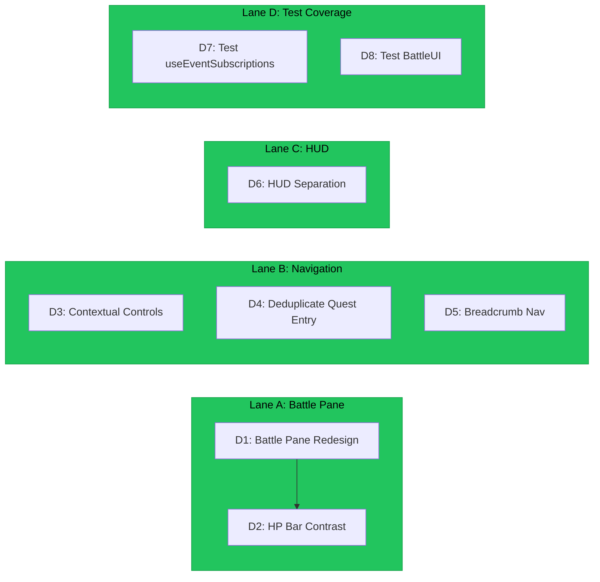

# OCULUS Implementation Directives

> **Domain:** The Navigator (`packages/oculus`)
> **Baseline:** 31 exports, 2 test files (worst coverage), 21 event subscriptions, ~30 orphaned exports
> **Goal:** Transform the UI from prototype panels into a responsive, context-aware game interface

---

## Execution Lanes



---

## D1 — Battle Pane Redesign

**Priority:** P1
**Complexity:** High (design + implementation)
**Files to modify:** `src/components/BattleUI.tsx`
**Cross-pillar:** Consumes LUDUS `getAvailableActions()` (L-D1), IMAGINARIUM encounter visuals (I-D3)

### Problem

The current battle pane is a dark card that blends into the dark scene background. It has:
- A single "Attack" button (small, low-contrast red-on-dark)
- No enemy visual — just text name + tiny bug icon
- A health bar (64/64) that's red-on-dark-red (hard to read fill vs empty)
- "BATTLE LOG" with one line, no scroll
- No backdrop blur or visual separation from the 3D scene
- No animation or transition on pane open/close

### Target State

- Frosted glass backdrop (CSS `backdrop-filter: blur`) separating pane from 3D scene
- Border glow in pillar accent color (Gules red `#EF4444`)
- Enemy portrait area (128x128) for IMAGINARIUM-generated visuals
- Action bar with 4 buttons (Attack, Defend, Spell, Flee) — large touch targets (min 48x48)
- Animated HP bars with distinct colors (enemy: red, player: green)
- Scrollable battle log with timestamps
- Slide-up entrance animation, fade-out on combat end
- Responsive layout: stacks vertically on mobile

### Approach

1. Redesign `BattleUI.tsx` layout: enemy portrait + info top, actions middle, battle log bottom
2. Add CSS `backdrop-filter: blur(12px)` with semi-transparent dark background
3. Action buttons read from LUDUS `getAvailableActions()` — disable unavailable actions with tooltip
4. Enemy portrait fetches from IMAGINARIUM `EncounterVisualGenerator` (fallback: severity-colored generic icon)
5. HP bar animation: CSS transition on width, color shifts from green → yellow → red as HP decreases
6. Battle log: max-height with overflow-y scroll, newest entry highlighted briefly

### Visual Spec

```
+--------------------------------------------+
|  [Enemy Portrait]  Null Pointer             |
|                    Severity 1/5             |
|                    ████████████░░░  64/64   |
+--------------------------------------------+
|  [ Attack ]  [ Defend ]  [ Spell ]  [ Flee ]|
+--------------------------------------------+
|  BATTLE LOG                                 |
|  > A wild null-pointer appeared!            |
|  > You attack for 12 damage!               |
|  > Null Pointer retaliates for 5 damage!   |
+--------------------------------------------+
```

### Exit Criteria

- [ ] Backdrop blur visually separates pane from scene
- [ ] All 4 action buttons render when LUDUS provides them
- [ ] Enemy portrait renders when IMAGINARIUM provides visual (fallback for absent data)
- [ ] HP bars animate smoothly on damage
- [ ] Battle log scrolls with history
- [ ] Pane entrance/exit animation works
- [ ] Touch targets meet 48x48 minimum
- [ ] Mobile layout stacks correctly

---

## D2 — HP Bar Contrast Fix

**Priority:** P2
**Complexity:** Low
**Files to modify:** `src/components/BattleUI.tsx` or `src/primitives/HealthBar.tsx`

### Problem

The enemy HP bar shows 64/64 as a red fill on a dark-red background. You can barely tell the difference between "full" and "empty." The bar needs a distinct empty-track color and a clearer fill gradient.

### Target State

- Empty track: `#2a1a1a` (very dark, distinct from fill)
- Fill gradient: full = `#22c55e` (green), 50% = `#eab308` (yellow), 25% = `#ef4444` (red), 0% = empty track visible
- Fill width animates with CSS transition (300ms ease-out)
- Numeric HP text overlay: white with dark text shadow for readability

### Exit Criteria

- [ ] HP bar clearly shows fill level at all percentages
- [ ] Color shifts from green → yellow → red as HP decreases
- [ ] Numeric overlay readable on all fill colors
- [ ] Animation smooth on damage events

---

## D3 — Contextual Controls Panel

**Priority:** P2
**Complexity:** Low
**Files to modify:** `src/components/ControlsPanel.tsx` or equivalent

### Problem

The controls panel always shows the same text: "Click: Orbit / Select, Scroll: Zoom, Q: Quest Log, M: Miller Columns, Esc: Close Panel." During combat, these are irrelevant — the player needs combat controls. The panel is static and wastes space.

### Target State

| Context | Controls Shown |
|---------|---------------|
| Exploration (Falcon) | Click: Orbit, Scroll: Zoom, M: Miller Columns, Q: Quests |
| Exploration (Player) | WASD: Move, Space: Jump, Click: Interact, Q: Quests |
| Combat | 1-4: Actions, Esc: (no flee — use Flee button), Q: Quest Log |
| Panel open | Esc: Close Panel, Tab: Switch Panel |

### Approach

1. Read `cameraMode` and `encounterNodeId` from renderer store
2. Switch control display based on active context
3. Collapse the panel to an icon button when not needed (expand on hover/press)

### Exit Criteria

- [ ] Controls change when entering combat
- [ ] Controls change when switching camera mode
- [ ] Panel can be collapsed to save screen space
- [ ] No stale controls shown for wrong context

---

## D4 — Deduplicate Quest Entry Points

**Priority:** P2
**Complexity:** Trivial
**Files to modify:** `src/components/QuestButton.tsx`, `src/components/NavigationBar.tsx`

### Problem

There's a "QUESTS" button in the bottom-left AND a "Quests Q" tab in the bottom-right tab bar. Two entry points to the same panel create confusion.

### Target State

- Single quest entry: the tab bar "Quests Q" tab
- Remove the standalone "QUESTS" button
- Or: keep the bottom-left button as a floating action button that opens the quest tab

### Exit Criteria

- [ ] Only one way to open the quest panel
- [ ] Quest panel accessible via keyboard shortcut (Q) and one click target

---

## D5 — Breadcrumb Navigation

**Priority:** P2
**Complexity:** Medium
**Files to modify:** New component + integration into main layout
**Cross-pillar:** Reads topology tree path from ARCHITECTUS renderer store

### Problem

There's no indication of where in the codebase you are. The tree is a visual structure but gives no textual context. Players can't tell if they're looking at `src/components/` or `src/utils/`.

### Target State

- Breadcrumb bar below the HUD: `src / components / App.tsx`
- Updates on `BRANCH_ENTERED` and `NODE_CLICKED` events
- Each segment is clickable (zooms camera to that branch)
- Truncates gracefully for deep paths

### Approach

1. Subscribe to `BRANCH_ENTERED` and `NODE_CLICKED` events in the breadcrumb component
2. Extract path segments from the event `filePath` field
3. Render as a horizontal breadcrumb with ` / ` separators
4. On click, emit a `CAMERA_FOCUS` event (or directly set player position)
5. Truncate to last 4 segments when path is deeper than 5

### Exit Criteria

- [ ] Breadcrumb shows current tree path
- [ ] Updates on navigation events
- [ ] Segments clickable
- [ ] Deep paths truncated gracefully
- [ ] No breadcrumb shown when no node selected (initial state)

---

## D6 — HUD Separation (Dev Telemetry vs Game State)

**Priority:** P1
**Complexity:** Low
**Files to modify:** `src/components/HUD.tsx` or equivalent

### Problem

The top-left HUD mixes dev telemetry ("60 FPS HIGH FALCON") with game-state information ("FALCON Lvl 1, HP 100/100"). Players don't need FPS. Developers don't need the character card mixed in. The panels are cramped and hard to read.

### Target State

- **Game HUD (always visible):** Character name, level, HP/MP bars — larger text, clearer layout
- **Dev overlay (toggle with backtick or F3):** FPS, quality tier, GPU backend, draw calls, triangles
- Dev overlay hidden by default in production builds
- Character card: HP bar wider (at least 120px), MP bar wider, level text larger

### Approach

1. Split the current HUD into `GameHUD.tsx` and `DevOverlay.tsx`
2. `GameHUD` shows character state only — always visible
3. `DevOverlay` shows performance metrics — toggled via keyboard shortcut
4. `DevOverlay` hidden when `process.env.NODE_ENV === 'production'` (or controlled by a debug flag)
5. Increase HP/MP bar height from current 4px to 8px minimum, width to 120px minimum

### Exit Criteria

- [ ] Game state and dev metrics in separate panels
- [ ] Dev overlay toggleable, hidden by default in production
- [ ] Character card text readable at a glance (16px+ for level, 14px+ for HP/MP)
- [ ] HP/MP bars visually prominent

---

## D7 — Test useEventSubscriptions

**Priority:** P2
**Complexity:** Medium
**Files to create:** `src/__tests__/useEventSubscriptions.test.ts`

### Problem

`useEventSubscriptions` subscribes to 21 EventBus events — the largest listener surface in the monorepo. Zero tests. Any regression silently breaks the entire OCULUS event pipeline.

### Exit Criteria

- [ ] All 21 subscriptions registered on mount
- [ ] All 21 cleaned up on unmount
- [ ] Event payloads correctly update OCULUS store
- [ ] Edge cases: rapid events, missing fields, double mount

---

## D8 — Test BattleUI Component

**Priority:** P2
**Complexity:** Medium
**Files to create:** `src/__tests__/BattleUI.test.ts`

### Problem

`BattleUI` is the most complex interactive component in OCULUS and has zero tests. After the redesign (D1), testing becomes even more critical.

### Exit Criteria

- [ ] Renders correctly with encounter data
- [ ] Action buttons emit correct events
- [ ] HP bar reflects damage events
- [ ] Battle log appends entries
- [ ] Pane hides when combat ends

---

*Document version: 1.0.0*
*Generated: 2026-02-18*
