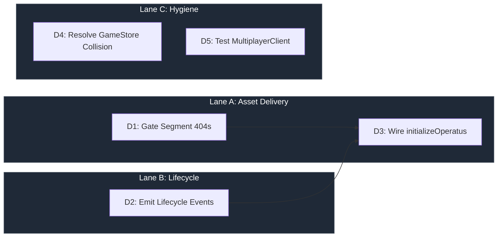

# OPERATUS Implementation Directives

> **Domain:** The Backbone (`packages/operatus`)
> **Baseline:** 19 exports, 11 test files, zero runtime consumers
> **Goal:** Close the infrastructure gaps that prevent asset delivery and lifecycle coordination

---

## Execution Lanes

---

## D1 — Gate Segment 404 Cascade

**Priority:** P0
**Complexity:** Low
**Files to modify:** `src/init.ts`, `src/AssetLoader.ts`
**Cross-pillar:** Blocks ARCHITECTUS D11 (graceful fallback)

### Problem

When `loadWorldIndex()` returns null (chunked manifest absent), `SegmentLoadManager` still fires per-node requests for `stem.json` and `cap.json` files. On the deployed app, this produces 350+ 404 errors per page load. The ARCHITECTUS `AssetBridge` fix (PR #91) silenced the manifest-level 404, but the downstream per-file requests still fire.

### Target State

When the chunked manifest is absent:
- `SegmentLoadManager` does not attempt per-segment loads
- No 404s appear in the console
- The monolithic fallback path renders the full tree without segment-level detail

### Approach

1. In `SegmentLoadManager`, check `worldIndexResult !== null` before scheduling per-segment fetches
2. In `AssetLoader`, if the API route returns 404 for segment data, log at `console.debug` (matching P3 convention from PR #91)
3. Add a `segmentsAvailable: boolean` flag to the segment store that downstream code checks before requesting segments

### Exit Criteria

- [ ] Zero 404s in console when chunked manifest is absent
- [ ] Monolithic fallback renders identically to current behavior
- [ ] When segments ARE available, loading proceeds normally
- [ ] No regression in AssetLoader tests

---

## D2 — Emit GAME_STARTED and LEVEL_LOADED Lifecycle Events

**Priority:** P1
**Complexity:** Low
**Files to modify:** `src/init.ts` or app-level integration
**Cross-pillar:** OPERATUS itself listens for these (AutoSave, bridge.ts) but nobody emits them

### Problem

OPERATUS subscribes to `GAME_STARTED` and `LEVEL_LOADED` in `init.ts` and `AutoSave.ts`. These events gate asset preloading, save state initialization, and cache warming. But no pillar emits either event. The entire OPERATUS initialization pipeline never triggers.

### Target State

- `GAME_STARTED` emitted when the app mounts and GPU detection completes
- `LEVEL_LOADED` emitted when topology rendering begins (after asset load)
- OPERATUS listeners activate: AutoSave starts, cache warms, PerfMonitor connects

### Approach

1. Emit `GAME_STARTED` from the app entry point (after `detectGPU()` resolves in ARCHITECTUS `App.tsx` Phase 1)
2. Emit `LEVEL_LOADED` from `DendriteWorld` or `SegmentedWorld` once scene geometry is ready
3. These emissions belong in the app integration layer — either `App.tsx` or a new `Lifecycle.tsx` component

### Exit Criteria

- [ ] `GAME_STARTED` fires once per app mount
- [ ] `LEVEL_LOADED` fires once per world render
- [ ] OPERATUS `AutoSave` starts after `GAME_STARTED`
- [ ] OPERATUS `AssetLoader` pre-warms after `LEVEL_LOADED`
- [ ] No duplicate emissions on hot reload

---

## D3 — Wire initializeOperatus

**Priority:** P2
**Complexity:** Low
**Files to modify:** App integration layer
**Depends on:** D2 (lifecycle events trigger initialization)

### Problem

`initializeOperatus()` exists but is never called. It sets up the 4-tier cache, persistence layer, and PerfMonitor. Without it, OPERATUS is a dead library.

### Target State

- `initializeOperatus()` called during app bootstrap
- PerfMonitor feeds FPS data to ARCHITECTUS for adaptive quality (D3)
- Cache layer active for AssetBridge consumption

### Approach

1. Call `initializeOperatus()` in the app entry point after dependencies are available
2. Pass the initialized `AssetLoader` instance to ARCHITECTUS via the `assetLoader` prop
3. Connect `PerfMonitor` output to the renderer store's `updatePerformance()`

### Exit Criteria

- [ ] `initializeOperatus()` called on mount
- [ ] AssetLoader available to AssetBridge
- [ ] PerfMonitor → rendererStore FPS pipeline active
- [ ] Teardown on unmount (when `destroy()` is added)

---

## D4 — Resolve GameStore Naming Collision

**Priority:** P2
**Complexity:** Low
**Files to modify:** `src/persistence/GameStore.ts`, `packages/shared/src/contracts/`
**Cross-pillar:** LUDUS also defines `GameStore`

### Problem

Both `ludus/state/GameStore.ts` and `operatus/persistence/GameStore.ts` define a `GameStore`. While they serve different purposes (LUDUS: runtime game state, OPERATUS: persisted save state), the naming collision creates confusion and risks import errors if an integration layer needs both.

### Target State

- OPERATUS renames to `SaveStateStore` or `PersistenceStore`
- Extract shared interface to `@dendrovia/shared/contracts`
- LUDUS retains `GameStore` name (it's the canonical runtime state)

### Exit Criteria

- [ ] No naming collision between pillar exports
- [ ] Shared interface in contracts package
- [ ] All OPERATUS internal references updated
- [ ] No type errors

---

## D5 — Test MultiplayerClient

**Priority:** P2
**Complexity:** Medium
**Files to create:** `tests/multiplayer-client.test.ts`

### Problem

`MultiplayerClient` is completely untested. It handles WebSocket connections, state sync, and conflict resolution — high blast-radius on failure.

### Exit Criteria

- [ ] Connection lifecycle tested (connect, disconnect, reconnect)
- [ ] State sync round-trip verified
- [ ] Conflict resolution tested with concurrent mutations
- [ ] Error paths (network failure, timeout) covered

---

*Document version: 1.0.0*
*Generated: 2026-02-18*
