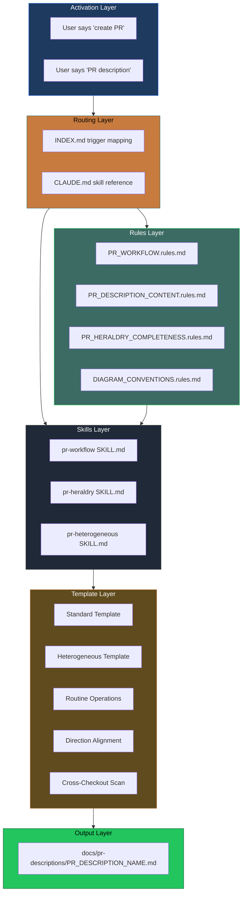

# PR Heraldry Completeness: Codebase Context System Setup

_Version: 1.0.0_
_Created: 2026-02-12_

> A structured PR description system with heraldic classification, accessibility-compliant Mermaid diagrams, governance policies, and Claude Code skill integration for the Dendrovia monorepo.

---

## System Overview

This system provides:

1. **Classifies** every PR using heraldic metadata (magnitude, charges, domains, mottos)
2. **Enforces** consistent structure via mandatory sections and prohibited content
3. **Guides** diagram creation with accessibility-compliant Mermaid conventions
4. **Routes** to specialized templates based on PR type
5. **Integrates** with Claude Code via skills, rules, and trigger-based routing

### Architecture



---

## File Structure

```
dendrovia/
├── .claude/
│   ├── rules/
│   │   ├── INDEX.md
│   │   ├── PR_WORKFLOW.rules.md
│   │   ├── PR_DESCRIPTION_CONTENT.rules.md
│   │   ├── PR_HERALDRY_COMPLETENESS.rules.md
│   │   ├── DIAGRAM_CONVENTIONS.rules.md
│   │   └── BRANCH_WORKFLOW.rules.md
│   └── skills/
│       ├── workflow/
│       │   ├── pr/
│       │   │   └── SKILL.md
│       │   └── pr-heterogeneous/
│       │       └── SKILL.md
│       └── heraldry/
│           └── pr-heraldry/
│               └── SKILL.md
├── lib/
│   └── heraldry/
│       ├── types.ts
│       ├── analyzer.ts
│       ├── emoji.ts
│       ├── mermaid.ts
│       └── index.ts
├── docs/
│   ├── pr-descriptions/
│   │   └── templates/
│   │       ├── ROUTINE_OPERATIONS_TEMPLATE.md
│   │       ├── DIRECTION_ALIGNMENT_PR_TEMPLATE.md
│   │       └── CROSS_CHECKOUT_SCAN_TEMPLATE.md
│   └── governance/
│       └── PR_HERALDRY_COMPLETENESS_CODEBASE_CONTEXT_SYSTEM_SETUP.md
└── CLAUDE.md
```

---

## Domain Taxonomy (Dendrovia)

| Domain | Pillar | Tincture | Hex |
|--------|--------|----------|-----|
| chronos | CHRONOS | Amber | `#c77b3f` |
| imaginarium | IMAGINARIUM | Purpure | `#A855F7` |
| architectus | ARCHITECTUS | Azure | `#3B82F6` |
| ludus | LUDUS | Gules | `#EF4444` |
| oculus | OCULUS | Vert | `#22C55E` |
| operatus | OPERATUS | Sable | `#1F2937` |
| shared | Cross-pillar | Or | `#FFD700` |
| app | Application | Argent | `#E5E7EB` |
| docs | Documentation | Tenne | `#CD853F` |
| infra | Infrastructure | Gules | `#EF4444` |

---

## Policy Cascade

```
1. CLAUDE.md (root)
   └── References skill path
       └── 2. PR_WORKFLOW.rules.md (process)
           ├── 3. PR_DESCRIPTION_CONTENT.rules.md (content)
           ├── 4. PR_HERALDRY_COMPLETENESS.rules.md (taxonomy)
           └── 5. DIAGRAM_CONVENTIONS.rules.md (diagrams)
```

---

## Reachability Matrix

Every document must be reachable from at least 2 independent paths:

| Document | Path 1 | Path 2 |
|----------|--------|--------|
| PR_WORKFLOW | CLAUDE.md | INDEX.md |
| PR_DESCRIPTION_CONTENT | INDEX.md | PR_WORKFLOW |
| PR_HERALDRY_COMPLETENESS | INDEX.md | PR_WORKFLOW |
| DIAGRAM_CONVENTIONS | INDEX.md | PR_DESCRIPTION_CONTENT |
| pr-workflow SKILL | CLAUDE.md | INDEX.md |
| pr-heraldry SKILL | INDEX.md | PR_DESCRIPTION_CONTENT |
| pr-heterogeneous SKILL | INDEX.md | pr-workflow SKILL |

---

## Verification Checklist

- [ ] `.claude/rules/INDEX.md` exists and maps all triggers
- [ ] All 5 rule files exist in `.claude/rules/`
- [ ] All 3 skill files exist in `.claude/skills/`
- [ ] `lib/heraldry/` contains types.ts, analyzer.ts, emoji.ts, mermaid.ts, index.ts
- [ ] `docs/pr-descriptions/templates/` contains 3 templates
- [ ] `CLAUDE.md` references all skills
- [ ] Cross-references resolve (run audit grep)
- [ ] All Mermaid style directives include `color:`

---

## Key Files Summary

| Purpose | Location |
|---------|----------|
| Primary Skill | `.claude/skills/workflow/pr/SKILL.md` |
| Heraldry Skill | `.claude/skills/heraldry/pr-heraldry/SKILL.md` |
| Heterogeneous Skill | `.claude/skills/workflow/pr-heterogeneous/SKILL.md` |
| Process Rules | `.claude/rules/PR_WORKFLOW.rules.md` |
| Content Rules | `.claude/rules/PR_DESCRIPTION_CONTENT.rules.md` |
| Heraldry Rules | `.claude/rules/PR_HERALDRY_COMPLETENESS.rules.md` |
| Diagram Rules | `.claude/rules/DIAGRAM_CONVENTIONS.rules.md` |
| Trigger Index | `.claude/rules/INDEX.md` |
| Type Definitions | `lib/heraldry/types.ts` |
| Templates | `docs/pr-descriptions/templates/*.md` |
| This Document | `docs/governance/PR_HERALDRY_COMPLETENESS_CODEBASE_CONTEXT_SYSTEM_SETUP.md` |
