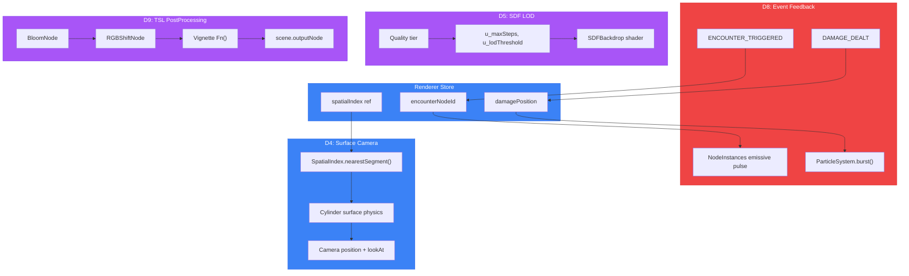

# PR: ARCHITECTUS Directives D4, D5, D8, D9 — Remaining Directive Implementation

## Coat of Arms

```
+--------------------------------------------------------------+
|   feat/architectus-d4-d5-d8-d9                               |
+--------------------------------------------------------------+
|                     ** MODERATE **                            |
|                                                              |
|          skip  [Azure | Sable]  skip                         |
|              per-pale                                        |
|                   mullet x 6                                 |
|                   cross x 1                                  |
|                                                              |
|              [architectus, operatus]                         |
|                                                              |
|           files: 15 | +1249 / -63                            |
+--------------------------------------------------------------+
|   "Innovation through iteration"                             |
+--------------------------------------------------------------+
```

**Compact:** ** [architectus, operatus] mullet x6 cross x1 skip +1249/-63

---

## Summary

Completes the remaining 4 ARCHITECTUS directives (D4, D5, D8, D9), bringing the total to 10/10. Implements surface-locked camera physics, SDF LOD pipeline integration, cross-pillar event feedback, and WebGPU-native TSL post-processing. Also wires D2 into the rendering pipeline and fixes a hot-path allocation in the particle system.

## Features

| Feature | Description | Status |
|---------|-------------|--------|
| D4 Surface Camera | Ant-on-manifold physics: WASD along branch surface, theta rotation, jump arc with gravity return, junction detection | Complete |
| D5 SDF LOD Pipeline | Quality-driven maxRaymarchSteps, lodThreshold, lodTransitionWidth uniforms; depth compositing enabled | Complete |
| D8 Event Feedback | ENCOUNTER_TRIGGERED emissive pulse (6Hz red), DAMAGE_DEALT particle burst via ParticleSystem.burst() | Complete |
| D9 TSL PostProcessing | Bloom + chromatic aberration + vignette via TSL node graph; conditional WebGPU/WebGL2 rendering path | Complete |
| D2 Wiring | WebGPU renderer constructed in Canvas gl callback via pre-loaded module ref | Complete |
| Particle Fix | Eliminate per-particle per-frame THREE.Color allocation with reusable tmpColor | Complete |
| Dev Server Timeout | td-colorizer wait timeout 20s→60s, initial delay 2s→5s for 7 concurrent webpack compiles | Complete |

## Architecture



## Files Changed

```
packages/architectus/src/
  store/
    useRendererStore.ts          # D4+D8 state: encounterNodeId, spatialIndex ref, actions
  components/
    CameraRig.tsx                # D4: SurfaceCamera with cylinder physics, WASD+jump
    SDFBackdrop.tsx              # D5: quality-driven LOD uniforms, depth compositing
    DendriteWorld.tsx            # D8: EventBus listeners, ParticleSystem ref, spatialIndex publish
    NodeInstances.tsx            # D8: encounter emissive pulse (6Hz red vs 1.5Hz teal)
    PostProcessingTSL.tsx        # D9: NEW — bloom+CA+vignette via TSL nodes
    PostProcessing.tsx           # D9: conditional WebGPU/WebGL2 path selection
    ParticleInstances.tsx        # Fix: reusable tmpColor eliminates per-frame allocation
    App.tsx                      # D2: WebGPU gl callback with pre-loaded module ref
  index.ts                       # Export PostProcessingTSL
scripts/
  td-colorizer.ts                # Fix: server wait timeout 20s→60s
```

## Commits

1. `fd79524` fix(scripts): increase td-colorizer server wait timeout
2. `642d06d` feat(architectus): add encounter feedback and spatial index state to store
3. `7824cbc` feat(architectus): wire WebGPU renderer into Canvas gl callback (D2)
4. `60d044b` feat(architectus): wire quality-driven LOD uniforms into SDF backdrop (D5)
5. `e4d4419` feat(architectus): add LUDUS event feedback loop (D8)
6. `38455ce` feat(architectus): add TSL post-processing for WebGPU path (D9)
7. `e0db2bf` feat(architectus): implement surface-locked camera with cylinder physics (D4)

## Test Plan

- [ ] TypeScript compiles without architectus-specific errors (`npx tsc --noEmit`)
- [ ] Dev server starts and renders scene (`bun run td`)
- [ ] Falcon mode orbital controls unchanged
- [ ] Player mode activates SurfaceCamera (WASD movement along branches)
- [ ] Jump (space) returns to surface with parabolic arc
- [ ] SDF backdrop responds to quality tier changes (step count, threshold)
- [ ] WebGPU path activates TSL post-processing (Chrome 113+ with WebGPU flag)
- [ ] WebGL2 path still uses pmndrs EffectComposer
- [ ] Particle burst fires on simulated DAMAGE_DEALT event
- [ ] Node emissive pulse activates on simulated ENCOUNTER_TRIGGERED event
- [ ] No console errors on either WebGPU or WebGL2 path
