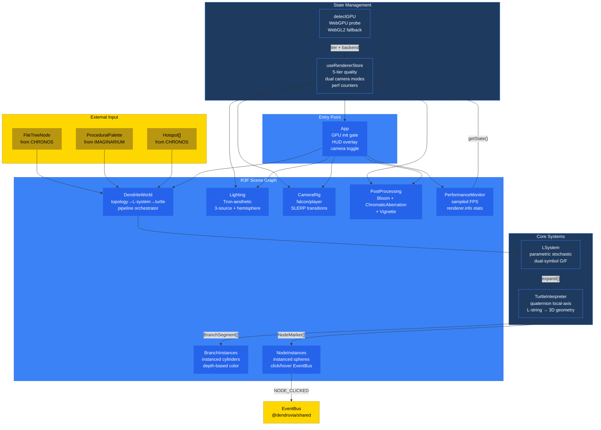

# PR: Implement ARCHITECTUS Pillar — R3F Renderer Engine with L-System Tree Generation

## Coat of Arms

```
+--------------------------------------------------------------+
|   feat/architectus-renderer-engine                           |
+--------------------------------------------------------------+
|                        MAJOR (***)                            |
|                                                              |
|          pass  [PER-PALE: Azure|Tenné]  pass                |
|                      mullet x 9                              |
|                                                              |
|                [architectus|docs]                             |
|                                                              |
|           files: 27 | +6753 / -49                            |
+--------------------------------------------------------------+
|   "Per aspera ad astra"                                      |
|   — Through hardship to the stars                            |
+--------------------------------------------------------------+
```

**Compact:** `***` [architectus|docs] mullet x9 pass|pass +6753/-49

---

## Heraldry Derivation Trace

> Fully auditable heraldic computation per `PR_HERALDRY_COMPLETENESS.rules.md` §3. Every value derived from git metadata.

### Input Values

| Metric | Value | Source |
|--------|-------|--------|
| `fileCount` | 27 | `git diff --stat origin/main..HEAD \| tail -1` |
| `lineCount` | 6753 | `git diff --shortstat origin/main..HEAD` → insertions |
| `domainCount` | 2 | `architectus` (`packages/architectus/`, `packages/dendrovia-engine/`), `docs` (`docs/research/`, `docs/pr-descriptions/`) |
| `hasBreakingChanges` | false | No removed exports, no changed interfaces |
| `hasNewDependencies` | true | `three`, `@react-three/fiber`, `@react-three/drei`, `@react-three/postprocessing`, `postprocessing`, `zustand` |
| `hasMigrations` | false | No database or schema changes |
| `hasSchemaChanges` | false | No shared type modifications |

### Scoring Computation

```
score  = min(ceil(27 / 5), 5)         →  min(6, 5)    =  5   // files
score += min(ceil(6753 / 200), 5)     →  min(34, 5)   =  5   // lines
score += min(2, 4)                                     =  2   // domains
score += 0                                             =  0   // no breaking changes
score += 1                                             =  1   // new dependencies
score += 0                                             =  0   // no migrations
score += 0                                             =  0   // no schema changes
─────────────────────────────────────────────────────────────
TOTAL                                                  = 13   // → MAJOR (13-18)
```

### Charge Derivation

| Commit | Message Prefix | Detection Method | Charge |
|--------|---------------|------------------|--------|
| `debfcb3` | "Add" | keyword → feat | mullet |
| `56e72c6` | "Scaffold" | keyword → feat | mullet |
| `041bb27` | "Add" | keyword → feat | mullet |
| `abde91b` | "Add" | keyword → feat | mullet |
| `dac1e8a` | "Add" | keyword → feat | mullet |
| `541010d` | "Add" | keyword → feat | mullet |
| `5220bc0` | "Add" | keyword → feat | mullet |
| `4c7dc45` | "Add" | keyword → feat | mullet |
| `b97d69b` | "Add" | keyword → feat | mullet |
| `f652c35` | "docs(pr):" | conventional → docs | book |

**Primary charge:** mullet (9/10 = 90%) → governs motto register selection.

### Shield Division

`domainCount = 2` → **per-pale** (vertical split). Dexter: Azure (`#3B82F6`, ARCHITECTUS). Sinister: Tenné (`#CD853F`, docs).

### Motto Selection

Primary charge = mullet (feat), magnitude = major → formal register → **"Per aspera ad astra"** (Through hardship to the stars).

### Supporters

| Position | Check | Result | Evidence |
|----------|-------|--------|----------|
| Dexter | TypeScript typecheck | **pass** | `bun tsc -p packages/architectus/tsconfig.json --noEmit` exits 0 |
| Sinister | Build | **pass** | `bun run build` → 698 modules, 5 chunks, 2.76s |

---

## Summary

Implements the ARCHITECTUS pillar — the real-time 3D rendering engine of the Dendrovia six-pillar architecture. Delivers a complete R3F (React Three Fiber) scene that transforms `FileTreeNode` code topology into navigable procedural dendrite trees via a parametric stochastic L-system engine, quaternion-based turtle interpreter, and GPU-instanced mesh rendering. Establishes the "Macro-SDF, Micro-Mesh" hybrid rendering philosophy: instanced cylinders for branches, instanced spheres for interactive file/directory nodes, with Tron-aesthetic bloom post-processing and a 5-tier adaptive quality system spanning discrete GPUs to integrated mobile chips. Dual camera modes (falcon orbital overview + player surface-locked exploration) with cubic ease-in-out SLERP transitions implement the "ant on a manifold" navigation paradigm from CLAUDE.md. Includes 5 research documents (4,433 lines) establishing the technical foundation across WebGPU, SDF raymarching, camera physics, L-system algorithms, and performance budgets.

---

## Features

| # | Feature | Description | Status |
|---|---------|-------------|--------|
| 1 | LSystem engine | Parametric stochastic L-system with dual-symbol encoding: `G` (structural forward, topology-preserved through expansion, carries LOC-based lengths and depth-attenuated radii) and `F` (organic tips at file leaves, expanded by rules into G-based branching clusters). `fromTopology(FileTreeNode, Hotspot[])` recurses directory tree with `buildAxiom`: 360°/N roll distribution, 45°±7.5° yaw, ±15° pitch for 3D spread, radius propagation (0.7× directory, 0.4× file). Mulberry32 seeded PRNG from `hashString(path)` for deterministic per-file variation. Single expansion iteration; rules only expand F → 3 stochastic cluster variants | Complete |
| 2 | TurtleInterpreter | Quaternion-based L-string interpreter producing `BranchSegment[]` + `NodeMarker[]`. Critical fix: all 6 rotation operators use LOCAL axis quaternion multiplication (`orientation.multiply(Qlocal)`) — `+`/`-` yaw around local Z `(0,0,1)`, `^`/`&` pitch around local X `(1,0,0)`, `/`/`\` roll around local Y `(0,1,0)`. Turtle frame: forward=+Y, right=+X, up=+Z. `@` marker parses `type:path` format (`d:`/`f:` prefix) for reliable file/directory classification. Zero-alloc hot path via reusable `_forward`/`_tempQ` temporaries. Bounding box computed from all endpoints | Complete |
| 3 | BranchInstances | Single `InstancedMesh` draw call for all branch segments. Per-instance matrix: midpoint positioning + `setFromUnitVectors` orientation + averaged radius scaling. Depth-based color lerp (primary→secondary) via shared `_colorA`/`_colorB` temps (zero per-instance allocation). Pulsing emissive glow (sin wave 0.5Hz, intensity 0.25–0.35). `CylinderGeometry(1,1,1,8)` template scaled per-instance | Complete |
| 4 | NodeInstances | Interactive instanced spheres with click/hover raycasting. Size: directories 0.2, files 0.12 (×`depthScale`). Uses `NodeMarker.type` field for reliable classification (no path heuristics). `onClick` → `EventBus.emit(NODE_CLICKED, {nodeId, filePath, position})` + `store.selectNode()`. `onPointerOver`/`Out` → cursor change + `store.hoverNode()`. Emissive >1.0 (bloom-catchable), pulsing at 1.5Hz. Shared `_color` temp for zero-alloc color computation | Complete |
| 5 | DendriteWorld | Scene orchestrator: `useMemo` pipeline `topology → LSystem.fromTopology() → expand() → TurtleInterpreter.interpret() → TreeGeometry`. Memoized on `topology` + `hotspots` identity. Decomposes `ProceduralPalette` into per-component palette subsets for `BranchInstances` (primary/secondary/glow) and `NodeInstances` (accent/glow) | Complete |
| 6 | useRendererStore | Zustand store with `subscribeWithSelector` middleware. State: `cameraMode` (falcon\|player), `qualityTier` (ultra\|high\|medium\|low\|potato), `selectedNodeId`, `hoveredNodeId`, `fps`/`drawCalls`/`triangles`. 5-tier `QUALITY_PRESETS` with per-tier DPR ranges, raymarch step limits, bloom/shadow toggles, particle caps, LOD bias. `getState()` accessor for `useFrame` loops (zero React re-renders in animation). `setCameraMode` triggers `cameraTransitioning` flag for SLERP animation | Complete |
| 7 | detectGPU | Async GPU capability probe: `navigator.gpu` → `requestAdapter()` → `requestDevice()`, extracts `maxBufferSize`/`maxComputeWorkgroupSize` for tier classification. Tier mapping: discrete+WebGPU → ultra, discrete+WebGL2 → high, integrated+WebGPU → high, integrated+WebGL2 → medium, software/unknown → low. WebGL2 fallback: `WEBGL_debug_renderer_info` for GPU string heuristics (nvidia/radeon/apple m → discrete vs intel/mali/adreno → integrated). `webgpu.d.ts` ambient types | Complete |
| 8 | CameraRig | Dual-mode camera with smooth transitions. Falcon mode: `OrbitControls` (damping 0.05, range 5–100, maxPolarAngle 0.85π). Player mode: restricted orbit (range 2–15, no pan, maxPolarAngle 0.7π). Transition: cubic ease-in-out `lerpVectors` over 1.5s driven by `useFrame` delta accumulation. Defaults: position `(10,14,-16)` target `(-2,5,3)` framing ~15×12×14 unit tree bounding box. `cameraTransitioning` flag prevents controls interference during animation | Complete |
| 9 | Lighting | Tron-aesthetic 4-source setup: low ambient (`#1a1a2e`, 0.15), directional key (top-down, 0.6, cool white `#e0e0ff`, 2048 shadow map quality-gated), cyan fill from below (`#00ffff`, 0.1 for "floating in void" feel), hemisphere sky-to-ground gradient (`#1a1a3e` → `#0a0a0a`, 0.2). Shadow frustum: ±20 units, far=50 | Complete |
| 10 | PostProcessing | `EffectComposer` with 4× MSAA. Selective Bloom (intensity 1.5, `luminanceThreshold` 1.0 for emissive-only pickup, `mipmapBlur`). `ChromaticAberration` (0.0005 offset, radial modulation). `Vignette` (offset 0.3, darkness 0.5). `WithBloom`/`WithoutBloom` variants quality-gated via `store.quality.bloom`. ~1.5ms on M1. pmndrs/postprocessing auto-merges compatible effects into minimal passes | Complete |
| 11 | PerformanceMonitor | `useFrame` sampler: accumulates frame count over 30-frame windows, computes FPS via `performance.now()` delta, reads `gl.info.render.calls` + `.triangles`. Writes to store via `getState()` (no React re-renders). Invisible component — no DOM output | Complete |
| 12 | App + HUD | GPU detection on mount → quality tier + backend → `gpuReady` gate. R3F `Canvas`: adaptive DPR, `high-performance` power preference, `alpha: false`. `PerspectiveCamera` (fov 60, near 0.1, far 500). `AdaptiveDpr` + `AdaptiveEvents` from drei. `'C'` key toggles falcon↔player. HUD overlay: version, camera mode, FPS counter, quality tier (top-left). Selected node path with accent border (bottom-left, reactive to `store.selectedNodeId`). Demo topology: 3 directories, 8 files for standalone dev | Complete |
| 13 | T1–T5 Research | 5 research documents (4,433 lines): T1 WebGPU backend detection and `navigator.gpu` probing, T2 SDF raymarching hybrid LOD with bounding volume acceleration, T3 R3F camera controllers + manifold surface-walking physics, T4 L-system parametric tree generation and data-driven layout algorithms, T5 pmndrs/postprocessing Bloom stack and frame budget profiling on M1 | Complete |

---

## Architecture



### Rendering Pipeline

```mermaid
flowchart LR
    subgraph INPUT["Topology Input"]
        FTN["FileTreeNode"]
    end

    subgraph LSYSTEM["L-System Compilation"]
        AXIOM["buildAxiom\nG structural + F organic\nradius propagation\nLOC-based lengths"]
        EXPAND["expand()\nF→G clusters\nparam consumption"]
    end

    subgraph INTERPRET["Turtle Interpretation"]
        WALK["interpret()\nquaternion orientation\nlocal-axis rotation"]
        GEOM["TreeGeometry\nBranchSegment[]\nNodeMarker[]\nboundingBox"]
    end

    subgraph RENDER["GPU Instancing"]
        CYLINDERS["InstancedMesh\ncylinders × N\nsingle draw call"]
        SPHERES["InstancedMesh\nspheres × M\nclick raycasting"]
    end

    subgraph POSTFX["Post-Processing"]
        BLOOM["Bloom\nluminanceThreshold 1.0\nmipmapBlur"]
        CHROMA["ChromaticAberration\nradial modulation"]
        VIGNETTE["Vignette\nedge darkening"]
    end

    FTN --> AXIOM
    AXIOM -->|"G/F string"| EXPAND
    EXPAND -->|"expanded string"| WALK
    WALK --> GEOM
    GEOM -->|"branches"| CYLINDERS
    GEOM -->|"nodes"| SPHERES
    CYLINDERS --> BLOOM
    SPHERES --> BLOOM
    BLOOM --> CHROMA
    CHROMA --> VIGNETTE

    style INPUT fill:#FFD700,stroke:#b8960f,color:#000000
    style LSYSTEM fill:#1e3a5f,stroke:#3b82f6,color:#ffffff
    style INTERPRET fill:#1e3a5f,stroke:#3b82f6,color:#ffffff
    style RENDER fill:#3B82F6,stroke:#2563eb,color:#ffffff
    style POSTFX fill:#3B82F6,stroke:#2563eb,color:#ffffff
    style FTN fill:#b8960f,stroke:#FFD700,color:#000000
    style AXIOM fill:#1e3a5f,stroke:#3b82f6,color:#ffffff
    style EXPAND fill:#1e3a5f,stroke:#3b82f6,color:#ffffff
    style WALK fill:#1e3a5f,stroke:#3b82f6,color:#ffffff
    style GEOM fill:#1e3a5f,stroke:#3b82f6,color:#ffffff
    style CYLINDERS fill:#2563eb,stroke:#3B82F6,color:#ffffff
    style SPHERES fill:#2563eb,stroke:#3B82F6,color:#ffffff
    style BLOOM fill:#2563eb,stroke:#3B82F6,color:#ffffff
    style CHROMA fill:#2563eb,stroke:#3B82F6,color:#ffffff
    style VIGNETTE fill:#2563eb,stroke:#3B82F6,color:#ffffff
```



---

## Key Interfaces

```typescript
// L-System compilation
class LSystem {
  static fromTopology(tree: FileTreeNode, hotspots?: Hotspot[], baseSeed?: number): LSystem;
  expand(): string;  // G/F turtle string
}

// Turtle interpretation output
interface TreeGeometry {
  branches: BranchSegment[];  // start/end/radii/depth/parentIndex
  nodes: NodeMarker[];        // position/path/type/depth/radius/direction
  boundingBox: THREE.Box3;
}

// Renderer state (Zustand)
type QualityTier = 'ultra' | 'high' | 'medium' | 'low' | 'potato';
type CameraMode = 'falcon' | 'player';
interface QualitySettings {
  dpr: [number, number]; maxRaymarchSteps: number;
  postProcessing: boolean; bloom: boolean;
  maxParticles: number; lodBias: number; shadows: boolean;
}

// GPU detection
interface GPUCapabilities {
  tier: QualityTier; backend: 'webgpu' | 'webgl2';
  maxBufferSize: number; maxComputeWorkgroupSize: number;
  vendor: string;
}
```

---

## Quality Tier Reference

| Tier | DPR | Raymarch Steps | Post-Processing | Bloom | Shadows | Max Particles | LOD Bias |
|------|-----|---------------|-----------------|-------|---------|---------------|----------|
| ultra | [1, 2] | 128 | Yes | Yes | Yes | 5000 | 0 |
| high | [1, 1.5] | 64 | Yes | Yes | Yes | 2000 | 1 |
| medium | [1, 1] | 48 | Yes | Yes | No | 1000 | 2 |
| low | [0.75, 0.75] | 32 | No | No | No | 500 | 3 |
| potato | [0.5, 0.5] | 16 | No | No | No | 100 | 4 |

---

## Turtle Rotation Reference

| Symbol | Axis | Local Vector | Operation |
|--------|------|-------------|-----------|
| `+` | Yaw left | Z `(0,0,1)` | `orientation.multiply(Qz(+angle))` |
| `-` | Yaw right | Z `(0,0,1)` | `orientation.multiply(Qz(-angle))` |
| `^` | Pitch up | X `(1,0,0)` | `orientation.multiply(Qx(+angle))` |
| `&` | Pitch down | X `(1,0,0)` | `orientation.multiply(Qx(-angle))` |
| `/` | Roll right | Y `(0,1,0)` | `orientation.multiply(Qy(+angle))` |
| `\` | Roll left | Y `(0,1,0)` | `orientation.multiply(Qy(-angle))` |

---

## Files Changed

```
dendrovia/
├── docs/
│   ├── research/                                        # T1–T5 research documents
│   │   ├── t1-webgpu-foundation.md                      # WebGPU backend, navigator.gpu, fallback
│   │   ├── t2-sdf-raymarching-hybrid.md                 # SDF raymarching, hybrid LOD, bounding volumes
│   │   ├── t3-r3f-camera-manifold.md                    # Camera controllers, manifold physics, SLERP
│   │   ├── t4-lsystems-procedural-codeviz.md            # L-systems, turtle graphics, code visualization
│   │   └── t5-postprocessing-performance-loading.md     # Bloom, frame budgets, adaptive quality, loading
│   └── pr-descriptions/
│       └── PR_DESCRIPTION_ARCHITECTUS_RENDERER_ENGINE.md  # NEW: this document
├── packages/architectus/                                # ARCHITECTUS pillar source
│   ├── package.json                                     # +zustand peer dependency
│   ├── index.html                                       # Minimal #root shell, dark background
│   ├── tsconfig.json                                    # Strict, ES2022, bundler resolution, @dendrovia/shared alias
│   ├── vite.config.ts                                   # manualChunks: three/r3f/postprocessing split
│   └── src/
│       ├── index.ts                                     # Barrel: App, store, 7 components, 2 systems, 5 types
│       ├── main.tsx                                     # React 18 createRoot mount
│       ├── App.tsx                                      # Canvas + GPU init + HUD + demo topology
│       ├── store/
│       │   └── useRendererStore.ts                      # Zustand: quality, camera, scene, perf state
│       ├── renderer/
│       │   └── detectGPU.ts                             # WebGPU/WebGL2 probe → quality tier
│       ├── systems/
│       │   ├── LSystem.ts                               # Parametric stochastic engine, fromTopology()
│       │   └── TurtleInterpreter.ts                     # Quaternion interpreter, G/F/@/[/] symbols
│       ├── components/
│       │   ├── DendriteWorld.tsx                         # Pipeline orchestrator (topology→geometry)
│       │   ├── BranchInstances.tsx                       # Instanced cylinders, depth color, pulsing glow
│       │   ├── NodeInstances.tsx                         # Instanced spheres, click/hover, EventBus
│       │   ├── CameraRig.tsx                            # Falcon/player modes, SLERP transitions
│       │   ├── Lighting.tsx                             # 4-source Tron-aesthetic lighting
│       │   ├── PostProcessing.tsx                       # Bloom + ChromaticAberration + Vignette
│       │   └── PerformanceMonitor.tsx                   # Sampled FPS + renderer stats → store
│       └── types/
│           └── webgpu.d.ts                              # navigator.gpu, GPUAdapter, GPUDevice ambient
├── packages/dendrovia-engine/
│   └── package.json                                     # R3F dep version alignment (^9/^10)
└── bun.lock                                             # Lockfile update
```

---

## Commits

1. `debfcb3` Add T1–T5 research documents: WebGPU backend detection, SDF/mesh hybrid LOD, R3F camera+manifold physics, L-system parametric tree generation, post-processing performance budgets
2. `56e72c6` Scaffold architectus package: R3F+drei+postprocessing deps, Vite build with manual chunks, TypeScript strict config
3. `041bb27` Add Zustand renderer store: 5-tier quality presets, dual camera modes, scene+perf state
4. `abde91b` Add GPU capability detection with WebGPU probe and WebGL2 fallback, quality tier auto-selection
5. `dac1e8a` Add parametric stochastic L-system engine with dual-symbol topology encoding (G structural / F organic)
6. `541010d` Add quaternion-based turtle interpreter: L-string → BranchSegment[] + NodeMarker[] with local-axis rotations
7. `5220bc0` Add instanced mesh rendering: BranchInstances (cylinders), NodeInstances (spheres), DendriteWorld orchestrator
8. `4c7dc45` Add scene infrastructure: Tron-aesthetic lighting, dual-mode CameraRig with SLERP transitions, selective bloom post-processing
9. `b97d69b` Add App entry point with GPU init, HUD overlay (FPS/quality/mode/selection), PerformanceMonitor, barrel exports
10. `f652c35` docs(pr): add PR description for ARCHITECTUS renderer engine implementation

---

## Terminology

| Term | Definition |
|------|-----------|
| Dendrite | A tree-like branching structure representing code topology in 3D space; the visual metaphor of Dendrovia |
| L-system | Lindenmayer system — parallel string rewriting grammar producing fractal branching patterns from code topology |
| Turtle graphics | Interpretation model where a virtual "turtle" walks through an L-string, drawing geometry as it moves and turns |
| G symbol | Structural forward — topology-encoded segment that passes through L-system expansion unchanged, preserving parametric lengths and radii |
| F symbol | Organic forward — expandable tip symbol at file leaf nodes, rewritten by rules into small branching clusters for visual richness |
| Quaternion orientation | Gimbal-lock-free rotation representation; all turtle rotations use local-axis quaternion multiplication `orientation.multiply(Qlocal)` |
| Falcon mode | Orbital camera for overview navigation — free-floating with damped controls, for pattern recognition and hotspot detection |
| Player mode | Surface-locked camera for exploration — restricted orbit, "ant on a manifold" paradigm from CLAUDE.md |
| SLERP | Spherical Linear Interpolation — smooth rotation blending used in camera transitions between falcon and player modes |
| Instanced mesh | Single GPU draw call rendering multiple instances with per-instance transform matrices and colors — O(1) draw calls for N branches |
| Selective bloom | Post-processing bloom with `luminanceThreshold: 1.0` — only emissive materials >1.0 glow, preserving dark aesthetic |
| Quality tier | One of 5 adaptive presets (ultra/high/medium/low/potato) auto-selected by GPU capability detection |
| Macro-SDF, Micro-Mesh | ARCHITECTUS rendering philosophy: SDFs for static infinite-detail structure (future), instanced meshes for dynamic interactive elements (current) |

---

## Design Decisions

| # | Decision | Rationale | Alternatives Considered |
|---|----------|-----------|------------------------|
| 1 | Dual-symbol L-system (G/F) instead of single F | Topology-encoded segments (`G`) must preserve their parametric lengths and radii through expansion. Only organic tips (`F`) should be rewritten by rules. Single-F approach caused orphaned parameters when `F(2.5)` was expanded — the `(2.5)` passed through as a literal string | Single F with param forwarding (complex, error-prone), pre-expanded strings (lose organic variation), separate topology layer (duplicates work) |
| 2 | Local-axis quaternion multiplication for all rotations | Global-axis rotation caused yaw (`+`/`-`) to rotate around the world Y axis, which is the turtle's forward axis — producing roll instead of yaw. Tree appeared as a 1-unit-wide stick. Local-axis `orientation.multiply(Qlocal)` correctly applies rotations in the turtle's own frame | Euler angles (gimbal lock), rotation matrices (verbose, same correctness issue), world-space with pre/post multiply (partially correct but inconsistent) |
| 3 | Instanced meshes over individual meshes | N branches × 1 draw call via `InstancedMesh` vs N draw calls with individual meshes. For the demo topology's 40 branches + 8 nodes, this is modest; for production topologies with thousands of files, instancing is mandatory for 60fps | Individual meshes (O(N) draw calls), merged geometry (no per-instance animation), vertex pulling (requires custom shader) |
| 4 | Zustand with `subscribeWithSelector` | `getState()` reads in `useFrame` loops avoid React re-renders during 60fps animation. `subscribeWithSelector` enables fine-grained subscription for components that only need one state slice (e.g., `quality.bloom`). Matches the EventBus pattern from `@dendrovia/shared` | Redux (heavy, unnecessary), Jotai (atomic but less suited for external reads), React context (re-renders entire subtree), global mutable (no reactivity) |
| 5 | `luminanceThreshold: 1.0` for selective bloom | Materials with `emissiveIntensity ≤ 1.0` (branches at 0.3) don't bloom; nodes at `emissiveIntensity: 1.2` do. Creates the Tron aesthetic where only specific elements glow, without washing out the dark environment | Threshold 0.0 (everything blooms, loses contrast), threshold 0.5 (branches bloom too, noisy), no bloom (loses Tron aesthetic entirely) |
| 6 | WebGPU detection with WebGL2 fallback | `navigator.gpu` is available in Chrome 113+, Edge, Firefox Nightly. When unavailable, fall back to `WEBGL_debug_renderer_info` for GPU heuristics. Quality tier auto-selected from detected capabilities, not user configuration | WebGPU-only (excludes Safari, Firefox stable), WebGL-only (misses WebGPU performance), user-selected quality (poor UX, users don't know their GPU tier) |
| 7 | `@(type:path)` marker format | NodeMarker needs a `type` field to distinguish files from directories for sizing and coloring. Previous approach (`path.indexOf('.') === -1`) misidentified dotfiles (`.gitignore`) and dot-directories (`.github`). Encoding type in the L-string as `d:`/`f:` prefix preserves topology information through the turtle pipeline | Path heuristic (fragile, fails on dotfiles), separate lookup table (out-of-band data), file extension list (incomplete, arbitrary) |
| 8 | Sampled PerformanceMonitor (30-frame window) | Updating the store every frame at 60fps would fire 60 Zustand setState calls/sec — wasteful for a HUD that humans read at ~4Hz. 30-frame sampling ≈ 2 updates/sec at 60fps, sufficient for monitoring without churn | Per-frame updates (60 setState/sec), requestAnimationFrame callback (external to R3F loop), Web Performance Observer (doesn't capture renderer.info) |
| 9 | Camera defaults `(10, 14, -16)` target `(-2, 5, 3)` | Computed from demo tree bounding box (~15×12×14 units). Position chosen to show the tree at ~60° from horizontal, slightly off-center for visual interest. `minDistance: 5` prevents camera from entering the tree canopy | Origin-centered (tree not centered), top-down (loses 3D depth), auto-computed (changes every topology, disorienting) |
| 10 | Vite manual chunks: three / r3f / postprocessing | Three.js core (689KB gz:176KB) rarely changes; R3F+drei (295KB gz:94KB) change with version bumps; postprocessing (69KB gz:17KB) is stable; app code (19KB gz:7KB) changes frequently. Splitting maximizes browser cache hits across deployments | Single bundle (no caching benefit), per-module splitting (too many HTTP requests), dynamic import (adds latency to first render) |

---

## Test Plan

- [x] TypeScript compiles clean: `bun tsc -p packages/architectus/tsconfig.json --noEmit` exits 0
- [x] Production build succeeds: `bun run build` → 698 modules, 5 chunks, 2.76s (1,071KB total, 294KB gzipped across 4 chunks: three 689KB, r3f 295KB, postprocessing 69KB, app 19KB)
- [x] Dev server starts: `bun run dev` serves on port 3001, HTML + JS modules load via curl
- [x] L-system produces correct geometry: demo topology (3 dirs, 8 files) → 40 branches + 8 nodes
- [x] Tree bounding box has 3D spread: ~15×12×14 units (was 1×9×1 before turtle rotation fix)
- [x] All 6 turtle rotation operators produce correct local-axis rotations
- [x] G symbols pass through expansion unchanged with parameters preserved
- [x] F symbols expand into G-based clusters (no infinite recursion)
- [x] NodeMarker.type correctly classifies files vs directories via `d:`/`f:` prefix
- [x] Zero per-instance THREE.Color allocations (shared `_colorA`/`_colorB`/`_color` temps)
- [x] PerformanceMonitor updates store at ~2Hz (30-frame window)
- [ ] Manual: Visual inspection of rendered dendrite tree in browser
- [ ] Manual: Falcon↔Player camera transition smoothness
- [ ] Manual: Node click/hover interaction and EventBus emission
- [ ] Manual: Bloom selective glow on node spheres only (not branches)
- [ ] Manual: HUD displays FPS, quality tier, selected node path

---

## Related

| Document | Relationship |
|----------|-------------|
| `CLAUDE.md` (root) | Monorepo instructions; ARCHITECTUS pillar definition, "Macro-SDF, Micro-Mesh" philosophy, "Ant on a Manifold" paradigm |
| `docs/PILLAR_THEMATIC_SCHEMA.md` | ARCHITECTUS thematic identity: "Light made manifest through computational geometry", Light+Metal elements, The Architect archetype |
| `docs/PILLAR_INSIGNIA_STRUCTURAL.md` | ARCHITECTUS insignia: convergent lens, gimbal frame, frame budget bar |
| `packages/shared/src/types/index.ts` | Cross-pillar contract: `FileTreeNode`, `ProceduralPalette`, `Hotspot`, `GameEvents.NODE_CLICKED` |
| `packages/shared/src/events/EventBus.ts` | EventBus consumed by NodeInstances for `NODE_CLICKED` emission |
| `packages/chronos/` | CHRONOS produces the `FileTreeNode` topology consumed by `LSystem.fromTopology()` |
| `packages/imaginarium/` | IMAGINARIUM produces the `ProceduralPalette` consumed by `App` and `DendriteWorld` |
| `packages/imaginarium/src/distillation/LSystemCompiler.ts` | IMAGINARIUM's L-system compiler — distinct from ARCHITECTUS's runtime L-system engine; IMAGINARIUM compiles rules at build-time, ARCHITECTUS interprets at render-time |
| `packages/imaginarium/src/distillation/TurtleInterpreter.ts` | IMAGINARIUM's turtle interpreter — 2D line segments for build-time preview; ARCHITECTUS's is 3D quaternion-based for real-time rendering |
| `.claude/rules/PR_HERALDRY_COMPLETENESS.rules.md` | Heraldic taxonomy and scoring algorithm used in Derivation Trace above |
| `.claude/rules/DIAGRAM_CONVENTIONS.rules.md` | WCAG-compliant Mermaid color rules applied to all diagrams in this description |
