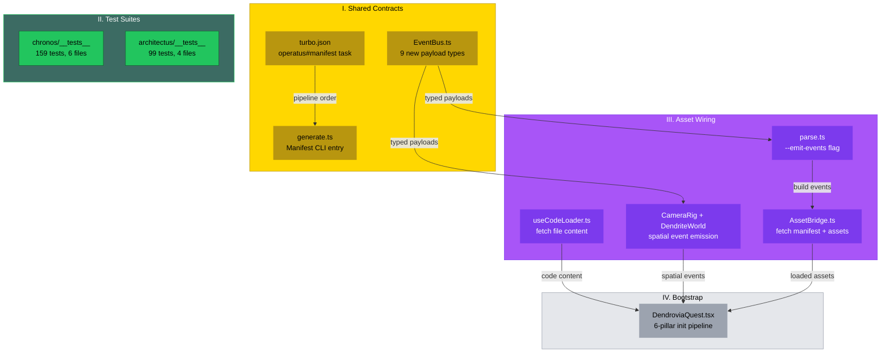
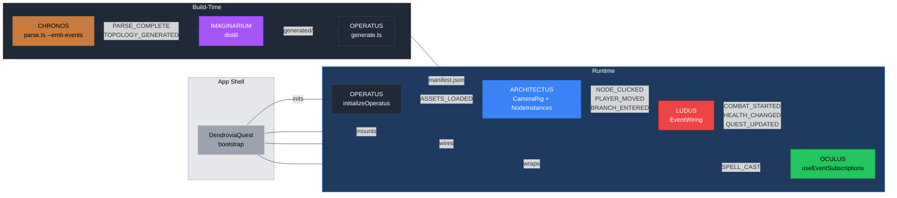

# PR: Cross-Pillar Integration — Event Contracts, Test Suites, Asset Wiring, Unified Bootstrap

## Coat of Arms

```
+--------------------------------------------------------------+
|   feat/cross-pillar-integration                              |
+--------------------------------------------------------------+
|                         MAJOR (***)                           |
|                                                              |
|     +------------------+   +------------------+              |
|     | I CONTRACTS      |   | II TEST SUITES   |             |
|     | mullet x 3       |   | scales x 2       |             |
|     | [shared|operatus]|   | [chronos|archit] |             |
|     +------------------+   +------------------+              |
|     +------------------+   +------------------+              |
|     | III ASSET WIRING |   | IV BOOTSTRAP     |             |
|     | mullet x 4       |   | mullet x 1       |             |
|     | [architectus|    |   | [app]            |             |
|     |  chronos|oculus] |   |                  |             |
|     +------------------+   +------------------+              |
|                                                              |
|   skip  [PARTY-PER-CROSS: Or|Purpure|Amber|Vert|Argent]  skip  |
|                   mullet x 8 | scales x 2                   |
|                                                              |
|              [shared|architectus|chronos|oculus|              |
|               operatus|app]                                  |
|                                                              |
|           files: 34 | +4495 / -205                           |
+--------------------------------------------------------------+
|   "Per aspera ad astra"                                      |
+--------------------------------------------------------------+
```

**Compact:** `***` [shared|architectus|chronos|oculus|operatus|app] mullet x8 scales x2 skip|skip +4495/-205

---

## Feature Space Index

| Index | Short Name | Full Name | Domain(s) | Commits | Lines |
|-------|------------|-----------|-----------|---------|-------|
| I | CONTRACTS | Shared Event Contracts + TurboRepo Pipeline | shared, operatus | 2 | ~170 |
| II | TEST SUITES | CHRONOS + ARCHITECTUS Test Coverage | chronos, architectus | 2 | ~3,100 |
| III | ASSET WIRING | Cross-Pillar Event + Asset Integration | architectus, chronos, oculus | 4 | ~670 |
| IV | BOOTSTRAP | Unified App Shell | app | 1 | ~290 |

## Cross-Space Dependencies

| From | To | Dependency Type |
|------|----|-----------------|
| I (CONTRACTS) | III (ASSET WIRING) | Typed event payloads consumed by spatial event emitters and asset loaders |
| I (CONTRACTS) | IV (BOOTSTRAP) | TurboRepo pipeline ordering consumed by build system |
| II (TEST SUITES) | III (ASSET WIRING) | Tests verify systems that ASSET WIRING modifies |
| III (ASSET WIRING) | IV (BOOTSTRAP) | Asset bridge + spatial events + CodeReader loader consumed by unified bootstrap |

## Architecture



### Runtime Event Flow



---

## I. Shared Event Contracts + TurboRepo Pipeline

### Coat of Arms (Space I)

```
+--------------------------------------------------------------+
|   packages/shared + turbo.json                               |
+--------------------------------------------------------------+
|                        MINOR (*)                              |
|                                                              |
|          skip  [Or|Sable]  skip                              |
|                   mullet x 2 | hammer x 1                   |
|                                                              |
|              [shared|operatus|infra]                          |
|                                                              |
|           files: 4 | +170 / -8                               |
+--------------------------------------------------------------+
|   "Fabrica fundamenta"                                       |
+--------------------------------------------------------------+
```

**Compact:** `*` [shared|operatus|infra] mullet x2 hammer x1 skip|skip +170/-8

### Summary

Typed all 31 GameEvents payloads (9 were missing) and wired OPERATUS ManifestGenerator into the TurboRepo build pipeline as `operatus#manifest` depending on `imaginarium#distill`.

### Features

| # | Feature | Description | Status |
|---|---------|-------------|--------|
| 1 | 9 event payload types | ParseCompleteEvent, TopologyGeneratedEvent, ShadersCompiledEvent, PaletteGeneratedEvent, CollisionDetectedEvent, ItemUsedEvent, AssetsLoadedEvent, StatePersistedEvent, CacheUpdatedEvent. Inline `import()` to avoid circular deps. MycologyCatalogedEvent consolidated from types/ to EventBus.ts | Complete |
| 2 | OPERATUS manifest CLI | `generate.ts` resolves `../imaginarium/generated/` via `import.meta.dir`, `--input`/`--output` overrides, directory validation, SHA-256 content hashing. `operatus#manifest` task in turbo.json | Complete |
| 3 | TurboRepo pipeline | `chronos#parse -> imaginarium#distill -> operatus#manifest -> architectus#build` | Complete |

---

## II. CHRONOS + ARCHITECTUS Test Suites

### Coat of Arms (Space II)

```
+--------------------------------------------------------------+
|   packages/chronos + packages/architectus                    |
+--------------------------------------------------------------+
|                       MODERATE (**)                           |
|                                                              |
|          skip  [Amber|Purpure]  skip                         |
|                   scales x 2                                 |
|                                                              |
|              [chronos|architectus]                            |
|                                                              |
|           files: 10 | +3,100 / -0                            |
+--------------------------------------------------------------+
|   "Veritas in probatione"                                    |
+--------------------------------------------------------------+
```

**Compact:** `**` [chronos|architectus] scales x2 skip|skip +3100/-0

### Summary

Filled the two critical test gaps: CHRONOS (0 → 159 tests) and ARCHITECTUS (0 → 99 tests). Combined with existing suites, the monorepo now has 690 tests across 34 files with 0 failures.

### Features

| # | Feature | Description | Status |
|---|---------|-------------|--------|
| 1 | CHRONOS test suite | 159 tests across 6 files: commit-classifier (3-tier cascade, 13 types, confidence levels), complexity-analyzer (cyclomatic + cognitive, difficulty tiers, per-function via ts-morph), hotspot-detector (Tornhill scoring, temporal coupling, mass-commit filtering), tree-builder (flat-to-hierarchy, directory-first sort, countFiles/countDirectories), contributor-profiler (8 archetypes, time archetypes, personality facets), topology-builder (output assembly, version metadata) | Complete |
| 2 | ARCHITECTUS test suite | 99 tests across 4 files: lsystem (fromTopology axiom encoding, expand rules, determinism, hotspot angle, radius/LOC), turtle-interpreter (quaternion rotation, stack push/pop, node markers, bounding box), renderer-store (5 quality tiers, camera modes, node selection, performance counters, loading state), detect-gpu (desktop/mobile tier classification, boundary values, WebGL2 cap) | Complete |

---

## III. Cross-Pillar Event + Asset Integration

### Coat of Arms (Space III)

```
+--------------------------------------------------------------+
|   packages/architectus + chronos + oculus                    |
+--------------------------------------------------------------+
|                       MODERATE (**)                           |
|                                                              |
|          skip  [Purpure|Amber|Vert]  skip                    |
|                   mullet x 4                                 |
|                                                              |
|              [architectus|chronos|oculus]                     |
|                                                              |
|           files: 14 | +670 / -20                             |
+--------------------------------------------------------------+
|   "Per aspera ad astra"                                      |
+--------------------------------------------------------------+
```

**Compact:** `**` [architectus|chronos|oculus] mullet x4 skip|skip +670/-20

### Summary

Wired the inter-pillar communication channels: ARCHITECTUS now loads IMAGINARIUM-generated assets via AssetBridge, emits spatial events (PLAYER_MOVED, BRANCH_ENTERED) for LUDUS to consume, CHRONOS emits build-time events behind `--emit-events`, and OCULUS CodeReader fetches file content via useCodeLoader hook.

### Features

| # | Feature | Description | Status |
|---|---------|-------------|--------|
| 1 | AssetBridge | `loadGeneratedAssets(manifestPath)` fetches manifest.json then parallel-loads palettes, shaders, lsystem, noise, mycology. 5s AbortController timeout per fetch. Returns `GeneratedAssets \| null`. Store extended with `generatedAssets` + `setGeneratedAssets`. App.tsx loads on mount, non-blocking — renders with DEFAULT_PALETTE, picks up IMAGINARIUM assets on arrival | Complete |
| 2 | Spatial events | CameraRig emits `PLAYER_MOVED` via useFrame when camera moves >0.5 world units (ref-based debounce). BranchTracker (renderless R3F component) runs every 10th frame, finds closest NodeMarker via `distanceToSquared`, emits `BRANCH_ENTERED` on transition. `NODE_CLICKED` pre-existing | Complete |
| 3 | CHRONOS EventBus | `--emit-events` CLI flag. Emits `PARSE_COMPLETE` after AST parsing, `TOPOLOGY_GENERATED` after output assembly. Default off for fast CLI mode. Positional arg parsing refactored to strip `--` flags | Complete |
| 4 | CodeReader loader | `useCodeLoader` hook watches `codeReader.filePath/content/loading`. Fetches via configurable `baseUrl` or custom `fetchContent` function. AbortController cancels stale requests. Store gains `loading`/`error` fields + `setCodeContent`/`setCodeLoading`/`setCodeError` actions. CodeReader renders 4 states: spinner, error, content, placeholder | Complete |

---

## IV. Unified App Bootstrap

### Coat of Arms (Space IV)

```
+--------------------------------------------------------------+
|   apps/dendrovia-quest                                       |
+--------------------------------------------------------------+
|                        MINOR (*)                              |
|                                                              |
|          skip  [Argent]  skip                                |
|                   mullet x 1                                 |
|                                                              |
|              [app]                                            |
|                                                              |
|           files: 5 | +290 / -8                               |
+--------------------------------------------------------------+
|   "Per aspera ad astra"                                      |
+--------------------------------------------------------------+
```

**Compact:** `*` [app] mullet x1 skip|skip +290/-8

### Summary

Single-component bootstrap (`DendroviaQuest.tsx`) that initializes all six pillars in a deterministic pipeline: OPERATUS (cache + persistence) → CHRONOS (topology fetch) → LUDUS (GameStore + GameSession + EventWiring) → render ARCHITECTUS (3D canvas with `manifestPath`) wrapped in OCULUS (OculusProvider + HUD overlay). Each step try/catch isolated — failure in one pillar never blocks others. `enableOperatus`/`enableLudus`/`enableOculus` props for independent pillar toggling. Cleanup on unmount: OPERATUS destroy, LUDUS unsub, EventBus clear.

---

## Files Changed

```
dendrovia/
├── IMPLEMENTATION_STATUS.md                        # Rewrite: 5-15% → ~85% actual
├── turbo.json                                      # +operatus#manifest, architectus#build deps
├── apps/dendrovia-quest/
│   ├── app/
│   │   ├── components/
│   │   │   └── DendroviaQuest.tsx                  # NEW: 6-pillar unified bootstrap
│   │   ├── layout.tsx                              # Updated title/description
│   │   └── page.tsx                                # Renders DendroviaQuest
│   ├── next.config.js                              # transpilePackages for 5 @dendrovia/*
│   └── package.json                                # +5 workspace dependencies
├── packages/shared/src/
│   ├── events/EventBus.ts                          # +9 event payload types
│   └── types/index.ts                              # Consolidate MycologyCatalogedEvent
├── packages/architectus/
│   ├── __tests__/
│   │   ├── detect-gpu.test.ts                      # NEW: 15 tests, tier classification
│   │   ├── lsystem.test.ts                         # NEW: 19 tests, axiom + expand
│   │   ├── renderer-store.test.ts                  # NEW: 41 tests, store state
│   │   └── turtle-interpreter.test.ts              # NEW: 24 tests, quaternion turtle
│   └── src/
│       ├── App.tsx                                 # manifestPath prop, asset loading
│       ├── index.ts                                # +loadGeneratedAssets, GeneratedAssets
│       ├── loader/
│       │   ├── AssetBridge.ts                      # NEW: manifest fetch + parallel loads
│       │   └── index.ts                            # NEW: barrel
│       ├── store/useRendererStore.ts               # +generatedAssets field/action
│       └── components/
│           ├── CameraRig.tsx                       # +PLAYER_MOVED emission (0.5u debounce)
│           └── DendriteWorld.tsx                    # +BranchTracker, lsystemOverride
├── packages/chronos/
│   ├── __tests__/
│   │   ├── commit-classifier.test.ts               # NEW: 28 tests, 3-tier cascade
│   │   ├── complexity-analyzer.test.ts             # NEW: 20 tests, cyclomatic+cognitive
│   │   ├── contributor-profiler.test.ts            # NEW: 22 tests, 8 archetypes
│   │   ├── hotspot-detector.test.ts                # NEW: 14 tests, Tornhill scoring
│   │   ├── topology-builder.test.ts                # NEW: 13 tests, output assembly
│   │   └── tree-builder.test.ts                    # NEW: 20 tests, flat-to-hierarchy
│   └── src/parse.ts                                # +--emit-events, PARSE_COMPLETE/TOPOLOGY_GENERATED
├── packages/oculus/src/
│   ├── __tests__/useOculusStore.test.ts            # +5 tests for loading/error state
│   ├── components/CodeReader.tsx                   # 4-state rendering, useCodeLoader
│   ├── hooks/useCodeLoader.ts                      # NEW: configurable content fetcher
│   ├── index.ts                                    # +useCodeLoader, CodeLoaderOptions
│   └── store/useOculusStore.ts                     # +loading/error fields, 3 new actions
└── packages/operatus/
    ├── package.json                                # manifest script → generate.ts
    └── src/manifest/generate.ts                    # NEW: CLI for operatus#manifest
```

## Commits

1. `b6dd1c8` feat(shared): add 9 missing event payload types, consolidate MycologyCatalogedEvent
2. `20fe161` test(architectus): add 99 tests across 4 files for LSystem, TurtleInterpreter, store, GPU detection
3. `cd03677` feat(operatus): wire ManifestGenerator CLI into TurboRepo pipeline
4. `fcd0d39` docs: rewrite IMPLEMENTATION_STATUS.md to reflect actual ~85% completion
5. `5d3b52c` test(chronos): add 159 tests across 6 files for full parsing pipeline
6. `2662bd5` feat(architectus): add AssetBridge to consume IMAGINARIUM generated output
7. `6a90fde` feat(architectus): emit PLAYER_MOVED and BRANCH_ENTERED spatial events
8. `605c450` feat(chronos): add --emit-events flag for EventBus integration
9. `6e0c64d` feat(oculus): wire CodeReader to fetch file content via useCodeLoader hook
10. `1e3c4e1` feat(app): add unified DendroviaQuest bootstrap wiring all six pillars

## Terminology

| Term | Definition |
|------|-----------|
| AssetBridge | ARCHITECTUS module that fetches IMAGINARIUM's manifest.json and loads all referenced assets in parallel |
| Spatial events | EventBus messages (PLAYER_MOVED, BRANCH_ENTERED, NODE_CLICKED) emitted by ARCHITECTUS when player navigates the 3D world |
| BranchTracker | Renderless R3F component that detects nearest NodeMarker and emits BRANCH_ENTERED on transition |
| useCodeLoader | OCULUS hook that fetches file content when CodeReader opens a file, configurable via baseUrl or custom fetchContent |
| DendroviaQuest | Unified app shell component that initializes OPERATUS → CHRONOS → LUDUS and renders ARCHITECTUS + OCULUS |
| operatus#manifest | TurboRepo task that scans IMAGINARIUM's generated/ directory and produces content-hashed manifest for cache busting |
| --emit-events | CHRONOS CLI flag that enables EventBus emission (PARSE_COMPLETE, TOPOLOGY_GENERATED) during parsing |

## Design Decisions

| # | Decision | Rationale | Alternatives Considered |
|---|----------|-----------|------------------------|
| 1 | Inline `import()` for event payload types | Avoids circular dependency between types/index.ts and events/EventBus.ts; type-only imports resolve at compile time | Top-level imports (circular risk), separate payload file (file proliferation) |
| 2 | PLAYER_MOVED debounced at 0.5 world units | Prevents event flooding from continuous camera movement; ref-based tracking avoids React re-renders | Per-frame emission (performance), time-based debounce (misses fast movements), store subscription (re-render overhead) |
| 3 | BranchTracker runs every 10th frame | Nearest-node search is O(n) over all NodeMarkers; at 60fps, running at 6Hz balances responsiveness with CPU cost | Every frame (wasteful), requestIdleCallback (too lazy), spatial index (premature optimization) |
| 4 | --emit-events defaults to off | CLI-first design: CHRONOS parse should complete fast without side effects; EventBus instantiation is only needed when pillar integration is active | Always emit (side effects in CLI), env var (less discoverable), config file (overhead) |
| 5 | CodeReader 4-state rendering | Loading/error/content/empty states prevent UI from being stuck on spinner or showing stale content | 2-state (loading or content — can't show errors), optimistic render (flashes stale content) |
| 6 | DendroviaQuest per-pillar try/catch | A failure in OPERATUS (e.g., OPFS not available) should not prevent the 3D scene from rendering; progressive enhancement | Single try/catch (all-or-nothing), error boundaries (React-level, not init-level) |
| 7 | enableOperatus/enableLudus/enableOculus props | Development flexibility: can render 3D scene without game logic or UI overlay; testing individual pillars in isolation | Single enable flag (all-or-nothing), import-time tree shaking (not runtime configurable) |
| 8 | Replicated classifyTier logic in detect-gpu tests | The function is module-private in detectGPU.ts and the public API requires browser APIs (navigator.gpu, canvas); replicating the algorithm tests the classification logic without browser mocks | Mock browser globals (fragile, version-dependent), export the function (breaks encapsulation), integration test (requires browser) |

## Test Plan

- [x] 9 new event payload types compile without circular dependency errors
- [x] CHRONOS: 159 tests pass across 6 files (commit-classifier, complexity-analyzer, hotspot-detector, tree-builder, contributor-profiler, topology-builder)
- [x] ARCHITECTUS: 99 tests pass across 4 files (lsystem, turtle-interpreter, renderer-store, detect-gpu)
- [x] OCULUS: 25 tests pass (5 new for loading/error state, 20 existing)
- [x] IMAGINARIUM: 181 tests still pass (regression check after shared type changes)
- [x] LUDUS: 204 tests still pass (regression check)
- [x] OPERATUS: 22 tests still pass (regression check)
- [x] Full monorepo: 690 tests, 0 failures, 7109 assertions across 34 files
- [x] TurboRepo pipeline: chronos#parse → imaginarium#distill → operatus#manifest → architectus#build
- [ ] Manual: DendroviaQuest renders 3D scene with HUD overlay
- [ ] Manual: PLAYER_MOVED fires on camera movement in dev tools console
- [ ] Manual: CodeReader spinner appears then content loads on file selection

## Related

| Document | Relationship |
|----------|-------------|
| `IMPLEMENTATION_STATUS.md` | Updated in this PR to reflect ~85% completion |
| `docs/pr-descriptions/PR_DESCRIPTION_CHRONOS_HERALDRY_CASTLE_WALLS.md` | Prior PR establishing CHRONOS + governance |
| `docs/pr-descriptions/PR_DESCRIPTION_IMAGINARIUM_MYCOLOGY.md` | Prior PR establishing IMAGINARIUM + mycology |
| `docs/pr-descriptions/PR_DESCRIPTION_LUDUS_COMBAT_ENGINE.md` | Prior PR establishing LUDUS combat |
| `docs/pr-descriptions/PR_DESCRIPTION_ARCHITECTUS_RENDERER_ENGINE.md` | Prior PR establishing ARCHITECTUS renderer |
| `docs/pr-descriptions/PR_DESCRIPTION_OCULUS_UI_COMPONENT_LIBRARY.md` | Prior PR establishing OCULUS UI |
| `docs/pr-descriptions/PR_DESCRIPTION_OPERATUS_INFRASTRUCTURE.md` | Prior PR establishing OPERATUS infra |
