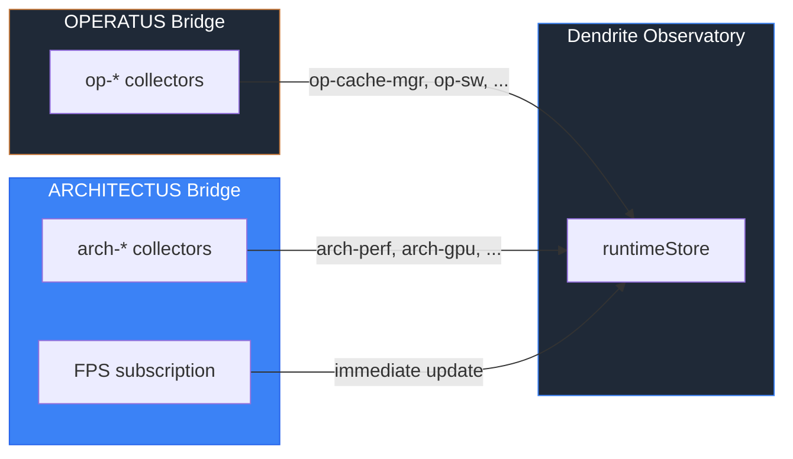

# PR: Dendrite Coverage Extension — Cross-Pillar Runtime Observation

## Coat of Arms

```
+--------------------------------------------------------------+
|   feat/dendrite-coverage-gaps                                |
+--------------------------------------------------------------+
|                      *** MAJOR ***                           |
|                                                              |
|           skip  [party-per-cross]  WARN                      |
|                   mullet x 5                                 |
|                                                              |
|       [shared · architectus · operatus · app · docs]         |
|                                                              |
|           files: 17 | +1707 / -24                            |
+--------------------------------------------------------------+
|   "Per aspera ad astra"                                      |
+--------------------------------------------------------------+
```

**Compact:** *** [shared · architectus · operatus · app · docs] mullet x5 skip/WARN/pass/WARN +1707/-24

---

## Summary

Fills dendrite coverage gaps exposed by the segment-based placement initiative (PR #37) and completes the OPERATUS-to-ARCHITECTUS runtime bridge arc. New fixture nodes represent the StoryArc pipeline and SegmentMapper subsystems; five previously silent OPERATUS nodes now have stub collectors producing live metrics; and a full ArchitectusRuntimeBridge reads useRendererStore to stream FPS, GPU, camera, and asset-loading health into the dendrite observatory.

## Features

| Feature | Description | Status |
|---------|-------------|--------|
| Shared `deriveHealth` | Extract health derivation to `lib/dendrite/health.ts` for cross-pillar reuse | Complete |
| IMAGINARIUM fixture: StoryArc phase | 5 new nodes (StoryArcDeriver, SegmentSlicer, MoodMapper, PhaseAssigner) + SegmentPipeline | Complete |
| ARCHITECTUS fixture: SegmentMapper | New section under Systems phase with containment edge | Complete |
| Dendrovia unified fixture | StoryArc section added, descriptions updated for SegmentPipeline + SegmentMapper | Complete |
| OPERATUS stub collectors | 5 collectors (StatePersistence, StateAdapter, MultiplayerClient, ServiceWorker, Generate) wired into bridge | Complete |
| ARCHITECTUS runtime bridge | 10 collectors, 2 action factories, FPS subscription, polling, SSR-safe hook | Complete |
| Playground wiring | Both bridges writing to shared runtimeStore, ARCHITECTUS fixture selectable in toolbar | Complete |

## Architecture



## Files Changed

```
lib/dendrite/
├── health.ts                          NEW  Shared deriveHealth + HealthCondition
├── index.ts                           MOD  Export deriveHealth
└── fixtures/
    ├── imaginarium.ts                 MOD  StoryArc phase + SegmentPipeline section
    ├── architectus.ts                 MOD  SegmentMapper section
    └── dendrovia.ts                   MOD  StoryArc section, updated descriptions

packages/operatus/src/dendrite/
├── collectors.ts                      MOD  5 stub collectors added
├── bridge.ts                          MOD  Wire stub collectors into collect()
├── health.ts                          MOD  Re-export from lib/dendrite/health.ts
└── index.ts                           MOD  Barrel exports for new collectors

packages/architectus/
├── package.json                       MOD  exports field with ./dendrite subpath
└── src/dendrite/
    ├── collectors.ts                  NEW  10 collectors reading useRendererStore
    ├── actions.ts                     NEW  qualityActions + cameraActions factories
    ├── bridge.ts                      NEW  ArchitectusRuntimeBridge class
    └── index.ts                       NEW  Barrel export

apps/playground-operatus/app/
├── hooks/useArchitectusBridge.ts      NEW  SSR-safe React hook
└── gyms/dendrite/page.tsx             MOD  Wire ARCHITECTUS fixture + bridge
```

## Commits

1. `c0042b4` feat(dendrite): add shared deriveHealth to lib for cross-pillar bridges
2. `9582074` feat(dendrite): add StoryArc phase and SegmentPipeline to IMAGINARIUM fixture
3. `51eda54` feat(dendrite): add SegmentMapper to ARCHITECTUS fixture and update dendrovia
4. `cda229b` feat(operatus): add stub collectors for silent dendrite nodes
5. `5b396c4` feat(architectus): add runtime bridge for dendrite observatory
6. `8eb8faa` docs(operatus): add deployment architecture contemplation

## Test Plan

- [x] `bun test` — 960 tests pass, 0 failures
- [ ] Load dendrite page, select IMAGINARIUM fixture — verify StoryArc phase renders with 4 children, no broken edges
- [ ] Select ARCHITECTUS fixture — verify SegmentMapper appears under Systems phase
- [ ] Select Dendrovia fixture — verify StoryArc section under IMAGINARIUM, updated descriptions
- [ ] Select OPERATUS fixture in runtime mode — verify all phase nodes show aggregated health (no invisible children)
- [ ] Click op-multiplayer, op-sw nodes — verify LiveMetricsSection shows stub metrics
- [ ] Select ARCHITECTUS fixture, switch to runtime color mode — verify arch-perf shows live FPS with health-based coloring
- [ ] Click arch-gpu — verify quality-switching actions appear
- [ ] Click arch-camera — verify camera mode toggle action appears
- [ ] Switch to Dendrovia fixture — verify both OPERATUS and ARCHITECTUS nodes show runtime health
