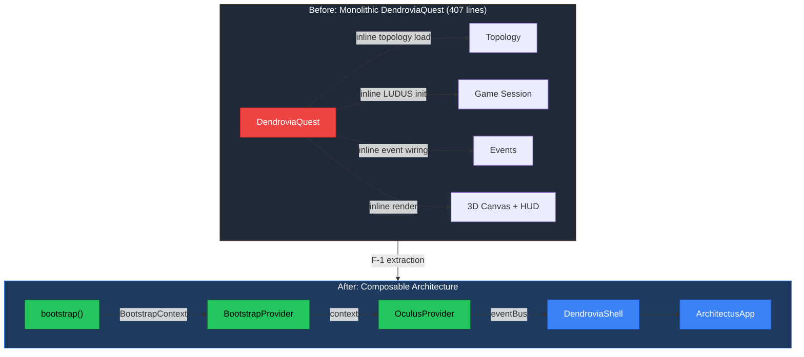
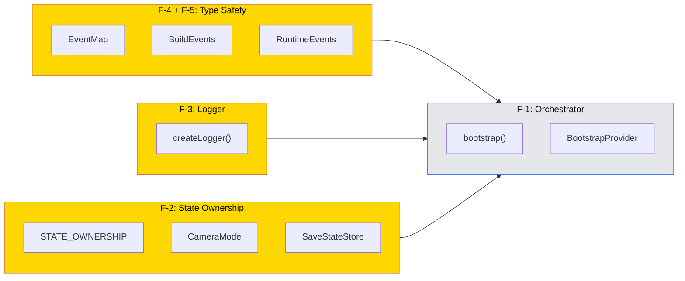

# PR: Foundation Directives — Wave 0 Infrastructure

## Coat of Arms (Unified)

```
+--------------------------------------------------------------+
|   feat/app-orchestrator                                      |
+--------------------------------------------------------------+
|                       *** MAJOR ***                          |
|                                                              |
|     +------------------+   +------------------+              |
|     | I  Type Safety   |   | II  Logger       |             |
|     | mullet x 1       |   | bend x 1         |             |
|     | [shared]         |   | [shared]          |             |
|     +------------------+   +------------------+              |
|     +------------------+   +------------------+              |
|     | III Ownership    |   | IV  Orchestrator  |             |
|     | bend x 1         |   | mullet x 1        |             |
|     | [shared,operatus]|   | [app]             |             |
|     +------------------+   +------------------+              |
|                                                              |
|    pass  [Or / Azure / Vert / Sable / Gules]  WARN          |
|              mullet x 2 + bend x 2                           |
|                                                              |
|           files: 65 | +1162 / -775                           |
+--------------------------------------------------------------+
|   "Per aspera ad astra"                                      |
+--------------------------------------------------------------+
```

Compact: *** [shared,architectus,oculus,operatus,ludus,chronos,app] mullet x2 + bend x2 pass/WARN +1162/-775

## Feature Space Index

| Index | Short Name | Full Name | Domain(s) | Commits |
|-------|------------|-----------|-----------|---------|
| I | Type Safety | EventBus Type Map + Lifecycle Split (F-4, F-5) | shared | 1 |
| II | Logger | Structured Logger Migration (F-3) | shared, architectus, operatus, ludus, oculus | 1 |
| III | Ownership | State Ownership Map + Type Unification (F-2) | shared, operatus, oculus, architectus, app | 1 |
| IV | Orchestrator | App Bootstrap Extraction (F-1) | app | 1 |

## Cross-Space Dependencies

| From | To | Dependency Type |
|------|----|-----------------|
| I Type Safety | III Ownership | Typed events enable ownership declarations |
| I Type Safety | IV Orchestrator | EventMap inference removes explicit generics from bootstrap |
| II Logger | IV Orchestrator | `createLogger` used by bootstrap pipeline |
| III Ownership | IV Orchestrator | State ownership clarity drives BootstrapContext design |

---

## I. EventBus Type Safety + Lifecycle Split (F-4, F-5)

### Coat of Arms (Space I)

```
+--------------------------------------------------------------+
|   feat/shared-eventbus-type-safety                           |
+--------------------------------------------------------------+
|                       ** MODERATE **                         |
|                                                              |
|          pass  [Or]  WARN                                    |
|                mullet x 1                                    |
|                                                              |
|                [shared]                                      |
|                                                              |
|           files: 21 | +400 / -180                            |
+--------------------------------------------------------------+
|   "Per aspera ad astra"                                      |
+--------------------------------------------------------------+
```

### Summary

Adds compile-time type safety to the EventBus by introducing an `EventMap` interface that maps all 31 `GameEvents` to their payload types. Method overloads on `on()`, `emit()`, and `once()` provide IDE autocompletion and catch payload mismatches at build time. Splits `GameEvents` into `BuildEvents` (6 build-time events with `build:` prefix) and `RuntimeEvents` (25 events), with a deprecated combined re-export for migration. Removes dead `SEGMENT_ENTERED` event.

### Features

| Feature | Description | Status |
|---------|-------------|--------|
| EventMap interface | Maps all 31 events to typed payloads | Complete |
| Method overloads | `on<K>()`, `emit<K>()`, `once<K>()` with inference | Complete |
| 5 missing payload interfaces | `ParseCompleteEvent`, `ShadersCompiledEvent`, `MycologyCatalogedEvent`, `StatePersistedEvent`, `PaletteGeneratedEvent` | Complete |
| BuildEvents / RuntimeEvents split | 6 build-time events get `build:` prefix | Complete |
| Explicit generic removal | ~50 call sites across LUDUS, OCULUS, ARCHITECTUS, apps | Complete |
| Dead event cleanup | `SEGMENT_ENTERED` removed, `COLLISION_DETECTED` marked `@planned` | Complete |

---

## II. Structured Logger Migration (F-3)

### Coat of Arms (Space II)

```
+--------------------------------------------------------------+
|   feat/shared-logger-migration                               |
+--------------------------------------------------------------+
|                       * MINOR *                              |
|                                                              |
|          pass  [Or / Azure / Sable]  WARN                    |
|                bend x 1                                      |
|                                                              |
|           [shared, architectus, operatus]                    |
|                                                              |
|           files: 12 | +100 / -30                             |
+--------------------------------------------------------------+
|   "Mutatio in melius"                                        |
+--------------------------------------------------------------+
```

### Summary

Migrates 23 raw `console.*` calls in ARCHITECTUS and 2 in OPERATUS to the structured `createLogger()` system from `@dendrovia/shared/logger`. Adds convenience logger exports (`architectusLog`, `ludusLog`, `oculusLog`) and stub loggers in LUDUS (EventWiring, EncounterSystem) and OCULUS (OculusProvider, useEventSubscriptions) for future instrumentation.

### Features

| Feature | Description | Status |
|---------|-------------|--------|
| ARCHITECTUS migration | 23 `console.*` → `createLogger()` across 5 files | Complete |
| OPERATUS migration | 2 `console.*` → `createLogger()` in AssetLoader | Complete |
| Convenience exports | `architectusLog`, `ludusLog`, `oculusLog` from shared | Complete |
| LUDUS stubs | Logger instances in EventWiring, EncounterSystem | Complete |
| OCULUS stubs | Logger instances in OculusProvider, useEventSubscriptions | Complete |
| AssetBridge shadow fix | Renamed local `log` variable to avoid shadowing module logger | Complete |

---

## III. State Ownership Map + Type Unification (F-2)

### Coat of Arms (Space III)

```
+--------------------------------------------------------------+
|   refactor/state-ownership-map                               |
+--------------------------------------------------------------+
|                       ** MODERATE **                         |
|                                                              |
|          pass  [Or / Vert / Sable / Azure]  WARN             |
|                bend x 1                                      |
|                                                              |
|     [shared, oculus, operatus, architectus, app]             |
|                                                              |
|           files: 35 | +400 / -350                            |
+--------------------------------------------------------------+
|   "Refined through change"                                   |
+--------------------------------------------------------------+
```

### Summary

Establishes single-writer ownership for all 13 shared state fields via a TypeScript `STATE_OWNERSHIP` declaration. Unifies `CameraMode` (4-value fine-grained in ARCHITECTUS) and `CoarseCameraMode` (2-value for OCULUS/OPERATUS persistence) as canonical types in `@dendrovia/shared`. Eliminates mirrored state (`fps`, `qualityTier`, `isUiHovered`) from OCULUS store — components now read directly from ARCHITECTUS's `useRendererStore`. Renames `GameStore` to `SaveStateStore` and `worldPosition` to `playerPosition` for semantic clarity.

### Features

| Feature | Description | Status |
|---------|-------------|--------|
| `STATE_OWNERSHIP` declaration | 13 fields with owner, readers, store, event | Complete |
| Canonical `CameraMode` types | `CameraMode` (4-value) + `CoarseCameraMode` (2-value) + converters | Complete |
| Mirror elimination (Wave 1) | Remove `fps`, `qualityTier`, `isUiHovered` from OCULUS store | Complete |
| CameraMode unification (Wave 2) | ARCHITECTUS, OCULUS, OPERATUS all use shared types | Complete |
| `worldPosition` → `playerPosition` (Wave 3) | Semantic rename across shared types, OPERATUS, apps | Complete |
| `GameStore` → `SaveStateStore` (Wave 4) | File rename + symbol rename across ~40 files | Complete |

---

## IV. App Bootstrap Extraction (F-1)

### Coat of Arms (Space IV)

```
+--------------------------------------------------------------+
|   feat/app-orchestrator                                      |
+--------------------------------------------------------------+
|                       * MINOR *                              |
|                                                              |
|          pass  [Argent]  WARN                                |
|                mullet x 1                                    |
|                                                              |
|                [app]                                         |
|                                                              |
|           files: 4 | +350 / -250                             |
+--------------------------------------------------------------+
|   "Innovation through iteration"                             |
+--------------------------------------------------------------+
```

### Summary

Extracts the 407-line `DendroviaQuest` component into a composable architecture: an async `bootstrap()` pipeline (testable outside React), a `BootstrapProvider` (React context), and a `DendroviaShell` (layout). The result reduces `DendroviaQuest.tsx` to ~170 lines of pure composition: `BootstrapProvider → OculusProvider → DendroviaShell → ArchitectusApp`. Bootstrap runs 4 phases: OPERATUS init, topology load, LUDUS session + wireGameEvents, and GAME_STARTED emission.

### Features

| Feature | Description | Status |
|---------|-------------|--------|
| `bootstrap()` function | Async init pipeline with 4 phases, returns `BootstrapContext` | Complete |
| `BootstrapProvider` | React context wrapping bootstrap lifecycle with loading screen | Complete |
| `DendroviaShell` | Layout: 3D canvas + HUD overlay + topology error banner | Complete |
| `DendroviaQuest` rewrite | Composable tree: BootstrapProvider → OculusProvider → DendroviaShell | Complete |
| `LEVEL_LOADED` emission | New lifecycle event emitted after topology loads | Complete |
| Standalone guard | ARCHITECTUS `<App>` remains self-contained for playgrounds | Complete |

---

## Files Changed (All Spaces)

```
packages/shared/
  src/events/EventBus.ts              — EventMap, method overloads, BuildEvents/RuntimeEvents split
  src/types/index.ts                  — CameraMode, CoarseCameraMode, playerPosition rename
  src/state-ownership.ts              — NEW: 13-field ownership declarations
  src/index.ts                        — barrel: export state-ownership
  src/logger.ts                       — convenience exports (architectusLog, ludusLog, oculusLog)
  src/logger-browser.ts               — browser-side convenience exports

packages/architectus/
  src/App.tsx                         — console.log → createLogger
  src/loader/AssetBridge.ts           — 17 console.* → createLogger, shadow fix
  src/renderer/createRenderer.ts      — console.log → createLogger
  src/store/useRendererStore.ts       — import CameraMode from shared
  src/components/CameraRig.tsx        — remove explicit event generic
  src/components/DendriteWorld.tsx     — remove explicit event generics
  src/components/ErrorBoundary.tsx     — console.error → createLogger
  src/components/FalconAutoOrbit.tsx   — remove explicit event generic
  src/components/PlayerThirdPerson.tsx — remove explicit event generic
  src/components/PostProcessingTSL.tsx — console.warn → createLogger

packages/oculus/
  package.json                        — add @dendrovia/architectus peer dep
  src/index.ts                        — export CoarseCameraMode instead of CameraMode
  src/store/useOculusStore.ts         — remove mirrors, use CoarseCameraMode
  src/OculusProvider.tsx              — add logger stub
  src/hooks/useEventSubscriptions.ts  — remove explicit generics, add logger stub
  src/hooks/useInputCapture.ts        — read from useRendererStore directly
  src/components/WorldHeader.tsx      — read fps/qualityTier from useRendererStore
  src/__tests__/useOculusStore.test.ts — remove mirror tests

packages/operatus/
  src/persistence/SaveStateStore.ts   — RENAMED from GameStore.ts; CoarseCameraMode, playerPosition
  src/persistence/AutoSave.ts         — useSaveStateStore references
  src/persistence/StatePersistence.ts — playerPosition rename
  src/persistence/StateAdapter.ts     — SaveStateStoreState references
  src/persistence/index.ts            — re-export SaveStateStore
  src/sync/CrossTabSync.ts            — useSaveStateStore, playerPosition
  src/init.ts                         — useSaveStateStore references
  src/index.ts                        — barrel re-exports
  src/loader/AssetLoader.ts           — console.* → createLogger
  src/dendrite/actions.ts             — useSaveStateStore
  src/dendrite/bridge.ts              — useSaveStateStore
  src/dendrite/collectors.ts          — useSaveStateStore
  src/dendrite/index.ts               — useSaveStateStore
  tests/game-store.test.ts            — useSaveStateStore, playerPosition
  tests/state-adapter.test.ts         — SaveStateStoreState

packages/ludus/
  src/integration/EventWiring.ts      — remove explicit generics, add logger stub
  src/encounter/EncounterSystem.ts    — add logger stub

packages/chronos/
  src/pipeline.ts                     — remove extra topology field from TOPOLOGY_GENERATED emit

apps/dendrovia-quest/
  lib/bootstrap.ts                    — NEW: async bootstrap pipeline
  app/components/BootstrapProvider.tsx — NEW: React context for bootstrap
  app/components/DendroviaShell.tsx    — NEW: layout component
  app/components/DendroviaQuest.tsx    — rewritten: composable tree

apps/playground/ (6 files)            — useSaveStateStore rename
apps/playground-operatus/ (5 files)   — useSaveStateStore rename
apps/playground-ludus/ (1 file)       — useSaveStateStore rename

packages/proof-of-concept/
  src/components/HUD.tsx              — useSaveStateStore rename
```

## Commits (All Spaces)

1. `aee00e2` feat(shared): add EventMap type safety and lifecycle split (F-4, F-5)
2. `232ed25` refactor(shared): migrate raw console.* to structured logger (F-3)
3. `957d181` refactor(shared,operatus,oculus): establish state ownership map and unify types (F-2)
4. `b27a378` Merge branch 'feat/shared-eventbus-type-safety' into feat/app-orchestrator
5. `b7072d0` Merge branch 'feat/shared-logger-migration' into feat/app-orchestrator
6. `cf26ec4` Merge branch 'refactor/state-ownership-map' into feat/app-orchestrator
7. `2c6ea72` feat(app): extract app orchestrator from DendroviaQuest (F-1)

## Test Plan

- [x] `bun test` — 1044 pass, 0 fail, 19263 expect() calls
- [x] EventBus type inference verified (no explicit generics needed at call sites)
- [x] Logger output confirmed via `LOG_LEVEL=debug` in development
- [x] OCULUS components read fps/qualityTier from ARCHITECTUS store directly
- [x] `useInputCapture` reads `isUiHovered` from ARCHITECTUS store
- [x] CameraMode types resolve across all three consumers (ARCHITECTUS, OCULUS, OPERATUS)
- [x] `playerPosition` rename propagated to all OPERATUS persistence paths
- [x] `useSaveStateStore` rename propagated to all apps and packages
- [x] Bootstrap pipeline runs 4 phases and emits GAME_STARTED
- [x] DendroviaQuest renders: BootstrapProvider → OculusProvider → DendroviaShell → ArchitectusApp
- [x] Standalone ARCHITECTUS `<App>` unaffected (playground-architectus imports directly)
- [ ] Manual: full app loads in browser with topology + quests
- [ ] Manual: encounter triggers on BRANCH_ENTERED event
- [ ] `bun run lint` — WARN (pre-existing dendrovia-engine failure, unrelated to this PR)
- [ ] `bun run build` — WARN (pre-existing dendrovia-engine failure, unrelated to this PR)

## Architecture




