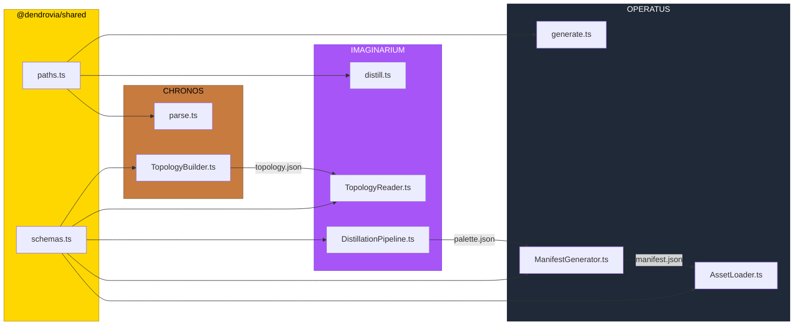

# PR: Unified Generated Paths + Contract Validation at Boundaries

## Coat of Arms

```
+--------------------------------------------------------------+
|   feat/generated-paths-and-contracts                         |
+--------------------------------------------------------------+
|                     MODERATE **                               |
|                                                              |
|     pass (types)  [SHIELD]  skip (lint)                      |
|                   mullet x 1                                 |
|                                                              |
|       [shared | chronos | imaginarium | operatus | infra]    |
|                                                              |
|            files: 13 | +246 / -41                            |
+--------------------------------------------------------------+
|   "Innovation through iteration"                             |
+--------------------------------------------------------------+
```

**Compact:** ** [shared|chronos|imaginarium|operatus|infra] mullet x1 pass/skip/pass/skip +246/-41

---

## Summary

Centralizes path resolution and adds Zod validation at every producer/consumer boundary in the build pipeline (`chronos#parse -> imaginarium#distill -> operatus#manifest`). Three divergent `generated/` directories with hardcoded relative traversals are replaced by canonical resolvers in `@dendrovia/shared/paths`, and three Zod schemas in `@dendrovia/shared/schemas` enforce the TopologySchema, PaletteSchema, and ManifestSchema contracts at runtime so the pipeline fails fast and loud on contract violations instead of silently propagating malformed artifacts.

## Features

| Feature | Description | Status |
|---------|-------------|--------|
| Monorepo root finder | `findMonorepoRoot()` walks up from cwd looking for `turbo.json`, caches result | Complete |
| Canonical path resolvers | `chronosGenerated()`, `imaginariumGenerated()`, `monorepoGenerated()` replace all hardcoded relative traversals | Complete |
| TopologyZod schema | Zod validator matching the existing TopologySchema JSON Schema contract | Complete |
| PaletteZod schema | Zod validator matching the existing PaletteSchema JSON Schema contract | Complete |
| ManifestZod schema | Zod validator matching the existing ManifestSchema JSON Schema contract | Complete |
| Producer-side validation | CHRONOS validates topology before write, IMAGINARIUM validates palette before write, OPERATUS validates manifest before return | Complete |
| Consumer-side validation | IMAGINARIUM validates topology on read, OPERATUS validates manifest on load | Complete |
| Silent fallback removal | TopologyReader parse errors now throw instead of silently falling back to mock topology (file-missing fallback preserved) | Complete |

## Architecture



## Files Changed

```
bun.lock ............................ +5   zod dependency resolution
packages/
  shared/
    package.json .................... +7/-1  add zod dep, ./paths and ./schemas exports
    src/
      index.ts ...................... +2     re-export paths and schemas
      paths.ts ...................... +65    NEW — monorepo root finder + canonical resolvers
      schemas.ts .................... +122   NEW — Zod schemas + validation functions
  chronos/
    src/
      parse.ts ...................... +3/-2  use chronosGenerated() for output dir
      builder/
        TopologyBuilder.ts .......... +4     validate topology before Bun.write
  imaginarium/
    src/
      distill.ts .................... +4/-4  use chronosGenerated() + imaginariumGenerated()
      pipeline/
        TopologyReader.ts ........... +22/-28  Zod validation, remove silent mock fallback on parse errors
        DistillationPipeline.ts ..... +4     validate palette before write
  operatus/
    src/
      manifest/
        generate.ts ................. +3/-4  use imaginariumGenerated() for input path
        ManifestGenerator.ts ........ +4     validate manifest before return
      loader/
        AssetLoader.ts .............. +5/-4  replace `as AssetManifest` casts with validateManifest()
```

## Commits

1. `c075562` feat(shared): centralize generated paths and add Zod contract validation

## Test Plan

- [x] `bun install` in shared — zod@3.25.76 installs cleanly
- [x] `tsc --noEmit` — shared package typechecks clean
- [x] `bun test` in chronos — 192 pass, 0 fail
- [x] `bun test` in imaginarium — 261 pass, 0 fail
- [x] `bun test` in operatus — 133 pass, 0 fail
- [x] Full monorepo `bun test` — 919 pass, 0 fail across 45 files
- [ ] Create corrupt topology.json (e.g. missing `files` array) and run `imaginarium#distill` — should fail with ZodError instead of silently using mock
- [ ] Verify `chronos#parse` writes to same canonical directory
- [ ] Verify `operatus#manifest` resolves IMAGINARIUM generated dir without hardcoded traversal
