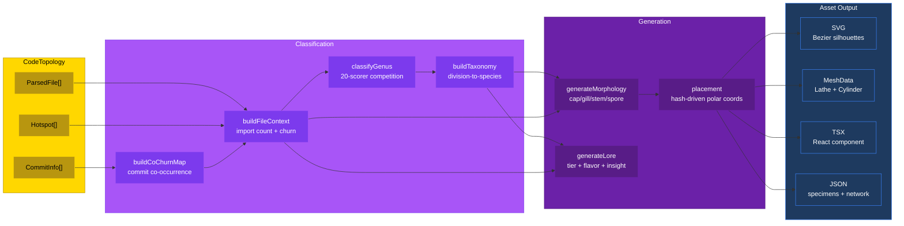

# PR: Implement IMAGINARIUM Pillar and Mycology Sub-System

## Coat of Arms

```
+--------------------------------------------------------------+
|   feat/mycology-system                                       |
+--------------------------------------------------------------+
|                         MAJOR (***)                           |
|                                                              |
|     +------------------+   +------------------+              |
|     | I IMAGINARIUM    |   | II MYCOLOGY      |             |
|     | mullet x 8       |   | mullet x 6       |             |
|     | [imaginarium]    |   | [imaginarium]     |             |
|     +------------------+   +------------------+              |
|                                                              |
|   skip  [PER-PALE: Purpure|Or]  skip                        |
|                   mullet x 14                                |
|                                                              |
|              [imaginarium|shared]                             |
|                                                              |
|           files: 58 | +6947 / -7                             |
+--------------------------------------------------------------+
|   "Per aspera ad astra"                                      |
+--------------------------------------------------------------+
```

**Compact:** `***` [imaginarium|shared] mullet x14 skip|skip +6947/-7

---

## Feature Space Index

| Index | Short Name | Full Name | Domain(s) | Commits | Lines |
|-------|------------|-----------|-----------|---------|-------|
| I | IMAGINARIUM | IMAGINARIUM Pillar — AI-to-Shader Distillation Pipeline | imaginarium, shared | 8 | ~3,500 |
| II | MYCOLOGY | Mycology Sub-System — Fungal Taxonomy, Network, Lore, Assets | imaginarium, shared | 6 | ~3,400 |

## Cross-Space Dependencies

| From | To | Dependency Type |
|------|----|-----------------|
| I (IMAGINARIUM) | II (MYCOLOGY) | IMAGINARIUM pipeline, utilities, cache, and shared types are consumed by all mycology modules |
| II (MYCOLOGY) | I (IMAGINARIUM) | Mycology integrates as step 8 of the distillation pipeline, extends ManifestInput, emits on EventBus |
| I (IMAGINARIUM) | shared | Defines CodeTopology, ProceduralPalette, SDFShader, NoiseFunction, LSystemRule, AssetManifest, GameEvents |
| II (MYCOLOGY) | shared | Extends shared types with FungalSpecimen, MycelialNetwork, MushroomLore, MycologyCatalogedEvent |

## Architecture

```mermaid
flowchart TB
    subgraph SPACE_I["I. IMAGINARIUM Pillar"]
        direction TB
        TOPO_R["TopologyReader\nJSON parse + mock fallback"]
        COLOR["ColorExtractor\nOKLCH palette extraction"]
        LSYS["LSystemCompiler\nrecursive rule generation"]
        NOISE["NoiseGenerator\nfBm/turbulence config"]
        SDF["SDFCompiler\ncomplexity-to-SDF mapping"]
        SHADER["ShaderAssembler\nGLSL template injection"]
        VARIANT["VariantGenerator\n5 shader variants"]
        ART["ArtGen\nAI provider abstraction"]
        CACHE["DeterministicCache\nSHA-256 two-tier"]
        MANIFEST["ManifestGenerator\nJSON asset manifest"]
        DISTILL["DistillationPipeline\n9-stage orchestrator"]

        DISTILL --> TOPO_R
        DISTILL --> COLOR
        DISTILL --> LSYS
        DISTILL --> NOISE
        DISTILL --> ART
        DISTILL --> VARIANT
        DISTILL --> MANIFEST
        VARIANT --> SDF
        VARIANT --> SHADER
        SHADER --> COLOR
    end

    subgraph SPACE_II["II. Mycology Sub-System"]
        direction TB
        TYPES["types.ts\n20-genus taxonomy"]
        GENUS["GenusMapper\ncompetitive scoring"]
        MORPH["MorphologyGenerator\nmetrics-to-traits"]
        NET["MycelialNetwork\nco-churn graph"]
        LORE["LoreGenerator\n5-tier rarity"]
        CAT["SpecimenCatalog\ntopology-to-registry"]
        SVG["SvgTemplates\nparametric Bezier"]
        SPRITE["MushroomSprite\nReact TSX"]
        MESH["MeshGenerator\nThree.js instancing"]
        MYCO_PIPE["MycologyPipeline\nsub-orchestrator"]
        MYCO_IDX["index.ts\nbarrel exports"]

        MYCO_PIPE --> CAT
        MYCO_PIPE --> NET
        MYCO_PIPE --> SVG
        CAT --> GENUS
        CAT --> MORPH
        CAT --> LORE
        GENUS --> TYPES
        MORPH --> TYPES
        LORE --> TYPES
        NET --> TYPES
        SVG --> TYPES
        SPRITE --> SVG
        MESH --> TYPES
    end

    subgraph SHARED["@dendrovia/shared"]
        direction TB
        SH_TYPES["types/index.ts\nCodeTopology + FungalSpecimen"]
        SH_EVENTS["EventBus\nMYCOLOGY_CATALOGED"]
    end

    DISTILL -->|"step 8"| MYCO_PIPE
    DISTILL --> CACHE
    DISTILL --> SH_EVENTS
    MYCO_PIPE --> SH_EVENTS
    COLOR --> SH_TYPES
    GENUS --> SH_TYPES
    MANIFEST -->|"mycology section"| MYCO_PIPE

    style SPACE_I fill:#A855F7,stroke:#7c3aed,color:#ffffff
    style SPACE_II fill:#6B21A8,stroke:#581c87,color:#ffffff
    style SHARED fill:#FFD700,stroke:#b8960f,color:#000000
    style DISTILL fill:#1e3a5f,stroke:#3b82f6,color:#ffffff
    style TOPO_R fill:#1e3a5f,stroke:#3b82f6,color:#ffffff
    style COLOR fill:#1e3a5f,stroke:#3b82f6,color:#ffffff
    style LSYS fill:#1e3a5f,stroke:#3b82f6,color:#ffffff
    style NOISE fill:#1e3a5f,stroke:#3b82f6,color:#ffffff
    style SDF fill:#1e3a5f,stroke:#3b82f6,color:#ffffff
    style SHADER fill:#1e3a5f,stroke:#3b82f6,color:#ffffff
    style VARIANT fill:#1e3a5f,stroke:#3b82f6,color:#ffffff
    style ART fill:#1e3a5f,stroke:#3b82f6,color:#ffffff
    style CACHE fill:#1e3a5f,stroke:#3b82f6,color:#ffffff
    style MANIFEST fill:#1e3a5f,stroke:#3b82f6,color:#ffffff
    style TYPES fill:#581c87,stroke:#7c3aed,color:#ffffff
    style GENUS fill:#581c87,stroke:#7c3aed,color:#ffffff
    style MORPH fill:#581c87,stroke:#7c3aed,color:#ffffff
    style NET fill:#581c87,stroke:#7c3aed,color:#ffffff
    style LORE fill:#581c87,stroke:#7c3aed,color:#ffffff
    style CAT fill:#581c87,stroke:#7c3aed,color:#ffffff
    style SVG fill:#581c87,stroke:#7c3aed,color:#ffffff
    style SPRITE fill:#581c87,stroke:#7c3aed,color:#ffffff
    style MESH fill:#581c87,stroke:#7c3aed,color:#ffffff
    style MYCO_PIPE fill:#581c87,stroke:#7c3aed,color:#ffffff
    style MYCO_IDX fill:#581c87,stroke:#7c3aed,color:#ffffff
    style SH_TYPES fill:#b8960f,stroke:#FFD700,color:#000000
    style SH_EVENTS fill:#b8960f,stroke:#FFD700,color:#000000
```



### Mycology Classification Pipeline



---

## I. IMAGINARIUM Pillar — AI-to-Shader Distillation Pipeline

### Coat of Arms (Space I)

```
+--------------------------------------------------------------+
|   packages/imaginarium                                       |
+--------------------------------------------------------------+
|                       MODERATE (**)                           |
|                                                              |
|          skip  [Purpure]  skip                               |
|                   mullet x 8                                 |
|                                                              |
|              [imaginarium|shared]                             |
|                                                              |
|           files: 42 | +3,500 / -7                            |
+--------------------------------------------------------------+
|   "Per aspera ad astra"                                      |
+--------------------------------------------------------------+
```

**Compact:** `**` [imaginarium] mullet x8 skip|skip +3500/-7

### Summary

Full IMAGINARIUM pillar implementation: the build-time compiler that distills `CodeTopology` into mathematical shader code, color palettes, L-system rules, noise configurations, and a unified asset manifest. Establishes the foundational utilities (OKLCH color math, SHA-256 hashing, GLSL helpers), distillation modules, shader template system, deterministic caching layer, and 9-stage orchestration pipeline. All outputs are procedural and deterministic — same topology input produces byte-identical artifacts.

### Features

| # | Feature | Description | Status |
|---|---------|-------------|--------|
| 1 | ColorExtractor | OKLCH-space palette extraction: `hueFromComplexity` + `saturationFromCohesion` + `lightnessFromChurn`. Per-file and per-topology extractors. Fallback to `DEFAULT_PALETTES` on error | Complete |
| 2 | LSystemCompiler | Topology-to-branching-rule compiler: axiom `F`, depth-adaptive iterations (capped at 5 for GPU budget), angle from mean complexity, rule complexity from file diversity. `expandLSystem` string rewriter | Complete |
| 3 | NoiseGenerator | fBm/turbulence/ridged selector from `hotspotDensity`. Octaves from log2(fileCount), lacunarity/gain from complexity variance. Deterministic seed via `hashObject` | Complete |
| 4 | SDFCompiler | 6-tier complexity-to-SDF mapping: `sphere` (trivial) through `smoothUnionTree` (extreme). GLSL code generation with `opSmoothUnion` k-factor from coupling metric. Instruction counting and validation | Complete |
| 5 | ShaderAssembler | 3-template GLSL injection: `sdf-library.glsl` + `raymarcher.glsl` + `lighting.glsl`. Color uniform binding from `ProceduralPalette`, `{{PLACEHOLDER}}` substitution, instruction budget validation | Complete |
| 6 | VariantGenerator | 5 shader variants per topology: global, per-language (top-3), complexity-weighted, structural (depth-biased), hotspot-focused. Each variant = SDFCompiler + ShaderAssembler pipeline | Complete |
| 7 | DistillationPipeline | 9-stage orchestrator: topology read, cache init, palette extraction (global + per-language), L-system compile, noise generate, optional AI art, shader variants, mycology catalogization, manifest write. <30ms for 100-file topology | Complete |
| 8 | DeterministicCache | Two-tier (memory Map + disk JSON) cache keyed by SHA-256 of normalized inputs. Version-gated entries, `getOrCompute` convenience, atomic disk writes via `Bun.write` | Complete |
| 9 | ArtGen | Provider-abstracted AI art generation: `stability`, `replicate`, `local`, `skip` (default). Prompt building from topology metrics. `skip` mode returns null image — procedural pipeline only | Complete |
| 10 | Utility layer | `utils/color.ts`: OKLCH bidirectional conversion, harmony schemes (complement/triadic/analogous/split-complement), temperature mapping, blending. `utils/glsl.ts`: `glslFloat`/`glslVec3`/`glslVec3FromHex`, `validateGLSL`, `countInstructions`. `utils/hash.ts`: `hashString`/`hashObject`/`hashFiles` via Bun.CryptoHasher SHA-256 | Complete |
| 11 | Fallback presets | `DefaultPalettes`: 7 language-keyed palettes (TypeScript/JavaScript/Python/Rust/Go/Java/Ruby) + `getLanguageHue` OKLCH hue map. `DefaultSDFs`: 3-tier (simple/medium/complex) GLSL presets | Complete |

### Key Interfaces

```typescript
// Pipeline output
interface PipelineResult {
  palettes: Array<{ id: string; palette: ProceduralPalette; path: string }>;
  shaders: Array<{ id: string; shader: SDFShader; path: string }>;
  noise: { config: NoiseFunction; path: string };
  lsystem: { rule: LSystemRule; path: string };
  manifestPath: string;
  durationMs: number;
}

// Shader assembly
interface AssemblerConfig {
  palette: ProceduralPalette;
  sdfCode: string;
  complexity: number;
  enableLighting: boolean;
}

// Cache
class DeterministicCache {
  get<T>(key: string): T | undefined;
  set<T>(key: string, value: T): void;
  getOrCompute<T>(key: string, compute: () => T): T;
}
```

---

## II. Mycology Sub-System — Fungal Taxonomy, Network, Lore, Assets

### Coat of Arms (Space II)

```
+--------------------------------------------------------------+
|   packages/imaginarium/src/mycology                          |
+--------------------------------------------------------------+
|                       MODERATE (**)                           |
|                                                              |
|          skip  [Purpure|Or]  skip                            |
|                   mullet x 6                                 |
|                                                              |
|              [imaginarium|shared]                             |
|                                                              |
|           files: 18 | +3,400 / -0                            |
+--------------------------------------------------------------+
|   "Per aspera ad astra"                                      |
+--------------------------------------------------------------+
```

**Compact:** `**` [imaginarium|shared] mullet x6 skip|skip +3400/-0

### Summary

Biologically-grounded classification system mapping source files to fungal specimens via a 20-genus taxonomy derived from real-world mycology. Each file in a `CodeTopology` becomes a mushroom whose morphology (cap shape, gill attachment, stem form, spore print color, bioluminescence) visually encodes code properties (complexity, coupling, LOC, language, hotspot churn). A mycelial network built from commit co-occurrence models the underground dependency graph. Five-tier lore provides inspectable domain knowledge. Asset pipeline produces parametric SVGs, a React TSX component, and Three.js-ready mesh data.

### Features

| # | Feature | Description | Status |
|---|---------|-------------|--------|
| 1 | Fungal taxonomy types | 290-line type system: `FungalDivision` (3) / `FungalClass` (3) / `FungalOrder` (6) / `FungalFamily` (12) / `FungalGenus` (20) literal unions. `MushroomMorphology` with `CapShape` (6), `GillAttachment` (4), `StemForm`, `SporePrintColor` (7), `BioluminescenceLevel` (4), `SizeClass` (5). `MycelialNetwork`, `MushroomLore`, `FungalSpecimen`, `MycologyManifest` | Complete |
| 2 | GenusMapper | 460-line competitive scoring engine. 20 `GenusProfile` scorers evaluate `FileContext` (importCount, importedByCount, churnFrequency, totalConnections, avgComplexity, language, LOC, directory, path patterns). Highest score wins. `Agaricus` baseline deliberately low (score 10 + bonuses capping ~28) so specialized genera (Boletus for `db/`, Cantharellus for `event`, Cordyceps for `decorator`) always dominate when applicable. `buildTaxonomy` maps genus → full division/class/order/family. Species epithet via SHA-256 → latin prefix/suffix lookup | Complete |
| 3 | MorphologyGenerator | Code metrics → physical traits. Cap shape from genus override then cyclomatic complexity fallback (convex default, campanulate for >15, umbonate for single-dominant-function). Gill attachment from `totalConnections` (free <3, adnexed <8, adnate <15, decurrent 15+). Stem height from `log2(LOC)/10`, thickness from `importedByCount`. Spore print: white=TypeScript, brown=JavaScript, black=Rust, purple=Python, pink=Ruby, cream=Go, ochre=Java. Bioluminescence from churn frequency (>0.8=pulsing, >0.5=bright, >0.2=faint). Size class from LOC (tiny <30, small <100, medium <500, large <2000, massive 2000+) | Complete |
| 4 | MycelialNetwork | Co-churn frequency analysis: files changing in same commit → edge candidates. Minimum 2 co-occurrences threshold. `deriveMycorrhizalType`: checks both endpoints for deprecated patterns (saprotrophic), decorator/mixin (parasitic), test files (endomycorrhizal), default ectomycorrhizal. Signal types: nutrient (data flow), salicylic (type flow), jasmonic (error), strigolactone (deferred). Strength normalized to [0,1]. Hub detection: top 10% by edge count. Directory-based clustering with density metric | Complete |
| 5 | LoreGenerator | 5-tier rarity (common/uncommon/rare/epic/legendary) via additive scoring: high complexity +2, hub node +3, high churn +1, old file (>100 commits) +2, many dependents +1, rare genus +2. 40 flavor text templates (2 per genus), deterministic selection via path hash. 10 regex pattern detectors for domain knowledge (singleton, observer, factory, middleware, state machine, pub-sub, visitor, strategy, builder, adapter). Code snippet synthesis from file extension | Complete |
| 6 | SpecimenCatalog | `catalogize(topology)`: filters trivial files via 8 `TRIVIAL_PATTERNS` regexes (gitignore, lockfiles, <3 LOC). Per-file pipeline: `buildFileContext` → `buildTaxonomy` → `generateMorphology` → `generateLore` → placement. Hash-driven polar coordinate placement. Substrate assignment by genus (deadwood for Xylaria/Pleurotus, living-bark for Cordyceps, soil default). Cluster sizing from genus (Mycena 3-8, Armillaria 2-5, others 1) | Complete |
| 7 | SvgTemplates | Parametric SVG generation: 6 Bezier cap profiles (convex/campanulate/umbonate/infundibuliform/plane/depressed), radial gill lines with spread, tapered stem with optional bulb, Amanita-type spots, annulus ring. `feGaussianBlur` + `feMerge` glow filter for bioluminescence. `feTurbulence` + `feDisplacementMap` organic edge filter. CSS `@keyframes pulse` animation for pulsing specimens. ~2-5KB per SVG, valid XML | Complete |
| 8 | MushroomSprite | React TSX component wrapping `generateSvg`. 3 sizes: icon (32px, minimap), card (128px, inventory), detail (512px, lore popup). CSS glow animation when bioluminescent. `role="img"`, `aria-label` with species binomial. Click handler for lore inspection | Complete |
| 9 | MeshGenerator | Three.js-ready data preparation: 12-step `LatheGeometry` cap profiles per `CapShape`, `CylinderGeometry` stem with radius taper (1.8x for bulbous). `InstanceData`: position/scale/rotation/color (normalized RGB from `scaleColor`)/emissive (intensity by bioluminescence level). `LODConfig`: billboard for tiny/small specimens, threshold scaled by `sizeMultiplier`, cluster radius for grouped genera | Complete |
| 10 | MycologyPipeline | Sub-orchestrator: `catalogize` → genus map extraction → `buildNetwork` → `generateSvg` per specimen → write `specimens.json` + `network.json` + SVG batch to `mycology/` subdirectory. Emits `MYCOLOGY_CATALOGED` event with specimen count, network edge count, manifest path | Complete |
| 11 | Cross-pillar integration | Extended `@dendrovia/shared` types: `FungalSpecimen`, `MycelialNetwork`, `MushroomLore`, `MycologyCatalogedEvent`, optional `mycology` field on `AssetManifest`. Added `MYCOLOGY_CATALOGED` to `GameEvents`. Extended `ManifestInput` and `DistillationPipeline` | Complete |

### Genus-to-Code-Property Reference

| Genus | Code Property | Visual Encoding | Real Mycology |
|-------|--------------|-----------------|---------------|
| Amanita | High-complexity entry points | Tall, spotted cap, volva | Iconic, symbiotic |
| Agaricus | Standard utility functions | Medium brown, pink gills | Common field mushroom |
| Boletus | Database/data-access | Thick stem, porous cap | Mycorrhizal with specific trees |
| Cantharellus | Event emitters / message passing | Golden funnel, forking ridges | Chanterelle — channels nutrients |
| Russula | Config files / constants | Brittle, bright cap | Snaps cleanly |
| Lactarius | Stream/generator modules | Exudes colored latex | Milk caps |
| Coprinus | Frequently deleted files | Ink-cap, auto-digesting | Autodeliquescent |
| Mycena | Small helpers (<50 LOC) | Tiny, translucent, bioluminescent | Fairy bonnets in clusters |
| Armillaria | Monolithic modules | Honey-colored, clustered | Honey fungus |
| Trametes | Middleware / adapters | Shelf form, concentric zones | Turkey tail |
| Ganoderma | Stable core modules | Woody bracket, lacquered | Reishi |
| Cordyceps | Decorators / monkey-patching | Erupts from host, orange stalks | Parasitic |
| Morchella | High cyclomatic complexity | Honeycomb/pitted cap | Morel |
| Pleurotus | Side-effect modules (logging) | Lateral growth, oyster-shaped | Oyster mushroom |
| Psilocybe | Debug/dev-only modules | Small, wavy cap | Alters perception |
| Hericium | Pure functions / FP modules | Cascading white spines | Lion's mane |
| Xylaria | Deprecated / dead code | Black, finger-like | Dead man's fingers |
| Clavaria | Simple linear pipelines | Coral-like, unbranched | Coral fungi |
| Phallus | Code smell modules | Phallic stipe, olive slime | Stinkhorn |
| Tuber | Hidden/internal modules | Subterranean, no fruiting body | Truffle |

### Key Interfaces

```typescript
// Core specimen
interface FungalSpecimen {
  id: string;
  filePath: string;
  taxonomy: FungalTaxonomy;
  morphology: MushroomMorphology;
  lore: MushroomLore;
  placement: MushroomPlacement;
}

// Network
interface MycelialNetwork {
  nodes: MycelialNode[];
  edges: MycelialEdge[];
  clusters: HyphalCluster[];
  hubNodes: string[];
}

// Asset output
interface MushroomMeshData {
  specimenId: string;
  cap: ProfileGeometry;      // LatheGeometry points
  stem: CylinderGeometry;    // Tapered cylinder
  instanceData: InstanceData; // Position, scale, rotation, color, emissive
  lod: LODConfig;            // Billboard threshold, cluster config
}
```

---

## Files Changed (All Spaces)

```
dendrovia/
├── packages/imaginarium/                          # Space I + II: IMAGINARIUM
│   ├── package.json                               # Scripts: distill, build, test
│   ├── tsconfig.json                              # ES2022/ESNext/Bun module resolution
│   ├── src/
│   │   ├── index.ts                               # Barrel exports (all public API)
│   │   ├── distill.ts                             # CLI entry: topology path + output dir
│   │   ├── utils/
│   │   │   ├── color.ts                           # OKLCH bidirectional, harmony, temperature
│   │   │   ├── glsl.ts                            # GLSL float/vec3/uniform, validate, count
│   │   │   └── hash.ts                            # SHA-256 string/object/file hashing
│   │   ├── cache/
│   │   │   └── DeterministicCache.ts              # Two-tier memory + disk cache
│   │   ├── fallback/
│   │   │   ├── DefaultPalettes.ts                 # 7 language palettes + hue map
│   │   │   ├── DefaultSDFs.ts                     # 3-tier GLSL SDF presets
│   │   │   └── index.ts                           # Barrel
│   │   ├── distillation/
│   │   │   ├── ColorExtractor.ts                  # OKLCH palette from topology
│   │   │   ├── LSystemCompiler.ts                 # Recursive branching rules
│   │   │   ├── NoiseGenerator.ts                  # fBm/turbulence/ridged config
│   │   │   ├── SDFCompiler.ts                     # Complexity-to-SDF mapping
│   │   │   ├── TurtleInterpreter.ts               # L-string to line segments
│   │   │   └── index.ts                           # Barrel
│   │   ├── generation/
│   │   │   ├── ArtGen.ts                          # Multi-provider AI art
│   │   │   ├── PromptBuilder.ts                   # Topology-to-prompt
│   │   │   └── index.ts                           # Barrel
│   │   ├── shaders/
│   │   │   ├── ShaderAssembler.ts                 # Template injection + validation
│   │   │   └── templates/
│   │   │       ├── sdf-library.glsl               # SDF primitive library
│   │   │       ├── raymarcher.glsl                # Raymarching loop
│   │   │       └── lighting.glsl                  # Phong + ambient
│   │   ├── pipeline/
│   │   │   ├── DistillationPipeline.ts            # 9-stage orchestrator
│   │   │   ├── VariantGenerator.ts                # 5 shader variants
│   │   │   ├── ManifestGenerator.ts               # JSON manifest (+ mycology)
│   │   │   ├── TopologyReader.ts                  # JSON parse + mock fallback
│   │   │   └── MockTopology.ts                    # Deterministic 50/100-file mock
│   │   └── mycology/                              # Space II: Mycology sub-system
│   │       ├── types.ts                           # 290-line taxonomy type system
│   │       ├── GenusMapper.ts                     # 20-scorer competitive classifier
│   │       ├── MorphologyGenerator.ts             # Metrics-to-physical-traits
│   │       ├── MycelialNetwork.ts                 # Co-churn graph builder
│   │       ├── LoreGenerator.ts                   # 5-tier knowledge generator
│   │       ├── SpecimenCatalog.ts                 # Topology-to-specimen registry
│   │       ├── MycologyPipeline.ts                # Sub-pipeline orchestrator
│   │       ├── index.ts                           # Barrel exports
│   │       └── assets/
│   │           ├── SvgTemplates.ts                # Parametric Bezier SVG
│   │           ├── MushroomSprite.tsx              # React component wrapper
│   │           └── MeshGenerator.ts               # Three.js mesh data
│   └── __tests__/
│       ├── color.test.ts                          # OKLCH conversion, harmony, temperature
│       ├── glsl-validation.test.ts                # GLSL validation, instruction counting
│       ├── ColorExtractor.test.ts                 # Palette extraction bounds
│       ├── LSystemCompiler.test.ts                # Rule generation, expansion
│       ├── NoiseGenerator.test.ts                 # Config bounds, octave scaling
│       ├── SDFCompiler.test.ts                    # Tier mapping, GLSL validity
│       ├── ShaderAssembler.test.ts                # Template injection, placeholder removal
│       ├── TurtleInterpreter.test.ts              # Segment generation, stack
│       ├── DeterministicCache.test.ts             # Memory + disk caching
│       ├── integration.test.ts                    # Full pipeline, determinism, fallback
│       └── mycology/
│           ├── taxonomy.test.ts                   # 14 tests: genus mapping, determinism
│           ├── morphology.test.ts                 # 22 tests: cap/gill/stem/spore/glow
│           ├── network.test.ts                    # 8 tests: edges, hubs, clusters
│           ├── lore.test.ts                       # 9 tests: tiers, content, patterns
│           ├── catalog.test.ts                    # 11 tests: filtering, placement
│           └── svg.test.ts                        # 30 tests: XML validity, shapes
│
├── packages/shared/                               # Cross-pillar types
│   └── src/
│       ├── types/index.ts                         # +FungalSpecimen, MycelialNetwork, MushroomLore, MycologyCatalogedEvent, AssetManifest.mycology
│       └── events/EventBus.ts                     # +MYCOLOGY_CATALOGED
```

## Commits

1. `2e9b38a` Add imaginarium package scaffolding: tsconfig, exports, scripts
2. `53fbe14` Add core utilities: SHA-256 hashing, OKLCH color math, GLSL helpers
3. `0507e6c` Add deterministic cache layer and fallback palette/SDF presets
4. `165f7b4` Add GLSL shader template system and ShaderAssembler
5. `6be0ac3` Add distillation modules: Color, LSystem, Turtle, Noise, SDF compiler
6. `30c250b` Add generation modules and pipeline orchestration system
7. `675f518` Add CLI entry point and barrel exports for all public modules
8. `478e312` Add comprehensive test suite: 87 tests across 10 files
9. `ce88b45` Add mycology cross-pillar types: FungalSpecimen, MycelialNetwork, MushroomLore
10. `64b8ca2` Add fungal taxonomy type system: 20 genera, morphology, network, lore primitives
11. `7f14ba3` Add mycology classification, morphology, network, lore, and catalog modules
12. `f4f1841` Add mycology asset pipeline: parametric SVG, React sprite, Three.js mesh data
13. `f6e1fcd` Integrate mycology sub-pipeline into distill orchestrator and manifest
14. `fd0e271` Add mycology test suite: 94 tests across 6 files (181 total, 0 failures)

## Terminology

| Term | Definition |
|------|-----------|
| Distillation | The process of converting code topology metadata into mathematical shader representations |
| SDF | Signed Distance Function — implicit surface representation used by raymarching shaders |
| OKLCH | Oklab Lightness-Chroma-Hue — perceptually uniform color space (successor to HSL) |
| L-System | Lindenmayer system — parallel string rewriting grammar for fractal branching |
| Genus | One of 20 fungal genera, each encoding a specific code characteristic |
| Mycorrhizal type | Network edge classification: ectomycorrhizal (read-only), endomycorrhizal (extends), saprotrophic (dead code), parasitic (monkey-patches) |
| Co-churn | Files that change together in commits — proxy for dependency relationships |
| Bioluminescence | Glow effect on mushroom specimens, intensity encodes hotspot churn frequency |
| Specimen | A concrete `FungalSpecimen` instance: taxonomy + morphology + lore + placement |
| Spore print | Color assigned by source language (white=TypeScript, brown=JavaScript, etc.) |
| Flavor text | Atmospheric prose attached to each specimen, deterministically selected by path hash |
| Lore tier | Rarity classification (common/uncommon/rare/epic/legendary) based on additive code-property scoring |

## Design Decisions

| # | Decision | Rationale | Alternatives Considered |
|---|----------|-----------|------------------------|
| 1 | OKLCH color space for all palette operations | Perceptual uniformity ensures equal visual steps between lightness/chroma values; HSL has non-uniform perceptual mapping that makes generated palettes look unbalanced | HSL (non-uniform), LAB (no cylindrical hue), RGB (no perceptual model) |
| 2 | GLSL output (not WGSL) | Three.js auto-transpiles GLSL → WGSL when WebGPU is the active renderer; writing GLSL directly ensures WebGL fallback compatibility and wider tool ecosystem support | WGSL (limits to WebGPU-only), dual output (unnecessary maintenance), SPIR-V (too low-level) |
| 3 | AI art generation defaults to `skip` | Procedural pipeline must be self-sufficient without external API dependencies; AI art is an enhancement, not a requirement. Avoids API cost and non-determinism by default | Default to stability (costs money, blocks on failure), local models (requires GPU setup) |
| 4 | Competitive genus scoring (not decision tree) | 20 overlapping code properties can't be cleanly partitioned; scoring allows graceful degradation when files match multiple genera, with Agaricus as calibrated fallback | Decision tree (brittle, can't handle overlap), ML classifier (non-deterministic, opaque), random (non-meaningful) |
| 5 | Agaricus baseline score set to 10 | Initial value of 20 caused Agaricus to beat specialized genera for generic files (accumulated 55 points). Reduced to 10 with capped bonuses (~28 max) ensures specialized matches always dominate | Higher baseline (generic files get wrong genus), no fallback genus (unclassified files) |
| 6 | Co-churn as dependency proxy | Full import graph requires AST resolution not yet available (deferred to CHRONOS enhancement). Co-churn (files changing in same commit) is a strong proxy: files that change together are likely coupled | Import graph parsing (requires full AST, not yet available), random edges (meaningless), manual annotation (doesn't scale) |
| 7 | TRIVIAL_PATTERNS filter with `(^|\/)` prefix | Paths may or may not start with `/` depending on topology source; original `\/` prefix failed to match bare filenames like `.gitignore` | Leading `/` only (misses bare paths), no filter (trivial files get specimens), extension-only filter (misses dotfiles) |
| 8 | Saprotrophic detection checks both edge endpoints | Co-churn edge keys are sorted alphabetically, so the deprecated file could be either source or target; single-endpoint check missed ~50% of saprotrophic relationships | Source-only (misses sorted cases), separate pass (wasteful), special key ordering (fragile) |
| 9 | 5-tier lore with additive rarity scoring | Additive scoring produces a natural distribution curve: most files are common (low score), few are legendary (requires multiple rare properties coinciding). More nuanced than binary thresholds | Fixed tier per genus (too predictable), random tier (non-meaningful), complexity-only (one-dimensional) |
| 10 | Parametric SVG over pre-rendered sprites | SVGs are ~2-5KB, scale infinitely, and are deterministic from morphology parameters. Pre-rendered sprites would require a rasterization step, fixed resolution, and larger file sizes | PNG sprites (resolution-locked, large files), Canvas rendering (requires runtime), WebGL textures (too heavyweight for inventory) |

## Test Plan

- [x] Core IMAGINARIUM test suite passes: 87 tests across 10 files
- [x] Mycology test suite passes: 94 tests across 6 files
- [x] Full pipeline integration: `bun test __tests__/integration.test.ts` exercises all 9 stages including mycology
- [x] Determinism verified: dual-run comparison produces byte-identical `manifest.json`
- [x] Performance: <30ms for 100-file topology (budget: 5000ms)
- [x] Taxonomy coverage: every `ParsedFile` in mock topology maps to exactly one genus
- [x] Morphology bounds: all generated dimensions within valid ranges (no NaN, no negative sizes)
- [x] Network validity: all edges reference existing nodes, no self-loops, strengths in [0,1]
- [x] SVG validity: every generated SVG parses as valid XML, contains expected elements
- [x] Lore tier distribution follows expected rarity curve (most common, few legendary)
- [x] Missing topology falls back to mock (50-file deterministic topology)
- [x] All 181 tests pass with 0 failures across 16 test files
- [ ] Manual: `bun run distill` against real codebase topology
- [ ] Manual: SVG rendering verification in browser
- [ ] Manual: MeshData consumption by Three.js LatheGeometry

## Related

| Document | Relationship |
|----------|-------------|
| `CLAUDE.md` (root) | Monorepo instructions referencing IMAGINARIUM pillar |
| `docs/PILLAR_THEMATIC_SCHEMA.md` | Thematic schema informing IMAGINARIUM's "Art is Code, Code is Art" philosophy |
| `docs/PILLAR_INSIGNIA_STRUCTURAL.md` | Pillar visual identity; IMAGINARIUM tincture is Purpure |
| `packages/shared/src/types/index.ts` | Cross-pillar contract types consumed by ARCHITECTUS, LUDUS, OCULUS |
| `packages/chronos/` | CHRONOS produces the `CodeTopology` consumed by IMAGINARIUM's pipeline |
