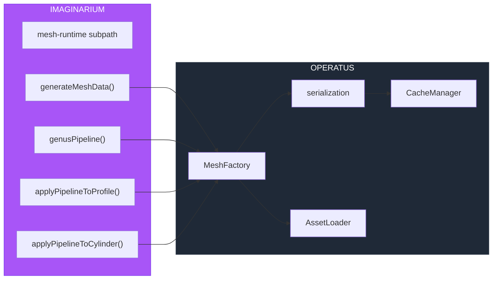

# PR: L3 Runtime Mesh Generation

## Coat of Arms

```
+--------------------------------------------------------------+
|   feat/l3-runtime-mesh-generation                            |
+--------------------------------------------------------------+
|                      ** MODERATE **                           |
|                                                              |
|          pass  [PER-PALE SHIELD]  skip                       |
|               mullet (feat) x 3                              |
|                                                              |
|            [operatus | imaginarium]                          |
|                                                              |
|           files: 11 | +715 / -4                             |
+--------------------------------------------------------------+
|   "Innovation through iteration"                             |
+--------------------------------------------------------------+
```

**Compact:** ** [operatus|imaginarium] mullet×3 scales×1 pass/skip/pass/skip +715/-4

---

## Summary

Implements L3 runtime mesh generation for OPERATUS, replacing 117 MB of pre-baked mesh build artifacts (1,690 files) with ~370 lines of on-demand browser-side generation code. The IMAGINARIUM pure-math mesh pipeline is re-exported via a new browser-safe subpath, and MeshFactory orchestrates generation with binary caching, in-flight deduplication, and pipeline versioning.

## Features

| Feature | Description | Status |
|---------|-------------|--------|
| mesh-runtime subpath | Browser-safe re-export of IMAGINARIUM mesh pipeline excluding node:fs/Bun.CryptoHasher | Complete |
| MeshFactory | On-demand specimen mesh generation with tiered cache integration | Complete |
| Binary serialization | 16-byte header + contiguous typed arrays (73% smaller than JSON) | Complete |
| In-flight deduplication | Concurrent requests for same specimen share a single generation promise | Complete |
| Pipeline versioning | MESH_PIPELINE_VERSION constant invalidates cache on pipeline changes | Complete |
| Batch generation | Main-thread yielding every N specimens + AbortSignal cancellation | Complete |
| AssetLoader fallback | loadMesh() falls back to runtime generation when pre-baked files unavailable | Complete |
| Init pipeline integration | MeshFactory wired as Step 7.5 with skipMeshFactory config option | Complete |

## Architecture



## Files Changed

```
packages/
├── imaginarium/
│   ├── package.json                        # +mesh-runtime subpath export
│   └── src/mesh-runtime/
│       └── index.ts                        # Browser-safe pipeline re-exports (NEW)
└── operatus/
    ├── package.json                        # +@dendrovia/imaginarium dep, +./mesh subpath
    ├── src/
    │   ├── index.ts                        # +MeshFactory/MESH_PIPELINE_VERSION re-exports
    │   ├── init.ts                         # +Step 7.5 MeshFactory init, +skipMeshFactory
    │   ├── loader/
    │   │   └── AssetLoader.ts              # +setMeshFactory(), +runtime fallback in loadMesh()
    │   └── mesh/                           # (NEW directory)
    │       ├── index.ts                    # Barrel exports
    │       ├── MeshFactory.ts              # Core factory: generate → cache → retrieve
    │       └── serialization.ts            # Binary encode/decode (16B header + typed arrays)
    └── tests/
        └── mesh-factory.test.ts            # 12 tests (NEW)
bun.lock                                    # Workspace dep resolution
```

## Commits

1. `935960c` feat(imaginarium): add browser-safe mesh-runtime subpath export
2. `88495d0` feat(operatus): add L3 runtime mesh generation with binary cache
3. `b7aa3fe` feat(operatus): wire MeshFactory into init pipeline and AssetLoader
4. `1aea339` test(operatus): add MeshFactory test suite

## Test Plan

- [x] `bun test` in packages/operatus — 154 pass, 0 fail
- [x] MeshFactory generates valid FlatMeshData for mock specimens
- [x] Binary encode/decode round-trips preserve positions, normals, indices exactly
- [x] Cache hit returns `fromCache: true` on second call
- [x] Concurrent getMesh() calls deduplicate (1 generation, not 2)
- [x] Pipeline version mismatch triggers regeneration
- [x] Batch respects AbortSignal cancellation
- [x] `bunx tsc --noEmit` — no new type errors from L3 code
- [ ] Integration test with live specimens from generated/imaginarium/mycology/specimens.json
- [ ] Bundle audit: verify mesh-runtime subpath excludes node:fs, node:path
