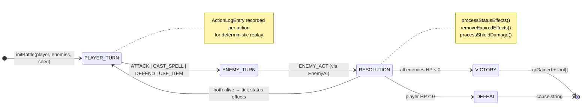
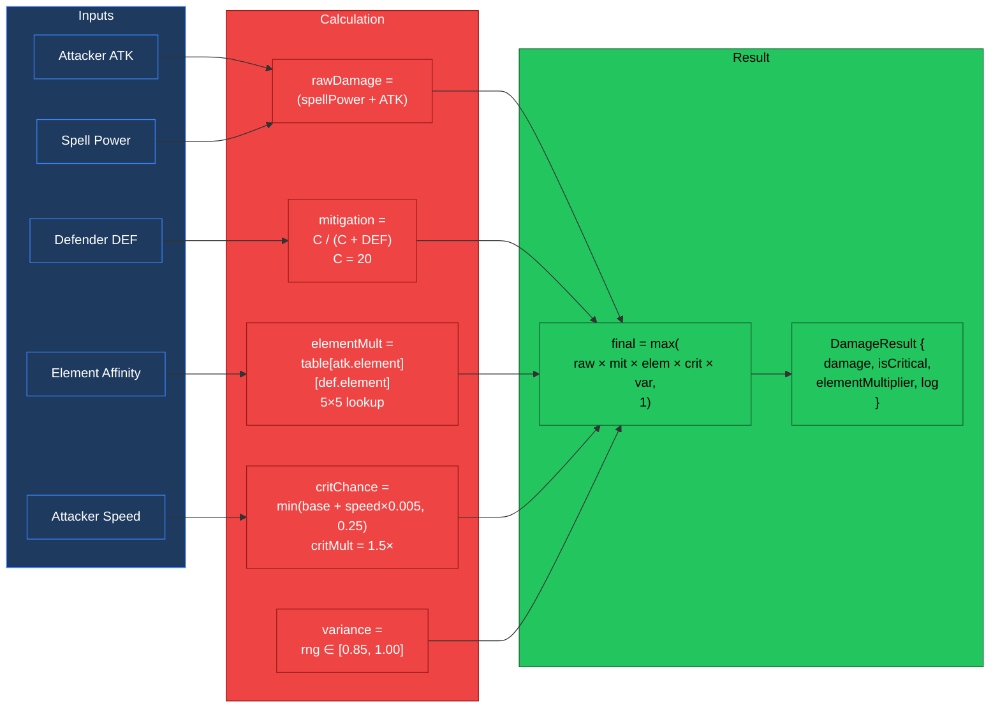

# PR: Implement LUDUS Pillar — Headless Turn-Based Combat Engine

## Coat of Arms

```
+--------------------------------------------------------------+
|   feat/ludus-combat-engine                                   |
+--------------------------------------------------------------+
|                        MAJOR (***)                            |
|                                                              |
|          skip  [PER-CHEVRON: Gules|Or|Tenne]  skip           |
|                     mullet x 11                              |
|                                                              |
|                  [ludus|shared|docs]                          |
|                                                              |
|           files: 26 | +8,546 / -9                           |
+--------------------------------------------------------------+
|   "Per aspera ad astra"                                      |
+--------------------------------------------------------------+
```

**Compact:** `***` [ludus|shared|docs] mullet x11 skip|skip +8546/-9

**Magnitude Derivation:** files=5 + lines=5 + domains=3 + breaking=3 + schema=2 = **18 → MAJOR**

---

## Summary

Complete implementation of the LUDUS pillar — the headless game mechanics engine for Dendrovia. 14 production modules delivering a pure-functional turn-based RPG combat system that runs in Bun/Node.js without rendering. The engine covers the full game loop: seeded PRNG, character classes with stat growth, symbol-driven spell generation, element-affinity damage formulas, status effect processing, procedural monster generation with AI action selection, a `(BattleState, Action) → BattleState` immutable reducer, quest generation from git history, encounter detection, inventory management, progression/reward resolution, cross-pillar event wiring, Monte Carlo balance simulation, save/load serialization, and externalized balance configuration. All combat is deterministic and replayable from seed + action log. 204 tests, 4,372 assertions, 224ms runtime.

---

## Architecture

### Module Dependency Graph

```mermaid
flowchart TB
    subgraph SHARED["@dendrovia/shared"]
        direction LR
        TYPES["types/index.ts\nCharacter|Monster|BattleState\nAction|Spell|Quest|Item"]
        EVENTS["EventBus.ts\n8 combat events\n11 typed payloads"]
    end

    subgraph CORE["Core Data Layer"]
        direction TB
        RNG["SeededRandom\nsfc32 128-bit PRNG\nstate-passing [val, RngState]"]
        STORE["GameStore\nimmutable state container\nsubscribe/snapshot/restore"]
        CHAR["CharacterSystem\n3-class factory\nstat growth + XP curve"]
    end

    subgraph COMBAT["Combat Engine"]
        direction TB
        SPELL["SpellFactory\nsymbol→spell generation\n12 registered spells"]
        MATH["CombatMath\n(Power+ATK)*C/(C+DEF)\n5×5 element table"]
        STATUS["StatusEffects\ntick/stack/expire\npoison|regen|shield|stun"]
        MONSTER["MonsterFactory\n4 BugTypes × severity\nboss/miniboss scaling"]
        AI["EnemyAI\nthreat evaluation\nheal/spell/attack priority"]
        ENGINE["TurnBasedEngine\npure (State,Action)→State\ndeterministic replay"]
    end

    subgraph SYSTEMS["Game Systems"]
        direction TB
        QUEST["QuestGenerator\ncommit→quest DAG\n4 types, prerequisite chains"]
        ENCOUNTER["EncounterSystem\nboss>miniboss>bug>random\ncooldown + defeated tracking"]
        INV["InventorySystem\n10-item registry\nslot stacking, loot drops"]
        PROG["ProgressionSystem\nXP→level-up pipeline\nbattle stats + victory screen"]
        WIRE["EventWiring\nGameSession aggregate\nEventBus↔combat bridge"]
    end

    subgraph META["Simulation / Save / Config"]
        direction TB
        SIM["SimulationHarness\nMonte Carlo N-trial\n3 strategies, CSV/report"]
        SAVE["SaveSystem\nJSON v1 serialize/deserialize\nversion validation"]
        BAL["BalanceConfig\nall magic numbers\ndeep-merge overrides"]
    end

    TYPES --> CHAR
    TYPES --> SPELL
    TYPES --> MATH
    TYPES --> ENGINE
    TYPES --> MONSTER
    TYPES --> QUEST
    TYPES --> SAVE
    EVENTS --> WIRE

    RNG --> MONSTER
    RNG --> ENGINE
    RNG --> SIM
    RNG --> INV
    CHAR --> ENGINE
    CHAR --> SIM
    SPELL --> ENGINE
    MATH --> ENGINE
    STATUS --> ENGINE
    MONSTER --> ENGINE
    MONSTER --> SIM
    AI --> ENGINE
    ENGINE --> SIM
    ENGINE --> WIRE
    ENGINE --> PROG
    INV --> PROG
    INV --> WIRE
    INV --> SAVE
    QUEST --> WIRE
    ENCOUNTER --> WIRE
    PROG --> WIRE
    BAL --> MATH
    BAL --> CHAR
    BAL --> MONSTER

    style SHARED fill:#FFD700,stroke:#b8960f,color:#000000
    style CORE fill:#1e3a5f,stroke:#3b82f6,color:#ffffff
    style COMBAT fill:#EF4444,stroke:#991b1b,color:#ffffff
    style SYSTEMS fill:#c77b3f,stroke:#8b5e2f,color:#000000
    style META fill:#3c6b63,stroke:#22c55e,color:#ffffff
    style TYPES fill:#FFD700,stroke:#b8960f,color:#000000
    style EVENTS fill:#FFD700,stroke:#b8960f,color:#000000
    style RNG fill:#1e3a5f,stroke:#3b82f6,color:#ffffff
    style STORE fill:#1e3a5f,stroke:#3b82f6,color:#ffffff
    style CHAR fill:#1e3a5f,stroke:#3b82f6,color:#ffffff
    style SPELL fill:#EF4444,stroke:#991b1b,color:#ffffff
    style MATH fill:#EF4444,stroke:#991b1b,color:#ffffff
    style STATUS fill:#EF4444,stroke:#991b1b,color:#ffffff
    style MONSTER fill:#EF4444,stroke:#991b1b,color:#ffffff
    style AI fill:#EF4444,stroke:#991b1b,color:#ffffff
    style ENGINE fill:#EF4444,stroke:#991b1b,color:#ffffff
    style QUEST fill:#c77b3f,stroke:#8b5e2f,color:#000000
    style ENCOUNTER fill:#c77b3f,stroke:#8b5e2f,color:#000000
    style INV fill:#c77b3f,stroke:#8b5e2f,color:#000000
    style PROG fill:#c77b3f,stroke:#8b5e2f,color:#000000
    style WIRE fill:#c77b3f,stroke:#8b5e2f,color:#000000
    style SIM fill:#3c6b63,stroke:#22c55e,color:#ffffff
    style SAVE fill:#3c6b63,stroke:#22c55e,color:#ffffff
    style BAL fill:#3c6b63,stroke:#22c55e,color:#ffffff
```



### Combat State Machine



### Damage Formula Pipeline



---

## Features

| # | Module | Description | Key Interfaces | Status |
|---|--------|-------------|----------------|--------|
| 1 | SeededRandom | sfc32 128-bit PRNG with state-passing `[value, RngState]` tuples. `nextFloat`/`nextInt`/`nextBool`/`shuffleArray`/`randomElement` — never calls `Math.random()` | `RngState`, `createRngState(seed)` | Complete |
| 2 | GameStore | Immutable game state container with subscriber notification. `dispatch(reducer)`, `select(selector)`, `subscribe(listener)`, `snapshot()`/`restore()` for undo | `GameStore<T>`, `createGameStore(initial)` | Complete |
| 3 | CharacterSystem | 3-class factory (tank/healer/dps) with base stats, per-level stat growth via `GrowthRates`, XP curve `totalXP=base*n^exp`, spell slot unlocking at levels 1/3/5/8 | `createCharacter(class, name, level)`, `levelUp(char)`, `canLevelUp(char)` | Complete |
| 4 | SpellFactory | Symbol-driven spell generation: shape (circle→heal, triangle→damage, square→shield, star→buff) × element × modifier. 12 pre-registered spells across 3 class kits (4 per class). Registry Map with `getSpell`/`registerSpell`/`getSpellsForClass` | `SpellSymbol`, `generateSpell(symbol)`, `SPELL_REGISTRY` | Complete |
| 5 | CombatMath | Hybrid Tung/Pokemon formula `(SpellPower+ATK)*C/(C+DEF)` with C=20. 5×5 element effectiveness table. Crit system: `baseCritChance + speed*0.005` capped at 0.25, multiplier 1.5×. Variance `[0.85, 1.0]` via seeded RNG. Floor=1 | `calculateDamage(attacker, defender, spell, rng)` → `DamageResult` | Complete |
| 6 | StatusEffects | Tick-based effect processor. `applyStatusEffect` with stack/refresh logic. Processes poison (%-based drain), regen (flat heal), shield (absorbed via `processShieldDamage`), stun (`isStunned` check), stat mods (attack/defense up/down additive) | `applyStatusEffect`, `processStatusEffects`, `removeExpiredEffects` | Complete |
| 7 | MonsterFactory | `BugType` → `Monster` with severity/complexity scaling. Base stats per type (null-pointer=glass cannon, memory-leak=high HP/regen, race-condition=fast, off-by-one=balanced). Severity multiplier `1+0.35*(sev-1)`, complexity `1+0.1*c`. Boss/miniboss generators. Flavor names | `createMonster(type, severity, complexity, rng)` → `[Monster, RngState]` | Complete |
| 8 | EnemyAI | Threat-evaluation action selection. Priority: heal when HP<30%, use spells on cooldown, basic attack fallback. Target selection: lowest-HP for damage, highest-threat for debuff. Deterministic via RNG pass-through | `chooseEnemyAction(monster, state, rng)` → `[Action, RngState]` | Complete |
| 9 | TurnBasedEngine | Pure functional `(BattleState, Action) → BattleState` reducer with zero mutation. Phase FSM: PLAYER_TURN→ENEMY_TURN→RESOLUTION→loop\|VICTORY\|DEFEAT. Dispatches ATTACK, CAST_SPELL (mana/cooldown), DEFEND (+5 def 1t), USE_ITEM, ENEMY_ACT. Status ticks at turn boundaries. `replayBattle(player, enemies, seed, actions)` for deterministic replay | `initBattle`, `executeTurn`, `replayBattle` | Complete |
| 10 | QuestGenerator | `ParsedCommit[]` → `Quest[]` DAG. 4 quest types: bug-hunt (bug-fix commits), feature (feat commits), refactor (refactor commits), archaeology (old files). Prerequisite chains. XP/item rewards scaled by commit size (insertions+deletions). State FSM: locked→available→active→completed | `generateQuestGraph`, `unlockAvailableQuests`, `startQuest`, `completeQuest` | Complete |
| 11 | EncounterSystem | Priority-based encounter triggers: boss (file complexity>20) > miniboss (hotspot risk>6) > bug (bug-fix commit) > random (15% per step). Cooldown system (3 steps). Defeated tracking via `Set<string>` for bosses/minibosses/bugs. `scanAllEncounters` for encounter map pre-computation | `checkEncounter(file, commits, hotspots, state, rng, config)` → `Encounter \| null` | Complete |
| 12 | InventorySystem | Slot-stacking item registry with 10 registered items (Debug Log, Stack Trace, Core Dump, Memory Snapshot, Root Cause, Caffeine, Rubber Duck, Energy Drink, Code Review, Pair Programming). `useItem` applies heal-hp/heal-mana/buff-attack/buff-defense/cleanse. Seeded RNG loot drops via `resolveLoot`/`resolveLootToInventory` | `Inventory`, `InventorySlot`, `addItem`, `removeItem`, `useItem` | Complete |
| 13 | ProgressionSystem | `resolveBattleRewards(battleState, rng)` extracts XP + loot from VICTORY phase. `applyBattleRewards(char, inv, rewards)` drives XP→level-up→stat growth pipeline. `applyQuestRewards` for quest completion. `BattleStatistics` tracking (wins/losses/damage/crits/spells/items). `buildVictoryScreen` data assembly for OCULUS | `resolveBattleRewards`, `applyBattleRewards`, `BattleStatistics` | Complete |
| 14 | EventWiring | `GameSession` aggregate interface over all game state. `wireGameEvents(session)` subscribes to `EventBus`: `NODE_CLICKED`→encounter check→combat start, `SPELL_CAST`→action dispatch, `ITEM_USED`→effect apply. Battle end→rewards→encounter state update→`COMBAT_ENDED`/`LEVEL_UP`/`LOOT_DROPPED` emission. `startBattle`/`dispatchCombatAction` for direct (non-EventBus) usage | `GameSession`, `wireGameEvents`, `startBattle` | Complete |
| 15 | SimulationHarness | Monte Carlo balance simulator. `simulateBattle(player, monster, seed, maxTurns, strategy)` with 3 strategies (attack-only/spell-first/mixed). `simulateMatchup` runs N trials per class×monster. `runFullSimulation`: 3 classes × 4 bug types. `runProgressionSimulation`: level sweep. Flag thresholds: <30% too-hard, >80% too-easy, >10% draws draw-heavy. `formatReport` (ASCII table) + `formatCSV` | `SimulationConfig`, `MatchupResult`, `SimulationReport` | Complete |
| 16 | SaveSystem | JSON serialization with `SAVE_VERSION=1`. `serializeGameState`→`SaveData`→`saveToJSON` round-trip. `deserializeGameState` with full field validation, graceful missing-field defaults, `Set↔Array` conversion. `validateSave` for quick format check. `createSaveSnapshot` convenience | `SaveData`, `LoadResult`, `saveToJSON`, `loadFromJSON` | Complete |
| 17 | BalanceConfig | All magic numbers externalized into `BalanceConfig` interface: `DamageConfig` (defenseConstant=20, baseCritChance=0.05, critMultiplier=1.5, maxCritChance=0.25, varianceMin=0.85, minDamage=1), `ElementConfig` (5×5 table), `CharacterConfig` (base stats + growth per class), `XPConfig`, `MonsterScalingConfig`, `CombatConfig`, `EncounterBalanceConfig`. `createBalanceConfig(overrides)` deep-merges partials. Presets: `EASY_CONFIG`, `HARD_CONFIG` | `BalanceConfig`, `DEFAULT_BALANCE_CONFIG`, `createBalanceConfig` | Complete |

---

## Shared Type System Changes (Breaking)

The `@dendrovia/shared` `types/index.ts` undergoes structural expansion. The prior `Character` interface is replaced with a combat-ready version:

| Type | Change | Fields Added |
|------|--------|-------------|
| `Character` | **Restructured** | `stats: CharacterStats` (nested), `spells: string[]`, `statusEffects: StatusEffect[]`, `cooldowns: Record<string, number>` |
| `CharacterStats` | **New** | `health`, `maxHealth`, `mana`, `maxMana`, `attack`, `defense`, `speed` |
| `CharacterClass` | **New** | Union: `'tank' \| 'healer' \| 'dps'` |
| `Element` | **New** | Union: `'fire' \| 'water' \| 'earth' \| 'air' \| 'none'` |
| `BugType` | **New** | Union: `'null-pointer' \| 'memory-leak' \| 'race-condition' \| 'off-by-one'` |
| `StatusEffect` | **New** | `id`, `name`, `type` (8-variant union), `value`, `remainingTurns`, `stackable` |
| `SpellEffect` | **Expanded** | `type` expanded to 10-variant union, added `target` field |
| `SpellSymbol` | **New** | `shape` × `element` × `modifier` |
| `GrowthRates` | **New** | Per-stat growth: `hp`, `mana`, `attack`, `defense`, `speed` |
| `RngState` | **New** | sfc32 state: `a`, `b`, `c`, `d` (uint32) |
| `CombatPhase` | **New** | Discriminated union: `PLAYER_TURN \| ENEMY_TURN \| RESOLUTION \| VICTORY \| DEFEAT` |
| `Action` | **New** | Discriminated union: `ATTACK \| CAST_SPELL \| DEFEND \| USE_ITEM \| ENEMY_ACT` |
| `ActionLogEntry` | **New** | `turn`, `actor`, `action`, `result` |
| `Monster` | **New** | `id`, `name`, `type`, `element`, `severity`, `stats`, `spells`, `statusEffects`, `xpReward`, `lootTable`, `sourceCommit?` |
| `BattleState` | **New** | `turn`, `phase`, `player`, `enemies[]`, `log[]`, `rng` |
| `BattleReplay` | **New** | `seed`, `playerClass`, `playerLevel`, `monsterType`, `monsterSeverity`, `actions[]` |
| `DamageResult` | **New** | `damage`, `isCritical`, `elementMultiplier`, `log` |
| `Item` | **New** | `id`, `name`, `description`, `type`, `effect: ItemEffect` |
| `ItemEffect` | **New** | 6-variant `type` union, `value`, `duration?` |
| `Encounter` | **New** | `type` (bug/boss/miniboss), `monster`, `triggerCondition` |
| `Bug` | **Modified** | `type` field now uses `BugType` union instead of inline string literal |
| `Quest` | **Modified** | `status` union standardized to `'locked' \| 'available' \| 'active' \| 'completed'` |

### EventBus Additions

8 new event keys with 11 typed payload interfaces:

| Event | Payload | Emitted By |
|-------|---------|-----------|
| `combat:turn:start` | `CombatTurnEvent { turn, phase }` | EventWiring |
| `combat:turn:end` | `CombatTurnEvent` | EventWiring |
| `spell:resolved` | `SpellResolvedEvent { spellId, casterId, targetId, effectType, value }` | EventWiring |
| `status:applied` | `StatusEffectEvent { targetId, effectId, effectType, remainingTurns }` | EventWiring |
| `status:expired` | `StatusEffectEvent` | EventWiring |
| `experience:gained` | `ExperienceGainedEvent { characterId, amount, totalExperience }` | ProgressionSystem |
| `level:up` | `LevelUpEvent { characterId, newLevel, statChanges }` | ProgressionSystem |
| `loot:dropped` | `LootDroppedEvent { monsterId, items[] }` | ProgressionSystem |

Additional typed payloads (for events already keyed): `DamageDealtEvent`, `CombatStartedEvent`, `CombatEndedEvent`, `HealthChangedEvent`, `ManaChangedEvent`.

---

## Files Changed

```
dendrovia/
├── packages/shared/                                  # Cross-pillar types + events
│   └── src/
│       ├── types/index.ts                            # +158: Character/Combat/Item/Quest/Encounter types
│       └── events/EventBus.ts                        # +82: 8 combat event keys, 11 typed payloads
│
├── packages/ludus/                                   # LUDUS pillar (all new except index.ts)
│   ├── tsconfig.json                                 # ESNext/bundler resolution for Bun
│   ├── docs/
│   │   └── TRANCHE-1-DECISIONS.md                    # Design rationale: PRNG, formula, elements, XP
│   ├── src/
│   │   ├── index.ts                                  # 14-module barrel export (modified)
│   │   ├── utils/
│   │   │   └── SeededRandom.ts                       # sfc32 PRNG, state-passing tuples
│   │   ├── state/
│   │   │   └── GameStore.ts                          # Immutable store, snapshot/restore
│   │   ├── character/
│   │   │   └── CharacterSystem.ts                    # 3-class factory, level-up, XP curve
│   │   ├── spell/
│   │   │   └── SpellFactory.ts                       # Symbol→spell, 12-spell registry
│   │   ├── combat/
│   │   │   ├── CombatMath.ts                         # Damage formula, element table, crits
│   │   │   ├── StatusEffects.ts                      # Tick/stack/expire, shield absorption
│   │   │   ├── MonsterFactory.ts                     # BugType factory, severity/complexity scaling
│   │   │   ├── EnemyAI.ts                            # Threat eval, action selection
│   │   │   └── TurnBasedEngine.ts                    # Pure reducer, phase FSM, replay
│   │   ├── quest/
│   │   │   └── QuestGenerator.ts                     # Commit→quest DAG, prerequisite chains
│   │   ├── encounter/
│   │   │   └── EncounterSystem.ts                    # Priority triggers, cooldown, defeated sets
│   │   ├── inventory/
│   │   │   └── InventorySystem.ts                    # Item registry, slot stacking, loot drops
│   │   ├── progression/
│   │   │   └── ProgressionSystem.ts                  # XP→level-up, battle stats, victory screen
│   │   ├── integration/
│   │   │   └── EventWiring.ts                        # GameSession, EventBus↔combat bridge
│   │   ├── simulation/
│   │   │   └── SimulationHarness.ts                  # Monte Carlo N-trial, 3 strategies
│   │   ├── save/
│   │   │   └── SaveSystem.ts                         # JSON v1 round-trip, version validation
│   │   └── config/
│   │       └── BalanceConfig.ts                      # Externalized tuning, deep-merge, presets
│   └── tests/
│       ├── core-data-layer.test.ts                   # SeededRandom, GameStore, CharacterSystem
│       ├── combat-engine.test.ts                     # SpellFactory through TurnBasedEngine
│       ├── game-systems.test.ts                      # Quest, Encounter, Inventory, Progression, Wiring
│       └── integration-e2e.test.ts                   # Simulation, Save, Config, full lifecycle, balance
```

---

## Commits

| # | Hash | Message | Scope | Lines |
|---|------|---------|-------|-------|
| 1 | `713699d` | Extend @dendrovia/shared types with LUDUS combat/game type system | shared | +158 / -7 |
| 2 | `bb0d74f` | Add LUDUS combat event vocabulary to shared EventBus | shared | +82 |
| 3 | `f3e1919` | Implement LUDUS core data layer: SeededRandom, GameStore, CharacterSystem | ludus | +520 |
| 4 | `279c1c2` | Implement SpellFactory: symbol-driven spell generation with registry | ludus | +488 |
| 5 | `9cf0ca4` | Implement CombatMath and StatusEffects engine modules | ludus | +394 |
| 6 | `ef37258` | Implement MonsterFactory and EnemyAI for procedural enemy generation | ludus | +591 |
| 7 | `04bff3e` | Implement TurnBasedEngine: pure functional combat state reducer | ludus | +632 |
| 8 | `7205496` | Implement game systems: Quest, Encounter, Inventory, Progression, EventWiring | ludus | +1,573 |
| 9 | `fdda7d0` | Implement SimulationHarness, BalanceConfig, and SaveSystem | ludus | +884 |
| 10 | `81f2949` | Add full LUDUS test suite: 204 tests across 4 files, 4372 assertions | ludus | +2,914 |
| 11 | `5b62d51` | Update LUDUS barrel exports and add Tranche 1 design decisions doc | ludus/docs | +310 / -2 |

---

## Key Interfaces

```typescript
// ─── Core Reducer Pattern ────────────────────────────────────
// The entire combat engine is this signature, repeated:
(state: BattleState, action: Action) => BattleState

// ─── PRNG State-Passing ──────────────────────────────────────
// Every random operation returns its next state — never mutates:
type RngOp<T> = (rng: RngState) => [T, RngState]

// ─── Character Class Hierarchy ───────────────────────────────
// Tank=infrastructure (150hp/5atk/15def), Healer=bug-fixer
// (100hp/100mana/3atk), DPS=feature-dev (80hp/15atk/5def)
type CharacterClass = 'tank' | 'healer' | 'dps'

// ─── Combat Phase FSM ────────────────────────────────────────
type CombatPhase =
  | { type: 'PLAYER_TURN' }
  | { type: 'ENEMY_TURN'; currentEnemyIndex: number }
  | { type: 'RESOLUTION' }
  | { type: 'VICTORY'; xpGained: number; loot: Item[] }
  | { type: 'DEFEAT'; cause: string }

// ─── Spell Symbol Algebra ────────────────────────────────────
// 4 shapes × 5 elements × 4 modifiers = 80 combinatorial spells
interface SpellSymbol {
  shape: 'circle' | 'triangle' | 'square' | 'star'
  element: 'fire' | 'water' | 'earth' | 'air' | 'none'
  modifier: 'swift' | 'heavy' | 'precise' | 'chaotic'
}

// ─── Monster Scaling ─────────────────────────────────────────
// severity ∈ [1,5]: multiplier = 1 + 0.35*(sev-1)
// complexity ∈ ℕ:   multiplier = 1 + 0.10*complexity
// XP = 25 * severity² * (1 + 0.05*complexity)
type BugType = 'null-pointer' | 'memory-leak' | 'race-condition' | 'off-by-one'

// ─── Balance Config Surface ──────────────────────────────────
interface BalanceConfig {
  damage:     DamageConfig      // defenseConstant, crit, variance
  elements:   ElementConfig     // 5×5 effectiveness table
  characters: CharacterConfig   // base stats + growth per class
  xp:         XPConfig          // curve: base * n^exponent
  monsters:   MonsterScalingConfig
  combat:     CombatConfig      // defend bonus, heal/shield ratios
  encounters: EncounterBalanceConfig
}
```

---

## Design Decisions

| # | Decision | Rationale | Alternatives Considered |
|---|----------|-----------|------------------------|
| 1 | sfc32 PRNG over `Math.random()` | Deterministic replay requires seedable, serializable RNG state. sfc32 provides 128-bit state with excellent statistical properties and passes PractRand at 64TB | xoshiro128 (similar quality, less common in JS), Mulberry32 (only 32-bit state — too short for collision avoidance), `Math.random()` (unseeded, non-reproducible) |
| 2 | State-passing `[value, RngState]` tuples | Enables pure functions — no mutable RNG reference. Each combat action produces a new RNG state that flows through the reducer chain, ensuring identical replays | Mutable RNG object (breaks pure-function guarantee), global seed (can't serialize mid-battle), per-turn reseed (loses intra-turn determinism) |
| 3 | `(BattleState, Action) → BattleState` pure reducer | Zero mutation enables snapshot/restore, deterministic replay, and trivial undo. Same pattern as Redux — familiar to JS developers, testable without mocks | OOP mutable state machine (harder to test, can't snapshot), event-sourced (more complex for single-player), ECS (overkill for turn-based) |
| 4 | Hybrid Tung/Pokemon damage formula | `(Power+ATK)*C/(C+DEF)` with C=20 produces smooth scaling where doubling DEF halves damage taken, avoiding the cliff effects of linear subtraction. The constant C makes level 1 combat feel responsive while still rewarding stat investment | Linear subtraction `ATK-DEF` (zero damage at parity), multiplicative `ATK/DEF` (too swingy), Pokemon's exact formula (special/physical split unnecessary for 3-class system) |
| 5 | 5-element rock-paper-scissors with `none` | Fire>Earth>Air>Water>Fire provides strategic depth. `none` element as 1.0× neutral ensures non-elemental spells are never penalized. Self-element at 0.5× prevents mirror-match stalemates | 4-element without none (forces all monsters to have weakness), 3-element (too simple for 4 bug types), 8-element (combinatorial explosion in balance testing) |
| 6 | Symbol-driven spell generation | `shape × element × modifier` decomposition creates 80 combinatorial spells from 13 primitives. Separates flavor (symbol aesthetics) from mechanics (power/cost/effect). Enables future procedural spell discovery via OCULUS symbol-drawing | Hand-authored spell list (doesn't scale), fully random generation (incoherent), template-based (less compositional) |
| 7 | Quest DAG from `ParsedCommit[]` | CHRONOS already produces classified commits. Bug-fix commits → bug-hunt quests, feat → feature quests. Prerequisite chains from chronological ordering create natural progression. Reward scaling by `insertions + deletions` maps commit scope to game significance | Random quest generation (no codebase connection), hand-authored quests (doesn't scale with repo), issue-tracker quests (requires API integration) |
| 8 | Monte Carlo balance simulation (1000 trials/matchup) | 1000 trials per matchup achieves <3% standard error on win rate estimates. 3 classes × 4 monsters × configurable severity = systematic coverage. Flagging at <30% and >80% catches both under/overpowered pairings | Analytical closed-form (intractable with crits/variance/status effects), manual playtesting (slow, biased), 100 trials (>9% error, insufficient precision) |
| 9 | Externalized `BalanceConfig` with deep-merge | Every magic number in one object. `createBalanceConfig({ damage: { defenseConstant: 15 } })` overrides one field while preserving all defaults. Enables difficulty presets (EASY/HARD) without code changes | Scattered constants (hard to audit), JSON config file (loses type safety), env vars (poor for nested structures) |
| 10 | `Set↔Array` conversion in SaveSystem | `EncounterState` uses `Set<string>` for O(1) defeated-boss lookups at runtime, but JSON lacks Set. Serialize to `Array`, reconstruct to `Set` on load. Version tag enables future migration | Always use Arrays (O(n) lookup in hot path), custom JSON reviver (fragile), MessagePack (non-human-readable saves) |

---

## Terminology

| Term | Definition |
|------|-----------|
| Reducer | Pure function `(State, Action) → State` — the core combat pattern. No side effects, no mutation |
| RngState | 128-bit sfc32 PRNG state `{a, b, c, d}`. Passed through every random operation as `[result, nextState]` |
| BattleState | Complete immutable snapshot of a combat: turn counter, phase FSM, player, enemies[], action log, RNG state |
| Phase FSM | Finite state machine governing combat flow: PLAYER_TURN → ENEMY_TURN → RESOLUTION → loop or terminal |
| Action ADT | Algebraic data type (discriminated union) for player/enemy actions: ATTACK, CAST_SPELL, DEFEND, USE_ITEM, ENEMY_ACT |
| Defense Constant | C=20 in `C/(C+DEF)`. At DEF=20, exactly 50% of raw power passes through. Controls the damage curve shape |
| Element Effectiveness | 5×5 lookup table mapping attacker element × defender element → multiplier ∈ {0.5, 1.0, 1.5} |
| Severity | Monster difficulty tier 1-5. Scales base stats by `1 + 0.35 * (severity - 1)`. Severity 5 = 2.4× base |
| Complexity | Secondary monster scaling from code complexity metric. `1 + 0.1 * complexity`. Additive with severity |
| SpellSymbol | Compositional spell descriptor: `shape` determines effect type, `element` scales power, `modifier` adjusts cost/crit |
| Encounter Priority | Boss (complexity>20) > Miniboss (risk>6) > Bug (bug-fix commit) > Random (15%/step). First match wins |
| Quest DAG | Directed acyclic graph of quests with prerequisite edges. Derived from CHRONOS commit classification |
| GameSession | Aggregate interface bundling character, inventory, quests, encounterState, battleState, battleStats — the full saveable game state |
| Deterministic Replay | `replayBattle(player, enemies, seed, actions[])` reproduces an identical battle from recorded inputs |
| Balance Flag | Simulation verdict: `ok` (30-80% win rate), `too-easy` (>80%), `too-hard` (<30%), `draw-heavy` (>10% draws) |

---

## Test Plan

### Verified (204/204 passing)

- [x] sfc32 PRNG produces identical sequences from identical seeds across runs
- [x] RNG state isolation: branching from same state produces same values independently
- [x] `shuffleArray` preserves all elements (no loss, no duplication)
- [x] GameStore dispatch produces new state without mutating previous
- [x] GameStore snapshot/restore round-trips state identity
- [x] `createCharacter` produces correct base stats for all 3 classes
- [x] `levelUp` applies class-specific growth rates to all 7 stat fields
- [x] XP curve `totalXPForLevel` is monotonically increasing
- [x] Spell slots unlock at levels 1, 3, 5, 8
- [x] `generateSpell` maps all 4 shapes to correct effect types
- [x] Element multipliers apply correctly (fire→earth=1.5×, fire→water=0.5×)
- [x] All 12 registered spells resolve from registry by ID
- [x] `getSpellsForClass` returns exactly 4 spells per class
- [x] Damage formula produces values within `[minDamage, raw*1.5]` bounds
- [x] Critical hits apply 1.5× multiplier and are seeded-deterministic
- [x] Minimum damage floor prevents zero-damage results
- [x] `applyStatusEffect` stacks stackable effects and refreshes non-stackable
- [x] Poison ticks reduce HP by percentage each turn
- [x] Shield absorbs damage before HP via `processShieldDamage`
- [x] `isStunned` returns true only when stun effect active
- [x] `removeExpiredEffects` prunes effects at remainingTurns=0
- [x] `createMonster` scales stats by severity multiplier `1+0.35*(sev-1)`
- [x] Complexity scaling applies additive `1+0.1*complexity` multiplier
- [x] Boss generator produces elevated stats and guaranteed loot
- [x] All 4 bug types produce distinct stat profiles
- [x] EnemyAI selects heal when monster HP < 30%
- [x] EnemyAI prefers spells over basic attack when off cooldown
- [x] `initBattle` creates valid BattleState at PLAYER_TURN phase
- [x] `executeTurn(ATTACK)` deals damage and advances to ENEMY_TURN
- [x] `executeTurn(CAST_SPELL)` deducts mana, sets cooldown, applies effect
- [x] `executeTurn(DEFEND)` applies +5 defense buff for 1 turn
- [x] Battle reaches VICTORY when all enemies reach 0 HP
- [x] Battle reaches DEFEAT when player reaches 0 HP
- [x] `replayBattle` produces identical final state from seed + action log
- [x] `generateQuestGraph` produces quests with correct prerequisite chains
- [x] Quest state transitions: locked→available→active→completed
- [x] `unlockAvailableQuests` only unlocks quests whose prerequisites are complete
- [x] Encounter priority: boss > miniboss > bug > random
- [x] Encounter cooldown prevents triggers within 3 steps
- [x] Defeated boss/miniboss tracking prevents re-encounter
- [x] `addItem` stacks quantities for same itemId
- [x] Inventory respects maxSlots capacity
- [x] `useItem` applies heal-hp/buff-attack/cleanse effects correctly
- [x] `resolveLoot` produces items from monster loot table via seeded RNG
- [x] `resolveBattleRewards` extracts XP and loot from VICTORY state
- [x] `applyBattleRewards` triggers level-up when XP exceeds threshold
- [x] BattleStatistics accumulates across multiple battles
- [x] `wireGameEvents` subscribes to NODE_CLICKED, SPELL_CAST, ITEM_USED
- [x] Single battle simulation runs to completion (victory/defeat/draw)
- [x] `simulateMatchup` N-trial win rate converges (variance < threshold)
- [x] `runFullSimulation` covers 3×4 class/monster matrix
- [x] `formatReport` produces parseable ASCII table
- [x] `formatCSV` produces valid header + data rows
- [x] `serializeGameState` → `loadFromJSON` round-trip preserves all fields
- [x] `Set<string>` → `Array` → `Set<string>` conversion is lossless
- [x] Save version mismatch produces descriptive error
- [x] Corrupt/malformed JSON produces graceful `LoadResult.error`
- [x] `validateSave` quick-checks format without full deserialization
- [x] `DEFAULT_BALANCE_CONFIG` matches Tranche 1 design decisions
- [x] `createBalanceConfig` deep-merges partial overrides preserving defaults
- [x] `EASY_CONFIG` and `HARD_CONFIG` presets produce distinct difficulty profiles
- [x] **E2E lifecycle**: create character → generate quests → trigger encounter → run battle → collect loot → level up → save → load → verify state
- [x] Higher monster severity produces lower player win rates or longer battles
- [x] Higher player level produces equal or better win rates against same monster

### Manual Verification

- [ ] `bun run simulate` (if wired) produces balance report across all matchups
- [ ] Save file is human-readable JSON with version tag and timestamp
- [ ] EASY_CONFIG simulation shows higher win rates than DEFAULT
- [ ] HARD_CONFIG simulation shows lower win rates than DEFAULT
- [ ] Cross-pillar: CHRONOS `ParsedCommit[]` feeds `generateQuestGraph` correctly
- [ ] Cross-pillar: EventBus events receivable by OCULUS HUD subscriber

---

## Cross-Pillar Interface

| Direction | Pillar | Interface | Description |
|-----------|--------|-----------|-------------|
| CHRONOS → LUDUS | CHRONOS | `ParsedCommit[]`, `ParsedFile[]`, `Hotspot[]` | QuestGenerator and EncounterSystem consume CHRONOS output for quest DAGs and encounter triggers |
| LUDUS → OCULUS | OCULUS | `EventBus` events: `combat:started`, `combat:ended`, `level:up`, `loot:dropped`, `health:changed` | OCULUS HUD subscribes to LUDUS events for real-time battle visualization |
| LUDUS → ARCHITECTUS | ARCHITECTUS | `EventBus` events: `combat:started`, `combat:ended` | ARCHITECTUS triggers visual effects (camera shake, particle systems) on combat events |
| OCULUS → LUDUS | OCULUS | `EventBus` events: `node:clicked`, `spell:cast`, `item:used` | Player actions in OCULUS dispatch to LUDUS combat engine via EventWiring |

---

## Related

| Document | Relationship |
|----------|-------------|
| `packages/ludus/docs/TRANCHE-1-DECISIONS.md` | Design rationale for PRNG selection, damage formula, element matrix, XP curve, balance methodology |
| `CLAUDE.md` (root) | Monorepo instructions referencing LUDUS pillar and its headless-first philosophy |
| `packages/shared/src/types/index.ts` | Shared type system extended by this PR |
| `packages/shared/src/events/EventBus.ts` | Event vocabulary extended by this PR |
| `packages/chronos/` | Upstream data producer — LUDUS consumes CHRONOS outputs |
| `docs/PILLAR_THEMATIC_SCHEMA.md` | Thematic schema defining LUDUS as "The Mechanics" pillar |
