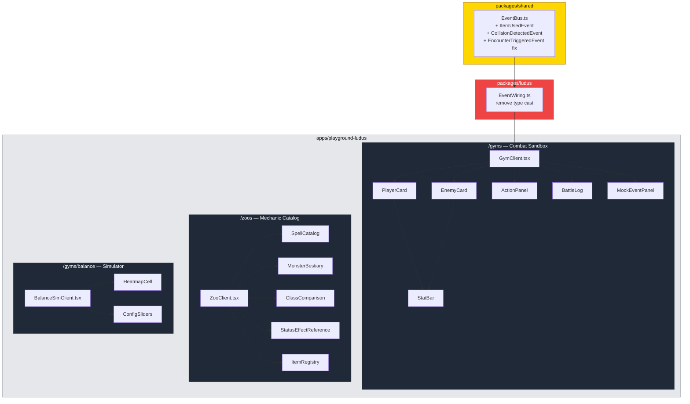

# PR: LUDUS Playground Sandbox — Combat, Catalog, and Balance Simulator

## Coat of Arms

```
+--------------------------------------------------------------+
|   feat/ludus-playground-sandbox                              |
+--------------------------------------------------------------+
|                        *** MAJOR                             |
|                                                              |
|          WARN  [PER-CHEVRON]  skip                           |
|                 mullet x 3                                   |
|            cross x 1  bend x 1  hammer x 1                  |
|                                                              |
|              [shared] [ludus] [app]                          |
|                                                              |
|           files: 23 | +1663 / -13                            |
+--------------------------------------------------------------+
|   "Per aspera ad astra"                                      |
+--------------------------------------------------------------+
```

**Compact:** *** [shared][ludus][app] mullet x3 WARN/skip/pass/skip +1663/-13

---

## Summary

Transforms the LUDUS headless game engine into an interactive, testable playground by building three new surfaces: a turn-by-turn Combat Sandbox (/gyms), a Mechanic Catalog (/zoos) browsing all game data, and a Monte Carlo Balance Simulator (/gyms/balance) with heatmap visualization. Also fixes three type mismatches in the shared event contract that would block type-safe cross-pillar wiring.

## Features

| Feature | Description | Status |
|---------|-------------|--------|
| Shared contract fixes | Correct `EncounterTriggeredEvent.type` union, add `ItemUsedEvent` and `CollisionDetectedEvent` payload types | Complete |
| EventWiring cleanup | Remove `as` type cast in LUDUS EventWiring now that shared contract is correct, use `ItemUsedEvent` type | Complete |
| Webpack extension resolution | Configure `.js` to `.ts`/`.tsx` extension alias so workspace package imports resolve correctly | Complete |
| Combat Sandbox (/gyms) | Interactive turn-by-turn combat: class/level/enemy selection, seeded RNG, full battle loop with attack/defend/spell actions, victory/defeat overlay, deterministic replay | Complete |
| Player & Enemy cards | Live HP/MP stat bars, ATK/DEF/SPD readout, status effect badges with color-coded types | Complete |
| Action panel | Dynamic buttons from `getAvailableActions()` with mana cost, cooldown, and tooltip descriptions | Complete |
| Battle log | Scrollable log of `ActionLogEntry[]` with auto-scroll and color-coded actor attribution | Complete |
| Mock event panel | Collapsible EventBus emitter (NODE_CLICKED, PLAYER_MOVED) with live subscription log for all GameEvents | Complete |
| Mechanic Catalog (/zoos) | Tabbed catalog: Spells, Monsters, Classes, Effects, Items | Complete |
| Spell catalog | Filterable table of all spells with element and effect type dropdowns | Complete |
| Monster bestiary | 4x5 grid (4 bug types x 5 severities) with deterministic seed-42 generation | Complete |
| Class comparison | Three-column stat tables at levels 1/5/10/15/20/25/30 with spell unlock schedules | Complete |
| Status effect reference | Descriptive cards for 8 effect types with mechanics and stackability info | Complete |
| Item registry | Card grid from `getAllItems()` with effect type, value, and duration | Complete |
| Balance Simulator (/gyms/balance) | Monte Carlo matchup analysis: 3 classes x 4 bug types heatmap, configurable trials/level/severity | Complete |
| Config sliders | 9 tunable `BalanceConfig` parameters (damage, combat, monster sections) with live preview | Complete |
| Heatmap visualization | Color-coded win-rate cells: green (balanced), yellow (caution), orange (favored), red (unbalanced) | Complete |
| CSV/JSON export | Download simulation results as CSV or full report as JSON via Blob URLs | Complete |

## Architecture



## Files Changed

```
packages/shared/
  src/events/EventBus.ts                            — Fix EncounterTriggeredEvent type union; add ItemUsedEvent, CollisionDetectedEvent

packages/ludus/
  src/integration/EventWiring.ts                    — Remove 'as' cast; import and use ItemUsedEvent type

apps/playground-ludus/
  package.json                                      — Switch dev script to --webpack mode
  next.config.js                                    — Add webpack extensionAlias for .js→.ts resolution
  app/gyms/
    page.tsx                                        — Replace stub with server wrapper importing GymClient
    GymClient.tsx                                   — Combat sandbox orchestrator: setup + battle loop + event emission
    components/
      StatBar.tsx                                   — Reusable HP/MP bar with fill percentage and color
      PlayerCard.tsx                                — Character display: name, class, level, HP/MP, stats, effects
      EnemyCard.tsx                                 — Monster display: name, type, element badge, severity, HP, stats
      ActionPanel.tsx                               — Action buttons from getAvailableActions() with spell tooltips
      BattleLog.tsx                                 — Scrollable ActionLogEntry[] with auto-scroll and actor colors
      MockEventPanel.tsx                            — EventBus emitter buttons + live subscription log
    balance/
      page.tsx                                      — Server component for /gyms/balance sub-route
      BalanceSimClient.tsx                          — Monte Carlo simulation UI with heatmap and config controls
      components/
        HeatmapCell.tsx                             — Color-coded matchup result cell (green/yellow/orange/red)
        ConfigSliders.tsx                           — 9 BalanceConfig sliders grouped by section
  app/zoos/
    page.tsx                                        — Replace stub with server wrapper importing ZooClient
    ZooClient.tsx                                   — Tab navigation across 5 catalog sections
    components/
      SpellCatalog.tsx                              — Filterable spell table with element/effect dropdowns
      MonsterBestiary.tsx                           — 4x5 bug-type x severity grid with seed-42 determinism
      ClassComparison.tsx                           — Three-column stat curves at 7 level breakpoints
      StatusEffectReference.tsx                     — 8 effect type cards with mechanics descriptions
      ItemRegistry.tsx                              — Consumable card grid from getAllItems()
```

## Commits

1. `b051e51` fix(shared): correct EncounterTriggeredEvent type union and add missing event payload types
2. `1428a54` refactor(ludus): remove type cast in EventWiring now that shared contract is correct
3. `6e0de8f` build(playground-ludus): configure webpack extensionAlias for .js→.ts resolution
4. `f033ff1` feat(playground-ludus): implement combat sandbox at /gyms
5. `244ac66` feat(playground-ludus): implement mechanic catalog at /zoos
6. `c023fef` feat(playground-ludus): implement balance simulator at /gyms/balance

## Test Plan

- [x] `bun test` in `packages/ludus/` — 204 tests pass, 0 failures, 4372 expect() calls
- [x] TypeScript compilation of `packages/ludus/` — pre-existing warnings only (QuestSystem, SpellFactory), no regressions from this PR
- [x] All three playground pages return HTTP 200 on `:3013` (`/gyms`, `/zoos`, `/gyms/balance`)
- [ ] `/gyms`: Select Tank class, level 5, null-pointer severity 2 — Start Battle — verify HP/MP bars render
- [ ] `/gyms`: Attack 3 times — verify log shows damage dealt + enemy counterattack
- [ ] `/gyms`: Cast "Mutex Lock" — verify mana decreases, shield status effect appears on player card
- [ ] `/gyms`: Win battle — verify VICTORY overlay with "New Battle" and "Rematch" buttons
- [ ] `/gyms`: Rematch with same seed — verify identical battle log (deterministic replay)
- [ ] `/gyms`: Open MockEventPanel — emit NODE_CLICKED — verify event appears in subscription log
- [ ] `/zoos`: Spells tab — 36+ spells visible, filter by element "fire" reduces list
- [ ] `/zoos`: Monsters tab — 20 cards in 4x5 grid, severity 5 monsters have higher stats than severity 1
- [ ] `/zoos`: Classes tab — Tank HP > Healer HP > DPS HP at every level breakpoint
- [ ] `/zoos`: Effects tab — 8 effect types with mechanics descriptions
- [ ] `/zoos`: Items tab — 10 consumable cards with name, description, effect
- [ ] `/gyms/balance`: Run default simulation (level 5, severity 2, 100 trials) — 12-cell heatmap renders
- [ ] `/gyms/balance`: Switch to EASY preset — win rates increase across the board
- [ ] `/gyms/balance`: Export CSV — file downloads with correct headers
- [ ] `/gyms/balance`: Adjust config sliders — values update in real time, re-run reflects changes
