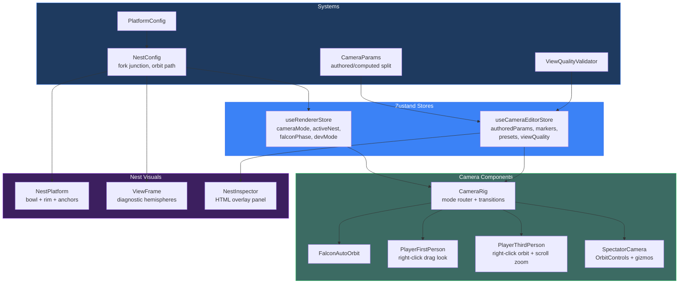

# PR: Nest System, Camera Overhaul & View Frame

## Coat of Arms

```
+--------------------------------------------------------------+
|   feat/nest-system-viewframe                                 |
+--------------------------------------------------------------+
|                      ** MODERATE **                           |
|                                                              |
|          skip  [Azure | Tenne]  WARN                         |
|                   mullet x 8                                 |
|                                                              |
|                [architectus, docs]                           |
|                                                              |
|           files: 23 | +5723 / -159                          |
+--------------------------------------------------------------+
|   "Innovation through iteration"                             |
+--------------------------------------------------------------+
```

**Compact:** ** [architectus, docs] mullet x8 skip/WARN/pass/skip +5723/-159

---

## Summary

Introduces the nest localization system, a complete camera mode overhaul (falcon / player-1p / player-3p / spectator), and replaces pointer-lock mouse controls with WoW/Google Earth-style right-click drag. Adds a camera parameter taxonomy with inspector-editable design params, store-driven FOV, and nest-centered transitions.

## Features

| Feature | Description | Status |
|---------|-------------|--------|
| NestConfig system | Topology-derived nest localization at first fork junction; falcon orbit path, bowl profile, branch anchors | Complete |
| Camera mode split | `player` → `player-1p` + `player-3p` + `spectator`; keyboard shortcuts (C, Tab, Shift-V) | Complete |
| Right-click drag controls | Replaces pointer lock in both player modes; eliminates SecurityError race condition | Complete |
| Scroll zoom (3P) | Mouse wheel adjusts chase distance within `[minDistance, maxDistance]` | Complete |
| Camera parameter taxonomy | Authored/computed param split; `Player1pAuthoredParams`, expanded `Player3pAuthoredParams` | Complete |
| Camera editor store | Marker editing, snapshots, presets, view quality, `setFov`, `setNestVerticalOffset` | Complete |
| Store-driven FOV | `StoreCamera` component; `computeInitialFov(treeSpan)` on first load | Complete |
| FalconAutoOrbit | Elliptical orbit with orbit→approach→arrived phases, guide-pull, WASD nudge | Complete |
| PlayerThirdPerson | Chase camera with spherical orbit, branch-walking + platform physics | Complete |
| SpectatorCamera | Free OrbitControls with camera marker gizmo editing | Complete |
| NestPlatform | Concave bowl geometry with rim glow, mid-ring, inner glow, branch anchor nodules | Complete |
| ViewFrame | Diagnostic hemispheres for view-near/view-far radii | Complete |
| NestInspector | HTML overlay panel: measurements, params, markers, presets, copy/paste, view quality | Complete |
| Nest-centered transitions | Player mode transitions land at nest center + vertical offset | Complete |
| chaseLag jitter fix | Default increased 0.05 → 0.1 for smoother 3P convergence | Complete |
| ViewQualityValidator | Runtime camera view quality scoring in player modes | Complete |

## Architecture



## Files Changed

```
packages/architectus/
├── __tests__/
│   ├── nest-config.test.ts          (new) NestConfig + falcon orbit tests
│   └── renderer-store.test.ts       (mod) Update for split camera modes
├── src/
│   ├── App.tsx                      (mod) StoreCamera replaces hardcoded FOV
│   ├── index.ts                     (mod) Export all new types/components
│   ├── components/
│   │   ├── CameraRig.tsx            (mod) Mode routing, right-click drag, transitions
│   │   ├── DendriteWorld.tsx         (mod) Wire NestPlatform, ViewFrame, NestInspector
│   │   ├── FalconAutoOrbit.tsx      (new) Elliptical orbit camera
│   │   ├── NestInspector.tsx        (new) HTML overlay diagnostics panel
│   │   ├── NestPlatform.tsx         (new) Bowl geometry at fork junctions
│   │   ├── PlayerThirdPerson.tsx    (new) Chase camera with orbit/zoom
│   │   ├── SegmentedWorld.tsx       (mod) Wire NestPlatform, ViewFrame, NestInspector
│   │   ├── SpectatorCamera.tsx      (new) Free camera + marker gizmos
│   │   └── ViewFrame.tsx            (new) Diagnostic hemispheres
│   ├── dendrite/
│   │   └── actions.ts               (mod) Camera cycle + nest actions
│   ├── store/
│   │   ├── useCameraEditorStore.ts  (new) Camera param editing store
│   │   └── useRendererStore.ts      (mod) Nest/dev/inspection/falcon state
│   └── systems/
│       ├── CameraParams.ts          (new) Authored/computed param taxonomy
│       ├── NestConfig.ts            (new) Nest localization + falcon orbits
│       ├── PlatformConfig.ts        (mod) Re-export NestConfig types
│       └── ViewQualityValidator.ts  (new) Camera view quality scoring
docs/research/
├── CAMERA_CONTROL_RESEARCH.md       (new) Camera control UX research
└── CAMERA_POLICY.md                 (new) Camera design policy
```

## Commits

1. `8957240` feat(architectus): add RootPlatform spawn platform component
2. `1d446cd` feat(architectus): add platform spawn state to renderer store
3. `4757325` feat(architectus): integrate RootPlatform into scene graphs
4. `2bacf41` feat(architectus): add platform-aware camera behavior
5. `3a7f8c5` chore(architectus): remove gridHelper, export RootPlatform
6. `5a8238b` feat(architectus): add topology-derived PlatformConfig system
7. `e4787a3` refactor(architectus): replace rootSpawnPoint with PlatformConfig in store
8. `4bc3fd4` refactor(architectus): make RootPlatform topology-driven via PlatformConfig
9. `aead35a` feat(architectus): compute and publish PlatformConfig from topology
10. `be7a945` refactor(architectus): derive all camera and physics values from topology
11. `db5d43d` chore(architectus): export PlatformConfig types and factory functions
12. `b0df66a` feat(architectus): add NestConfig system and expand renderer store
13. `bcd753c` feat(architectus): add camera parameter taxonomy and editor store
14. `afdbad0` feat(architectus): add camera mode components and nest visuals
15. `195dacb` refactor(architectus): overhaul CameraRig with right-click drag and mode routing
16. `c460c06` feat(architectus): integrate nest system and store-driven FOV into scene graphs

## Test Plan

- [x] `bun test --filter architectus` — 126 tests pass, 0 failures
- [x] No `SecurityError` from pointer lock on any mode transition
- [ ] Falcon mode: auto-orbit, WASD nudge, scroll zoom
- [ ] Player 1P: right-click drag to look, WASD to move, left-click free
- [ ] Player 3P: right-click drag to orbit, scroll to zoom, no jitter
- [ ] Spectator: OrbitControls, marker gizmos functional
- [ ] C key cycles falcon → 1P → 3P; Tab toggles 1P ↔ 3P
- [ ] FOV adjustable via inspector (I key), camera responds immediately
- [ ] Nest offset adjustable, mesh and camera target shift vertically
- [ ] Transition from falcon lands at nest center
- [ ] Initial FOV adapts to tree scale on first load
