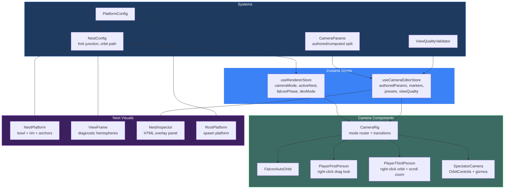

# PR: Nest System, Unified Playground & Developer Tooling

## Coat of Arms (Unified)

```
+--------------------------------------------------------------+
|   feat/nest-system-viewframe                                 |
+--------------------------------------------------------------+
|                      *** MAJOR ***                           |
|                                                              |
|     +------------------+   +------------------+              |
|     | I Nest System    |   | II Playground    |              |
|     | mullet x10       |   | mullet x3        |              |
|     | [architectus]    |   | [app, ui, oculus] |              |
|     +------------------+   +------------------+              |
|     +------------------+   +------------------+              |
|     | III Dev Tooling  |   | IV Cross-Cutting |              |
|     | mullet x2        |   | cross x1         |              |
|     | [operatus, infra]|   | [imaginarium]    |              |
|     +------------------+   +------------------+              |
|                                                              |
|          skip  [Azure | Argent | Sable | Purpure]  skip     |
|                   mullet x 17                                |
|                                                              |
|           files: 267 | +28821 / -722                        |
+--------------------------------------------------------------+
|   "Per aspera ad astra"                                      |
+--------------------------------------------------------------+
```

**Compact:** *** [architectus, app, ui, oculus, operatus, infra, imaginarium, docs] mullet x17 skip/skip/skip/skip +28821/-722

---

## Feature Space Index

| Index | Short Name | Full Name | Domain | Commits |
|-------|------------|-----------|--------|---------|
| I | Nest System | Nest System, Camera Overhaul & ViewFrame | architectus | 18 |
| II | Playground | Unified Playground App & UI Platform | app, ui, oculus | 7 |
| III | Dev Tooling | Developer Tooling & Worktree Lifecycle | operatus, infra | 6 |
| IV | Cross-Cutting | Hash Fix & Documentation | imaginarium, docs | 3 |

## Cross-Space Dependencies

| From | To | Dependency Type |
|------|----|-----------------|
| II Playground | I Nest System | Playground hosts architectus 3D scenes |
| III Dev Tooling | II Playground | Workspace launcher registers playground dev command |
| III Dev Tooling | I Nest System | Worktree lifecycle enables branch-isolated architectus development |

---

## I. Nest System, Camera Overhaul & ViewFrame

### Coat of Arms (Space I)

```
+--------------------------------------------------------------+
|   I — Nest System                                            |
+--------------------------------------------------------------+
|                      *** MAJOR ***                           |
|                                                              |
|          skip  [Azure]  skip                                 |
|                   mullet x 10                                |
|                                                              |
|                [architectus]                                 |
|                                                              |
|           files: 22 | +5151 / -160                          |
+--------------------------------------------------------------+
|   "Per aspera ad astra"                                      |
+--------------------------------------------------------------+
```

### Summary

Introduces the nest localization system, a complete camera mode overhaul (falcon / player-1p / player-3p / spectator), and replaces pointer-lock mouse controls with WoW/Google Earth-style right-click drag. Adds a camera parameter taxonomy with inspector-editable design params, store-driven FOV, and nest-centered transitions. Fixes NaN in bounding sphere computation for zero-length branches.

### Features

| Feature | Description | Status |
|---------|-------------|--------|
| PlatformConfig system | Topology-derived platform configuration at root spawn; replaces hardcoded spawn points with computed values | Complete |
| RootPlatform component | Spawn platform with topology-driven positioning, grid removal, physics-aware camera | Complete |
| NestConfig system | Topology-derived nest localization at first fork junction; falcon orbit path, bowl profile, branch anchors | Complete |
| Camera mode split | `player` → `player-1p` + `player-3p` + `spectator`; keyboard shortcuts (C, Tab, Shift-V) | Complete |
| Right-click drag controls | Replaces pointer lock in both player modes; eliminates SecurityError race condition | Complete |
| Scroll zoom (3P) | Mouse wheel adjusts chase distance within `[minDistance, maxDistance]` | Complete |
| Camera parameter taxonomy | Authored/computed param split; `Player1pAuthoredParams`, expanded `Player3pAuthoredParams` | Complete |
| Camera editor store | Marker editing, snapshots, presets, view quality, `setFov`, `setNestVerticalOffset` | Complete |
| Store-driven FOV | `StoreCamera` component; `computeInitialFov(treeSpan)` on first load | Complete |
| FalconAutoOrbit | Elliptical orbit with orbit→approach→arrived phases, guide-pull, WASD nudge | Complete |
| PlayerThirdPerson | Chase camera with spherical orbit, branch-walking + platform physics | Complete |
| SpectatorCamera | Free OrbitControls with camera marker gizmo editing | Complete |
| NestPlatform | Concave bowl geometry with rim glow, mid-ring, inner glow, branch anchor nodules | Complete |
| ViewFrame | Diagnostic hemispheres for view-near/view-far radii | Complete |
| NestInspector | HTML overlay panel: measurements, params, markers, presets, copy/paste, view quality | Complete |
| Nest-centered transitions | Player mode transitions land at nest center + vertical offset | Complete |
| chaseLag jitter fix | Default increased 0.05 → 0.1 for smoother 3P convergence | Complete |
| ViewQualityValidator | Runtime camera view quality scoring in player modes | Complete |
| BoundingSphere NaN fix | Prevent NaN in `computeBoundingSphere` for zero-length branches | Complete |

### Architecture



---

## II. Unified Playground App & UI Platform

### Coat of Arms (Space II)

```
+--------------------------------------------------------------+
|   II — Unified Playground                                    |
+--------------------------------------------------------------+
|                      *** MAJOR ***                           |
|                                                              |
|          skip  [Argent | Vert]  skip                         |
|                   mullet x 3                                 |
|                                                              |
|                [app, ui, oculus]                              |
|                                                              |
|           files: 224 | +17739 / -183                        |
+--------------------------------------------------------------+
|   "Per aspera ad astra"                                      |
+--------------------------------------------------------------+
```

### Summary

Introduces the unified six-pillar playground app with dynamic `[pillar]/[domain]` routing, pillar-aware domain sub-page registry, and collapsible sidebar navigation. Replaces static domain index cards with layout-driven sub-nav flow. Adds `'use client'` directives across all interactive OCULUS modules for Next.js App Router compatibility.

### Features

| Feature | Description | Status |
|---------|-------------|--------|
| Unified playground app | `apps/playground/` with dynamic `[pillar]/[domain]` routing across all six pillars | Complete |
| Pillar/domain sub-pages | Per-domain pages: analyze, topology, combat, gallery, l-systems, bestiary, frames, etc. | Complete |
| Zoo-kit scaffold | Reusable zoo exhibit shell: `ZooShell`, `ZooExhibitCard`, `ZooFilterBar`, `ZooInspector`, `PropPlayground` | Complete |
| Museum-kit scaffold | Reusable museum shell: `MuseumShell`, `MuseumExhibitRow`, `MuseumFilterBar`, `MuseumDetailPanel` | Complete |
| Gym-kit scaffold | Reusable gym shell: `GymShell`, `GymProvider`, `GymViewport`, `GymControlPanel`, `GymStateDash`, `GymWiretap` | Complete |
| Collapsible sidebar | `CollapsibleSidebar` with `SidebarProvider` context, keyboard toggle | Complete |
| Domain sub-nav | `DomainSubNav` component with pillar-aware page registry | Complete |
| Domain registry | `DomainRegistry` mapping pillar → domain → sub-pages with metadata | Complete |
| Pillar context | `PillarContext` provider with pillar data lookups | Complete |
| Client component markers | `'use client'` directive on all interactive OCULUS modules (25 files) | Complete |
| Playground-oculus sub-nav | Layout-driven sub-nav replaces domain index card grids | Complete |
| Workspace registration | `bun run dev` includes playground in turbo dev orchestration | Complete |

---

## III. Developer Tooling & Worktree Lifecycle

### Coat of Arms (Space III)

```
+--------------------------------------------------------------+
|   III — Dev Tooling                                          |
+--------------------------------------------------------------+
|                      ** MODERATE **                           |
|                                                              |
|          skip  [Sable | Gules]  skip                         |
|                   mullet x 2                                 |
|                                                              |
|                [operatus, infra]                              |
|                                                              |
|           files: 10 | +4500 / -46                           |
+--------------------------------------------------------------+
|   "Arx inconcussa"                                           |
+--------------------------------------------------------------+
```

### Summary

Adds the worktree lifecycle system for OPERATUS-canonical topology, generates full 256-color iTerm2 profiles via CIELAB perceptual interpolation, hardens Castle Walls hook installation, and improves workspace launcher ergonomics (Brave tab refresh, 2-pane iTerm layout, font size automation).

### Features

| Feature | Description | Status |
|---------|-------------|--------|
| iTerm2 256-color profiles | `generate-iterm-256.py` generates pillar profiles via CIELAB perceptual interpolation with full 256-color ANSI mapping | Complete |
| Worktree lifecycle system | `wt-lifecycle.sh` with `wt:new`, `wt:release`, `wt:status`, `wt:list` commands; OPERATUS-canonical branching | Complete |
| Canonical worktree setup | `setup-canonical-worktrees.sh` bootstraps the full six-pillar topology with symlinks and worktrees | Complete |
| Castle Walls hook installer | `install-castle-walls-hooks.sh` enforces hook installation and hardens lifecycle scripts | Complete |
| Brave tab refresh | Launcher refreshes existing tabs instead of opening duplicates | Complete |
| iTerm 2-pane layout | Simplified from multi-pane to 2-pane (pillar root + dendrovia) with Cmd+- font size automation | Complete |
| Launcher pane targeting | Top pane points at pillar checkout root, bottom pane at dendrovia | Complete |

---

## IV. Cross-Cutting Fixes & Documentation

### Coat of Arms (Space IV)

```
+--------------------------------------------------------------+
|   IV — Cross-Cutting                                         |
+--------------------------------------------------------------+
|                      * MINOR *                               |
|                                                              |
|          skip  [Purpure | Tenne]  skip                       |
|                   cross x 1                                  |
|                                                              |
|                [imaginarium, docs]                            |
|                                                              |
|           files: 11 | +1431 / -333                          |
+--------------------------------------------------------------+
|   "Correctio fundamentum"                                    |
+--------------------------------------------------------------+
```

### Summary

Extends FNV-1a hash output from 16 to 24 hex characters for sufficient placement entropy in segment-based worlds. Adds symbolic checkout conventions, worktree canonicalization analysis, agent parity roadmap, and camera design research documents.

### Features

| Feature | Description | Status |
|---------|-------------|--------|
| FNV-1a hash extension | 24 hex chars (was 16) for placement entropy across large segment counts | Complete |
| Symbolic checkout conventions | `SYMBOLIC_CHECKOUT_CONVENTIONS.md` documenting the six-pillar worktree topology | Complete |
| Worktree canonicalization | Analysis document for OPERATUS-canonical worktree strategy | Complete |
| Camera design research | `CAMERA_CONTROL_RESEARCH.md` and `CAMERA_POLICY.md` documenting UX research and design decisions | Complete |
| Agent parity roadmap | `AGENT_PARITY_ROADMAP.md` tracking pillar agent convergence | Complete |

---

## Files Changed (All Spaces)

```
packages/architectus/                        (Space I — 22 files, +5151/-160)
├── __tests__/
│   ├── nest-config.test.ts                  (new) NestConfig + falcon orbit tests
│   └── renderer-store.test.ts               (mod) Update for split camera modes
├── src/
│   ├── App.tsx                              (mod) StoreCamera replaces hardcoded FOV
│   ├── index.ts                             (mod) Export all new types/components
│   ├── components/
│   │   ├── BranchInstances.tsx              (mod) Bounding sphere NaN guard
│   │   ├── CameraRig.tsx                    (mod) Mode routing, right-click drag, transitions
│   │   ├── DendriteWorld.tsx                (mod) Wire NestPlatform, ViewFrame, NestInspector
│   │   ├── FalconAutoOrbit.tsx              (new) Elliptical orbit camera
│   │   ├── NestInspector.tsx                (new) HTML overlay diagnostics panel
│   │   ├── NestPlatform.tsx                 (new) Bowl geometry at fork junctions
│   │   ├── PlayerThirdPerson.tsx            (new) Chase camera with orbit/zoom
│   │   ├── RootPlatform.tsx                 (new) Topology-driven spawn platform
│   │   ├── SegmentedWorld.tsx               (mod) Wire NestPlatform, ViewFrame, NestInspector
│   │   ├── SpectatorCamera.tsx              (new) Free camera + marker gizmos
│   │   └── ViewFrame.tsx                    (new) Diagnostic hemispheres
│   ├── dendrite/
│   │   └── actions.ts                       (mod) Camera cycle + nest actions
│   ├── store/
│   │   ├── useCameraEditorStore.ts          (new) Camera param editing store
│   │   └── useRendererStore.ts              (mod) Nest/dev/inspection/falcon state
│   └── systems/
│       ├── CameraParams.ts                  (new) Authored/computed param taxonomy
│       ├── NestConfig.ts                    (new) Nest localization + falcon orbits
│       ├── PlatformConfig.ts                (mod) Re-export NestConfig types
│       └── ViewQualityValidator.ts          (new) Camera view quality scoring

apps/playground/                             (Space II — 180+ files, new app)
├── app/
│   ├── layout.tsx, page.tsx, globals.css    (new) Root layout + pillar grid landing
│   ├── global-error.tsx                     (new) Error boundary
│   ├── [pillar]/
│   │   ├── layout.tsx, page.tsx             (new) Pillar layout + domain grid
│   │   └── [domain]/
│   │       ├── layout.tsx, page.tsx         (new) Domain layout + sub-page nav
│   │       ├── _zoo-kit/                    (new) Reusable zoo exhibit scaffold (8 files)
│   │       ├── _museum-kit/                 (new) Reusable museum exhibit scaffold (7 files)
│   │       ├── _gym-kit/                    (new) Reusable gym sandbox scaffold (9 files)
│   │       ├── analyze/                     (new) CHRONOS analysis drilldown
│   │       ├── topology/                    (new) ARCHITECTUS topology showcase
│   │       ├── combat/                      (new) LUDUS combat gym
│   │       ├── gallery/                     (new) IMAGINARIUM museum
│   │       ├── frames/                      (new) OCULUS frame zoo
│   │       ├── primitives/                  (new) OCULUS primitives zoo
│   │       └── ... (30+ domain sub-pages)
│   ├── _providers/                          (new) Mock data, bridges, providers
│   ├── api/                                 (new) Analyze, recon, registry, results routes
│   └── fonts/                               (new) Geist font assets
├── lib/                                     (new) Chronos loader, shims
├── next.config.js                           (new) Next.js config with webpack shims
├── package.json                             (new) Workspace package
└── tsconfig.json                            (new) TypeScript config

apps/playground-oculus/                      (Space II — 12 files, mod)
├── app/
│   ├── foundry/layout.tsx, page.tsx         (mod) Sub-nav layout
│   ├── gyms/layout.tsx, page.tsx            (mod) Sub-nav layout
│   ├── museums/layout.tsx, page.tsx         (mod) Sub-nav layout
│   └── zoos/layout.tsx, page.tsx            (mod) Sub-nav layout

packages/ui/                                 (Space II — 7 files)
├── src/
│   ├── collapsible-sidebar.tsx              (new) Collapsible sidebar component
│   ├── domain-nav.tsx                       (mod) Updated navigation
│   ├── domain-registry.tsx                  (new) Pillar→domain→sub-page registry
│   ├── domain-sub-nav.tsx                   (new) Domain sub-navigation
│   ├── pillar-context.tsx                   (new) Pillar context provider
│   ├── pillar-data.tsx                      (new) Pillar metadata
│   ├── pillar-nav.tsx                       (mod) Updated navigation
│   ├── playground-layout.tsx                (new) Unified playground layout
│   └── sidebar-provider.tsx                 (new) Sidebar state context

packages/oculus/                             (Space II — 25 files, mod)
└── src/**/*.tsx, src/**/*.ts                (mod) 'use client' directives on all interactive modules

packages/imaginarium/                        (Space IV — 1 file)
└── src/utils/hash.ts                        (mod) FNV-1a extended to 24 hex chars

scripts/                                     (Space III — 10 files)
├── install-castle-walls-hooks.sh            (new) Hook installation script
├── setup-canonical-worktrees.sh             (new) Six-pillar worktree bootstrap
├── wt-lifecycle.sh                          (new) Worktree lifecycle commands
└── workspace-launcher/
    ├── Dendrovia.plist                      (mod) Updated iTerm2 plist with 256-color profiles
    ├── brave-launcher.ts                    (mod) Tab refresh instead of duplicate open
    ├── generate-iterm-256.py                (new) CIELAB 256-color profile generator
    ├── iterm-launcher.ts                    (mod) 2-pane layout, font size automation
    └── pillar-registry.ts                   (mod) Updated registry

docs/                                        (Space IV — 8 files)
├── AGENT_PARITY_ROADMAP.md                  (new) Pillar agent convergence tracking
├── SYMBOLIC_CHECKOUT_CONVENTIONS.md         (new) Six-pillar worktree topology
├── TURBO_DEV_ORCHESTRATION.md               (mod) Updated dev orchestration
├── WORKTREE_CONTEXT_CANONICALIZATION_ANALYSIS.md (new) Canonical worktree analysis
├── pr-descriptions/
│   ├── PR_DESCRIPTION_NEST_SYSTEM_VIEWFRAME.md   (mod) This file
│   └── PR_DESCRIPTION_WORKTREE_CONTEXT_CANONICALIZATION.md (new)
└── research/
    ├── CAMERA_CONTROL_RESEARCH.md           (new) Camera UX research
    └── CAMERA_POLICY.md                     (new) Camera design policy

Root files                                   (3 files)
├── WORKFLOW.md                              (mod) Updated workflow documentation
├── bun.lock                                 (mod) Dependency changes
└── package.json                             (mod) Workspace script additions
```

## Commits (All Spaces)

1. `8ab19df` feat(ui): add unified playground context and collapsible sidebar layout
2. `173cfe7` feat(ui): add pillar-aware domain sub-page registry and sub-nav
3. `ed2531f` refactor(playground-oculus): replace domain index cards with layout sub-nav flow
4. `2c4824b` chore(oculus): mark interactive modules as client components
5. `0ce2355` feat(playground): add unified six-pillar app with dynamic pillar/domain routing
6. `749034d` chore(workspace): register unified playground workspace and dev command
7. `7109db9` docs(workflow): add worktree context canonicalization analysis
8. `f44e3be` docs(pr): add PR description for worktree context canonicalization
9. `f5f093f` Merge pull request #88 from pastarita/docs/worktree-context-canonicalization
10. `5dd0e71` feat(architectus): add RootPlatform spawn platform component
11. `4dfe8a1` feat(architectus): add platform spawn state to renderer store
12. `04e9ed9` feat(architectus): integrate RootPlatform into scene graphs
13. `134db23` feat(architectus): add platform-aware camera behavior
14. `995e567` chore(architectus): remove gridHelper, export RootPlatform
15. `e2ffae8` feat(architectus): add topology-derived PlatformConfig system
16. `24bfe2f` refactor(architectus): replace rootSpawnPoint with PlatformConfig in store
17. `2a88122` refactor(architectus): make RootPlatform topology-driven via PlatformConfig
18. `360319b` feat(architectus): compute and publish PlatformConfig from topology
19. `65650e5` refactor(architectus): derive all camera and physics values from topology
20. `a8a3a1e` chore(architectus): export PlatformConfig types and factory functions
21. `18dea61` feat(architectus): add NestConfig system and expand renderer store
22. `d1c2461` feat(architectus): add camera parameter taxonomy and editor store
23. `e16fe62` feat(architectus): add camera mode components and nest visuals
24. `6c7b678` refactor(architectus): overhaul CameraRig with right-click drag and mode routing
25. `1b065f0` feat(architectus): integrate nest system and store-driven FOV into scene graphs
26. `3f921c6` docs(architectus): add PR description for nest-system-viewframe
27. `c9b3bb7` fix(architectus): prevent NaN in computeBoundingSphere for zero-length branches
28. `81a15c2` feat(operatus): generate full 256-color iTerm2 profiles via CIELAB interpolation
29. `7242a82` fix(operatus): point launcher top pane at pillar checkout root, adjust split ratio
30. `0ac79c9` fix(operatus): simplify top pane, fix bottom pane font size via Cmd+- keystrokes
31. `4e02000` feat(operatus): add worktree lifecycle system with OPERATUS-canonical topology
32. `a8aae83` feat(operatus): refresh existing Brave tabs, simplify iTerm to 2-pane layout
33. `9fc411f` fix(imaginarium): extend FNV-1a hash to 24 hex chars for placement entropy
34. `8bae04d` feat(infra): enforce Castle Walls hooks and harden worktree lifecycle

## Test Plan

- [x] `bun test --filter architectus` — 126 tests pass, 0 failures
- [x] No `SecurityError` from pointer lock on any mode transition
- [ ] Falcon mode: auto-orbit, WASD nudge, scroll zoom
- [ ] Player 1P: right-click drag to look, WASD to move, left-click free
- [ ] Player 3P: right-click drag to orbit, scroll to zoom, no jitter
- [ ] Spectator: OrbitControls, marker gizmos functional
- [ ] C key cycles falcon → 1P → 3P; Tab toggles 1P ↔ 3P
- [ ] FOV adjustable via inspector (I key), camera responds immediately
- [ ] Nest offset adjustable, mesh and camera target shift vertically
- [ ] Transition from falcon lands at nest center
- [ ] Initial FOV adapts to tree scale on first load
- [ ] Unified playground loads at `/` with pillar grid
- [ ] Dynamic `[pillar]/[domain]` routing resolves all registered sub-pages
- [ ] Collapsible sidebar toggles, domain sub-nav renders per-domain links
- [ ] Zoo-kit, museum-kit, gym-kit scaffolds render exhibit shells
- [ ] `'use client'` directives present on all interactive OCULUS modules
- [ ] `bun run dev` includes playground in turbo orchestration
- [ ] iTerm2 profiles load with 256-color CIELAB palettes
- [ ] `bun run wt:status` reports all pillar states
- [ ] `bun run wt:new OPERATUS <branch>` switches branch correctly
- [ ] Brave launcher refreshes existing tabs
- [ ] FNV-1a hash produces 24-char hex strings
