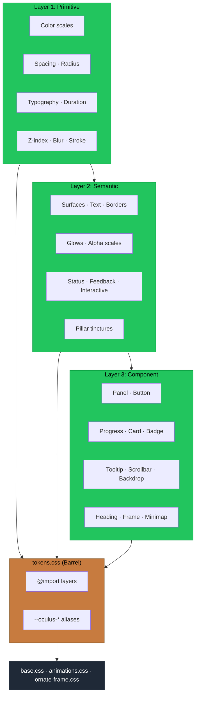

# PR: Layered Token Architecture for OCULUS Design System

## Coat of Arms

```
+--------------------------------------------------------------+
|   feat/oculus-layered-tokens                                 |
+--------------------------------------------------------------+
|                       * MINOR *                              |
|                                                              |
|            skip  [Vert · plain]  WARN                        |
|                   mullet x 3                                 |
|                                                              |
|                    [oculus]                                   |
|                                                              |
|            files: 7 | +598 / -111                            |
+--------------------------------------------------------------+
|   "New horizons"                                             |
+--------------------------------------------------------------+
```

**Compact:** * [oculus] mullet×3 bend×2 skip/WARN/pass/pass +598/-111

---

## Summary

Introduces a three-layer token architecture (Primitive → Semantic → Component) to the OCULUS design system, replacing the flat 91-line `:root` block with ~330 structured tokens across three files. All existing `var(--oculus-*)` references are preserved as backwards-compatible aliases, and ~25 hardcoded `rgba()` values in consumer stylesheets are replaced with token references.

## Features

| Feature | Description | Status |
|---------|-------------|--------|
| Primitive token layer | ~160 raw value tokens (`--oc-color-*`, `--oc-space-*`, `--oc-text-*`, `--oc-duration-*`, easing, z-index, blur, glow, motion, stroke) | Complete |
| Semantic token layer | ~90 decision tokens for surfaces, text roles, borders, glows, accent/danger alpha scales, game status, interactive states, focus ring, transitions, pillar tinctures | Complete |
| Component token layer | ~80 component recipes for panel, button (base/primary/danger/CTA), progress bars, card, badge, tooltip, scrollbar, backdrop, code viewer, miller columns, minimap, heading, ornate frame | Complete |
| Barrel rewrite | `tokens.css` imports three layers and provides 50+ `--oculus-*` → `--oc-*` backwards-compat aliases | Complete |
| Consumer migration | base.css, animations.css, ornate-frame.css — ~25 hardcoded rgba/px values replaced with component tokens | Complete |

## Architecture



## Files Changed

```
packages/oculus/src/styles/
├── tokens/
│   ├── primitive.css       NEW — Layer 1: raw values (~160 tokens)
│   ├── semantic.css        NEW — Layer 2: decision tokens (~90 tokens)
│   └── component.css       NEW — Layer 3: component recipes (~80 tokens)
├── tokens.css              REWRITE — barrel import + 50+ backwards-compat aliases
├── base.css                UPDATE — button, heading, scrollbar, backdrop → tokens
├── animations.css          UPDATE — slide offsets, scale, pulse glow → tokens
└── ornate-frame.css        UPDATE — variant padding (20/16/12/8px) → --oc-space-*
```

## Commits

1. `d4ddd67` feat(oculus): add primitive token layer with color, spacing, and timing scales
2. `8cd1438` feat(oculus): add semantic token layer with surfaces, text, borders, and pillar tinctures
3. `c33c7bb` feat(oculus): add component token layer with panel, button, and progress recipes
4. `cb731a5` refactor(oculus): rewrite tokens.css as barrel with backwards-compat aliases
5. `6f670db` refactor(oculus): replace ~25 hardcoded values in base/animations/ornate-frame with tokens
6. `1446d85` docs(oculus): add PR description for layered token architecture

## Test Plan

- [x] `bun test packages/oculus` — 54 tests pass, 0 failures
- [x] `bun run --filter @dendrovia/oculus build` — builds cleanly (21.89 kB CSS, 126.44 kB JS)
- [x] Zero hardcoded `rgba()` values remain in consumer CSS files (base.css, animations.css, ornate-frame.css)
- [x] All existing `var(--oculus-*)` references resolve through alias chain to new `--oc-*` tokens
- [ ] Visual verification: run playground-oculus (port 3015) — HUD Sandbox and Primitives Zoo render identically
- [ ] DevTools: inspect any OCULUS panel element → `--oculus-panel-bg` resolves through alias chain to `--oc-surface-raised` → `rgba(10,10,10,0.80)`
