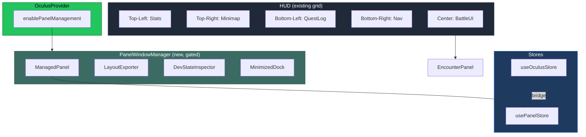

# PR: Add Panel Window Manager and EncounterPanel

## Coat of Arms

```
+--------------------------------------------------------------+
|   feat/oculus-panel-window-manager                           |
+--------------------------------------------------------------+
|                      ** MODERATE **                           |
|                                                              |
|          pass  [Vert]  WARN                                  |
|                   mullet x 1                                 |
|                                                              |
|                [oculus]                                       |
|                                                              |
|           files: 21 | +1897 / -108                           |
+--------------------------------------------------------------+
|   "Innovation through iteration"                             |
+--------------------------------------------------------------+
```

**Compact:** ** [oculus] mullet×1 pass/WARN/pass/pass +1897/-108

---

## Summary

Introduces a draggable, resizable, lockable panel window management system and a composable slot-based EncounterPanel to OCULUS. Panel management is opt-in via `enablePanelManagement: true` in OculusConfig, preserving full backwards compatibility — the HUD renders identically without it. A separate `usePanelStore` manages panel geometry, visibility, z-ordering, and locking, with a bidirectional bridge to `useOculusStore.activePanel`.

## Features

| Feature | Description | Status |
|---------|-------------|--------|
| Panel Store | Zustand store for panel registry, geometry, visibility, z-order, locking — separate from game state | Complete |
| Default Layouts | Factory-default configs for 6 panels with positions, sizes, modes, and exclusivity | Complete |
| ManagedPanel | Draggable, resizable panel wrapper with title bar, close/minimize/lock controls, resize grip | Complete |
| PanelWindowManager | Absolute-positioned container layer for managed panels + minimized dock | Complete |
| MinimizedDock | Bottom-center row of clickable chips to restore minimized panels | Complete |
| EncounterPanel | Slot-based encounter shell supporting combat, dialogue, lore, and puzzle types | Complete |
| BattleUI refactor | BattleUI now delegates rendering to EncounterPanel while preserving its API and event contract | Complete |
| Layout Exporter | Dev panel with panel registry table, Copy JSON, Import, Reset/Lock all | Complete |
| State Inspector | Dev panel showing live Zustand key-value state from both stores | Complete |
| useDragResize | Pointer-event drag/resize hook with rAF throttling and CSS transform positioning | Complete |
| usePanelRegistration | Mount/unmount lifecycle hook for panel store registration | Complete |
| Keyboard shortcuts | `` ` `` (layout exporter), `I` (state inspector), `L` (toggle lock), extended `Esc` | Complete |
| Store bridge | Bidirectional sync between useOculusStore.activePanel and usePanelStore visibility | Complete |
| Opt-in gating | `enablePanelManagement` config flag — false by default, zero behavior change | Complete |

## Architecture



## Files Changed

```
packages/oculus/src/
├── store/
│   ├── panel-types.ts              NEW — Type definitions (PanelConfig, LayoutSnapshot, etc.)
│   ├── usePanelStore.ts            NEW — Zustand store for panel management
│   ├── default-layouts.ts          NEW — Factory-default panel configurations
│   └── useOculusStore.ts           MOD — Bridge logic in setActivePanel/togglePanel/startCombat/endCombat
├── hooks/
│   ├── useDragResize.ts            NEW — Pointer-event drag + resize with rAF throttling
│   ├── usePanelRegistration.ts     NEW — Register/unregister panels on mount/unmount
│   └── useKeyboardShortcuts.ts     MOD — Added `, I, L shortcuts + extended Esc
├── components/
│   ├── ManagedPanel.tsx            NEW — Positioned panel wrapper with title bar and controls
│   ├── PanelWindowManager.tsx      NEW — Absolute-positioned container layer
│   ├── MinimizedDock.tsx           NEW — Minimized panel chips
│   ├── EncounterPanel.tsx          NEW — Slot-based encounter shell
│   ├── BattleUI.tsx                MOD — Refactored to delegate rendering to EncounterPanel
│   ├── HUD.tsx                     MOD — Added PanelWindowManager layer (gated)
│   └── dev/
│       ├── LayoutExporter.tsx      NEW — Panel list + JSON export/import
│       ├── DevStateInspector.tsx   NEW — Live state viewer
│       └── index.ts               NEW — Barrel export
├── styles/
│   ├── managed-panel.css           NEW — Panel chrome + minimized dock CSS
│   └── base.css                    MOD — Added managed-panel.css import
├── __tests__/
│   └── usePanelStore.test.ts       NEW — 70 tests for panel store
├── OculusProvider.tsx              MOD — Added enablePanelManagement config + default registration
└── index.ts                        MOD — Added 20 new exports
```

## Commits

1. `9523e85` feat(oculus): add Panel Window Manager and EncounterPanel

## Test Plan

- [x] Existing `useOculusStore.test.ts` passes unchanged (17 tests)
- [x] New `usePanelStore.test.ts` passes (70 tests) — registration, visibility, geometry, locking, z-order, export/import
- [x] TypeScript typecheck clean (`tsc --noEmit`)
- [x] Vite build succeeds (54 modules → dist/)
- [ ] `apps/playground-oculus` HudSandboxGym renders identically (no `enablePanelManagement`)
- [ ] Set `enablePanelManagement: true` in playground, verify:
  - [ ] `` ` `` opens Layout Exporter
  - [ ] Panels can be dragged, resized, minimized, locked
  - [ ] "Copy Layout JSON" produces valid JSON on clipboard
  - [ ] BattleUI combat flow still emits SPELL_CAST events correctly
  - [ ] `I` opens State Inspector with live state
  - [ ] `L` toggles lock on topmost panel
