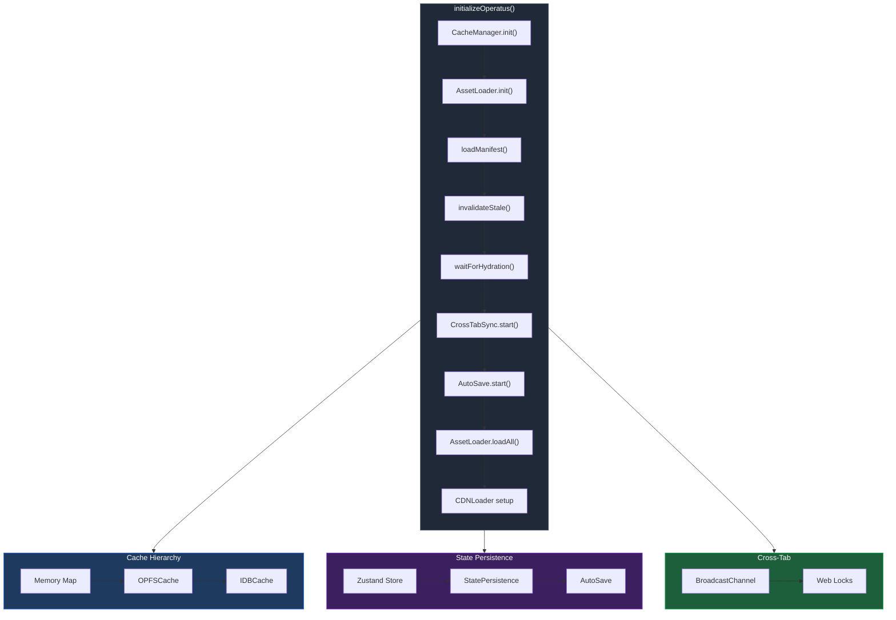
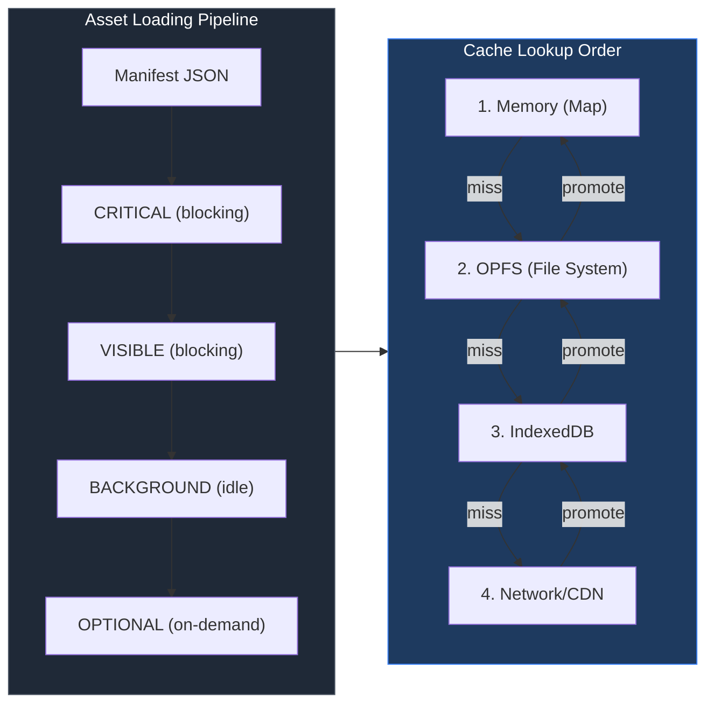

# PR: OPERATUS Infrastructure — Asset Loading, Caching, State Persistence

## Coat of Arms

```
+--------------------------------------------------------------+
|   feat/operatus-infrastructure                                |
+--------------------------------------------------------------+
|                        *** MAJOR ***                         |
|                                                              |
|            skip  [Sable / Argent / Azure]  skip              |
|                     mullet (star) x 5                        |
|                       cross x 1                              |
|                      scales x 1                              |
|                                                              |
|              [operatus | app | architectus]                  |
|                                                              |
|             files: 31 | +4484 / -17                          |
+--------------------------------------------------------------+
|   "Per aspera ad astra"                                      |
+--------------------------------------------------------------+
```

**Compact:** *** [operatus|app|architectus] mullet×5 cross×1 scales×1 skip/skip/pass/skip +4484/-17

---

## Summary

Implements the complete OPERATUS infrastructure pillar for Dendrovia: a tiered browser cache hierarchy (Memory → OPFS → IndexedDB), manifest-driven asset loading with priority scheduling, Zustand-backed state persistence with FNV-1a integrity checks and migration chains, cross-tab synchronization via BroadcastChannel and Web Locks leader election, and foundational multiplayer/CDN/service-worker modules. This establishes the full asset delivery and state management backbone that ARCHITECTUS, LUDUS, and OCULUS consume.

## Features

| Feature | Description | Status |
|---------|-------------|--------|
| OPFSCache | Browser Origin Private File System wrapper with metadata tracking and hash validation | Complete |
| IDBCache | Zero-dependency IndexedDB fallback with identical interface to OPFSCache | Complete |
| CacheManager | Tiered orchestrator (Memory → OPFS → IDB) with auto-promotion on hit, quota monitoring, eviction | Complete |
| AssetLoader | Manifest-driven loading with 4 priority tiers (CRITICAL/VISIBLE/BACKGROUND/OPTIONAL), requestIdleCallback for background, progress callbacks | Complete |
| CDNLoader | HD asset streaming with exponential backoff retry, concurrency-limited download queue (default 3), ObjectURL generation for Three.js | Complete |
| StatePersistence | Zustand `StateStorage` adapter backed by IndexedDB, `SaveEnvelope` with FNV-1a checksums, optional lz-string compression, sequential migration chain | Complete |
| GameStore | Concrete Zustand v5 store with `Set<string>` serialization, deep-merge rehydration, hydration promise, level-up mechanics | Complete |
| AutoSave | Three-layer save system: 30s interval + event-driven (quest/combat/branch) + `beforeunload` emergency save to localStorage | Complete |
| CrossTabSync | `BroadcastChannel` state propagation + `navigator.locks.request` exclusive leader election, debounced broadcast, graceful degradation | Complete |
| PerfMonitor | `performance.mark/measure` instrumentation, cache hit ratios, `timeAsync<T>` wrapper, report generation | Complete |
| ManifestGenerator | Node-only build tool: recursive directory scan, SHA-256 content hashing (16 hex chars), asset type detection, incremental diff, CLI entry | Complete |
| Service Worker | Cache-first / stale-while-revalidate / network-first strategies, message-driven invalidation, pre-caching | Complete |
| SW Registration | `registerServiceWorker()` → `SWController` with update detection, skipWaiting, cache invalidation helpers | Complete |
| MultiplayerClient | WebSocket with auto-reconnect (exponential backoff + jitter), offline message queue (100 max FIFO), PING/PONG heartbeat, presence tracking | Complete |
| initializeOperatus() | Single-entry pipeline wiring cache → loader → manifest → hydration → sync → autosave → CDN, returns `OperatusContext` with `destroy()` | Complete |
| Deps fix | Corrected `@react-three/fiber` and `@react-three/drei` to valid npm ranges for React 19 compat | Complete |

## Architecture





## Files Changed

```
apps/
  dendrovia-quest/
    package.json                          # @react-three/fiber ^9.0.0, @react-three/drei ^10.0.0

packages/
  dendrovia-engine/
    package.json                          # Same fiber/drei version fix

  operatus/
    package.json                          # v0.3.0, 8 subpath exports, zustand dep, lz-string optional
    src/
      index.ts                            # Barrel exports for all 8 module groups
      init.ts                             # initializeOperatus() pipeline → OperatusContext
      cache/
        index.ts                          # Re-exports
        OPFSCache.ts                      # OPFS wrapper, metadata, hash validation
        IDBCache.ts                       # IndexedDB fallback, identical interface
        CacheManager.ts                   # Tiered orchestrator, quota mgmt, eviction
      loader/
        index.ts                          # Re-exports
        AssetLoader.ts                    # Manifest-driven, 4 priority tiers, progress callbacks
        CDNLoader.ts                      # Retry+backoff, concurrency queue, ObjectURL
      persistence/
        index.ts                          # Re-exports + type aggregation
        StatePersistence.ts               # Zustand StateStorage adapter, FNV-1a, migrations
        GameStore.ts                      # Concrete store, Set serialization, deep merge
        AutoSave.ts                       # 30s + event + beforeunload emergency
      sync/
        index.ts                          # Re-exports
        CrossTabSync.ts                   # BroadcastChannel + Web Locks leader election
      perf/
        index.ts                          # Re-exports
        PerfMonitor.ts                    # performance.mark/measure, cache hit ratios
      manifest/
        index.ts                          # Re-exports (Node-only, subpath import)
        ManifestGenerator.ts              # SHA-256 hashing, CLI, incremental builds
      sw/
        index.ts                          # Re-exports
        service-worker.ts                 # Cache-first/SWR/network-first strategies
        register.ts                       # SW registration + update detection
      multiplayer/
        index.ts                          # Re-exports
        MultiplayerClient.ts             # WebSocket reconnect, offline queue, presence
    tests/
      manifest.test.ts                    # 8 tests: structure, hashing, types, CLI
      perf.test.ts                        # 8 tests: marks, cache ratios, timeAsync
      persistence.test.ts                 # 6 tests: versioning, migration, FNV-1a

bun.lock                                  # Regenerated for updated dependencies
```

## Commits

1. `312d99c` fix(deps): correct @react-three/fiber and @react-three/drei to valid npm ranges
2. `84b8eb5` feat(operatus): implement tiered cache layer — OPFS, IDB fallback, CacheManager
3. `b6f982f` feat(operatus): implement AssetLoader and CDNLoader with priority scheduling
4. `f3cbdd8` feat(operatus): implement state persistence — Zustand adapter, GameStore, AutoSave
5. `a5ef8d5` feat(operatus): implement cross-tab sync with Web Locks leader election
6. `cfdc081` feat(operatus): add perf monitoring, manifest gen, service worker, multiplayer
7. `e7589cb` feat(operatus): add initializeOperatus() pipeline and finalize exports
8. `e93e440` test(operatus): add unit tests for manifest, perf, and persistence modules

## Test Plan

- [x] `bun test` — 22 tests passing across 3 test files (manifest, perf, persistence)
- [x] `bun build --target=browser` — browser bundle 151.6KB (30.9KB gzip), under 300KB budget
- [x] ManifestGenerator excluded from browser bundle (Node-only via subpath export)
- [ ] Verify OPFS caching in Chrome DevTools (Application → Storage → OPFS)
- [ ] Verify IndexedDB fallback in Firefox private browsing (OPFS unavailable)
- [ ] Verify cross-tab sync: open two tabs, confirm leader election and state propagation
- [ ] Verify AutoSave: modify game state, close tab, reopen and confirm state restored
- [ ] Verify service worker registration and cache-first strategy in production build
- [ ] Integration test with ARCHITECTUS shader loading pipeline
- [ ] Verify `bun install` resolves cleanly in fresh clone
