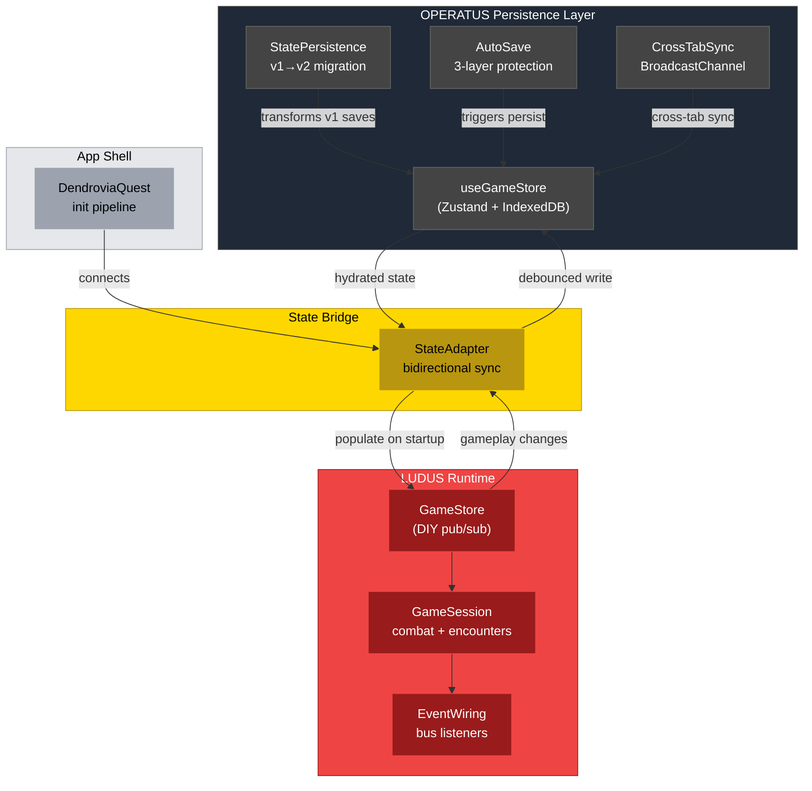
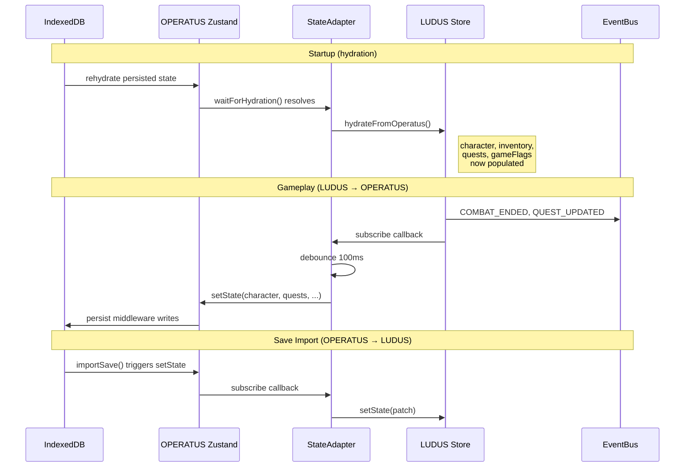

# PR: OPERATUS Phase 1 — Store Unification & Persistence Bridge

## Coat of Arms

```
+--------------------------------------------------------------+
|   feat/operatus-phase1-store-unification                     |
+--------------------------------------------------------------+
|                       MODERATE (**)                           |
|                                                              |
|     +------------------+   +------------------+              |
|     | I TYPE CONTRACT  |   | II STORE REWRITE |             |
|     | mullet x 1       |   | mullet x 1       |             |
|     | [shared]         |   | fix x 1          |             |
|     |                  |   | [operatus]       |             |
|     +------------------+   +------------------+              |
|     +------------------+   +------------------+              |
|     | III MIGRATION    |   | IV ADAPTER       |             |
|     | mullet x 1       |   | mullet x 2       |             |
|     | [operatus]       |   | [operatus|app]   |             |
|     +------------------+   +------------------+              |
|                                                              |
|   skip  [Or|Sable|Argent]  skip                              |
|                   mullet x 5 | fix x 1                      |
|                                                              |
|              [shared|operatus|app]                            |
|                                                              |
|           files: 9 | +404 / -59                              |
+--------------------------------------------------------------+
|   "Duo stabilia, unum verum"                                 |
+--------------------------------------------------------------+
```

**Compact:** `**` [shared|operatus|app] mullet x5 fix x1 skip|skip +404/-59

---

## Feature Space Index

| Index | Short Name | Full Name | Domain(s) | Commits | Lines |
|-------|------------|-----------|-----------|---------|-------|
| I | TYPE CONTRACT | Extend shared GameSaveState | shared | 1 | ~5 |
| II | STORE REWRITE | Unify GameStore with Character type, rename player→character | operatus | 1 | ~170 |
| III | MIGRATION | v1→v2 save format migration | operatus | 1 | ~48 |
| IV | ADAPTER | StateAdapter + DendroviaQuest wiring | operatus, app | 2 | ~235 |

## Cross-Space Dependencies

| From | To | Dependency Type |
|------|----|-----------------|
| I (TYPE CONTRACT) | II (STORE REWRITE) | Extended GameSaveState fields consumed by new GameStoreState shape |
| II (STORE REWRITE) | III (MIGRATION) | New state shape defines the v2 target that migration transforms into |
| II (STORE REWRITE) | IV (ADAPTER) | Unified store API surface consumed by StateAdapter bridge |
| III (MIGRATION) | IV (ADAPTER) | Hydration depends on migration completing before adapter reads state |

## Architecture



### StateAdapter Sync Flow



---

## I. Extend Shared GameSaveState

### Coat of Arms (Space I)

```
+--------------------------------------------------------------+
|   packages/shared                                            |
+--------------------------------------------------------------+
|                        PATCH (·)                              |
|                                                              |
|          skip  [Or]  skip                                    |
|                   mullet x 1                                 |
|                                                              |
|              [shared]                                         |
|                                                              |
|           files: 1 | +5 / -0                                 |
+--------------------------------------------------------------+
|   "Contractus ante omnia"                                    |
+--------------------------------------------------------------+
```

**Compact:** `·` [shared] mullet x1 skip|skip +5/-0

### Summary

The `GameSaveState` persistence contract was missing fields that LUDUS already tracks at runtime. Added `inventory: Item[]`, `gameFlags: Record<string, boolean>`, `worldPosition`, `cameraMode`, and `playtimeMs` so the save format captures full session state.

---

## II. Unify GameStore with Character Type

### Coat of Arms (Space II)

```
+--------------------------------------------------------------+
|   packages/operatus                                          |
+--------------------------------------------------------------+
|                       MODERATE (**)                           |
|                                                              |
|          skip  [Sable]  skip                                 |
|                   mullet x 1 | fix x 1                      |
|                                                              |
|              [operatus]                                       |
|                                                              |
|           files: 3 | +114 / -57                              |
+--------------------------------------------------------------+
|   "Forma recta, nomen rectum"                                |
+--------------------------------------------------------------+
```

**Compact:** `**` [operatus] mullet x1 fix x1 skip|skip +114/-57

### Summary

The OPERATUS `DEFAULT_PLAYER` used flat `health`/`mana` fields instead of the shared `Character` interface's nested `stats: CharacterStats`. This made the store type-invalid against the cross-pillar contract. Fixed by restructuring to proper nested stats and adding all required `Character` fields (`spells`, `statusEffects`, `cooldowns`).

Renamed the `player` state key to `character` throughout GameStore, AutoSave, and CrossTabSync to match the shared type name. Added `inventory: Item[]`, `gameFlags: Record<string, boolean>`, and `playtimeMs: number` with corresponding actions.

### Features

| # | Feature | Description | Status |
|---|---------|-------------|--------|
| 1 | DEFAULT_CHARACTER | Nested `stats: CharacterStats`, `spells: []`, `statusEffects: []`, `cooldowns: {}`. Replaces type-invalid flat structure | Complete |
| 2 | player→character rename | All state access, actions (`setCharacter`, `updateStats`), snapshot, AutoSave trigger, CrossTabSync persist keys | Complete |
| 3 | New state fields | `inventory: Item[]` with `addItem`/`removeItem`, `gameFlags: Record<string, boolean>` with `setGameFlag`, `playtimeMs: number` with `addPlaytime` | Complete |
| 4 | CrossTabSync key update | Persist key list updated from `['player', ...]` to `['character', ..., 'inventory', 'gameFlags', 'playtimeMs']` | Complete |

---

## III. v1→v2 Save Migration

### Coat of Arms (Space III)

```
+--------------------------------------------------------------+
|   packages/operatus                                          |
+--------------------------------------------------------------+
|                        MINOR (*)                              |
|                                                              |
|          skip  [Sable]  skip                                 |
|                   mullet x 1                                 |
|                                                              |
|              [operatus]                                       |
|                                                              |
|           files: 1 | +47 / -1                                |
+--------------------------------------------------------------+
|   "Migra sine damno"                                         |
+--------------------------------------------------------------+
```

**Compact:** `*` [operatus] mullet x1 skip|skip +47/-1

### Summary

Bumped `SAVE_VERSION` from 1 to 2 and registered a migration that transforms existing v1 saves to the new format. Handles the `player`→`character` rename, restructures flat `health`/`mana` fields into nested `stats: CharacterStats`, and backfills all new fields (`inventory`, `gameFlags`, `playtimeMs`, `worldPosition`, `cameraMode`) with safe defaults.

The migration is defensive: checks for both `v1.player` and `v1.character` keys (in case of partially-migrated state), and preserves any nested `stats` object if already present.

---

## IV. StateAdapter + App Wiring

### Coat of Arms (Space IV)

```
+--------------------------------------------------------------+
|   packages/operatus + apps/dendrovia-quest                   |
+--------------------------------------------------------------+
|                       MODERATE (**)                           |
|                                                              |
|          skip  [Sable|Argent]  skip                          |
|                   mullet x 2                                 |
|                                                              |
|              [operatus|app]                                   |
|                                                              |
|           files: 4 | +238 / -1                               |
+--------------------------------------------------------------+
|   "Pons inter duo regna"                                     |
+--------------------------------------------------------------+
```

**Compact:** `**` [operatus|app] mullet x2 skip|skip +238/-1

### Summary

LUDUS and OPERATUS each maintain independent game state stores: LUDUS uses a DIY pub/sub store (runtime-only, no persistence), OPERATUS uses Zustand with IndexedDB persistence. The `StateAdapter` bridges them bidirectionally so gameplay state survives across sessions.

Wired into the `DendroviaQuest` init pipeline between OPERATUS hydration and EventBus wiring, so the LUDUS session starts with persisted state instead of empty defaults.

### Features

| # | Feature | Description | Status |
|---|---------|-------------|--------|
| 1 | StateAdapter | Bidirectional sync with `syncing` guard to prevent infinite loops. LUDUS→OPERATUS sync is debounced (100ms default) to batch rapid combat ticks. OPERATUS→LUDUS sync fires on reference changes only (save import, reset) | Complete |
| 2 | Quest model bridge | LUDUS splits quests into `activeQuests[]` + `completedQuests[]`; OPERATUS stores flat `quests[]`. Adapter merges/splits on sync | Complete |
| 3 | Hydration flow | `adapter.connect(ludusStore)` awaits `waitForHydration()`, then populates LUDUS store from persisted OPERATUS state before event wiring begins | Complete |
| 4 | DendroviaQuest wiring | Adapter created and connected between OPERATUS init and EventBus wiring steps. Cleanup via `adapter.disconnect()` on unmount | Complete |

---

## Files Changed

```
dendrovia/
├── packages/shared/src/
│   └── types/index.ts                              # +5 fields on GameSaveState
├── packages/operatus/src/
│   ├── index.ts                                     # +StateAdapter, StateAdapterConfig exports
│   ├── persistence/
│   │   ├── GameStore.ts                             # Rewrite: Character type fix, player→character, new fields
│   │   ├── StatePersistence.ts                      # SAVE_VERSION 1→2, v1→v2 migration
│   │   ├── AutoSave.ts                              # player→character reference fix
│   │   ├── StateAdapter.ts                          # NEW: bidirectional LUDUS↔OPERATUS bridge
│   │   └── index.ts                                 # +StateAdapter barrel export
│   └── sync/
│       └── CrossTabSync.ts                          # player→character, updated persist keys
└── apps/dendrovia-quest/app/
    └── components/
        └── DendroviaQuest.tsx                       # Wire StateAdapter into init pipeline
```

## Commits

1. `c54ce5f` feat(shared): extend GameSaveState with inventory, gameFlags, and playtime
2. `ed27860` fix(operatus): unify GameStore with shared Character type and rename player to character
3. `b9857ff` feat(operatus): add v1-to-v2 save migration for character restructure
4. `4dbda24` feat(operatus): add StateAdapter for bidirectional LUDUS↔OPERATUS sync
5. `6479d67` feat(app): wire StateAdapter into DendroviaQuest init pipeline

## Terminology

| Term | Definition |
|------|-----------|
| StateAdapter | Bidirectional sync bridge between the LUDUS DIY pub/sub GameStore and the OPERATUS Zustand persist store |
| Save migration | Version-keyed transform function that upgrades old save data to the current format on load |
| Hydration | The async process of loading persisted state from IndexedDB into the Zustand store on startup |
| Syncing guard | Boolean flag that prevents recursive updates when one store's subscription triggers a write to the other |
| Quest model split | LUDUS separates quests into `activeQuests[]` and `completedQuests[]`; OPERATUS stores all quests in a single `quests[]` array |
| Debounced sync | LUDUS→OPERATUS writes are batched via 100ms setTimeout to avoid per-tick IndexedDB writes during combat |

## Design Decisions

| # | Decision | Rationale | Alternatives Considered |
|---|----------|-----------|------------------------|
| 1 | Bidirectional sync with loop guard | Both stores can be the source of truth: LUDUS during gameplay, OPERATUS on save import/reset. A boolean `syncing` flag is simpler and more debuggable than unidirectional event replay | Unidirectional LUDUS→OPERATUS only (breaks save import), merge LUDUS into Zustand (LUDUS is zero-dep by design), EventBus-mediated sync (adds event type proliferation) |
| 2 | Debounce LUDUS→OPERATUS at 100ms | Combat can produce multiple state changes per frame (damage, status effects, cooldown ticks). Batching into a single IndexedDB write prevents I/O thrashing | Per-change writes (IndexedDB overhead), requestIdleCallback (unpredictable timing), manual flush on combat end only (risks data loss on mid-combat tab close) |
| 3 | Adapter connects before EventBus wiring | LUDUS event handlers (e.g., NODE_CLICKED → encounter check) read from the store. If the store isn't hydrated first, encounters use default level-1 stats instead of the player's actual state | Wire events first then hydrate (race condition), lazy hydration on first read (complex, every access needs null check) |
| 4 | Quest split/merge in adapter, not in stores | Neither store should know about the other's data model. The adapter is the only component that understands both shapes | Add completedQuests to OPERATUS (breaks persistence contract), flatten LUDUS quests (loses runtime query convenience) |
| 5 | `as GameStoreState` cast on partialize | Zustand's `partialize` intentionally returns a subset, but the TypeScript generic expects the full type. The cast is safe because `merge` reconstitutes the full shape on rehydration | Widen the Zustand generic (breaks action type safety), create a separate PersistedState type (duplicates field declarations), `@ts-ignore` (less precise) |
| 6 | v1→v2 migration checks both `player` and `character` keys | Defensive against partially-migrated or manually-edited saves. If someone renamed the key but didn't restructure stats, the migration still produces valid output | Strict v1 shape check (fails on edge cases), schema validation (heavyweight for a game save) |

## Test Plan

- [x] OPERATUS: 22 tests pass, 45 assertions (regression check after GameStore rewrite)
- [x] LUDUS: 204 tests pass, 4372 assertions (regression check — store interface unchanged)
- [x] Type check: 0 new errors in persistence/, sync/, or app components
- [x] Pre-existing type errors (sw/service-worker.ts, manifest/generate.ts) unchanged
- [ ] Manual: Load game with no existing save → LUDUS store gets default character
- [ ] Manual: Play session, close tab, reopen → character stats, inventory, quests persist
- [ ] Manual: v1 save in IndexedDB → migrates to v2 on load (player→character, flat→nested stats)
- [ ] Manual: Import save via `importSave()` → LUDUS store updates without page reload

## Related

| Document | Relationship |
|----------|-------------|
| `docs/OPERATUS_INTERFACE_PRIORITIZATION.md` | This PR implements Phase 1 (tasks A1, A2, A3, B1, B2, B3) of the prioritization plan |
| `docs/pr-descriptions/PR_DESCRIPTION_OPERATUS_INFRASTRUCTURE.md` | Prior PR establishing the OPERATUS persistence layer that this PR corrects and extends |
| `docs/pr-descriptions/PR_DESCRIPTION_CROSS_PILLAR_INTEGRATION.md` | Prior PR creating DendroviaQuest bootstrap that this PR wires the StateAdapter into |
| `docs/pr-descriptions/PR_DESCRIPTION_LUDUS_COMBAT_ENGINE.md` | LUDUS GameStore interface that the StateAdapter bridges to |
