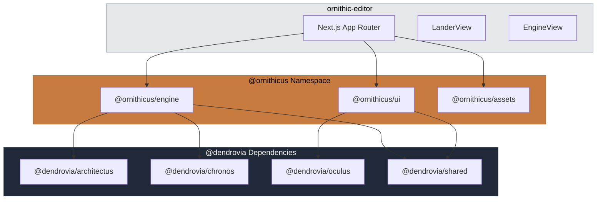

# PR Description — Ornithicus Launch

```
+--------------------------------------------------------------+
|   feat/ornithicus-launch                                     |
+--------------------------------------------------------------+
|                      *** MAJOR ***                           |
|                                                              |
|          skip  [PER-QUARTERLY SHIELD]  skip                  |
|                   mullet x 7                                 |
|                                                              |
|          [ornithicus · app · operatus · docs]                |
|                                                              |
|           files: 61 | +2530 / -81                           |
+--------------------------------------------------------------+
|   "Per aspera ad astra"                                      |
+--------------------------------------------------------------+
```

*** [ornithicus · app · operatus · docs] mullet x7, book x1 skip/skip/skip/skip +2530/-81

---

## Summary

Establishes the Ornithicus product layer as a first-class citizen in the Dendrovia monorepo. Three new `@ornithicus/*` packages provide the spatial engine, HUD components, and asset stubs. The ornithic-editor app is converted from Vite to Next.js App Router with favicon, OpenGraph, and Vercel deployment. A dedicated `--orn` workspace launcher mode arranges 5 iTerm2 windows with the ORNITHICUS pillar in a full-width hero position.

---

## Features

| Feature | Description | Status |
|---------|-------------|--------|
| `@ornithicus/engine` | Spatial engine with ReplayAnimator, ScaleFrameShift, FrustumController, DiffMaterialEngine | Complete (scaffold) |
| `@ornithicus/ui` | HUD component library: TopHeader, LeftHUD, RightHUD, Floating namespaces + CyberOrganicTheme | Complete (scaffold) |
| `@ornithicus/assets` | Asset stubs for avatars, cursors, skeuomorphs | Complete (scaffold) |
| Next.js conversion | Vite → Next.js 16.1.5 App Router with webpack mode, port 3009 | Complete |
| Favicon + OpenGraph | Bird SVG icon, dynamic OG image via edge runtime | Complete |
| Vercel config | `vercel.json` for dendrovia-ornithicus.vercel.app | Complete |
| Turbo pipeline | `@ornithicus/*` build tasks with dependency graph | Complete |
| Monorepo scripts | `td:ornithicus`, `dev:orn`, `launch:orn` | Complete |
| `--orn` launcher | 5-window iTerm2 layout (4 pillars + ORNITHICUS hero) | Complete |
| ORNITHICUS iTerm2 profile | Avian amber CIELAB palette, 256-color generation | Complete |
| Pillar registry | ORNITHICUS added to registry + worktree lifecycle | Complete |
| CHRONOS directives | Reframed as differential provenance engine | Complete |

---

## Files Changed

```
packages/ornithicus-engine/
  ├── package.json                    — Package definition with @dendrovia/* deps
  ├── tsconfig.json                   — TypeScript config
  └── src/
      ├── index.ts                    — Barrel export
      ├── growth/ReplayAnimator.ts    — Commit sequence replay
      ├── rasterization/ScaleFrameShift.ts — LOD scale management
      ├── skybox/FrustumController.ts — Bird-perspective frustum
      └── temporal/DiffMaterialEngine.ts — Diff-aware materials

packages/ornithicus-ui/
  ├── package.json                    — Package with @dendrovia/oculus dep
  ├── tsconfig.json
  └── src/
      ├── index.ts                    — Namespace barrel exports
      ├── namespaces/TopHeader/       — MillerBreadcrumb, ProjectCatalog
      ├── namespaces/LeftHUD/         — ChatEventStream, SceneBulletin
      ├── namespaces/RightHUD/        — Minimap, ControlToggles
      ├── namespaces/Floating/        — HoverCodeReader
      └── styling/CyberOrganicTheme.ts

packages/ornithicus-assets/
  ├── package.json
  ├── tsconfig.json
  └── src/
      ├── index.ts
      ├── avatars/index.ts
      ├── cursors/index.ts
      └── skeuomorphs/index.ts

apps/ornithic-editor/
  ├── package.json                    — Next.js 16.1.5, port 3009
  ├── next.config.js                  — Webpack fallbacks, transpilePackages
  ├── tsconfig.json                   — Extends @repo/typescript-config/nextjs
  ├── vercel.json                     — Deployment config
  ├── next-env.d.ts
  ├── lib/url-browser-shim.js         — Node url module browser shim
  └── app/
      ├── layout.tsx                  — Metadata API (OG, Twitter)
      ├── page.tsx                    — Client wrapper
      ├── globals.css                 — Dark theme, amber accents
      ├── icon.svg                    — Bird favicon
      ├── opengraph-image.tsx         — Dynamic OG image (edge)
      └── components/
          ├── App.tsx                 — Root component
          ├── router.tsx              — View router
          ├── adapters/MillerBAdapter.ts
          └── views/
              ├── LanderView/        — Landing page with URL input
              └── EngineView/        — 3D engine view with scenes

scripts/
  ├── launch-workspace.ts             — Added --orn flag and help text
  └── workspace-launcher/
      ├── types.ts                    — Added ornMode option
      ├── iterm-launcher.ts           — Ornithicus grid + hero pane
      ├── ghostty-launcher.ts         — ORNITHICUS theme
      ├── pillar-registry.ts          — ORNITHICUS entry
      ├── generate-iterm-256.py       — Avian amber palette definition
      └── Dendrovia.plist             — Regenerated 7-profile set

turbo.json                            — @ornithicus/* build tasks
package.json                          — td:ornithicus, dev:orn, launch:orn
bun.lock                              — Dependency resolution
scripts/wt-lifecycle.sh               — ORNITHICUS in pillar array
docs/CHRONOS_DIRECTIVES.md            — Differential provenance reframe
```

---

## Commits

1. `2f21e4b feat(ornithicus): scaffold ornithicus-engine package`
2. `d892923 feat(ornithicus): scaffold ornithicus-ui package`
3. `02f2f60 feat(ornithicus): scaffold ornithicus-assets package`
4. `5fde376 feat(app): convert ornithic-editor from Vite to Next.js`
5. `841be1f feat(infra): register Ornithicus pillar in monorepo tooling`
6. `ce263ce feat(launcher): add --orn mode with ORNITHICUS hero window`
7. `690d0d3 feat(launcher): generate ORNITHICUS iTerm2 color profile`
8. `8662110 docs(chronos): reframe as differential provenance engine`

---

## Test Plan

- [x] `git status` clean after all commits
- [x] `bun run launch:orn -- --dry-run` generates valid 5-window AppleScript
- [x] Castle Walls Wall 1 (secrets) passes on all 8 commits
- [x] Branch pushed to remote
- [ ] `bun run dev:orn` boots Next.js on port 3009
- [ ] `bun run build --filter=ornithic-editor` completes
- [ ] Favicon renders at localhost:3009
- [ ] View source shows OpenGraph meta tags
- [ ] `bun run launch:orn` opens 5 iTerm2 windows with correct profiles

---

## Architecture


