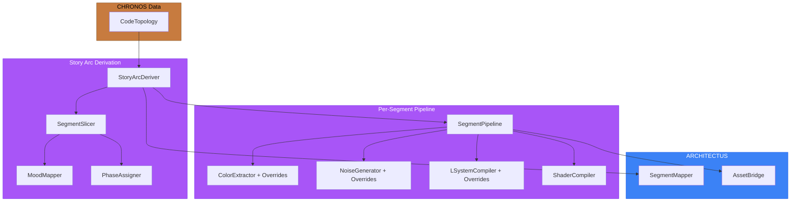

# PR: Segment-Based Placement — Story Arc Derivation & Per-Segment Pipelines

## Coat of Arms (Unified)

```
+--------------------------------------------------------------+
|   feat/segment-based-placement                               |
+--------------------------------------------------------------+
|                       MAJOR ***                              |
|                                                              |
|     +------------------+   +------------------+              |
|     | I Museums Fix    |   | II Story Arc     |             |
|     | cross x1         |   | mullet x4        |             |
|     | [app]            |   | [shared,imag,    |             |
|     |                  |   |  architectus]    |             |
|     +------------------+   +------------------+              |
|                                                              |
|     typecheck: WARN   lint: skip                             |
|     test: pass         build: skip                           |
|                                                              |
|           files: 28 | +1781 / -134                           |
+--------------------------------------------------------------+
|   "Per aspera ad astra"                                      |
+--------------------------------------------------------------+
```

Compact: *** [app,shared,imaginarium,architectus] mullet x4 cross x1 scales x1 test:pass +1781/-134

## Feature Space Index

| Index | Short Name | Full Name | Domain | Commits |
|-------|------------|-----------|--------|---------|
| I | Museums Fix | Server-side mycology computation & subpath exports | app | 1 |
| II | Story Arc | Segment-based placement via story arc derivation | shared, imaginarium, architectus | 6 |

## Cross-Space Dependencies

| From | To | Type |
|------|----|------|
| I Museums Fix | II Story Arc | Subpath exports pattern (`package.json`) shared across both spaces |
| II Story Arc | I Museums Fix | None — spaces are independent |

---

## I. Museums Fix

### Coat of Arms (Space I)

```
+--------------------------------------------------------------+
|                       MINOR *                                |
|                                                              |
|                   cross x1                                   |
|                    [app]                                     |
|                                                              |
|           files: 5 | +95 / -89                               |
+--------------------------------------------------------------+
|   "The path made clear"                                      |
+--------------------------------------------------------------+
```

### Summary

Moves mycology catalog computation from the client-side MycologyExhibit component to the server-side museums page, fixing hydration mismatches and enabling proper server-side data fetching. Adds subpath exports to the imaginarium package for granular imports.

### Features

| Feature | Description | Status |
|---------|-------------|--------|
| Server-side mycology | Compute mycology catalog in `page.tsx` server component and pass as prop | Complete |
| Subpath exports | Add `./utils/color`, `./utils/glsl`, `./mycology` exports to imaginarium `package.json` | Complete |
| Component simplification | Reduce MycologyExhibit to a pure presentation component | Complete |

---

## II. Segment-Based Placement

### Coat of Arms (Space II)

```
+--------------------------------------------------------------+
|                       MAJOR ***                              |
|                                                              |
|                   mullet x4                                  |
|          scales x1 | test x1                                |
|           [shared, imaginarium, architectus]                 |
|                                                              |
|           files: 23 | +1686 / -45                            |
+--------------------------------------------------------------+
|   "Per aspera ad astra"                                      |
+--------------------------------------------------------------+
```

### Summary

Derives a machine-readable story arc from CHRONOS topology data, partitioning the codebase into narrative segments with distinct phases and moods. Each segment runs through a per-segment generative pipeline producing unique visual assets (palettes, noise configs, L-systems, shaders) driven by mood-based overrides. ARCHITECTUS gains segment-to-world mapping for spatially distinct visual treatments.

### Features

| Feature | Description | Status |
|---------|-------------|--------|
| Shared types & events | `StoryArc`, `StorySegment`, `SegmentMetrics`, `SegmentMood`, `StoryPhase`, `SegmentAssets`, `SegmentPlacement` types; `STORY_ARC_DERIVED`, `SEGMENT_DISTILLED`, `SEGMENT_ENTERED` events | Complete |
| SegmentSlicer | Partitions `FileTreeNode` into segments by top-level directory; merges segments with <3 files; caps at 10 | Complete |
| MoodMapper | Pure function mapping `SegmentMetrics` to one of 5 moods (serene, tense, chaotic, triumphant, mysterious) | Complete |
| PhaseAssigner | Tension-scored phase assignment (prologue through epilogue) across segments | Complete |
| StoryArcDeriver | Deterministic orchestrator: topology in, `StoryArc` out, with hashed seed and fallback | Complete |
| Distillation overrides | `PaletteOverrides`, `NoiseOverrides`, `LSystemOverrides` additive params on existing extractors | Complete |
| SegmentPipeline | Per-segment distillation with mood-driven strategy overrides, writes to `segments/{id}/` | Complete |
| Pipeline integration | Story arc derivation wired into `DistillationPipeline` between shader variants and mycology | Complete |
| SegmentMapper | ARCHITECTUS system mapping `NodeMarker[]` to `SegmentPlacement` with centroid and radius | Complete |
| AssetBridge extension | Loads `story-arc.json` and `segment-assets.json` from manifest | Complete |
| Test suite | 32 tests across 5 files covering slicer, mood, phase, deriver, and integration | Complete |

---

## Files Changed (All Spaces)

### Space I: Museums Fix

```
apps/playground-imaginarium/
  app/museums/
    MuseumsClient.tsx               # Remove unused mycology prop threading
    page.tsx                        # Add server-side mycology catalog computation
    components/
      MycologyExhibit.tsx           # Simplify to presentational component
      PaletteExhibit.tsx            # Minor import adjustment
      ShaderExhibit.tsx             # Minor import adjustment
```

### Space II: Segment-Based Placement

```
packages/shared/src/
  types/index.ts                    # Add StoryArc, SegmentMetrics, StorySegment, etc.
  events/EventBus.ts                # Add STORY_ARC_DERIVED, SEGMENT_DISTILLED, SEGMENT_ENTERED

packages/imaginarium/
  package.json                      # Add ./storyarc subpath export
  src/
    index.ts                        # Re-export story arc public API
    storyarc/
      SegmentSlicer.ts              # Tree-to-segment partitioning
      MoodMapper.ts                 # Metrics-to-mood classification
      PhaseAssigner.ts              # Tension-based phase distribution
      StoryArcDeriver.ts            # Orchestrator with deterministic hashing
      index.ts                      # Barrel exports
    distillation/
      ColorExtractor.ts             # Add PaletteOverrides parameter
      NoiseGenerator.ts             # Add NoiseOverrides parameter
      LSystemCompiler.ts            # Add LSystemOverrides parameter
      index.ts                      # Export override types
    pipeline/
      SegmentPipeline.ts            # Per-segment distillation with mood strategies
      DistillationPipeline.ts       # Wire in story arc step
      ManifestGenerator.ts          # Add storyArc field to manifest
  __tests__/storyarc/
    slicer.test.ts                  # 7 tests: partitioning, merge, cap, fallback
    mood.test.ts                    # 6 tests: all 5 moods reachable
    phase.test.ts                   # 7 tests: tension, phase distribution
    deriver.test.ts                 # 6 tests: determinism, coverage, fallback
    integration.test.ts             # 4 tests: full pipeline, determinism, perf

packages/architectus/src/
  systems/SegmentMapper.ts          # Node-to-segment placement with centroid
  loader/AssetBridge.ts             # Load story arc + segment assets from manifest
```

## Commits (All Spaces)

1. `6fd99a8` fix(museums): move mycology computation to server component and add subpath exports
2. `332a45f` feat(shared): add story arc types and segment event contracts
3. `61b538b` feat(imaginarium): add story arc derivation from code topology
4. `a583863` feat(imaginarium): add override params to distillation modules
5. `60d4905` feat(imaginarium): add segment pipeline and wire into distillation
6. `131967e` feat(architectus): add segment mapper and extend AssetBridge
7. `dbd92bf` test(imaginarium): add story arc unit and integration tests

## Architecture



## Test Plan

- [x] `bun test packages/imaginarium/__tests__/storyarc/` — 32 tests pass (slicer, mood, phase, deriver, integration)
- [x] Determinism verified: same topology produces identical story arc and segment assets across runs
- [x] Fallback verified: single-file topology produces single climax segment without throwing
- [x] Integration verified: full pipeline produces `segments/` directories with palette.json, noise.json, lsystem.json, shader.glsl per segment
- [x] Distinct palettes: segments with different moods produce different primary colors
- [x] Performance: 100-file topology completes pipeline in <10 seconds
- [ ] `bun run distill` produces `story-arc.json` + `segments/` in generated output
- [ ] ARCHITECTUS loads segment assets via AssetBridge without errors
