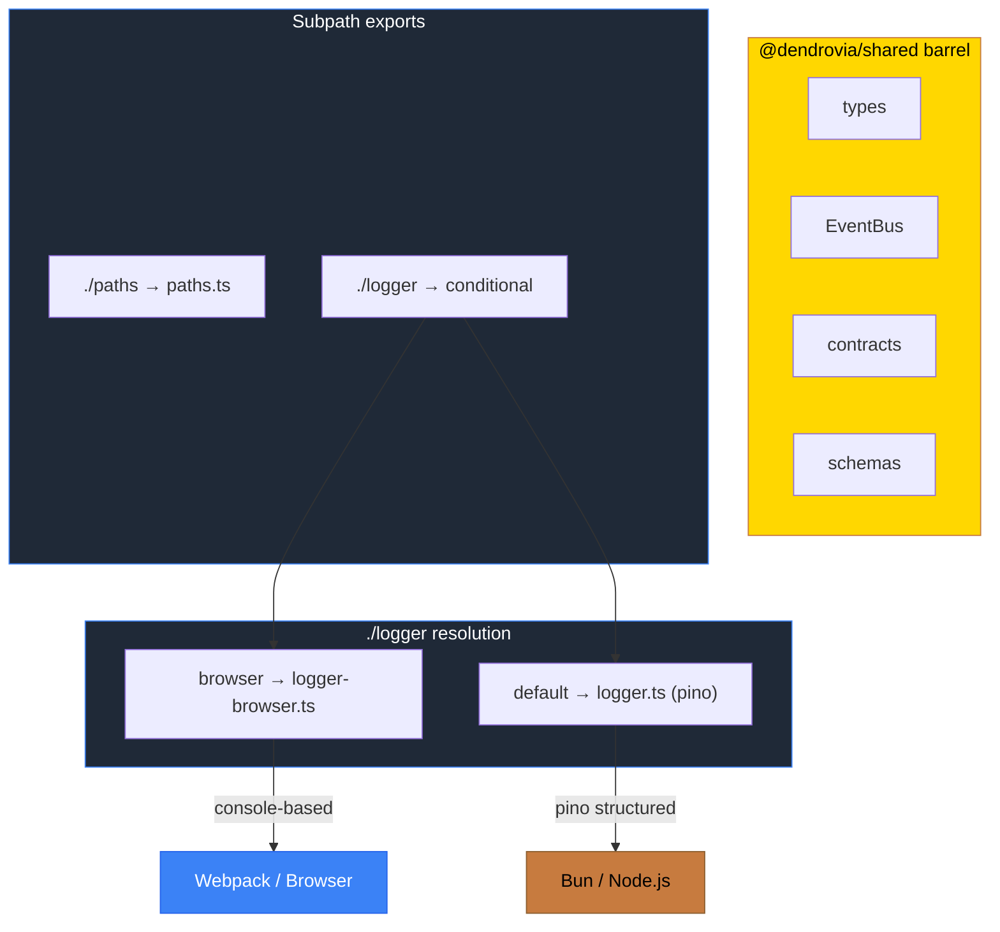

# PR: Fix node:fs Webpack Leak in @dendrovia/shared

## Coat of Arms

```
+--------------------------------------------------------------+
|   fix/shared-node-fs-leak                                    |
+--------------------------------------------------------------+
|                      * MINOR *                               |
|                                                              |
|           skip  [per-pale]  skip                             |
|                   cross x 1                                  |
|                                                              |
|                  [shared]                                     |
|                                                              |
|           files: 7 | +129 / -10                              |
+--------------------------------------------------------------+
|   "Correctio fundamentum"                                    |
+--------------------------------------------------------------+
```

**Compact:** * [shared] cross x1 skip/skip/pass/skip +129/-10

---

## Summary

The `@dendrovia/shared` barrel export pulled `node:fs` into client bundles through two chains: `paths.ts` (direct `fs` import) and `logger.ts` (pino → `node:fs`). This caused Next.js 16.1.5 webpack builds to fail with `UnhandledSchemeError: Reading from "node:fs" is not handled by plugins`. This fix isolates Node-only modules from the barrel and adds a browser-safe logger via conditional exports, preserving the pino structured logger for server-side use.

## Features

| Feature | Description | Status |
|---------|-------------|--------|
| Barrel isolation | Remove `paths` and `logger` re-exports from main barrel | Complete |
| Browser logger | Console-based `logger-browser.ts` matching pino convention | Complete |
| Shared Logger type | `logger-types.ts` interface contract for both implementations | Complete |
| Conditional exports | `./logger` subpath routes browser→console, default→pino | Complete |
| EventBus fix | Remove pino import from EventBus (uses console.debug) | Complete |

## Architecture



## Files Changed

```
packages/shared/
├── package.json                  MOD  Add conditional exports for ./logger
└── src/
    ├── index.ts                  MOD  Remove paths + logger from barrel
    ├── logger.ts                 MOD  Export shared Logger type, annotate as Node-only
    ├── logger-browser.ts         NEW  Console-based browser logger (same API)
    ├── logger-types.ts           NEW  Shared Logger interface contract
    └── events/
        └── EventBus.ts           MOD  Remove pino import, use console.debug
bun.lock                          MOD  Lockfile update
```

## Commits

1. `e88d62b` fix(shared): isolate node:fs from browser bundles via conditional logger exports

## Test Plan

- [x] `bun test` — 967 tests pass, 0 failures
- [x] Server logger verified: pino JSON structured output preserved
- [x] Browser logger verified: `[PILLAR/component]` prefix formatting
- [x] `findMonorepoRoot` and `createLogger` no longer in barrel exports
- [x] `EventBus` still in barrel, no pino dependency
- [x] `@dendrovia/shared/paths` subpath still works for server consumers
- [ ] Next.js app builds without `node:fs` error
