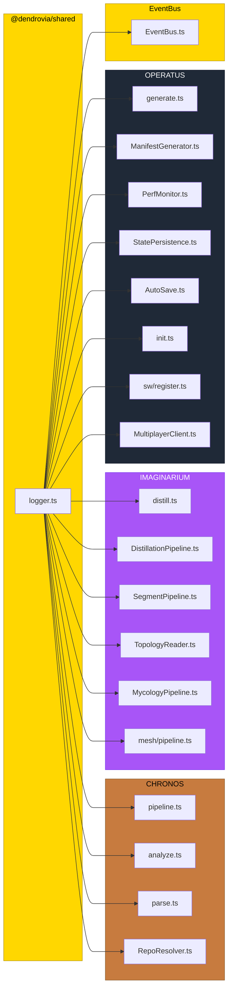

# PR: Structured Logging with pino — Cross-Pillar Console Migration

## Coat of Arms

```
+--------------------------------------------------------------+
|   feat/structured-logging                                    |
+--------------------------------------------------------------+
|                      *** MAJOR ***                           |
|                                                              |
|            skip  [party-per-cross]  skip                     |
|                    bend x 5                                  |
|                                                              |
|     [shared · chronos · imaginarium · operatus · infra]      |
|                                                              |
|           files: 24 | +315 / -199                            |
+--------------------------------------------------------------+
|   "Mutatio in melius"                                        |
+--------------------------------------------------------------+
```

**Compact:** *** [shared · chronos · imaginarium · operatus · infra] bend x5 skip/skip/pass/skip +315/-199

---

## Summary

Replaces all ~133 `console.*` calls across the monorepo with centralized pino-based structured logging via a new `@dendrovia/shared/logger` factory. Every pillar now emits JSON logs in CI and human-readable colored output in dev, with `LOG_LEVEL` env var controlling verbosity across the entire build pipeline.

## Features

| Feature | Description | Status |
|---------|-------------|--------|
| Logger factory | `createLogger(pillar, component?)` producing pino child loggers with structured bindings | Complete |
| TTY auto-detection | `pino-pretty` for terminal, raw JSON for CI — zero configuration | Complete |
| CHRONOS migration | 4 files, ~40 console calls replaced with structured `log.info`/`warn`/`fatal` | Complete |
| IMAGINARIUM migration | 6 files, ~30 console calls replaced; mood strategy and segment pipeline covered | Complete |
| OPERATUS migration | 8 files, ~35 console calls replaced; PerfMonitor groups collapsed to structured entries | Complete |
| EventBus integration | Debug logging gated behind existing `debug` flag, now structured | Complete |
| CLI banner preservation | ASCII banners in analyze.ts/distill.ts kept as `process.stdout.write()` (UX, not log data) | Complete |
| Silent mode | pipeline.ts `silent` option mapped to `log.level = 'silent'` on pino instance | Complete |

## Architecture



## Files Changed

```
packages/shared/
├── src/logger.ts                          NEW  pino factory + pillar convenience exports
├── src/index.ts                           MOD  re-export logger
├── src/events/EventBus.ts                 MOD  console.log → log.debug
└── package.json                           MOD  pino + pino-pretty deps, ./logger export

packages/chronos/src/
├── pipeline.ts                            MOD  remove log() helper, 24 calls → pino
├── analyze.ts                             MOD  34 calls → pino, banners → stdout
├── parse.ts                               MOD  18 calls → pino, banners → stdout
└── resolver/RepoResolver.ts               MOD  5 calls → pino

packages/imaginarium/src/
├── distill.ts                             MOD  8 calls → pino, banner → stdout
├── pipeline/DistillationPipeline.ts       MOD  15 calls → pino
├── pipeline/SegmentPipeline.ts            MOD  1 call → pino
├── pipeline/TopologyReader.ts             MOD  1 warn → pino
├── mycology/MycologyPipeline.ts           MOD  5 calls → pino
└── mesh/pipeline.ts                       MOD  1 call → pino, log param → verbose

packages/operatus/src/
├── manifest/generate.ts                   MOD  15 calls → pino
├── manifest/ManifestGenerator.ts          MOD  CLI main() calls → pino
├── perf/PerfMonitor.ts                    MOD  console.group → single structured log
├── persistence/StatePersistence.ts        MOD  4 warn/error → pino
├── persistence/AutoSave.ts                MOD  1 warn → pino
├── init.ts                                MOD  3 warn → pino
├── sw/register.ts                         MOD  1 warn → pino
└── multiplayer/MultiplayerClient.ts       MOD  1 warn → pino

turbo.json                                 MOD  LOG_LEVEL, LOG_FORMAT in globalEnv
bun.lock                                   MOD  pino dependency resolution
```

## Commits

1. `78d079f` feat(shared): add pino-based structured logger factory
2. `3973358` refactor(shared): replace EventBus console.log with pino debug logging
3. `f524f2b` refactor(chronos): migrate all console.* calls to pino structured logging
4. `cb1762a` refactor(imaginarium): migrate all console.* calls to pino structured logging
5. `d3611a4` refactor(operatus): migrate all console.* calls to pino structured logging
6. `0c35f1f` refactor(imaginarium,operatus): migrate upstream console.* calls added after branch point

## Test Plan

- [x] `bun test` — 967 pass, 0 fail across 51 files
- [x] Zero `console.*` calls remaining in source (`grep -r 'console\.' packages/ --include='*.ts'` = 0 hits)
- [ ] `LOG_LEVEL=warn bun run packages/chronos/src/parse.ts` — only warnings and errors appear
- [ ] `LOG_LEVEL=silent bun run packages/chronos/src/parse.ts` — no log output
- [ ] TTY detection: JSON output when piped, colored output in terminal
- [ ] `bun run build` — all packages build successfully
