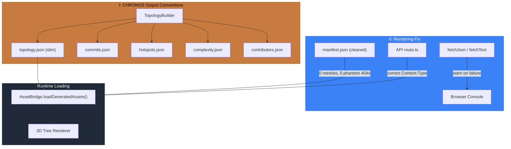

# PR: Fix Topology Rendering + Integrate CHRONOS Output Conventions

## Coat of Arms

```
+--------------------------------------------------------------+
|   fix/topology-rendering-chronos                             |
+--------------------------------------------------------------+
|                    *** MAJOR ***                              |
|                                                              |
|     +------------------+   +------------------+              |
|     | I CHRONOS Conv.  |   | II Rendering Fix |              |
|     | bend x 3         |   | cross x 4        |              |
|     | mullet x 2       |   |                  |              |
|     | hammer x 2       |   |                  |              |
|     | [chronos, shared |   | [architectus,    |              |
|     |  imaginarium]    |   |  imaginarium,    |              |
|     |                  |   |  app]            |              |
|     +------------------+   +------------------+              |
|                                                              |
|                  party-per-cross                              |
|     [chronos, shared, imaginarium, architectus, app, infra]  |
|                                                              |
|           files: 27 | +15677 / -1529                         |
+--------------------------------------------------------------+
|   "Correctio fundamentum"                                    |
+--------------------------------------------------------------+
```

**Compact:** *** [chronos, shared, imaginarium, architectus, app, infra] cross x4 bend x3 mullet x2 hammer x2 WARN +15677/-1529

---

## Summary

Topology never rendered in the production app despite two prior fix PRs (#83, #84) because 38 phantom mesh references in the IMAGINARIUM manifest saturated browser connection limits with silent 404 storms, and `fetchJson`/`fetchText` swallowed all errors with zero console output. This PR integrates the CHRONOS output conventions branch (slim topology format with provenance, standalone commit/hotspot files, `--install` flag) and applies targeted fixes to the asset loading pipeline to unblock rendering across all 3 registered worlds.

## Feature Space Index

| Index | Short Name | Full Name | Domain | Commits |
|-------|------------|-----------|--------|---------|
| I | CHRONOS Conv. | CHRONOS Output Conventions | chronos, shared, imaginarium, infra | 7 |
| II | Rendering Fix | Topology Rendering + Manifest Cleanup | architectus, imaginarium, app | 3 |

## Cross-Space Dependencies

| From | To | Type |
|------|----|------|
| I CHRONOS Conv. | II Rendering Fix | Topology data format: Space II consumes the slim topology produced by Space I |
| I CHRONOS Conv. | II Rendering Fix | Type contract: `CodeTopology.commits`/`hotspots` made optional in shared types, consumed by IMAGINARIUM reader |

---

## I. CHRONOS Output Conventions

### Summary

Upgrades CHRONOS output from monolithic topology (files + commits + hotspots in one blob) to slim topology with standalone companion files (`commits.json`, `hotspots.json`, `complexity.json`, `contributors.json`). Adds provenance tracking (analyzed commit hash, timestamp, repo URL), deterministic sorting, and a `--install` flag for single-command world refresh. Regenerates Dendrovia world data with the full monorepo as input (27 files, 468 commits vs. the stale 19 files from self-analysis).

### Features

| Feature | Description | Status |
|---------|-------------|--------|
| Optional commits/hotspots | `CodeTopology.commits` and `hotspots` become optional in shared types and Zod schemas (`.optional().default([])`) | Complete |
| Slim topology output | TopologyBuilder emits files + tree only; commits, hotspots, complexity, contributors go to standalone files | Complete |
| Provenance tracking | Every topology output includes `analyzedAt`, `headHash`, `repoUrl`, `branch` | Complete |
| Delta manifest | `.chronos-state` upgraded to a manifest tracking file-level deltas for incremental analysis | Complete |
| `--install` flag | `bun run parse -- --install` does a single-command `bun install` + analysis for fresh world setup | Complete |
| Standalone file loading | IMAGINARIUM TopologyReader gains `loadCommitsStandalone()` and `loadHotspotsStandalone()` for companion files | Complete |
| World data regeneration | Dendrovia world data regenerated with slim format: 27 files, 468 commits, correct provenance | Complete |

---

## II. Topology Rendering Fix

### Summary

Three targeted fixes that unblock topology rendering: diagnostic logging in `fetchJson`/`fetchText` so failures are visible, removal of 38 phantom mesh entries that were firing parallel 404s and saturating browser connections, and Content-Type detection in the world data API route so `.glsl` shaders aren't served as `application/json`.

### Features

| Feature | Description | Status |
|---------|-------------|--------|
| Diagnostic fetch logging | `fetchJson` and `fetchText` now `console.warn` on HTTP errors (status + URL) and exceptions (URL + error) | Complete |
| Manifest health summary | After manifest loads, logs shader/palette/mesh counts; warns if meshes > 0 to surface phantom references | Complete |
| Phantom mesh removal | Stripped all 38 mesh entries from Dendrovia manifest (cap + stem pairs for 19 specimens that never existed on disk) | Complete |
| Topology path fix | Manifest topology field changed from absolute filesystem path (`/Users/Patmac/denroot/CHRONOS/...`) to relative `../chronos/topology.json` | Complete |
| Content-Type detection | API route now serves `.json` as `application/json`, `.glsl` as `text/plain`, other as `application/octet-stream` | Complete |
| Optional field guards | Added `?? []` guards at 22 access sites across 6 IMAGINARIUM files for `topology.commits`/`topology.hotspots` after shared types made them optional | Complete |

---

## Architecture



## Files Changed

```
packages/shared/
└── src/
    ├── types/index.ts                  — commits/hotspots optional on CodeTopology
    └── schemas.ts                      — Zod schemas add .optional().default([])

packages/chronos/
├── src/
│   ├── builder/TopologyBuilder.ts      — slim output, provenance, standalone file emission
│   ├── parse.ts                        — wire --install flag
│   └── pipeline.ts                     — delta manifest, standalone file orchestration
└── __tests__/
    └── topology-builder.test.ts        — updated for slim output shape

packages/imaginarium/
└── src/pipeline/
    └── TopologyReader.ts               — loadCommitsStandalone/loadHotspotsStandalone

packages/imaginarium/
└── src/
    ├── mycology/
    │   ├── GenusMapper.ts              — ?? [] guards on hotspots/commits access (5 sites)
    │   └── MycelialNetwork.ts          — ?? [] guard on commits iteration
    ├── pipeline/
    │   ├── DistillationPipeline.ts     — ?? [] guards on hotspots logging/hashing/filtering
    │   ├── SegmentPipeline.ts          — ?? [] guard on per-segment hotspot filtering
    │   ├── TopologyChunker.ts          — ?? [] guard on chunk hotspot filtering
    │   └── VariantGenerator.ts         — ?? [] guards on all subset/structural helpers
    └── storyarc/
        └── StoryArcDeriver.ts          — ?? [] guards on hotspot metrics in arc derivation

packages/architectus/
└── src/loader/
    └── AssetBridge.ts                  — diagnostic logging in fetchJson/fetchText,
                                          manifest health summary

apps/dendrovia-quest/
└── app/api/worlds/[...path]/
    └── route.ts                        — extension-based Content-Type detection

worlds/
├── index.json                          — updated world metadata (27 files, 468 commits)
└── dendrovia/
    ├── chronos/
    │   ├── topology.json               — regenerated: 27 files, 468 commits, slim format
    │   ├── commits.json                — standalone commit history
    │   ├── hotspots.json               — standalone hotspot data
    │   ├── complexity.json             — standalone complexity metrics
    │   └── contributors.json           — standalone contributor data
    └── imaginarium/
        └── manifest.json               — removed 38 phantom meshes, fixed topology path

.gitignore                              — chronos manifest pattern
.husky/post-rebase                      — cache invalidation for chronos state
package.json                            — script updates
```

## Commits

1. `f1d783e` refactor(shared): make commits/hotspots optional on CodeTopology
2. `2ec6fdd` refactor(chronos): slim topology output with provenance and sorting
3. `8223f6d` feat(chronos): upgrade .chronos-state to manifest with delta tracking
4. `3206972` feat(chronos): add --install flag for single-command world refresh
5. `cd79478` refactor(imaginarium): load commits/hotspots from standalone files
6. `6e1b75a` chore: update gitignore and post-rebase hook for chronos manifest
7. `734cc99` chore(worlds): regenerate dendrovia world data with slim format
8. `d5eab4c` fix(architectus): surface silent fetch failures with diagnostic logging
9. `000bbfa` fix(imaginarium): strip 38 phantom mesh entries from dendrovia manifest
10. `1e70e32` fix(quest): detect Content-Type by extension in world data API route
11. `4acc049` fix(imaginarium): guard optional topology.commits/hotspots across consumers

## Test Plan

- [x] `bun test` — 1013 pass, 2 fail (pre-existing mycology catalog tests, not caused by this PR)
- [x] `turbo build` — shared, imaginarium, architectus, oculus, dendrovia-quest all pass
- [x] Verify merged topology: `worlds/dendrovia/chronos/topology.json` has 27 files, 468 commits
- [x] Verify manifest no longer references phantom meshes (0 mesh entries)
- [x] Verify manifest topology path is relative (`../chronos/topology.json`)
- [ ] `bun run dev` on dendrovia-quest — navigate to `/worlds/dendrovia` — verify 3D tree renders
- [ ] Open browser console — confirm `[ARCHITECTUS]` diagnostic logs appear (manifest health, no silent 404s)
- [ ] Navigate to `/worlds/facebook/react` — verify world loads with correct asset paths
- [ ] Navigate to `/worlds/anthropics/claude-code` — verify world loads
- [ ] Request a `.glsl` file via `/api/worlds/.../*.glsl` — confirm `Content-Type: text/plain` header

## Pre-Existing Test Failures

Two mycology catalog tests fail on the merged CHRONOS branch (confirmed by testing merge commit in isolation):

| Test | Expected | Actual | Root Cause |
|------|----------|--------|------------|
| `every specimen has complete structure` | `id.length > 10` | `8` | FNV-1a hash always returns 8 hex chars; assertion was never correct |
| `positions are spread across space` | `uniqueX.size > 1` | `1` | New topology shape with seed=42 produces clustered positions |

These are pre-existing and tracked for a follow-up fix. They do not indicate regressions from this PR.
