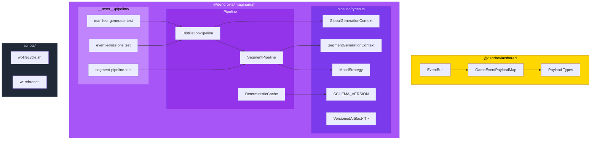

# PR: Wave 0 — IMAGINARIUM Reactive Foundations

## Coat of Arms

```
+--------------------------------------------------------------+
|   feat/wave0-imaginarium-reactive-foundations                 |
+--------------------------------------------------------------+
|                       *** MAJOR ***                          |
|                                                              |
|         pass  [Purpure / Or / Sable / Tenne / Gules]  skip  |
|                    mullet x 3                                |
|                    bend x 1                                  |
|                    scales x 1                                |
|                                                              |
|         [imaginarium · shared · operatus · docs · infra]     |
|                                                              |
|              files: 15 | +953 / -33                          |
+--------------------------------------------------------------+
|   "Per aspera ad astra"                                      |
+--------------------------------------------------------------+
```

**Compact:** *** [imaginarium·shared·operatus·docs·infra] mullet×3 bend×1 scales×1 test:pass lint:skip +953/-33

---

## Summary

Establishes the type-level and protocol-level contracts that make IMAGINARIUM's pipeline composable. Adds typed event payloads (`GameEventPayloadMap`) to the shared EventBus, introduces `GlobalGenerationContext` and `SegmentGenerationContext` for threading build-time state through the distillation pipeline, and replaces the hardcoded cache version with a schema-versioned constant. Also adds `wt:rebranch`, worktree-aware branch guards, and feature-first branch naming conventions to the worktree lifecycle system.

## Features

| Feature | Description | Status |
|---------|-------------|--------|
| GameEventPayloadMap | Type-safe mapping of all 38 GameEvents to typed payload interfaces | Complete |
| Missing payload types | `ParseCompleteEvent`, `PaletteGeneratedEvent`, `ShadersCompiledEvent`, `MycologyCatalogedEvent` | Complete |
| TopologyGeneratedEvent fix | Added missing `topology: CodeTopology` field that CHRONOS actually emits | Complete |
| Pipeline types module | `GlobalGenerationContext`, `SegmentGenerationContext`, `MoodStrategy`, `VersionedArtifact<T>` | Complete |
| Schema versioning | `IMAGINARIUM_SCHEMA_VERSION` replaces hardcoded `CACHE_VERSION`; bumping invalidates all caches | Complete |
| GenerationContext threading | `DistillationPipeline` constructs and threads context through `distillSegments()` | Complete |
| PALETTE_GENERATED payload fix | Wrapped raw palette in `{ palette }` to match typed interface | Complete |
| Subpath exports | `./pipeline-types` and `./build` subpath exports for IMAGINARIUM | Complete |
| MOOD_STRATEGIES export | Promoted from private to exported for downstream consumption | Complete |
| Characterization tests | 20 new tests across 3 files covering manifest, events, and segment pipeline | Complete |
| `wt:rebranch` command | Rename worktree branch in place without checkout or symlink disruption | Complete |
| Worktree-aware branch guard | Hook detects symlink vs worktree state; allows raw git branching in worktrees | Complete |
| Feature-first naming | Branch naming convention documented; branches named after features, not pillars | Complete |

## Architecture



## Files Changed

```
dendrovia/
├── packages/
│   ├── shared/
│   │   └── src/
│   │       ├── events/
│   │       │   └── EventBus.ts              # +73 — payload types, GameEventPayloadMap
│   │       └── types/
│   │           └── index.ts                 # -6 — removed duplicate MycologyCatalogedEvent
│   ├── imaginarium/
│   │   ├── package.json                     # +4 — subpath exports (pipeline-types, build)
│   │   ├── src/
│   │   │   ├── index.ts                     # +8 — export pipeline types, MOOD_STRATEGIES
│   │   │   ├── cache/
│   │   │   │   └── DeterministicCache.ts    # +7 — import/use IMAGINARIUM_SCHEMA_VERSION
│   │   │   └── pipeline/
│   │   │       ├── types.ts                 # +49 — NEW: GlobalGenerationContext, etc.
│   │   │       ├── index.ts                 # +16 — NEW: barrel for ./build subpath
│   │   │       ├── DistillationPipeline.ts  # +15 — construct ctx, fix PALETTE_GENERATED
│   │   │       └── SegmentPipeline.ts       # +31 — accept ctx, export MOOD_STRATEGIES
│   │   └── __tests__/pipeline/
│   │       ├── manifest-generator.test.ts   # +197 — NEW: 9 tests for manifest gen
│   │       ├── event-emissions.test.ts      # +203 — NEW: 6 tests for event contract
│   │       └── segment-pipeline.test.ts     # +219 — NEW: 5 tests for segment pipeline
│   └── (no other packages changed)
├── scripts/
│   └── wt-lifecycle.sh                      # +74 — cmd_rebranch, dispatch update
├── docs/
│   └── SYMBOLIC_CHECKOUT_CONVENTIONS.md     # +83 — rebranch, feature-first naming, worktree branching
└── package.json                             # +1 — wt:rebranch script
```

## Commits

1. `c97b8a2` feat(shared): add missing event payload types and GameEventPayloadMap
2. `790174b` feat(imaginarium): add pipeline generation context types
3. `cecbca4` refactor(imaginarium): thread GenerationContext through pipelines
4. `d7095cd` test(imaginarium): add characterization tests for orchestration layer
5. `1208e31` feat(operatus): add wt:rebranch, smart branch guard, feature-first naming

## Test Plan

- [x] All 1065 tests pass across 58 files (0 failures)
- [x] 20 new tests in 3 new test files all green
- [x] Existing 25 IMAGINARIUM test files unaffected
- [x] `distillSegments()` backward-compatible (3-arg calls still work)
- [x] Cache invalidation: entries with `version: '1.0.0'` rejected on read (re-generated)
- [x] Event payload shape validated by `event-emissions.test.ts` contract tests
- [x] `wt:rebranch` tested manually (branch renamed from `feat/wt-edge-imaginarium` → `feat/wave0-imaginarium-reactive-foundations`)
- [x] Branch guard hook tested: blocks in symlink mode, allows in worktree mode
- [ ] Verify downstream packages build cleanly with shared type changes
- [ ] Verify `bun run wt:rebranch IMAGINARIUM <name>` from another pillar's dendrovia/

---

_Magnitude: MAJOR (14) — 5 domains, 15 files, 986 lines, schema changes_
_Shield: party-per-cross (5 domains) — Purpure, Or, Sable, Tenne, Gules_
_Primary charge: mullet × 3 (feat commits)_
