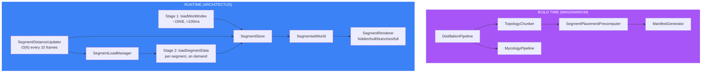

# PR: World Segmentation Architecture

```
+--------------------------------------------------------------+
|   feat/world-segmentation-build                              |
+--------------------------------------------------------------+
|                      *** MAJOR ***                           |
|                                                              |
|          pass  [SHIELD]  pass                                |
|                mullet x 3                                    |
|                                                              |
|         [imaginarium, architectus, shared]                   |
|                                                              |
|           files: 18 | +1697 / -23                            |
+--------------------------------------------------------------+
|   "Per aspera ad astra"                                      |
+--------------------------------------------------------------+

*** [imaginarium,architectus,shared] mullet x3 pass/pass +1697/-23
```

## Summary

Replaces the monolithic 28MB-at-startup loading pipeline with a segmented architecture that loads ~15KB upfront and streams per-segment data on demand. Uses existing StorySegments (max 10 per world) as spatial chunking units with distance-based LOD rendering and atmospheric fog to hide loading boundaries.

## Features

| Feature | Description | Status |
|---------|-------------|--------|
| Build-time chunking | TopologyChunker splits FileTreeNode per segment, writes per-segment topology/specimens | Complete |
| Placement precomputation | Centroids, radii, convex hulls computed at build time via L-System/Turtle | Complete |
| Slim manifest | Chunked manifest ~5KB replaces 4.7MB monolith, mesh entries split to mesh-index.json | Complete |
| Two-stage loading | Stage 1 loads world index (~15KB), Stage 2 loads segments on demand | Complete |
| Segment store | Zustand store tracking per-segment load state, distances, opacity | Complete |
| LOD rendering | 4-tier LOD (hidden/hull/branches/full) based on camera distance | Complete |
| Convex hull silhouettes | Translucent mood-tinted hulls as distant placeholders (1 draw call each) | Complete |
| Distance updater | O(N) segment scan every 10 frames replaces O(7000) node scan | Complete |
| Load manager | Active segment fully loaded, 2 neighbors partially, rest evicted | Complete |
| World fog | FogExp2 derived from world radius hides loading seams | Complete |
| Backward compatibility | Monolithic loading path preserved as fallback | Complete |

## Files Changed

```
packages/shared/
  src/types/index.ts                              (+70) WorldIndex, PrecomputedPlacement, TopologyChunk, ChunkedManifest types

packages/imaginarium/
  src/pipeline/TopologyChunker.ts                  (NEW) Prunes FileTreeNode per segment
  src/pipeline/SegmentPlacementPrecomputer.ts      (NEW) Precomputes centroids, radii, convex hulls
  src/pipeline/ManifestGenerator.ts                (+67) generateChunkedManifest()
  src/pipeline/DistillationPipeline.ts             (+133) Steps 7.6-9.5 for segmentation
  src/mycology/MycologyPipeline.ts                 (+40) Per-segment specimen partitioning

packages/architectus/
  src/store/useSegmentStore.ts                     (NEW) Per-segment state management
  src/loader/AssetBridge.ts                        (+198) loadWorldIndex + loadSegmentData
  src/loader/SegmentLoadManager.ts                 (NEW) Load/evict strategy
  src/components/SegmentedWorld.tsx                 (NEW) Scene root for segmented rendering
  src/components/SegmentRenderer.tsx                (NEW) Per-segment LOD renderer
  src/components/SegmentHull.tsx                    (NEW) Convex hull mesh
  src/components/SegmentDistanceUpdater.tsx         (NEW) Distance tracking in render loop
  src/components/WorldFog.tsx                      (NEW) Atmospheric fog
  src/App.tsx                                      (+64) Conditional SegmentedWorld vs DendriteWorld
  src/index.ts                                     (+13) New exports
  src/loader/index.ts                              (+5) New exports

apps/dendrovia-quest/
  app/components/DendroviaQuest.tsx                 (+14) Skip topology when world index loaded
```

## Commits

1. `68e6498` feat(imaginarium,shared): add build-time world segmentation
2. `8124289` feat(architectus): add two-stage segment-aware loading
3. `672e26d` feat(architectus): add distance-based LOD rendering with fog

## Test Plan

- [x] `bun test` — 987 pass, 3 pre-existing fail, 0 regressions
- [x] TypeScript type-check — no new errors (pre-existing Bun/@types/react errors only)
- [ ] Run `bun run distill` on React world — verify per-segment files in output
- [ ] Load quest app — verify world-index.json loads first, hulls render immediately
- [ ] Move camera toward segment — verify hull -> branches -> full transition
- [ ] Move camera away — verify eviction back to hull state
- [ ] Verify monolithic fallback still works when chunked manifest unavailable

## Architecture



## Performance Impact

| Metric | Before | After |
|--------|--------|-------|
| Initial network | ~28MB | ~15KB |
| Time to first render | 5-10s | <500ms |
| Active geometry | 7000+7000+6849 instances | ~800+800+800 (1 segment) |
| Tracking cost per check | O(7000) nodes | O(8) segments + O(800) nodes |
| Memory (specimens) | 12MB | ~1.5MB |
