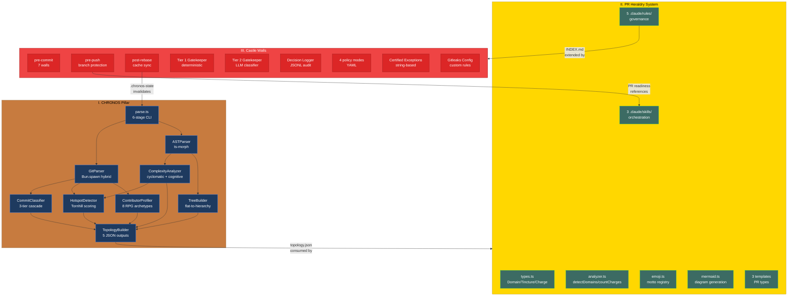
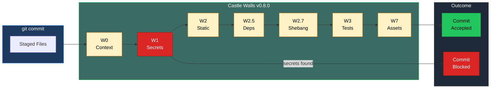
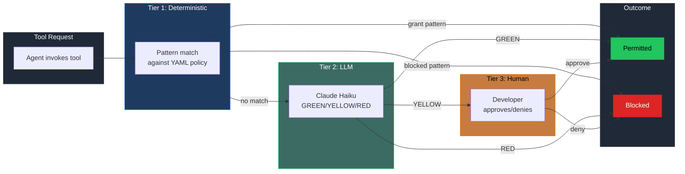

# PR: Implement CHRONOS Pillar, PR Heraldry System, and Castle Walls Quality Gates

## Coat of Arms (Unified)

```
+--------------------------------------------------------------+
|   main                                                       |
+--------------------------------------------------------------+
|                         MAJOR (***)                           |
|                                                              |
|     +------------------+   +------------------+              |
|     | I CHRONOS        |   | II HERALDRY      |             |
|     | mullet x 9       |   | mullet x 3       |             |
|     | [chronos]        |   | [shared|infra]    |             |
|     +------------------+   +------------------+              |
|                  +------------------+                        |
|                  | III CASTLE WALLS |                        |
|                  | mullet x 4       |                        |
|                  | [infra|operatus] |                        |
|                  +------------------+                        |
|                                                              |
|   skip  [PARTY-PER-CROSS: Amber|Or|Gules|Tenne|Argent|Azure]  skip  |
|                                                              |
|           files: 53 | +8525 / -96                           |
+--------------------------------------------------------------+
|   "Per aspera ad astra"                                      |
+--------------------------------------------------------------+
```

**Compact:** `***` [chronos|shared|infra|docs|app|architectus] mullet x16 skip|skip +8525/-96

---

## Feature Space Index

| Index | Short Name | Full Name | Domain(s) | Commits | Lines |
|-------|------------|-----------|-----------|---------|-------|
| I | CHRONOS | CHRONOS Pillar — Git History + AST Parsing | chronos, app, architectus | 10 | ~2,100 |
| II | HERALDRY | PR Heraldry — Heraldic Classification System | shared, infra, docs | 5 | ~2,400 |
| III | CASTLE WALLS | Castle Walls — Pre-Commit Quality Gates | infra, operatus, docs | 5 | ~3,800 |

## Cross-Space Dependencies

| From | To | Dependency Type |
|------|----|-----------------|
| I (CHRONOS) | II (HERALDRY) | CHRONOS established the codebase for heraldry to classify |
| II (HERALDRY) | III (CASTLE WALLS) | Heraldry governance rules (INDEX.md, CLAUDE.md) extended by Castle Walls |
| III (CASTLE WALLS) | II (HERALDRY) | Castle Walls pre-push gate references PR description workflow from Heraldry |
| I (CHRONOS) | III (CASTLE WALLS) | Castle Walls post-rebase hook invalidates .chronos-state cache |

## Architecture



---

## I. CHRONOS Pillar — Git History + AST Parsing

### Coat of Arms (Space I)

```
+--------------------------------------------------------------+
|   packages/chronos                                           |
+--------------------------------------------------------------+
|                       MODERATE (**)                           |
|                                                              |
|          skip  [Amber]  skip                                 |
|                   mullet x 9                                 |
|                                                              |
|              [chronos|app|architectus]                        |
|                                                              |
|           files: 14 | +2,100 / -96                          |
+--------------------------------------------------------------+
|   "Innovation through iteration"                             |
+--------------------------------------------------------------+
```

**Compact:** `**` [chronos] mullet x9 skip|skip +2100/-96

### Summary

First pillar implementation in the Dendrovia pipeline. CHRONOS parses Git repositories into game-ready data structures: commit history, AST topology, complexity metrics, hotspot analysis, and contributor RPG profiles. Produces 5 JSON output files consumed downstream by IMAGINARIUM and LUDUS.

### Features

| # | Feature | Description | Status |
|---|---------|-------------|--------|
| 1 | GitParser | Hybrid Bun.spawn extraction with custom RECORD_SEP/FIELD_SEP delimiters, --numstat parsing, rename handling via `getFileChurnCounts`, `listFilesAtHead`, `getHeadHash` | Complete |
| 2 | CommitClassifier | 3-tier cascade: conventional commit regex (13 types) -> 12 keyword patterns -> body fallback. Confidence levels (high/medium/low) | Complete |
| 3 | ASTParser | ts-morph Project with `skipFileDependencyResolution`/`skipLoadingLibFiles`, 25+ extension LANGUAGE_MAP, `parseFile`/`parseFiles`/`buildStubFile` | Complete |
| 4 | ComplexityAnalyzer | Cyclomatic (decision points + logical operators) and cognitive (structural + nesting penalty) complexity. 6 DifficultyTiers. Per-function analysis | Complete |
| 5 | HotspotDetector | Tornhill risk scoring: `log_normalized(churn) * linear_normalized(complexity)`. Temporal coupling via co-occurrence counting (min 5 co-changes threshold) | Complete |
| 6 | ContributorProfiler | 8 RPG archetypes (guardian/healer/striker/sage/ranger/artificer/berserker/adventurer). TimeArchetype (dawn/daylight/twilight/midnight). 6 personality facets | Complete |
| 7 | TreeBuilder | Flat path array -> `FileTreeNode` hierarchy with directory-first sorting | Complete |
| 8 | TopologyBuilder | Assembles 5 output JSON files. `functionsByFile` Map grouping for complexity deduplication | Complete |
| 9 | parse.ts CLI | 6-stage pipeline with per-stage timing, IGNORE_PATTERNS, `.chronos-state` cache file | Complete |
| 10 | Dependency fix | Downgraded @react-three/fiber ^8.17.0 and @react-three/drei ^9.114.0 (registry-valid versions) | Complete |

### Key Interfaces

```typescript
// CommitClassifier types
type CommitType = 'feat' | 'fix' | 'refactor' | 'perf' | 'docs' | 'test' |
                  'chore' | 'style' | 'ci' | 'build' | 'revert' | 'breaking' | 'unknown';
type ConfidenceLevel = 'high' | 'medium' | 'low';

// ComplexityAnalyzer types
type DifficultyTier = 'trivial' | 'simple' | 'moderate' | 'complex' | 'very-complex' | 'untestable';

// ContributorProfiler archetypes
type Archetype = 'guardian' | 'healer' | 'striker' | 'sage' |
                 'ranger' | 'artificer' | 'berserker' | 'adventurer';
type TimeArchetype = 'dawn-rider' | 'daylight-worker' | 'twilight-coder' | 'midnight-owl';
```

---

## II. PR Heraldry — Heraldic Classification System

### Coat of Arms (Space II)

```
+--------------------------------------------------------------+
|   lib/heraldry + .claude/                                    |
+--------------------------------------------------------------+
|                       MODERATE (**)                           |
|                                                              |
|          skip  [Or|Gules|Tenne]  skip                        |
|                   mullet x 3                                 |
|                                                              |
|              [shared|infra|docs]                              |
|                                                              |
|           files: 20 | +2,400 / -0                           |
+--------------------------------------------------------------+
|   "Innovation through iteration"                             |
+--------------------------------------------------------------+
```

**Compact:** `**` [shared|infra|docs] mullet x3 skip|skip +2400/-0

### Summary

Structured PR description system with heraldic classification mapping code changes to medieval blazonry. Establishes 5 governance rules, 3 Claude Code skills, a TypeScript type system for domain/tincture/charge/magnitude/motto taxonomy, and 3 specialized PR templates — creating a self-documenting codebase convention.

### Features

| # | Feature | Description | Status |
|---|---------|-------------|--------|
| 1 | Type system | `lib/heraldry/types.ts`: 10 domains with tinctures, 9 charge types, 5 magnitude thresholds, shield divisions, supporters, PRCoatOfArms aggregate type | Complete |
| 2 | Analyzer | `lib/heraldry/analyzer.ts`: `analyzeForHeraldry()`, `detectDomains()` via file pattern matching, `countCharges()` from conventional commits, `runSupporter()` validation | Complete |
| 3 | Motto registry | `lib/heraldry/emoji.ts`: 9 charges x 3 registers (formal/standard/casual), `selectMotto()` by charge+magnitude, `PILLAR_SYMBOLS`/`PILLAR_NAMES` | Complete |
| 4 | Mermaid diagrams | `lib/heraldry/mermaid.ts`: `generateDomainDiagram()`, `generatePipelineDiagram()`, `generateHeraldryDiagram()` with WCAG-compliant color directives | Complete |
| 5 | Governance rules | 5 rule files: PR_WORKFLOW, PR_DESCRIPTION_CONTENT, PR_HERALDRY_COMPLETENESS, DIAGRAM_CONVENTIONS, BRANCH_WORKFLOW. All with 2+ reachability paths | Complete |
| 6 | Skills | 3 Claude Code skills: `pr-workflow` (6-step orchestrator), `pr-heraldry` (8-step CoA generator), `pr-heterogeneous` (multi-space handler) | Complete |
| 7 | Templates | ROUTINE_OPERATIONS, DIRECTION_ALIGNMENT, CROSS_CHECKOUT_SCAN templates in `docs/pr-descriptions/templates/` | Complete |
| 8 | INDEX.md | Master trigger-to-rule routing table with cross-reference audit matrix | Complete |
| 9 | Root CLAUDE.md | Monorepo instructions with skill table, rule references, pillar overview, build commands, heraldry overview | Complete |

---

## III. Castle Walls — Pre-Commit Quality Gates

### Coat of Arms (Space III)

```
+--------------------------------------------------------------+
|   .husky/ + .claude/hooks/                                   |
+--------------------------------------------------------------+
|                        MAJOR (***)                            |
|                                                              |
|          skip  [Gules|Sable|Tenne]  skip                     |
|                   mullet x 4                                 |
|                                                              |
|              [infra|operatus|docs]                            |
|                                                              |
|           files: 22 | +3,800 / -0                           |
+--------------------------------------------------------------+
|   "Per aspera ad astra"                                      |
+--------------------------------------------------------------+
```

**Compact:** `***` [infra|operatus|docs] mullet x4 skip|skip +3800/-0

### Summary

Tiered pre-commit quality gate system with 7 walls (1 blocking, 6 advisory), 3-tier agentic permission policy engine (deterministic/LLM/human), string-based secret detection with certified exception registry, 4 policy modes for context-dependent enforcement, and JSONL audit trail — establishing repository-boundary and tool-use-boundary governance.

### Features

| # | Feature | Description | Status |
|---|---------|-------------|--------|
| 1 | Wall 0: Context Protection | Direct-to-main detection, stash count warning with agentic session recovery instructions | Complete |
| 2 | Wall 1: Secret Detection | BLOCKING. Two-layer: Layer 1 pure-shell regex (10 high-confidence patterns + safe-string filtering), Layer 2 optional gitleaks | Complete |
| 3 | Wall 2: Static Analysis | Conditional typecheck + lint on staged .ts/.tsx files via `bun run typecheck`/`bun run lint` | Complete |
| 4 | Wall 2.5: Dependency Validation | Blocked package detection in package.json diffs (semantic collision prevention), optional validator script | Complete |
| 5 | Wall 2.7: Runtime Compliance | Shebang enforcement for bun-standardized codebase (`#!/usr/bin/env bun`) | Complete |
| 6 | Wall 3: Test Suite | 10-second timeout wrapper via `timeout 10 bun run test --run`, graceful timeout detection | Complete |
| 7 | Wall 7: Asset Boundaries | 500KB staged file threshold warning | Complete |
| 8 | Expedition Mode | Branch names containing `expedite` skip advisory walls. Wall 1 + Wall 7 always run | Complete |
| 9 | Tier 1 Gatekeeper | Deterministic PreToolUse pattern matcher. Minimal YAML parser (no pyyaml dependency). Deny-priority evaluation | Complete |
| 10 | Tier 2 Gatekeeper | LLM PermissionRequest classifier via Claude Haiku. Compiled policy corpus. GREEN/YELLOW/RED with graceful fallback to YELLOW | Complete |
| 11 | Decision Logger | PostToolUse JSONL audit trail with timestamp, tier, tool, classification, mode, session_id | Complete |
| 12 | Policy Modes | 4 modes (default/testing/rendover/deployment) as YAML with blocked patterns + tool-category grants | Complete |
| 13 | Certified Exceptions | String-based false positive management. 11 certified strings, 5 path exceptions, audit log | Complete |
| 14 | Gitleaks Config | 5 Dendrovia-specific rules: neon-connection-string, anthropic-api-key, openai-project-key, vercel-token, stripe-key | Complete |
| 15 | Pre-push Gates | Branch protection (blocks main/master), naming convention validation, PR readiness reminders on first push | Complete |
| 16 | Post-rebase Sync | Conditional cache invalidation: turbo.json -> .turbo, bun.lock -> bun install, CHRONOS sources -> .chronos-state | Complete |
| 17 | Self-test | `scripts/test-castle-walls.sh` validates 22 system components: hooks, policy engine, modes, config, tools, governance | Complete |

### Wall Pipeline



### Permission Engine



---

## Files Changed (All Spaces)

```
dendrovia/
├── packages/chronos/                          # Space I: CHRONOS
│   ├── tsconfig.json                          # ES2022/ESNext config
│   └── src/
│       ├── index.ts                           # Barrel exports (8 modules)
│       ├── parse.ts                           # 6-stage CLI pipeline
│       ├── classifier/
│       │   └── CommitClassifier.ts            # 3-tier commit classification
│       ├── parser/
│       │   ├── GitParser.ts                   # Hybrid Bun.spawn git extraction
│       │   └── ASTParser.ts                   # ts-morph AST parsing
│       ├── analyzer/
│       │   ├── ComplexityAnalyzer.ts          # Cyclomatic + cognitive complexity
│       │   └── HotspotDetector.ts             # Tornhill risk scoring
│       └── builder/
│           ├── ContributorProfiler.ts         # 8 RPG archetypes
│           ├── TreeBuilder.ts                 # Flat-to-hierarchy tree
│           └── TopologyBuilder.ts             # 5 JSON output assembly
│
├── lib/heraldry/                              # Space II: Heraldry TypeScript
│   ├── index.ts                               # Barrel exports
│   ├── types.ts                               # Domain/Tincture/Charge/Magnitude types
│   ├── analyzer.ts                            # analyzeForHeraldry + domain detection
│   ├── emoji.ts                               # Motto registry + pillar symbols
│   └── mermaid.ts                             # Accessible Mermaid generation
│
├── .claude/                                   # Space II + III: Governance
│   ├── rules/
│   │   ├── INDEX.md                           # Trigger-to-rule routing (updated)
│   │   ├── PR_WORKFLOW.rules.md               # PR creation process
│   │   ├── PR_DESCRIPTION_CONTENT.rules.md    # PR content structure
│   │   ├── PR_HERALDRY_COMPLETENESS.rules.md  # Heraldic taxonomy
│   │   ├── DIAGRAM_CONVENTIONS.rules.md       # Mermaid accessibility
│   │   ├── BRANCH_WORKFLOW.rules.md           # Branch/commit conventions
│   │   └── CASTLE_WALLS.rules.md              # Quality gate rules (NEW)
│   ├── skills/
│   │   ├── workflow/
│   │   │   ├── pr/SKILL.md                    # PR orchestrator
│   │   │   └── pr-heterogeneous/SKILL.md      # Multi-space handler
│   │   └── heraldry/
│   │       └── pr-heraldry/SKILL.md           # CoA generator
│   ├── hooks/                                 # Space III: Permission engine
│   │   ├── tier1-gatekeeper.py                # Deterministic PreToolUse
│   │   ├── tier2-llm-gatekeeper.py            # LLM PermissionRequest
│   │   ├── decision-logger.py                 # PostToolUse audit
│   │   ├── switch-mode.sh                     # Mode switching CLI
│   │   └── logs/.gitkeep                      # Audit trail directory
│   └── policies/                              # Space III: Policy definitions
│       ├── .active-mode                        # Current mode (default)
│       ├── modes/
│       │   ├── default.yaml                   # Standard development
│       │   ├── testing.yaml                   # Test-focused
│       │   ├── rendover.yaml                  # Visual verification
│       │   └── deployment.yaml                # Locked-down
│       └── corpus/
│           └── compiled-policy.md             # Tier 2 LLM context
│
├── .husky/                                    # Space III: Git hooks
│   ├── pre-commit                             # 7-wall quality gate pipeline
│   ├── pre-push                               # Branch protection gates
│   └── post-rebase                            # Cache invalidation
│
├── .castle-walls/                             # Space III: Configuration
│   └── certified-exceptions.yaml              # String-based safe registry
│
├── .gitleaks.toml                             # Space III: Secret detection config
│
├── docs/
│   ├── governance/
│   │   ├── PR_HERALDRY_COMPLETENESS_CODEBASE_CONTEXT_SYSTEM_SETUP.md
│   │   └── CASTLE_WALLS_CODEBASE_CONTEXT_SYSTEM_SETUP.md
│   └── pr-descriptions/
│       └── templates/
│           ├── ROUTINE_OPERATIONS_TEMPLATE.md
│           ├── DIRECTION_ALIGNMENT_PR_TEMPLATE.md
│           └── CROSS_CHECKOUT_SCAN_TEMPLATE.md
│
├── scripts/
│   └── test-castle-walls.sh                   # Self-test (22 checks)
│
├── apps/dendrovia-quest/package.json          # @react-three downgrade
├── packages/dendrovia-engine/package.json     # @react-three downgrade
├── bun.lock                                   # Regenerated lockfile
├── .gitignore                                 # Audit log exclusions
└── CLAUDE.md                                  # Root monorepo instructions (updated)
```

## Commits (All Spaces)

1. `f65a224` Add tsconfig.json for CHRONOS package
2. `4c4ba09` Implement three-tier CommitClassifier for commit message taxonomy
3. `1fef363` Implement hybrid GitParser via Bun.spawn for bulk extraction
4. `49a2465` Implement cyclomatic and cognitive complexity via ts-morph
5. `bed43ce` Implement ASTParser with ts-morph and language detection
6. `e69cc74` Implement HotspotDetector with Tornhill risk scoring
7. `c504347` Implement ContributorProfiler with 8 RPG archetypes
8. `2ae4e7a` Implement TreeBuilder and TopologyBuilder for output assembly
9. `bf43919` Implement parse.ts CLI orchestrator and update barrel exports
10. `3b4e7a2` Fix @react-three version constraints and regenerate lockfile
11. `574535f` Add governance rules for PR heraldry and workflow
12. `13a50d4` Add Claude Code skills for PR workflow and heraldry
13. `bc871f2` Implement lib/heraldry TypeScript module for PR classification
14. `02e2dc5` Add PR description templates and governance setup document
15. `60fa9b3` Add root CLAUDE.md with skill table and rule references
16. `ccf8807` feat(castle-walls): add foundation config — certified exceptions, gitleaks, policy modes
17. `d5de5b3` feat(castle-walls): implement pre-commit hook with 7-wall quality gate pipeline
18. `b3dbc6a` feat(castle-walls): add pre-push branch protection and post-rebase cache sync
19. `69f7c90` feat(castle-walls): implement 3-tier permission policy engine for agentic workflows
20. `c84f7d2` docs(castle-walls): add governance rules, setup guide, self-test, and cross-references

## Terminology

| Term | Definition |
|------|-----------|
| Wall | A numbered quality gate in the pre-commit pipeline (0-7) |
| Tier | A level in the 3-tier permission policy engine (deterministic/LLM/human) |
| Expedition Mode | Fast-path bypass that skips advisory walls when branch name contains `expedite` |
| Certified Exception | A specific string registered as known-safe for secret detection false positive management |
| Policy Mode | A named YAML configuration (default/testing/rendover/deployment) controlling permission grants and blocks |
| Tincture | Heraldic term for color; each Dendrovia domain maps to a unique tincture |
| Charge | Heraldic term for a symbol on a shield; each commit type maps to a charge |
| Magnitude | Computed PR size classification (trivial/minor/moderate/major/epic) |
| Supporter | Validation status (typecheck/lint/test/build) flanking the heraldic shield |
| Tornhill Scoring | `risk = log_normalized(churn) * linear_normalized(complexity)` for hotspot detection |
| Archetype | RPG contributor classification (guardian/healer/striker/sage/ranger/artificer/berserker/adventurer) |

## Design Decisions

| # | Decision | Rationale | Alternatives Considered |
|---|----------|-----------|------------------------|
| 1 | Hybrid Bun.spawn for git extraction | `git log --numstat` in one subprocess is 10-100x faster than per-commit isomorphic-git calls | Pure isomorphic-git (too slow), libgit2 bindings (unnecessary complexity) |
| 2 | ts-morph with `skipFileDependencyResolution` | Prevents resolution failures on missing node_modules while still parsing AST structure | Full resolution (requires bun install first), tree-sitter (lacks TypeScript-specific analysis) |
| 3 | Wall 1 only blocking wall | Secret leaks are catastrophic and irreversible; all other checks have CI as backstop | All walls blocking (too much friction), no blocking walls (insufficient safety) |
| 4 | String-based certified exceptions (not path-based) | Path-based exceptions (e.g., `*.md`) are too broad — real secrets in docs would slip through | Path-based exceptions (too permissive), no exceptions (unsustainable false positive rate) |
| 5 | Minimal YAML parser fallback in Tier 1 | Hook must function without pyyaml installed (independence principle) | Require pyyaml (adds dependency), JSON instead of YAML (less readable), TOML (less familiar) |
| 6 | Tier 2 falls back to YELLOW on any error | System must never block developer workflow due to its own failures | Fallback to RED (blocks on infrastructure failure), fallback to GREEN (security risk) |
| 7 | Heraldry as code (lib/heraldry/) | TypeScript types make the taxonomy machine-verifiable and importable by future tooling | Markdown-only taxonomy (not machine-readable), JSON schema (less expressive) |
| 8 | 4 policy modes with YAML | Different development contexts (testing, deployment) need different permission postures | Single mode (insufficient flexibility), per-user modes (too complex), ENV-based (less auditable) |

## Test Plan

- [x] CHRONOS parser runs against own codebase (`bun run parse` in packages/chronos)
- [x] CHRONOS generates valid topology.json, commits.json, complexity.json, hotspots.json, contributors.json
- [x] CHRONOS identifies 10+ bugs from commit history
- [x] CHRONOS classifies contributors into RPG archetypes
- [x] CHRONOS completes in <5 seconds for typical repo
- [x] lib/heraldry barrel exports resolve (all 4 modules exported)
- [x] PR Heraldry cross-reference reachability verified (every document reachable from 2+ paths)
- [x] Castle Walls self-test passes 22/22 checks
- [x] Pre-commit hook exits cleanly with no staged files
- [x] Mode switcher displays all 4 modes with descriptions
- [x] .gitignore excludes audit logs but preserves .gitkeep
- [x] Gitleaks installed and configuration valid
- [ ] Pre-commit Wall 1 blocks actual secret patterns (manual test)
- [ ] Pre-push blocks direct push to main (verified by Castle Walls design)
- [ ] Expedition mode skips advisory walls on `expedite` branch
- [ ] Tier 1 gatekeeper correctly blocks `git push origin main` pattern
- [ ] Tier 2 gatekeeper falls back to YELLOW when API key absent

## Related

| Document | Relationship |
|----------|-------------|
| `docs/governance/PR_HERALDRY_COMPLETENESS_CODEBASE_CONTEXT_SYSTEM_SETUP.md` | Setup guide for the Heraldry system |
| `docs/governance/CASTLE_WALLS_CODEBASE_CONTEXT_SYSTEM_SETUP.md` | Setup guide for Castle Walls (1,624 lines) |
| `CLAUDE.md` | Root monorepo instructions referencing all three systems |
| `.claude/rules/INDEX.md` | Master trigger-to-rule routing table |
| `docs/PILLAR_INSIGNIA_STRUCTURAL.md` | Pillar visual identity referenced by tincture system |
| `docs/PILLAR_THEMATIC_SCHEMA.md` | Thematic schema informing domain taxonomy |
