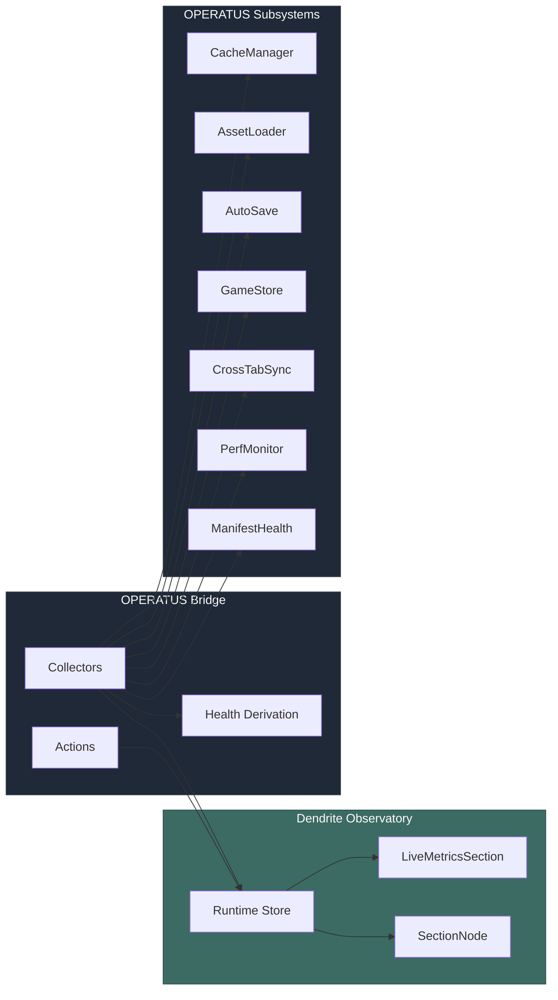

# PR Description — Dendrite Runtime Primitives + OPERATUS Control Plane

```
+--------------------------------------------------------------+
|   feat/dendrite-runtime-primitives                           |
+--------------------------------------------------------------+
|                      *** MAJOR                               |
|                                                              |
|          skip  [SHIELD: per-chevron]  skip                   |
|                   mullet x 3                                 |
|                                                              |
|           [operatus, infra, app]                             |
|                                                              |
|           files: 30 | +1442 / -26                            |
+--------------------------------------------------------------+
|   "Per aspera ad astra"                                      |
+--------------------------------------------------------------+
```

Compact: *** [operatus+infra+app] mullet x3 skip/skip/skip/skip +1442/-26

---

## Summary

Transforms OPERATUS from a silent infrastructure layer into a live control plane observable through the dendrite visualization system. Adds runtime health types, a dedicated high-frequency Zustand store, visual indicators, and an OPERATUS bridge that polls subsystem metrics and streams them into the dendrite DAG. Also adds manifest health validation with staleness detection.

## Features

| Feature | Description | Status |
|---------|-------------|--------|
| Runtime types | `RuntimeHealth`, `RuntimeMetric`, `NodeAction`, `RuntimeNodeState`, `RuntimeEvent` | Complete |
| Runtime store | Separate Zustand vanilla store for high-frequency updates (no Immer) | Complete |
| Runtime color mode | "runtime" mode with health-based node coloring (green/amber/red/gray) | Complete |
| Pulse animation | CSS keyframe pulse on non-idle runtime nodes | Complete |
| LiveMetricsSection | Panel component showing metrics grid, action buttons, event history | Complete |
| Toolbar integration | Runtime color mode button + connection status dot | Complete |
| AssetLoader getters | `loadedCount`, `manifestLoaded` public accessors | Complete |
| AutoSave getters | `isRunning`, `lastSaveTimestamp` public accessors | Complete |
| Health derivation | Priority-ordered condition evaluator for subsystem health | Complete |
| Collectors | 9 per-node metric extractors + phase aggregator | Complete |
| Actions registry | 4 action factories (cache, autosave, gamestore, perfmonitor) | Complete |
| Runtime bridge | Hybrid polling + event-driven bridge class | Complete |
| Playground wiring | SSR-safe hook + page integration | Complete |
| Manifest validation | `validateManifestStructure` + `validateManifestOnDisk` | Complete |
| Manifest collector | Dendrite node for manifest health display | Complete |
| Manifest health tests | 9 tests covering validation edge cases | Complete |

## Files Changed

```
lib/dendrite/
  types.ts                              # Added runtime types, extended ColorMode
  design-tokens.ts                      # Added RUNTIME_HEALTH_COLORS
  index.ts                              # Exported new primitives
  coloring/
    modes.ts                            # Added runtimeResolver
    index.ts                            # Exported runtime resolver
  layout/
    layout-engine.ts                    # Accept runtimeHealthMap, inject health colors
  store/
    dendrite-store.ts                   # Added runtimeHealthMap field + action
    runtime-store.ts                    # NEW — vanilla Zustand runtime store
  nodes/
    SectionNode.tsx                     # Runtime dot override + pulse animation
  panels/
    LiveMetricsSection.tsx              # NEW — metrics/actions/events panel
    NodeDetailPanel.tsx                 # Accept runtimeStore, render LiveMetrics
    ColorLegend.tsx                     # Added runtime legend entries
    index.ts                           # Exported LiveMetricsSection
  toolbar/
    DendriteToolbar.tsx                 # Runtime button + connection dot
  canvas/
    DendriteCanvas.tsx                  # Thread runtimeStore prop

packages/operatus/
  package.json                          # Added ./dendrite subpath export
  src/
    loader/AssetLoader.ts               # Added loadedCount, manifestLoaded getters
    persistence/AutoSave.ts             # Added isRunning, lastSaveTimestamp getters
    init.ts                             # Validate manifest after load
    perf/PerfMonitor.ts                 # Extended LoadingReport with manifestHealth
    manifest/
      ManifestHealth.ts                 # NEW — manifest structure/disk validation
      index.ts                          # Exported validation functions
    dendrite/
      index.ts                          # NEW — barrel export
      health.ts                         # NEW — deriveHealth condition evaluator
      collectors.ts                     # NEW — 9 subsystem collectors + aggregator
      actions.ts                        # NEW — 4 action factories
      bridge.ts                         # NEW — OperatusRuntimeBridge class
  tests/
    manifest-health.test.ts             # NEW — 9 validation tests

apps/playground-operatus/
  app/
    hooks/useOperatusBridge.ts          # NEW — SSR-safe bridge React hook
    gyms/dendrite/page.tsx              # Wired runtime store + bridge
```

## Commits

1. `179453c` feat(dendrite): add runtime primitives for live subsystem observation
2. `915b1a5` feat(operatus): add runtime bridge for dendrite live observation
3. `dad0091` feat(operatus): add manifest health validation and pipeline wiring

## Test Plan

- [ ] Dendrite playground page renders correctly (no regressions)
- [ ] "runtime" color mode shows nodes colored by health state
- [ ] Selecting a node with runtime data shows LiveMetricsSection in detail panel
- [ ] Action buttons execute (danger actions require confirmation)
- [ ] Connection status dot appears in toolbar when bridge is active
- [ ] ColorLegend shows runtime health entries when in runtime mode
- [ ] `bun test` — all 142 OPERATUS tests pass (133 existing + 9 new manifest health)
- [ ] Manifest validation detects missing version, checksum, topology
- [ ] Manifest staleness warning triggers for manifests older than 7 days
- [ ] No SSR errors in playground (dynamic imports guard browser APIs)

---

## Architecture


