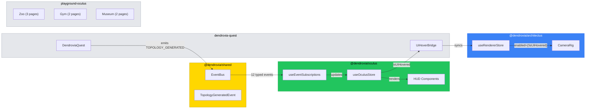

# PR Description: OCULUS Remediation & Playground Enablement

+--------------------------------------------------------------+
|   feat/oculus-remediation-playground                         |
+--------------------------------------------------------------+
|                       *** MAJOR                              |
|                                                              |
|            pass  [PARTY-PER-CROSS]  skip                     |
|                   mullet x 1                                 |
|                                                              |
|          [oculus, shared, architectus, app, docs]             |
|                                                              |
|            files: 24 | +1779 / -98                           |
+--------------------------------------------------------------+
|   "Per aspera ad astra"                                      |
+--------------------------------------------------------------+

Compact: *** [oculus+shared+architectus+app+docs] mullet x1 typecheck:pass test:pass lint:skip build:skip +1779/-98

---

## Summary

Remediates all 18 integration gaps between OCULUS and its peer pillars — fixing typed event handler contracts, adding missing EventBus subscriptions, improving store serialization, and wiring cross-pillar data flows. Builds 7 SpacePark playground pages (Zoo/Gym/Museum) that exercise every OCULUS component with mock data and interactive controls.

---

## Features

| Feature | Description | Status |
|---------|-------------|--------|
| Event handler contract fixes | All 12 EventBus handlers now use correct typed payloads (`HealthChangedEvent`, `ManaChangedEvent`, `DamageDealtEvent`, `CombatStartedEvent`, etc.) | Complete |
| New event subscriptions | Added `EXPERIENCE_GAINED`, `LEVEL_UP`, `COMBAT_TURN_START/END`, `SPELL_RESOLVED` handlers | Complete |
| TopologyGeneratedEvent | New typed event interface in shared contract | Complete |
| Store improvements | `setCharacter` reads from `stats.*` sub-object, `visitedNodes` as serializable `string[]`, battle log capped at 100 | Complete |
| CameraRig UI coordination | `isUiHovered` bridged from OCULUS store to ARCHITECTUS renderer store, disables OrbitControls over UI panels | Complete |
| Topology wiring | DendroviaQuest emits `TOPOLOGY_GENERATED` event for OCULUS Minimap/MillerColumns | Complete |
| Configurable code loader | `OculusConfig.codeLoader` allows custom base URL and fetch function | Complete |
| NODE_CLICKED enhancement | Opens CodeReader with automatic language detection from file extension | Complete |
| Zoo: Primitives Gallery | Interactive knobs for Panel, ProgressBar, IconBadge, StatLabel, Tooltip | Complete |
| Zoo: View Components | All 7 composite components rendered with mock data | Complete |
| Zoo: Compositions | Full HUD layout in exploration and combat modes | Complete |
| Gym: HUD Sandbox | Sliders and buttons drive EventBus events to update HUD in real time | Complete |
| Gym: Battle Arena | Full mock combat flow — attack, cast spells, take turns, victory/defeat | Complete |
| Museum: Event Flow Exhibition | Interactive catalog of all 29 GameEvents with payload inspection | Complete |
| Museum: Cross-Pillar Interface Map | Six-pillar architecture visualization with data flow arrows | Complete |
| Tests | 28 tests (was 20), all passing — covers store improvements and contract fixes | Complete |

---

## Files Changed

```
dendrovia/
├── IMPLEMENTATION_STATUS.md                                 # Updated progress, milestones, test counts
├── apps/
│   ├── dendrovia-quest/app/components/
│   │   └── DendroviaQuest.tsx                               # T09: emit TOPOLOGY_GENERATED, T11: UiHoverBridge
│   └── playground-oculus/app/
│       ├── components/
│       │   ├── PlaygroundProvider.tsx                        # Mock EventBus + OculusProvider wrapper
│       │   └── mock-data.ts                                 # Shared mock quests, spells, topology, hotspots
│       ├── gyms/
│       │   ├── page.tsx                                     # Updated index with sub-page links
│       │   ├── battle-arena/page.tsx                        # T21: Full combat simulation playground
│       │   └── hud-sandbox/page.tsx                         # T20: HUD sliders + EventBus controls
│       ├── museums/
│       │   ├── page.tsx                                     # Updated index with sub-page links
│       │   ├── cross-pillar/page.tsx                        # T23: Six-pillar architecture map
│       │   └── event-flow/page.tsx                          # T22: 29-event interactive catalog
│       └── zoos/
│           ├── page.tsx                                     # Updated index with sub-page links
│           ├── compositions/page.tsx                        # T19: Full HUD layout compositions
│           ├── primitives/page.tsx                          # T17: Interactive primitive gallery
│           └── views/page.tsx                               # T18: All view components with mock data
├── packages/
│   ├── architectus/src/
│   │   ├── components/CameraRig.tsx                         # T11: enabled={!isUiHovered} on OrbitControls
│   │   └── store/useRendererStore.ts                        # T11: added isUiHovered state + setter
│   ├── oculus/src/
│   │   ├── OculusProvider.tsx                               # T15: configurable codeLoader in OculusConfig
│   │   ├── __tests__/useOculusStore.test.ts                 # T24: 28 tests (stats sub-object, array visitedNodes, log cap)
│   │   ├── components/
│   │   │   ├── FalconModeOverlay.tsx                        # T13: visitedNodes.size → .length
│   │   │   └── Minimap.tsx                                  # T13: flattenTree accepts string[] for visited
│   │   ├── hooks/useEventSubscriptions.ts                   # T01-T08,T07,T10: all handler contract fixes
│   │   └── store/useOculusStore.ts                          # T12-T14: setCharacter, visitedNodes[], log cap
│   └── shared/src/
│       ├── events/EventBus.ts                               # T04: TopologyGeneratedEvent interface
│       └── types/index.ts                                   # T13: GameWorldState.visitedNodes → string[]
```

---

## Commits

1. `ce15ff6` feat(oculus): remediate cross-pillar event contracts and build SpacePark playground

---

## Test Plan

- [x] `bunx tsc --noEmit` on `packages/shared` — zero errors
- [x] `bunx tsc --noEmit` on `packages/oculus` — zero errors
- [x] `bunx tsc --noEmit` on `packages/architectus` — pre-existing PostProcessing error only (unrelated)
- [x] `bun test` on `packages/oculus` — 28/28 passing
- [ ] `bun dev` on `apps/playground-oculus` — all 7 SpacePark pages render
- [ ] Zoo: primitives gallery interactive controls work
- [ ] Gym: HUD sandbox sliders update health/mana/XP bars
- [ ] Gym: Battle arena completes a full mock combat
- [ ] Museum: Event flow shows all 29 events with payload inspection
- [ ] Museum: Cross-pillar map shows 6 pillars with data flow arrows

---

## Architecture


