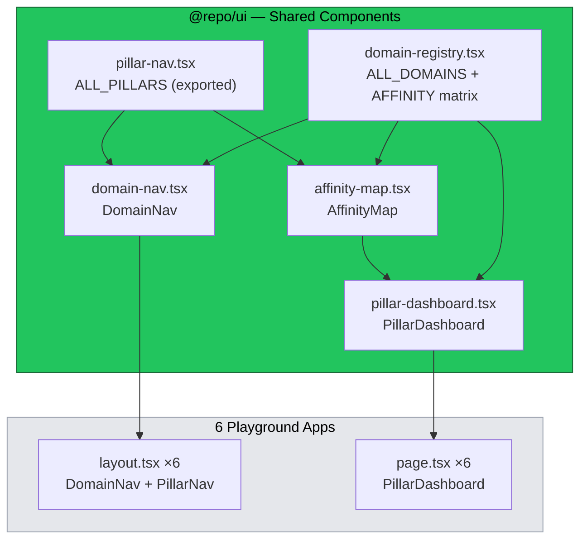

# PR: Shared Navigation Components + Pillar-Domain Affinity System

## Coat of Arms

```
+--------------------------------------------------------------+
|   refactor/pillar-nav-shared-component                       |
+--------------------------------------------------------------+
|                       *** MAJOR ***                          |
|                                                              |
|          skip  [PER-QUARTERLY]  skip                         |
|                mullet x 6                                    |
|                bend x 3                                      |
|                hammer x 1                                    |
|                                                              |
|          [oculus · app · infra · operatus]                   |
|                                                              |
|           files: 20 | +1075 / -557                          |
+--------------------------------------------------------------+
|   "Per aspera ad astra"                                      |
+--------------------------------------------------------------+
```

**Compact:** *** [oculus·app·infra·operatus] mullet×6 bend×3 hammer×1 skip/skip/skip/skip +1075/-557

---

## Summary

Extracts duplicated navigation arrays from 6 playground layouts into shared `@repo/ui` components, then layers a pillar-domain affinity system on top — a 6×6 scoring matrix that drives sidebar sort order, tiered root-page layouts (hero/featured/reference), and an interactive heatmap viewer. Also introduces the `land` skill for semantic commit segmentation workflows.

## Features

| Feature | Description | Status |
|---------|-------------|--------|
| PillarNav extraction | Shared cross-pillar navigation component replacing 6 duplicated CROSS_NAV arrays | Complete |
| DomainNav with affinity sort | Searchable expandable sidebar; domains ranked by pillar affinity; pillar sub-links ranked per-domain with star indicator for top-affinity pillars | Complete |
| Domain Registry | Single source of truth: `ALL_DOMAINS`, `PILLAR_DOMAIN_AFFINITY` 6×6 matrix, per-pillar descriptions, helper functions (`getDomainsForPillar`, `getPillarsForDomain`) | Complete |
| AffinityMap heatmap | Interactive 6×6 colored matrix; cell opacity scales with pillar tincture × score; hover tooltip with score/label/progress bar; current-pillar column highlighting | Complete |
| PillarDashboard tiered layout | Root page component: hero domain (full-width, accent, CTA), featured grid, reference grid (compact), collapsible AffinityMap toggle | Complete |
| SessionStorage persistence | Expanded domain state in DomainNav persists across page navigations via sessionStorage | Complete |
| Landing workflow skill | New `land` skill: semantic commit segmentation → rebase → PR description. Registered in INDEX.md | Complete |
| kill-ports utility | Shell script to clear stale dev servers on ports 3010-3016 | Complete |

## Architecture



## Files Changed

```
.claude/
├── rules/INDEX.md                          # Register land skill, bump to v1.2.0
└── skills/workflow/land/SKILL.md           # NEW — landing workflow skill

apps/
├── playground-architectus/app/
│   ├── layout.tsx                          # Replace DOMAINS + render → DomainNav
│   └── page.tsx                            # Replace flat grid → PillarDashboard
├── playground-chronos/app/
│   ├── layout.tsx                          # Same
│   └── page.tsx                            # Same
├── playground-imaginarium/app/
│   ├── layout.tsx                          # Same
│   └── page.tsx                            # Same
├── playground-ludus/app/
│   ├── layout.tsx                          # Same (conflict resolved: CROSS_NAV removed)
│   └── page.tsx                            # Same (conflict resolved: upstream DOMAINS replaced)
├── playground-oculus/app/
│   ├── layout.tsx                          # Same
│   └── page.tsx                            # Same
└── playground-operatus/app/
    ├── layout.tsx                          # Same (conflict resolved: CROSS_NAV removed)
    └── page.tsx                            # Same

packages/ui/src/
├── pillar-nav.tsx                          # Add export to ALL_PILLARS
├── domain-registry.tsx                     # NEW — types, affinity matrix, helpers
├── domain-nav.tsx                          # NEW — searchable expandable sidebar
├── affinity-map.tsx                        # NEW — interactive heatmap viewer
└── pillar-dashboard.tsx                    # NEW — tiered hero/featured/reference layout

scripts/
└── kill-ports.sh                           # NEW — dev server port cleanup
```

## Commits

1. `01c51cb` refactor(ui): extract shared PillarNav component from 6 duplicated CROSS_NAV arrays
2. `f293e9b` chore(scripts): add kill-ports.sh to clear stale dev servers on 3010-3016
3. `f84395e` refactor(ui): export ALL_PILLARS constant for cross-component reuse
4. `cc9f67c` feat(ui): add domain registry with 6×6 pillar-domain affinity matrix
5. `3972a3c` feat(ui): add shared DomainNav with affinity sort and sessionStorage persistence
6. `8902f0c` feat(ui): add AffinityMap heatmap viewer with hover-inspectable cells
7. `77256b1` feat(ui): add PillarDashboard with hero/featured/reference tiered layout
8. `d8689bc` refactor(playgrounds): replace inline DOMAINS arrays with shared DomainNav component
9. `01c5879` refactor(playgrounds): replace flat card grids with affinity-tiered PillarDashboard
10. `c38fd68` feat(skills): add landing workflow skill for semantic commit segmentation

## Test Plan

- [ ] `bun run td` — all 6 playgrounds start on correct ports
- [ ] Each pillar's sidebar shows domains sorted by affinity (hero domain first)
- [ ] Hero domain shows "PRIMARY" badge in sidebar
- [ ] Clicking a domain expands to show all 6 pillar links, sorted by domain affinity
- [ ] Top-affinity pillars (score 5) show star indicator in expanded domain
- [ ] Expanded domain state persists across page navigation (sessionStorage)
- [ ] Search input filters domains correctly
- [ ] Each root page shows tiered layout: hero card full-width → featured grid → reference grid
- [ ] AffinityMap toggle expands to show 6×6 heatmap below domain cards
- [ ] Heatmap cells colored by pillar tincture with score-proportional opacity
- [ ] Hovering any heatmap cell shows tooltip with pillar/domain/score/bar
- [ ] Current pillar column highlighted in heatmap
- [ ] Cross-pillar links navigate to correct `localhost:{port}/{domain}`
- [ ] LUDUS and OPERATUS layouts render correctly after rebase conflict resolution
- [ ] UI package typechecks cleanly (`npx tsc --noEmit -p packages/ui/tsconfig.json`)
